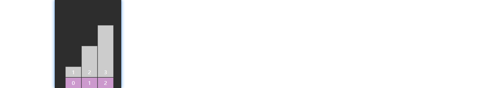
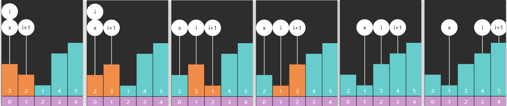
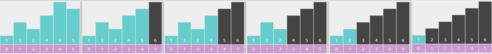
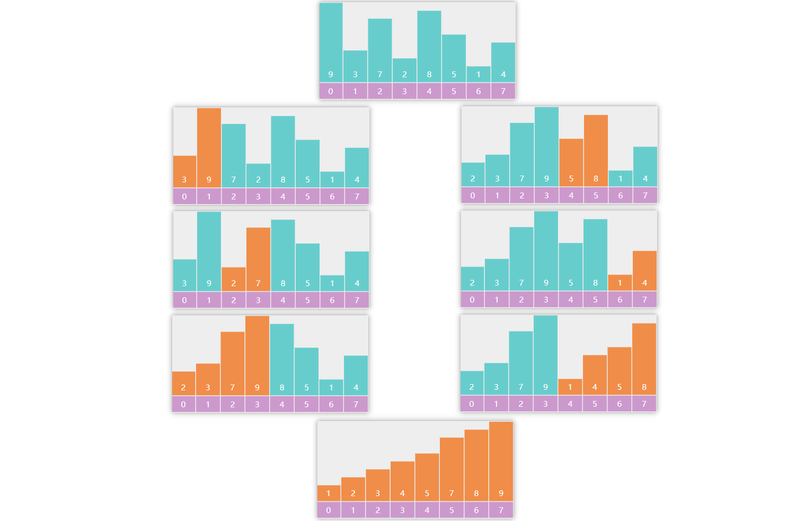
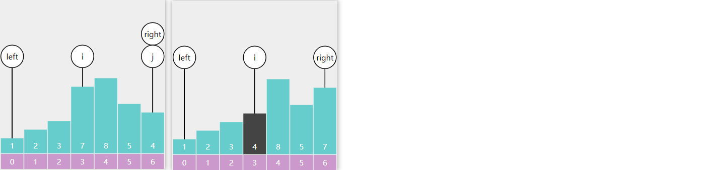
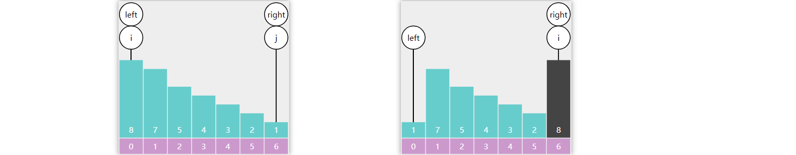

# 排序算法

## 前言

### 比较排序算法

| 算法 |    最好    |    最坏    |    平均    |  空间   | 稳定 | 思想 |                           注意事项                           |
| :--: | :--------: | :--------: | :--------: | :-----: | :--: | :--: | :----------------------------------------------------------: |
| 冒泡 |    O(n)    |  O($n^2$)  |  O($n^2$)  |  O(1)   |  Y   | 比较 |                     最好情况需要额外判断                     |
| 选择 |  O($n^2$)  |  O($n^2$)  |  O($n^2$)  |  O(1)   |  N   | 比较 |                     交换次数一般少于冒泡                     |
|  堆  | O($nlogn$) | O($nlogn$) | O($nlogn$) |  O(1)   |  N   | 选择 |         堆排序的辅助性较强，理解前先理解堆的数据结构         |
| 插入 |    O(n)    |  O($n^2$)  |  O($n^2$)  |  O(1)   |  Y   | 比较 | 插入排序对于近乎有序的数据处理速度比较快，复杂度有所下降，可以提前结束 |
| 希尔 |  O(nlogn)  |  O($n^2$)  | O($nlogn$) |  O(1)   |  N   | 插入 |  gap序列的构造有多种方式，不同方式处理的数据复杂度可能不同   |
| 归并 | O($nlogn$) | O($nlogn$) | O($nlogn$) |  O(n)   |  Y   | 分治 |                   需要额外的O(n)的存储空间                   |
| 快速 | O($nlogn$) |  O($n^2$)  | O($nlogn$) | O(logn) |  N   | 分治 | 快排可能存在最坏情况，需要把枢轴值选取得尽量随机化来缓解最坏情况下的时间复杂度 |

### 非比较排序算法

| 非比较排序算法 | 时间复杂度 | 空间复杂度 | 稳定性 |
| -------------- | ---------- | ---------- | ------ |
| 计数排序       | O(n+k)     | O(n+k)     | 稳定   |
| 桶排序         | O(n+k)     | O(n+k)     | 稳定   |
| 基数排序       | O(d*(n+k)) | O(n+k)     | 稳定   |

其中

* n 是数组长度
* k 是桶长度
* d 是基数位数

### 稳定 vs 不稳定


### Java 中的排序

Arrays.sort()

JDK 7~13 中的排序实现

| 排序目标                      | 条件                                       | 采用算法            |
| ----------------------------- | ------------------------------------------ | ------------------- |
| int[] long[] float[] double[] | size < 47                                  | 混合插入排序 (pair) |
|                               | size < 286                                 | 双基准点快排        |
|                               | 有序度低                                   | 双基准点快排        |
|                               | 有序度高                                   | 归并排序            |
| byte[]                        | size <= 29                                 | 插入排序            |
|                               | size > 29                                  | 计数排序            |
| char[] short[]                | size < 47                                  | 插入排序            |
|                               | size < 286                                 | 双基准点快排        |
|                               | 有序度低                                   | 双基准点快排        |
|                               | 有序度高                                   | 归并排序            |
|                               | size > 3200                                | 计数排序            |
| Object[]                      | -Djava.util.Arrays.useLegacyMergeSort=true | 传统归并排序        |
|                               |                                            | TimSort             |

JDK 14~20 中的排序实现

| 排序目标                      | 条件                                         | 采用算法           |
| ----------------------------- | -------------------------------------------- | ------------------ |
| int[] long[] float[] double[] | size < 44 并位于最左侧                       | 插入排序           |
|                               | size < 65 并不是最左侧                       | 混合插入排序 (pin) |
|                               | 有序度低                                     | 双基准点快排       |
|                               | 递归次数超过 384                             | 堆排序             |
|                               | 对于整个数组或非最左侧 size > 4096，有序度高 | 归并排序           |
| byte[]                        | size <= 64                                   | 插入排序           |
|                               | size > 64                                    | 计数排序           |
| char[] short[]                | size < 44                                    | 插入排序           |
|                               | 再大                                         | 双基准点快排       |
|                               | 递归次数超过 384                             | 计数排序           |
|                               | size > 1750                                  | 计数排序           |
| Object[]                      | -Djava.util.Arrays.useLegacyMergeSort=true   | 传统归并排序       |
|                               |                                              | TimSort            |

* 其中 TimSort 是用归并+二分插入排序的混合排序算法
* 值得注意的是从 JDK 8 开始支持 Arrays.parallelSort 并行排序
* 根据最新的提交记录来看 JDK 21 可能会引入基数排序等优化

## 冒泡排序

要点

* 每轮冒泡不断地比较**相邻**的两个元素，如果它们是逆序的，则交换它们的位置
* 下一轮冒泡，可以调整未排序的右边界，减少不必要比较

以数组 3、2、1 的冒泡排序为例，第一轮冒泡


第二轮冒泡


未排序区域内就剩一个元素，结束



优化手段：每次循环时，若能确定**更合适的**右边界，则可以减少冒泡轮数

以数组 3、2、1、4、5 为例，第一轮结束后记录的 x，即为右边界



代码

```java
public int[] sortArray(int[] nums) {
    int j = nums.length - 1;
    while (j != 0) {
        int x = 0;
        for (int i = 0; i < j; i++) {
            if (nums[i] > nums[i + 1]) {
                int t = nums[i];
                nums[i] = nums[i + 1];
                nums[i + 1] = t;
                x = i;
            }
        }
        j = x;
    }
    return nums;
}
```
## 选择排序

要点

* 每一轮选择，找出最大（最小）的元素，并把它交换到合适的位置

以下面的数组选择最大值为例，因为是升序，将最大值交换到未排序的右边界



代码

```java
public int[] sortArray(int[] nums) {
    for (int j = nums.length - 1; j > 0; j--) {
        int max = j;
        for (int i = 0; i < j; i++) {
            if (nums[i] > nums[max]) {
                max = i;
            }
        }
        if (max != j) {
            int t = nums[max];
            nums[max] = nums[j];
            nums[j] = t; 
        }
    }
    return nums;
}
```

## 堆排序

要点：

* 建立大顶堆
* 每次将堆顶元素（最大值）交换到末尾，调整堆顶元素，让它重新符合大顶堆特性

建堆


交换，下潜调整


代码

```java
public int[] sortArray(int[] nums) {
        heapify(nums);
        for (int i = nums.length - 1; i > 0; i--) {
            swap(nums, 0, i);
            down(nums, 0, i - 1);
        }
        return nums;
    }

    void heapify(int[] nums) {
        int size = nums.length - 1;
        for (int i = (size - 1) >> 1; i >= 0; i--) {
            down(nums, i, size);
        }
    }

    void down(int[] nums, int i, int size) {
        while (true) {
            int left = (i << 1) + 1;
            int right = left + 1;
            int max = i;

            if (left <= size && nums[left] > nums[max]) {
                max = left;
            }

            if (right <= size && nums[right] > nums[max]) {
                max = right;
            }

            if (max == i) {       
                break;
            }

            swap(nums, i, max);
            i = max;
        }

    }

    void swap(int nums[], int i, int j) {
        int t = nums[i];
        nums[i] = nums[j];
        nums[j] = t;
    }
```

## 插入排序

要点

* 将数组分为两部分 [0 ... low-1]  [low ... nums.length-1]
  * 左边 [0 ... low-1] 是已排序部分
  * 右边 [low ... nums.length-1] 是未排序部分
* 每次从未排序区域取出 low 位置的元素, 插入到已排序区域

例


代码

```java
public int[] sortArray(int[] nums) {
    for (int low = 1; low < nums.length; low++) {
        int t = nums[low];
        int i = low- 1;
        while (i >= 0 && t < nums[i]) {
            nums[i + 1] = nums[i];
            i--;
        }

        if (i != low - 1) {
            nums[i + 1] = t;
        }            
    }
    return nums;
}
```

## 希尔排序

要点

* 简单的说，就是分组实现插入，每组元素间隙称为 gap
* 每轮排序后 gap 逐渐变小，直至 gap 为 1 完成排序 
* 对插入排序的优化，让元素更快速地交换到最终位置
* 可以把插入排序看成 gap = 1 的希尔排序，把希尔排序看成分组的插入排序
* 初始的 gap = nums.length / 2

下图演示了 gap = 4，gap = 2，gap = 1 的三轮排序前后比较


代码

```java
public int[] sortArray(int[] nums) {
    for (int gap = nums.length >> 1; gap >= 1; gap >>= 1) {            
        for (int low = gap; low < nums.length; low++) {
            int t = nums[low];
            int i = low - gap;
            while(i >= 0 && nums[i] > t) {
                nums[i + gap] = nums[i];
                i -= gap;
            }
            if (i != low - gap) {
                nums[i + gap] = t;
            }
        }
    }

    return nums;
}
```

## 归并排序

### 自顶向下（递归）

要点

* 分 - 每次从中间切一刀，处理的数据少一半
* 治 - 当数据仅剩一个时可以认为有序
* 合 - 两个有序的结果，可以进行合并排序（参见 LeetCode 题目 [88. 合并两个有序数组 - 力扣（LeetCode）](https://leetcode.cn/problems/merge-sorted-array/description/)）



代码

```java
public int[] sortArray(int[] nums) {
    int[] t = new int[nums.length];
    split(nums, 0, nums.length - 1, t);
    return nums;
}

void split(int[] nums, int i, int j, int[] t) {
	if (i == j) {
		return;
	}

	int m = i + j >> 1;
	split(nums, i, m, t);
	split(nums, m + 1, j, t);

	merge(nums, i, m, m + 1, j, t);
	System.arraycopy(t, i, nums, i, j - i + 1);
}

void merge(int[] nums, int i, int iend, int j, int jend, int[] t) {
	int k = i;
    while (i <= iend && j <= jend) {
        if (nums[i] < nums[j]) {
            t[k] = nums[i];
            i++;
        } else {
            t[k] = nums[j];
            j++;
        }
    	k++;
    }

	if (i <= iend) {
		System.arraycopy(nums, i, t, k, iend - i + 1);
	}


	if (j <= jend) {
		System.arraycopy(nums, j, t, k, jend - j + 1);
	}
}
```

### 自底向上（非递归）

要点

* 分 - 按固定步长分割数组（步长从1开始，每次翻倍）。
* 治 - 子数组长度为1时天然有序，逐步合并相邻有序子数组。
* 合 - 同自顶向下，合并相邻有序子数组（参见 LeetCode 题目 [88. 合并两个有序数组](https://leetcode.cn/problems/merge-sorted-array/description/)），但需注意处理边界问题。

代码

```java
public int[] sortArray(int[] nums) {
    int[] t = new int[nums.length];
    for (int width = 1; width < nums.length; width <<= 1) {
        for(int i = 0; i < nums.length; i += width << 1) {
            int j = Math.min(i + (width << 1) - 1, nums.length - 1);
            int m = Math.min(i + width - 1, nums.length - 1);
            merge(nums, i, m, m + 1, j, t);         
        }
        System.arraycopy(t, 0, nums, 0, nums.length);
    }
    return nums;
}

void merge(int[] nums, int i, int iend, int j, int jend, int[] t) {
    int k = i;
    while(i <= iend && j <= jend) {
        if (nums[i] < nums[j]) {
            t[k] = nums[i];
            i++;
        } else {
            t[k] = nums[j];
            j++;
        }
        k++;
    }

    if (i <= iend) {
        System.arraycopy(nums, i, t, k, iend - i + 1);
    }

    if (j <= jend) {
        System.arraycopy(nums, j, t, k, jend - j + 1);
    }
}
```

### 归并 + 插入

要点

* 小数据量且有序度高时，插入排序效果高
* 大数据量用归并效果好
* 可以结合二者

代码

```java
public int[] sortArray(int[] nums) {
    int[] t = new int[nums.length];
    split (nums, 0, nums.length - 1, t);
    return nums;
}

void split(int[] nums, int i, int j, int[] t) {
    if (j - i <= 32) {
        insertSort(nums, i, j);
        return;
    }

    int m = i + j >> 1;
    split(nums, i, m, t);
    split(nums, m + 1, j, t);

    merge(nums, i, m, m + 1, j, t);
    System.arraycopy(t, i, nums, i, j - i + 1);
}

void merge(int[] nums, int i, int iend, int j, int jend, int[] t) {
    int k = i;
    while (i <= iend && j <= jend) {
        if (nums[i] < nums[j]) {
            t[k] = nums[i];
            i++;
        } else {
            t[k] = nums[j];
            j++;
        }
        k++;
    }    

    if (i <= iend) {
        System.arraycopy(nums, i, t, k, iend - i + 1);
    }   

    if (j <= jend) {
        System.arraycopy(nums, j, t, k, jend - j + 1);
    }   
}

void insertSort(int[] nums, int left, int right) {
    for (int low = left + 1; low <= right; low++) {
        int t = nums[low];
        int i = low - 1;
        while (i >= left && nums[i] > t) {
            nums[i + 1] = nums[i];
            i--;
        }
        if (i != low - 1) {
            nums[i + 1] = t;
        }            
    }
}
```

## 快速排序

### 单边循环

单边循环（lomuto分区）要点

* 选择最右侧元素作为基准点，将 <= 基准点的元素都堆放左侧，> 基准点的元素都堆放右侧

* i 是分界指针，始终指向最后一个已确认的 <= 基准点的元素的下一个位置，一开始是 left

  j 是扫描指针，遍历整个区间寻找需要交换到左侧的 <= 基准点的元素，从 left 开始

* 遍历过程中区间会被切分成三个区域

  从 left 到 i：已确认的 <= 基准点的元素

  从 i 到 j：已确认的 > 基准点的元素

  从 j 到 right：未检查元素

* 最后基准点与 i 交换，i 即为基准点最终索引

例：

 j 从左边出发向右查找，j 找到比基准点 4 小的 1，让 i++ 指向 1 的下一个位置，j++ 检查下一个元素

接着 j 找到比基准点 4 大的 5，i 不动继续指向 1 的下一个位置，然后 j++ 检查下一个元素

接着 j 找到 比基准点 4 小的 2，让 2 与 i 位置上的元素交换位置，然后让 i++ 指向 2 的下一个位置，j++ 检查下一个元素


i 此时指向 2 的下一个位置，j 找到比基准点 4 小的 3，让 3 与 i 位置上的元素交换位置，然后 i++指向 3 的下一个位置


j 到达right 处结束，right 与 i 交换，一轮分区结束



代码

```java
public int[] sortArray(int[] nums) {
    quick(nums, 0, nums.length - 1);
    return nums;
}

void quick (int[] nums, int left, int right) {
    if (left >= right) {
        return;
    }

    int m = partition(nums, left, right);
    quick(nums, left, m - 1);
    quick(nums, m + 1, right);
}

int partition(int[] nums, int left, int right) {    
    int t = nums[right];
    int i = left;
    for (int j = left; j < right; j++) {
        if (nums[j] <= t) {
            if (i != j) {
                swap(nums, i, j);
            }
            i++;
        }
    }
    swap(nums, i, right);

    return i;
}

void swap(int[] nums, int i, int j) {
    int t = nums[i];
    nums[i] = nums[j];
    nums[j] = t;
}
```

### 双边循环

双边循环要点

* 选择最左侧元素作为基准点
* j 找比基准点小的，i 找比基准点大的，一旦找到，二者进行交换
  * i 从左向右
  * j 从右向左
* 最后基准点与 i 交换，i 即为基准点最终索引

例：

i 找到比基准点大的5停下来，j 找到比基准点小的1停下来（包含等于），二者交换


i 找到8，j 找到3，二者交换，i 找到7，j 找到2，二者交换


i == j，退出循环，基准点与 i 交换


代码

```java
public int[] sortArray(int[] nums) {
    quick(nums, 0, nums.length - 1);
    return nums;
}

void quick(int[] nums, int left, int right) {
    if (right <= left) {
        return;
    }

    int m = partition(nums, left, right);
    quick(nums, left, m - 1);
    quick(nums, m + 1, right);
}

int partition(int[] nums, int left, int right) {
    int t = nums[left];
    int i = left;
    int j = right;
    while (i < j) {
        while (i < j && nums[j] > t) {
            j--;
        }

        while (i < j && nums[i] <= t) {
            i++;
        }
        swap(nums, i, j);           
    }
    swap(nums, left, j);

    return j;
}

void swap(int[] nums, int i, int j) {
    int t = nums[i];
    nums[i] = nums[j];
    nums[j] = t;
}
```

### 随机基准点

使用随机数作为基准点，避免万一最大值或最小值作为基准点导致的分区不均衡

例



改进代码

```java
int idx = ThreadLocalRandom.current().nextInt(right - left + 1) + left;
swap(a, idx, left);
```

### 处理重复值

如果重复值较多，则原来算法中的分区效果也不好，如下图中左侧所示，需要想办法改为右侧的分区效果


要点

- i 从 left + 1 开始，i 遇见等于基准的元素也需要停下
-  i 和 j 在交换元素后要再走一步，避免 i 或 j 遇见等于基准的元素，使下次循环 j 或 i 遇见等于基准的元素，依然没法行动
- 要注意 i 和 j 的边界问题，跟基础班快速排序略有不同，但不需要注意 i 和 j 的行动顺序了

改进代码

```java
public int[] sortArray(int[] nums) {
    quick(nums, 0, nums.length - 1);
    return nums;
}

void quick(int[] nums, int left, int right) {
    if (right <= left) {
        return;
    }

    int m = partition(nums, left, right);
    quick(nums, left, m - 1);
    quick(nums, m + 1, right);
}

int partition(int[] nums, int left, int right) {
    int idx = ThreadLocalRandom.current().nextInt(right - left + 1) + left;
    swap(nums, idx, left);
    int t = nums[left];
    int i = left + 1;
    int j = right;
    while (i <= j) {
        while (i <= j && nums[j] > t) {
            j--;
        }

        while (i <= j && nums[i] < t) {
            i++;
        }
        if (i <= j) {
            swap(nums, i, j);
            i++;
            j--; 
        }                    
    }
    swap(nums, left, j);

    return j;
}

void swap(int[] nums, int i, int j) {
    int t = nums[i];
    nums[i] = nums[j];
    nums[j] = t;
}
```

* 核心思想是
  * 改进前，i 只找大于的，j 会找小于等于的。一个不找等于、一个找等于，势必导致等于的值分布不平衡
  * 改进后，二者都会找等于的交换，等于的值会平衡分布在基准点两边

* 细节
  * 因为一开始 i 就可能等于 j，因此外层循环需要加等于条件保证至少进入一次，让 j 能减到正确位置
  * 内层 while 循环中 i <= j 的 = 也不能去掉，因为 i == j 时也要做一次与基准点的判断，好让 i 及 j 正确
  * i == j 时，也要做一次 i++ 和 j-- 使下次循环二者不等才能退出
  * 因为最后退出循环时 i 会大于 j，因此最终与基准点交换的是 j

* 内层两个 while 循环的先后顺序不再重要

## 计数排序

要点

- 创建计数数组，计数数组长度为排序数组中 max - min + 1
- 将排序数组中每个元素出现的次数映射在计数数组中，有可能会出现负数，所以映射位置为 x - min，
- 遍历计数数组，根据每个元素出现次数重构排序数组

```java
public int[] sortArray(int[] nums) {
    int max = nums[0];
    int min = nums[0];
    for (int i = 1; i < nums.length; i++) {
        if (nums[i] < min) {
            min = nums[i];
        }
        if (nums[i] > max) {
            max = nums[i];
        }
    }

    int[] count = new int[max - min + 1];
    for (int x : nums) {
        count[x - min]++;
    }

    int k = 0;
    for (int i = 0; i < count.length; i++) {
        while (count[i] > 0) {
            nums[k++] = i + min;
            count[i]--;
        }
    }
    return nums;
}
```

## 桶排序

要点

- 分桶：将待排序元素按数值范围分配到有限数量的有序区间桶中，确保每个桶的最大值 ≤ 下一个桶的最小值（通常通过均匀划分值域实现）
- 桶内排序：对每个非空桶单独排序（常用插入排序等稳定算法，若数据分布不均匀也可递归分桶）
- 合并结果：按桶的顺序依次拼接内容，利用桶间的有序性直接得到全局有序序列

### 初步实现

默认每个桶里只放一样大小的元素

代码

```java
public int[] sortArray(int[] nums) {
    int max = nums[0];
    int min = nums[0];

    for (int i = 1; i < nums.length; i++) {
        if (nums[i] > max) {
            max = nums[i];
        }
        if (nums[i] < min) {
            min = nums[i];
        }
    }

    bucketSort(nums, max, min);
    return nums;
}

void bucketSort(int[] nums, int max, int min) {
    ArrayList[] buckets = new ArrayList[max - min + 1];
    for (int x : nums) {
        if (buckets[x - min] == null) {
            buckets[x - min] = new ArrayList<Integer>();
        }
        buckets[x - min].add(x);
    }
    int k = 0;
    for (ArrayList bucket : buckets) {
        if (bucket != null) {
            for (Object o : bucket) {
                Integer x = (Integer) o;
                nums[k++] = x;
            }
        }            
    }
}
```

如果每个桶里只放一样大小的元素，数据量大的话会很占用内存空间，所以我们可以根据情况调整桶里的元素的大小范围，再对桶里的元素另外排序

### 桶排序递归

- 对数组内元素数量开方确定桶数量
- 定义范围 range，每个桶里放一定大小范围的元素

代码

```java
public int[] sortArray(int[] nums) {
    int max = nums[0];
    int min = nums[0];

    for (int i = 1; i < nums.length; i++) {
        if (nums[i] > max) {
            max = nums[i];
        }
        if (nums[i] < min) {
            min = nums[i];
        }
    }

    if (max == min) {
        return nums;
    }

    bucketSort(nums, max, min);
    return nums;
}

void bucketSort(int[] nums, int max, int min) {
    int bucketNum = Math.max((int) Math.sqrt(nums.length), 2);
    int range = (max - min) / bucketNum + 1;
    ArrayList<Integer>[] buckets = new ArrayList[bucketNum];

    for (int x : nums) {
        if (buckets[(x - min) / range] == null) {
            buckets[(x - min) / range] = new ArrayList<>();
        }
        buckets[(x - min) / range].add(x);
    }
    int k = 0;
    for (ArrayList<Integer> bucket : buckets) {
        if (bucket != null) {
            int[] array = sortArray(bucket.stream().mapToInt(Integer::intValue).toArray());
            for (int x : array) {
                nums[k++] = x;
            }            
        }
    }
}
```

但这段代码放在LeetCode上跑，可以发现执行效率比初步实现的代码还低很多，通常我们会对桶内元素采用插入排序，而不是继续递归桶排序

### 桶 + 插入

代码

```java
public int[] sortArray(int[] nums) {
    int max = nums[0];
    int min = nums[0];

    for (int i = 1; i < nums.length; i++) {
        if (nums[i] > max) {
            max = nums[i];
        }
        if (nums[i] < min) {
            min = nums[i];
        }
    }

    if (max == min) {
        return nums;
    }

    bucketSort(nums, max, min);
    return nums;
}

void bucketSort(int[] nums, int max, int min) {
    int bucketNum = Math.max((int) Math.sqrt(nums.length), 2);
    int range = (max - min) / bucketNum + 1;
    ArrayList<Integer>[] buckets = new ArrayList[bucketNum];
    for (int i = 0; i < buckets.length; i++) {
        buckets[i] = new ArrayList<>();
    }
    for (int x : nums) {
        buckets[(x - min) / range].add(x);
    }
    int k = 0;
    for (ArrayList<Integer> bucket : buckets) {
        if (bucket.size() > 0) {
            int[] array = insertSort(bucket.stream().mapToInt(Integer::intValue).toArray());
            for (int x : array) {
                nums[k++] = x;
            }            
        }
    }
}

int[] insertSort(int[] nums) {
    for (int low = 1; low < nums.length; low++) {
        int x = nums[low];
        int i = low - 1;
        while (i >= 0 && x < nums[i]) {
            nums[i + 1] = nums[i];
            i--;
        }
        nums[i + 1] = x;
    }
    return nums;
}
```

## 基数排序

要点

- **找最大值和最小值**：确定最大值 `max` 和最小值 `min`，计算偏移量 `offset = -min` 使所有数值变为非负数。
- **调整数组**：将所有数组元素加上 `offset`，使所有数变为正数。
- **按位排序**：从最低有效位（LSD）开始排序。每一轮根据当前位的值（个位、十位等）将数字分配到10个桶（0-9）。
- **合并桶**：将桶中的元素按顺序合并回数组。
- **恢复原始数组**：排序完成后，将数组中的每个元素减去 `offset`，恢复原始值。
- **计算位数**：通过 `maxLength` 函数计算最大数的位数，确定排序的轮数。

代码

```java
public int[] sortArray(int[] nums) {
    if (nums.length == 0) {
        return nums;
    }

    int max = nums[0];
    int min = nums[0];

    for (int i = 1; i < nums.length; i++) {
        if (nums[i] > max) {
            max = nums[i];
        } else if (nums[i] < min) {
            min = nums[i];
        }
    }

    if (max == min) {
        return nums;
    }

    int offset = -min;
    for (int i = 0; i < nums.length; i++) {
        nums[i] += offset;
    }
    int[][] buckets = new int[10][nums.length];
    int[] counts = new int[10];
    int div = 1;

    int length = maxLength(max + offset);

    for (int i = 0; i < length; i++) {
        Arrays.fill(counts, 0);
        for (int x : nums) {
            int d = x / div % 10;
            buckets[d][counts[d]++] = x;
        }

        int k = 0;
        for (int j = 0; j < 10; j++) {
            if (counts[j] > 0) {
                System.arraycopy(buckets[j], 0, nums, k, counts[j]);
                k += counts[j];
            }
        }
        div *= 10;
    }

    for (int i = 0; i < nums.length; i++) {
        nums[i] -= offset;
    }
    return nums;
}

int maxLength(int max) {
    int length = 0;
    while (max != 0) {
        max /= 10;
        length++;
    }
    return length;
}
```

