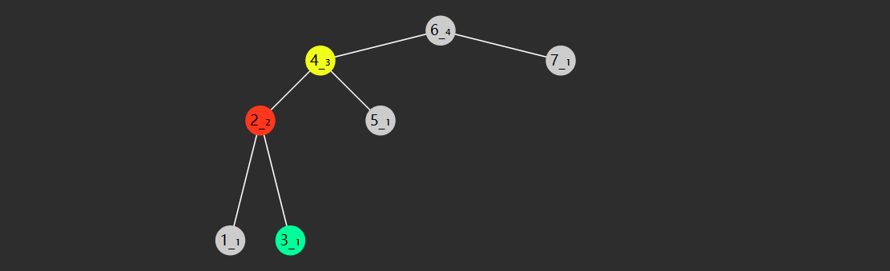
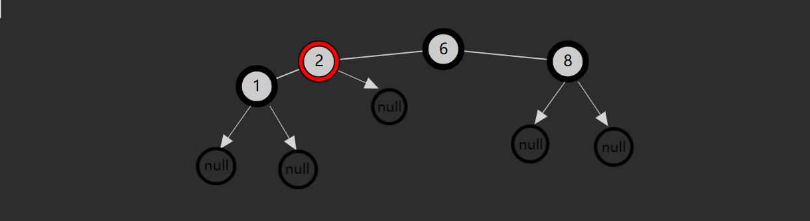

# 二叉树（Binary Tree）

## AVL树

> [AVL 树](https://zh.wikipedia.org/wiki/AVL%E6%A0%91)是计算机科学中最早被发明的自平衡二叉搜索树。AVL树得名于它的发明者格奥尔吉·阿杰尔松-韦利斯基和叶夫根尼·兰迪斯，他们在1962年的论文《An algorithm for the organization of information》中公开了这一数据结构。
>
> 在二叉搜索树中，如果插入的元素按照特定的顺序排列，可能会导致树变得非常不平衡，从而降低搜索、插入和删除的效率。为了解决这个问题，AVL 树通过在每个节点中维护一个平衡因子来确保树的平衡。平衡因子是左子树的高度减去右子树的高度。如果平衡因子的绝对值大于等于 2，则通过旋转操作来重新平衡树。
>
> AVL 树是用于存储有序数据的一种重要数据结构，它是二叉搜索树的一种改进和扩展。它能够确保树的深度始终保持在 O(log n) 的水平，因此它的查找、插入和删除在平均和最坏情况下的时间复杂度都是 O(log⁡ n)。随着计算机技术的不断发展，AVL 树已经成为了许多高效算法和系统中必不可少的一种基础数据结构。

### 概述

前面介绍过，如果一棵二叉搜索树长的不平衡，那么查询的效率会受到影响，如下图：


通过旋转可以让树重新变得平衡，并且不会改变二叉搜索树的性质（即左边仍然小，右边仍然大）。


上图旋转后得到的树就是AVL树，AVL树本质上是二叉搜索树，但是它又具有以下特点：

- 它是一棵空树或它的左右两个子树的高度差的绝对值不超过1
- 左右两个子树也都是一棵平衡二叉树

### 高度处理

**如何得到节点高度**

力扣上有一道题目：[104.二叉树的最大深度](https://leetcode.cn/problems/maximum-depth-of-binary-tree/description/)，其实求的就是根节点的高度。但由于求高度是一个非常频繁的操作，因此将高度作为节点的一个属性，将来新增或删除时及时更新，默认为 1。这样处理效果更好。

```java
static class AVLNode {
    int height = 1;
    int key;
    Object value;
    AVLNode left;
    AVLNode right;
    // ...
}
```

**求高度代码**

高度可以通过height属性获取，但是为了方便求节点为 null 时的高度，因此创建 height 方法：

```java
private int height(AVLNode node) {
    return node == null ? 0 : node.height;
}
```

**更新高度代码**

将来新增、删除、旋转时，高度都可能发生变化，需要更新。下面是更新高度的代码：

```
private void updateHeight(AVLNode node) {
    node.height = Integer.max(height(node.left), height(node.right)) + 1;
}
```

### 失衡判断

**如何判断失衡**

如果一个节点的左右孩子高度差超过1，则此节点失衡，才需要旋转。

定义平衡因子（balance factor）如下：
$$
平衡因子 = 左子树高度 - 右子树高度
$$
当平衡因子：

* bf = 0，1，-1 时，表示左右平衡
* bf > 1 时，表示左边太高
* bf < -1 时，表示右边太高

对应代码：

```
private int bf(AVLNode node) {
    return height(node.left) - height(node.right);
}
```

**何时触发失衡判断**

当插入新节点，或删除节点，引起高度变化时，例如：


目前此树平衡，当再插入一个节点4时，节点们的高度都产生了相应的变化，节点8失衡了。


再比如说，下面这棵树一开始也是平衡的。


当删除节点8时，节点们的高度都产生了相应的变化，节点 6 失衡了。


### 失衡情况

**左左型（LL）**


* 失衡节点（图中节点8）的 bf > 1，即左边更高
* 失衡节点的左孩子（图中节点6）的 bf >= 0 即左孩子这边也是左边更高或等高

**左右型（LR）**


* 失衡节点（图中节点8）的 bf > 1，即左边更高
* 失衡节点的左孩子（图中节点3）的 bf < 0 即左孩子这边是右边更高

**右左型（RL）**


* 失衡节点（图中节点3）的 bf <-1，即右边更高，
* 失衡节点的右孩子（图中节点6）的 bf > 0，即右孩子这边左边更高。

**右右型（RR）**


* 失衡节点（图中节点3）的 bf <-1，即右边更高
* 失衡节点的右孩子（图中节点6）的 bf <= 0，即右孩子这边右边更高或等高

### 解决失衡

失衡可以通过树的旋转解决。什么是树的旋转呢？它是在不干扰元素顺序的情况下更改结构，通常用来让树的高度变得平衡。

观察下面一棵二叉搜索树，可以看到，旋转后，并未改变树的左小右大特性，但根、父、孩子节点都发生了变化。

```
      4                                   2
     / \             4 right             / \
    2   5      -------------------->    1   4
   / \         <--------------------       / \
  1   3              2 left               3   5
```

**右旋（处理LL型失衡）**

旋转前


* 红色节点，旧根（失衡节点）
* 黄色节点，旧根的左孩子，将来作为新根，旧根是它右孩子
* 绿色节点，新根的右孩子，将来要托孤作为旧根的左孩子

旋转后


代码

```
private AVLNode rightRotate(AVLNode red) {
    AVLNode yellow = red.left;
    AVLNode green = yellow.right;
    yellow.right = red;
    red.left = green;
    return yellow;
}
```

**左旋（处理RR型失衡）**

旋转前


* 红色节点，旧根（失衡节点）
* 黄色节点，旧根的右孩子，将来作为新根，旧根是它左孩子
* 绿色节点，新根的左孩子，将来要换托孤作为旧根的右孩子

旋转后


代码

```java
private AVLNode leftRotate(AVLNode red) {
    AVLNode yellow = red.right;
    AVLNode green = yellow.left;
    yellow.left = red;
    red.right = green;
    return yellow;
}
```

**左右旋（处理LR型失衡）**

指先左旋左子树，再右旋根节点（失衡节点），这时一次旋转并不能解决失衡（其实就是把LR型失衡先转换成LL型失衡再处理）。

左子树旋转前


左子树旋转后



根右旋前


根右旋后


代码

```java
private AVLNode leftRightRotate(AVLNode root) {
    root.left = leftRotate(root.left);
    return rightRotate(root);
}
```

**右左旋（处理RL型失衡）**

指先右旋右子树，再左旋根节点（失衡节点）（其实就是把RL型失衡先转换成RR型失衡再处理）。

右子树右旋前


右子树右旋后


根左旋前


根左旋后


代码

```java
private AVLNode rightLeftRotate(AVLNode root) {
    root.right = rightRotate(root.right);
    return leftRotate(root);
}
```

**注意**

每次旋转后，都需要更新高度，需要更新的节点是红色、黄色，而绿色节点高度不变。

仔细观察可以发现，每次旋转时，以红色和黄色节点为根节点的二叉树结构都会发生变化。由于二叉树的节点高度是通过取左右子树中较大高度加1来计算得出的，因此每次旋转后，红色和黄色节点的高度都需要进行更新。

例如，在右旋的例子中，红色节点4的左子树由黄色节点2变为绿色节点3，而黄色节点2的右子树则由绿色节点3变为红色节点4，其余节点的结构保持不变。

旋转前


旋转后


**在右旋、左旋中加入更新高度的代码**

右旋

```java
private AVLNode rightRotate(AVLNode red) {
    AVLNode yellow = red.left;
    AVLNode green = yellow.right;
    yellow.right = red;
    red.left = green;
    updateHeight(red);
    updateHeight(yellow);
    return yellow;
}
```

左旋

```java
private AVLNode leftRotate(AVLNode red) {
    AVLNode yellow = red.right;
    AVLNode green = yellow.left;
    yellow.left = red;
    red.right = green;
    updateHeight(red);
    updateHeight(yellow);
    return yellow;
}
```

这里也有一个需要注意的点，更新高度时我们要从下往上更新，也就是先更新红色节点，再更新黄色节点。

**判断及调整平衡代码**

```java
private AVLNode balance(AVLNode node) {
    if (node == null) {
        return null;
    }
    int bf = bf(node);
    if (bf > 1 && bf(node.left) >= 0) { //LL型
        return rightRotate(node);
    } else if (bf > 1 && bf(node.left) < 0) { //LR型
        return leftRightRotate(node);
    } else if (bf < -1 && bf(node.right) > 0) { //RL型
        return rightLeftRotate(node);
    } else if (bf < -1 && bf(node.right) <= 0) { //RR型
        return rightRotate(node);
    }
    return node;
}
```

### 代码实现

AVL树的实现与二叉搜索树相似，主要区别在于新增和删除操作时需要进行平衡调整。

**新增**

```java
public void put(int key, Object val) {
    root = doPut(root, key, val);
}

private AVLNode doPut(AVLNode node, int key, Object val) {
    if (node == null) {
        return new AVLNode(key,val);
    }
    if (key == node.key) {
        node.val = val;
        return node;
    }
    if (key < node.key) {
        node.left = doPut(node.left, key, val);
    }
    if (key > node.key) {
        node.right = doPut(node.right, key, val);
    }
    updateHeight(node);
    return balance(node);
}
```

**删除**

```java
public void remove(int key) {
    root = doRemove(root, key);
}

private AVLNode doRemove(AVLNode node, int key) {
    if (node == null) {
        return null;
    }

    if (key < node.key) {
        node.left = doRemove(node.left, key);
    }

    if (key > node.key) {
        node.right = doRemove(node.right, key);
    }

    if (key == node.key) {
        if (node.left == null) {
            node = node.right;
        } else if (node.right == null) {
            node = node.left;
        } else {
            AVLNode replaced = node.right;
            while (replaced.left != null) {
                replaced = replaced.left;
            }
            replaced.right = doRemove(node, replaced.key);
            replaced.left = node.left;
            node = replaced;
        }
    }
    updateHeight(node);
    return balance(node);
}
```

**完整代码**

```java
public class AVLTree {

    AVLNode root;

    static class AVLNode {
        int key;
        Object value;
        AVLNode left;
        AVLNode right;
        int height = 1; // 高度

        public AVLNode(int key, Object value) {
            this.key = key;
            this.value = value;
        }

        public AVLNode(int key) {
            this.key = key;
        }

        public AVLNode(int key, Object value, AVLNode left, AVLNode right) {
            this.key = key;
            this.value = value;
            this.left = left;
            this.right = right;
        }
    }

    // 求节点的高度
    private int height(AVLNode node) {
        return node == null ? 0 : node.height;
    }

    // 更新节点高度 (新增、删除、旋转)
    private void updateHeight(AVLNode node) {
        node.height = Integer.max(height(node.left), height(node.right)) + 1;
    }

    // 平衡因子 (balance factor) = 左子树高度-右子树高度  1 -1 0
    private int bf(AVLNode node) {
        return height(node.left) - height(node.right);
    }

    // 参数：要旋转的节点, 返回值：新的根节点
    private AVLNode rightRotate(AVLNode red) {
        AVLNode yellow = red.left;
        AVLNode green = yellow.right;
        yellow.right = red;   // 上位
        red.left = green;     // 换爹
        updateHeight(red);
        updateHeight(yellow);
        return yellow;
    }

    // 参数：要旋转的节点, 返回值：新的根节点
    private AVLNode leftRotate(AVLNode red) {
        AVLNode yellow = red.right;
        AVLNode green = yellow.left;
        yellow.left = red;
        red.right = green;
        updateHeight(red);
        updateHeight(yellow);
        return yellow;
    }

    // 先左旋左子树, 再右旋根节点
    private AVLNode leftRightRotate(AVLNode node) {
        node.left = leftRotate(node.left);
        return rightRotate(node);
    }

    // 先右旋右子树, 再左旋根节点
    private AVLNode rightLeftRotate(AVLNode node) {
        node.right = rightRotate(node.right);
        return leftRotate(node);
    }

    // 检查节点是否失衡, 重新平衡代码
    private AVLNode balance(AVLNode node) {
        if (node == null) {
            return null;
        }
        int bf = bf(node);
        if (bf > 1 && bf(node.left) >= 0) { // LL
            return rightRotate(node);
        } else if (bf > 1 && bf(node.left) < 0) { // LR
            return leftRightRotate(node);
        } else if (bf < -1 && bf(node.right) > 0) { // RL
            return rightLeftRotate(node);
        } else if (bf < -1 && bf(node.right) <= 0) { // RR
            return leftRotate(node);
        }
        return node;
    }

    public void put(int key, Object value) {
        root = doPut(root, key, value);
    }

    private AVLNode doPut(AVLNode node, int key, Object value) {
        // 1. 找到空位, 创建新节点
        if (node == null) {
            return new AVLNode(key, value);
        }
        // 2. key 已存在, 更新
        if (key == node.key) {
            node.value = value;
            return node;
        }
        // 3. 继续查找
        if (key < node.key) {
            node.left = doPut(node.left, key, value); // 向左
        } else {
            node.right = doPut(node.right, key, value); // 向右
        }
        updateHeight(node);
        return balance(node);
    }

    public void remove(int key) {
        root = doRemove(root, key);
    }

    private AVLNode doRemove(AVLNode node, int key) {
        // 1. node == null
        if (node == null) {
            return null;
        }
        // 2. 没找到 key
        if (key < node.key) {
            node.left = doRemove(node.left, key);
        } else if (node.key < key) {
            node.right = doRemove(node.right, key);
        } else {
            // 3. 找到 key  1) 没有孩子 2) 只有一个孩子 3) 有两个孩子
            if (node.left == null && node.right == null) {
                return null;
            } else if (node.left == null) {
                node = node.right;
            } else if (node.right == null) {
                node = node.left;
            } else {
                AVLNode s = node.right;
                while (s.left != null) {
                    s = s.left;
                }
                // s 后继节点
                s.right = doRemove(node.right, s.key);
                s.left = node.left;
                node = s;
            }
        }
        // 4. 更新高度
        updateHeight(node);
        // 5. 平衡调整
        return balance(node);
    }
}
```

### 总结

AVL树是一种自平衡二叉搜索树，通过对每个节点的左右子树高度差进行控制，保持树的平衡，确保查找、插入和删除操作的时间复杂度始终为O(log n)。由于树的高度受到严格限制，因此在节点数目较多且查找操作频繁的情况下，AVL树能够提供高效的查找性能。每次插入或删除节点时，AVL树会通过旋转操作来保持平衡，这确保了树的深度不会过大，从而避免了退化成链表的情况。

然而，AVL树的插入和删除操作较为复杂，每次修改树结构时都可能需要进行旋转操作，增加了实现的复杂度和时间开销。特别是在频繁进行插入和删除操作时，旋转操作可能成为性能瓶颈。因此，在节点较少或插入、删除操作占比较高的场景中，AVL树的性能优势可能不如其他数据结构，如红黑树。红黑树虽然也能保持平衡，但其旋转操作较少，适用于插入和删除较为频繁的情况，因此在这些应用场景下更为高效。

## 红黑树

> [红黑树](https://zh.wikipedia.org/wiki/%E7%BA%A2%E9%BB%91%E6%A0%91)是一种自平衡二叉查找树，最早由一位名叫鲁道夫·贝尔的德国计算机科学家于1972年发明。然而，最初的树形结构不是现在的红黑树，而是一种称为B树的结构，它是一种多叉树，可用于在磁盘上存储大量数据。
>
> 在1980年代早期，计算机科学家利奥尼达斯·J·吉巴斯和罗伯特·塞奇威克推广了红黑树，并证明了它的自平衡性和高效性。从那时起，红黑树成为了最流行的自平衡二叉查找树之一，并被广泛应用于许多领域，如编译器、操作系统、数据库等。
>
> 红黑树的名字来源于红色节点和黑色节点的交替出现，它们的颜色是用来维护树的平衡性的关键。它们的颜色具有特殊的意义，黑色节点代表普通节点，而红色节点代表一个新添加的节点，它们必须满足一些特定的规则才能维持树的平衡性。

### 概述

红黑树也是一种自平衡的二叉搜索树，较之 AVL，插入和删除时旋转次数更少。

**红黑树特性：**

1. 所有节点都有两种颜色：红:red_circle:、黑:black_circle:
2. 每个叶子节点（null节点）都视为黑色:black_circle:
3. 红色:red_circle:节点不能相邻
4. 根节点是黑色:black_circle:
5. 从根节点到任意一个叶子节点，路径中的黑色:black_circle:节点数一样（黑色完美平衡）


根据上面的性质，判断一下下面这棵树是不是红黑树


先下结论，这棵树不是红黑树。

上面这棵树首先很容易就能看出是满足特性1-4条的，关键在于第5条特性，可能乍一看好像也是符合第5条的，但实际就会陷入一个误区，忽略了null节点，这样看的话每一条从根节点到叶子结点的路径确实都经过了两个黑色节点。

但实际上，在红黑树中，最下面的null节点也是需要考虑到的，如下图



这样一来，每一条从根节点到叶子结点的路径经过的黑色节点数量也不是全都一样，这样特性5就不满足了，所以这棵树并不是一棵红黑树。

**推论**

1. 红黑树的子树也一定是红黑树。
2. 根节点以外如果所有节点都有兄弟，那么可以不用考虑null节点
3. 在没有考虑null节点的情况下，根节点以外如果某个节点没有兄弟且包含黑色节点，肯定违反了红黑树特性5
4. 根据推论2和特性3，可以推出，根节点以外如果某个节点没有兄弟，那他必定是红色节点，且它的两个孩子必定为null
5. 根据推论2和特性3，还可以推出，一个红色节点，他只能是有两个黑孩子或者两个孩子都为null

### 准备工作

**枚举类**

```java
enum Color {
    RED, BLACK;
}
```

红黑树的颜色有两种，红色和黑色，所以这里先定义一个枚举类型，用来代表两种颜色。

**节点类**

```java
static class Node {
    int key;
    Object value;
    Node left;
    Node right;
    Node parent;        //父节点 操作红黑树时，需要维护parent指向正确的对象
    Color color = RED;  //颜色 默认为红色
    
	// ...
	
    // 是否是左孩子
    boolean isLeftChild() {
        return parent != null && parent.left == this; //节点是根节点时父亲为null
    }

    // 叔叔
    Node uncle() {
        if (parent == null || parent.parent == null) { //节点是根节点或者节点的父节点是根节点都是没有叔叔节点的
            return null;
        }
        if (parent.isLeftChild()) {
            return parent.parent.right;
        } else {
            return parent.parent.left;
        }
    }

    // 兄弟
    Node sibling() {
        if (parent == null) { // 根节点没有兄弟节点
            return null;
        }
        if (this.isLeftChild()) {
            return parent.right;
        } else {
            return parent.left;
        }
    }
}
```

两个比较特殊的属性：parent（父节点）和color（颜色），三个工具方法：isLeftChild（是否是左孩子）、uncle（获取叔叔节点）、sibling（获取兄弟节点）。后面操作红黑树时，这些东西会经常用到，先定义出来，能让我们后面的代码更简洁，思路也更清晰。

根据特性1，红黑树节点的颜色要么是红色要么是黑色，那么在插入新节点时，这个节点应该是红色还是黑色呢？答案是红色，原因也不难理解。如果插入的节点是黑色，那么这个节点所在路径比其他路径多出一个黑色节点，这个调整起来会比较麻烦。如果插入的节点是红色，此时所有路径上的黑色节点数量不变，仅可能会出现红红相邻的情况，违反了特性4，这种情况下，调整起来相对简单，通过变色和旋转进行调整即可。

**判断红、黑**

```java
// 判断红
boolean isRed(Node node) {
	return node != null && node.color == RED;
}

// 判断黑
boolean isBlack(Node node) {
	return !isRed(node);
}
```

方便处理节点为null的情况

**右旋、左旋**

```java
// 右旋
private void rightRotate(Node pink) {
    Node parent = pink.parent;
    Node yellow = pink.left;
    Node green = yellow.right;
    if (green != null) {
        green.parent = pink;
    }
    yellow.right = pink;
    yellow.parent = parent;
    pink.left = green;
    pink.parent = yellow;
    //建立新根yellow与parent的父子关系
    if (parent == null) {
        root = yellow;
    } else if (parent.left == pink) {
        parent.left = yellow;
    } else {
        parent.right = yellow;
    }
}

// 左旋
private void leftRotate(Node pink) {
    Node parent = pink.parent;
    Node yellow = pink.right;
    Node green = yellow.left;
    if (green != null) {
        green.parent = pink;
    }
    yellow.left = pink;
    yellow.parent = parent;
    pink.right = green;
    pink.parent = yellow;
    //建立新根yellow与parent的父子关系
    if (parent == null) {
        root = yellow;
    } else if (parent.left == pink) {
        parent.left = yellow;
    } else {
        parent.right = yellow;
    }
}
```

两个需要注意的点：

- 维护各节点的parent指向正确的对象
- 旋转后新根与父节点的父子关系在方法内直接建立

### 红黑树的操作

红黑树的基本操作和其他树形结构一样，一般都包括查找、插入、删除等操作。前面说到，红黑树是一种自平衡的二叉查找树，既然是二叉查找树的一种，那么查找过程和二叉查找树一样，比较简单，这里不再赘述。相对于查找操作，红黑树的插入和删除操作就要复杂的多。尤其是删除操作，要处理的情况比较多，下面就来分情况讲解。

[插入和删除时的各种情况的例子](/example/tree_redblack)

#### 插入

前面讲过，插入节点默认为红色。

**case 1：插入节点为根节点，将根节点变黑:black_circle:**

**case 2：插入节点的父亲为黑色:black_circle:，树的红黑性质不变，无需调整**

<br>

插入节点的父亲为红色:red_circle:，触发红红相邻

**case 3：叔叔为红色:red_circle:**

- 父亲变为黑色:black_circle:，为了保证黑色平衡，连带的叔叔也变为黑色:black_circle:
- 祖父如果是黑色不变，会造成这颗子树黑色过多，因此祖父节点变为红色:red_circle:
- 祖父如果变成红色，可能会接着触发红红相邻，因此对将祖父进行递归调整
- 往上递归会一直持续，直到出现以下三种结果：
  - 祖父的父亲是黑色，没有触发红红相邻，进入case2，结束递归
  - 递归到根节点的孩子节点，根据特性4，根节点一定是黑色，因此会进入case2，结束递归
  - 递归到根节点，进入case1，将根节点变成黑色，结束递归，而且经过重复递归调整，整棵红黑树恢复平衡，因为根节点没有兄弟节点，也就不用考虑根节点与兄弟节点的黑色平衡

**case 4：叔叔为黑色:black_circle:**

- 父亲为左孩子，插入节点也是左孩子，此时即 LL 不平衡

  - 让父亲变黑:black_circle:，为了保证这颗子树黑色不变，将祖父变成红:red_circle:，但叔叔子树少了一个黑色
  - 祖父右旋，补齐一个黑色给叔叔，父亲旋转上去取代祖父，由于它是黑色，不会再次触发红红相邻

- 父亲为左孩子，插入节点是右孩子，此时即 LR 不平衡

  - 父亲左旋，变成 LL 情况，按 LL 不平衡来后续处理

- 父亲为右孩子，插入节点也是右孩子，此时即 RR 不平衡

  - 让父亲变黑:black_circle:，为了保证这颗子树黑色不变，将祖父变成红:red_circle:，但叔叔子树少了一个黑色

  - 祖父左旋，补齐一个黑色给叔叔，父亲旋转上去取代祖父，由于它是黑色，不会再次触发红红相邻

- 父亲为右孩子，插入节点是左孩子，此时即 RL 不平衡

  - 父亲右旋，变成 RR 情况，按 RR 不平衡来后续处理

```java
public void put(int key, Object value) {
    Node p = root;
    Node parent = null;
    while (p != null) {
        parent = p;
        if (key < p.key) {
            p = p.left;
        } else if (p.key < key) {
            p = p.right;
        } else {
            p.value = value; // 更新
            return;
        }
    }
    Node inserted = new Node(key, value);
    if (parent == null) {
        root = inserted;
    } else if (key < parent.key) {
        parent.left = inserted;
        inserted.parent = parent;
    } else {
        parent.right = inserted;
        inserted.parent = parent;
    }
    fixRedRed(inserted);
}


void fixRedRed(Node x) {
    // case 1 插入节点是根节点，变黑即可
    if (x == root) {
        x.color = BLACK;
        return;
    }
    // case 2 插入节点父亲是黑色，无需调整
    if (isBlack(x.parent)) {
        return;
    }
    /* case 3 当红红相邻，叔叔为红时
        需要将父亲、叔叔变黑、祖父变红，然后对祖父做递归处理
    */
    Node parent = x.parent;
    Node uncle = x.uncle();
    Node grandparent = parent.parent;
    if (isRed(uncle)) {
        parent.color = BLACK;
        uncle.color = BLACK;
        grandparent.color = RED;
        fixRedRed(grandparent);
        return;
    }

    // case 4 当红红相邻，叔叔为黑时
    if (parent.isLeftChild() && x.isLeftChild()) { // LL
        parent.color = BLACK;
        grandparent.color = RED;
        rightRotate(grandparent);
    } else if (parent.isLeftChild() && !x.isLeftChild()) { // LR
        leftRotate(parent);
        x.color = BLACK;
        grandparent.color = RED;
        rightRotate(grandparent);
    } else if (!parent.isLeftChild() && !x.isLeftChild()) { // RR
        parent.color = BLACK;
        grandparent.color = RED;
        leftRotate(grandparent);
    } else { // RL
        rightRotate(parent);
        x.color = BLACK;
        grandparent.color = RED;
        leftRotate(grandparent);
    }
}
```

#### 删除

**case0：删除节点有两个孩子**

- 交换删除节点和后继节点的 key，value，递归删除后继节点，后继节点必定最多只有一个右孩子，所以会直接进入以下其他case

<br>

删除节点没有孩子或只剩一个孩子

**case 1：删的是根节点**

* 根节点没有孩子，删完了，直接将 root = null
* 根节点只剩一个孩子，用剩余节点替换了根节点的 key，value，根节点孩子 = null，颜色保持黑色:black_circle:不变

<br>

如果删除的节点是红色直接删除，不用作任何调整。但删黑色有一种简单情况

**case 2：删的是黑:black_circle:，替换节点是红:red_circle:**

- 让这个替换的红节点变黑:black_circle:，补上删除失去的黑色资源

<br>

替换节点是黑色:black_circle:，触发**双黑**（本质上是少了一个黑），删除节点和替换节点都是黑色:black_circle:，所以没法通过将替换节点变成黑色来补上删除节点失去的黑色资源。

**注意**！！！删除节点只剩一个孩子节点的情况下，是不会触发双黑的，因为在这个情况下，替换节点只能是删除节点剩下的那个孩子节点，但是红黑树不会存在一个黑色节点没有兄弟节点的情况。

**如何让黑色资源重新平衡**？可以借助兄弟的力量，于是有了这几种情况

**case 3：删除节点的兄弟节点为红:red_circle:**

- 过度情况，可通过旋转变成case 4或者case 5
- 兄弟节点为红，父节点、侄子节点必定是黑，要不就触发红红相邻了
- 而且侄子节点必定不为null，要不黑色平衡不了
- 删除节点是左孩子节点，父节点左旋
- 删除节点是右孩子节点，父节点右旋
- 父节点和兄弟节点要变色，保证旋转后颜色平衡
- 旋转的目的是让黑侄子节点变为删除节点的黑兄弟节点，对删除节点再次递归，进入 case 4 或 case 5

**case 4：删除节点的兄弟节点为黑色:black_circle:，两个侄子节点都为黑 :black_circle:**

* 将兄弟节点变红:red_circle:，目的是将删除节点和兄弟节点那边的黑色数目同时减 1，先达成两兄弟之间的内部黑色平衡
* 如果父节点是红:red_circle:，则需将父节点变为黑，避免红红，且此时路径黑节点数目刚好与删除节点前保持一致
* 如果父节点是黑:black_circle:，说明这条路径还是少黑，再次让父节点触发双黑，进入递归
* 如果一直递归到根节点，所有路径都会比原来少一个黑色，红黑树又恢复平衡，结束递归

**case 5：删除节点的兄弟节点为黑:black_circle:，至少一个红:red_circle:侄子**

* 如果兄弟节点是左孩子节点，左侄子节点是红:red_circle:，LL 不平衡

  - 父节点右旋
  - 将来删除节点这边少个黑，所以最后旋转过来的父节点需要变成黑:black_circle:，平衡起见，左侄子节点也变黑:black_circle:
  - 原来兄弟节点要成为新的父节点，需要变成原来父节点颜色

* 如果兄弟节点是左孩子节点，右侄子节点是红:red_circle:，LR 不平衡

  - 兄弟节点左旋，然后父节点右旋

  * 将来删除节点这边少个黑，所以最后旋转过来的父节点需要变成黑:black_circle:
  * 原来右侄子节点要成为新的父节点，需要变成原来父节点颜色
  * 兄弟节点已经是黑了:black_circle:，无需改变

* 如果兄弟节点是右孩子节点，右侄子节点是红:red_circle:，RR 不平衡

  - 父节点左旋

  * 将来删除节点这边少个黑，所以最后旋转过来的父节点需要变成黑:black_circle:，平衡起见，右侄子节点也变黑:black_circle:
  * 原来兄弟节点要成为新的父节点，需要变成原来父节点颜色

* 如果兄弟节点是右孩子节点，左侄子节点是红:red_circle:，RL 不平衡

  - 兄弟节点右旋，然后父节点左旋

  * 将来删除节点这边少个黑，所以最后旋转过来的父节点需要变成黑:black_circle:
  * 原来左侄子节点要成为新的父节点，需要变成原来父节点颜色
  * 兄弟节点已经是黑了:black_circle:，无需改变

我们将父节点，兄弟节点，删除节点看成一个**待调整区域**，可以发现，case 5 看似复杂，其实四个情况都是做同一件事，将红侄子节点通过旋转拉进**待调整区域**，通过将红侄子变成黑色补上删除节点失去的一个黑色节点，且不改变待调整区域各位置的节点颜色，所以旋转后都要调整颜色，将**待调整区域**各个位置的节点颜色恢复成原来的颜色。

为什么这样做就可以让红黑树保持平衡？我们将**待调整区域**以外的区域看成**外部区域**，可以发现，只要父节点不改变颜色并且以父节点内部各路径黑色数目与原来保持一致（**问题A)**，那么**外部区域**不需要任何调整，整棵红黑树也会恢复平衡。

如何解决**问题A**，核心思路就是让**待调整区域**里不失去任何一个位置的节点并且各位置的节点颜色与原来保持一致，但是我们的删除节点就在**待调整区域**里，我们也不能因为解决**问题A**而让其他区域的黑色数目减少，这怎么办？不要忘了我们还有一个红色侄子节点，我们可以通过旋转把它拉近**待调整区域**，再通过调整颜色将**待调整区域**各个位置的节点颜色恢复成原来的颜色，这样做会导致**外部区域**丢失一个红色节点，但是，红节点的丢失是不会对红黑树的平衡造成影响的。

```
public void remove(int key) {
    Node deleted = find(key);
    if (deleted == null) {
        return;
    }
    doRemove(deleted);
}

public boolean contains(int key) {
    return find(key) != null;
}

// 查找删除节点
private Node find(int key) {
    Node p = root;
    while (p != null) {
        if (key < p.key) {
            p = p.left;
        } else if (p.key < key) {
            p = p.right;
        } else {
            return p;
        }
    }
    return null;
}

// 查找剩余节点
private Node findReplaced(Node deleted) {
    if (deleted.left == null && deleted.right == null) {
        return null;
    }
    if (deleted.left == null) {
        return deleted.right;
    }
    if (deleted.right == null) {
        return deleted.left;
    }
    Node s = deleted.right;
    while (s.left != null) {
        s = s.left;
    }
    return s;
}

// 处理双黑 (case3、case4、case5) (删除的节点是黑色，替换上来的节点也是黑色)
private void fixDoubleBlack(Node x) {
    if (x == root) {
        return;
    }
    Node parent = x.parent;
    Node sibling = x.sibling();
    // case 3 兄弟节点是红色
    if (isRed(sibling)) {
        if (x.isLeftChild()) {
            leftRotate(parent);
        } else {
            rightRotate(parent);
        }
        parent.color = RED;
        sibling.color = BLACK;
        fixDoubleBlack(x);
        return;
    }

    // case 4 兄弟是黑色, 两个侄子也是黑色
    if (isBlack(sibling.left) && isBlack(sibling.right)) {
        sibling.color = RED;
        if (isRed(parent)) {
            parent.color = BLACK;
        } else {
            fixDoubleBlack(parent);
        }
    }
    // case 5 兄弟是黑色, 侄子有红色
    else {
        // LL
        if (sibling.isLeftChild() && isRed(sibling.left)) {
            rightRotate(parent);
            sibling.left.color = BLACK;
            sibling.color = parent.color;
        }
        // LR
        else if (sibling.isLeftChild() && isRed(sibling.right)) {
            sibling.right.color = parent.color;
            leftRotate(sibling);
            rightRotate(parent);
        }
        // RL
        else if (!sibling.isLeftChild() && isRed(sibling.left)) {
            sibling.left.color = parent.color;
            rightRotate(sibling);
            leftRotate(parent);
        }
        // RR
        else {
            leftRotate(parent);
            sibling.right.color = BLACK;
            sibling.color = parent.color;
        }
        parent.color = BLACK;
    }
}

private void doRemove(Node deleted) {
    Node replaced = findReplaced(deleted);
    Node parent = deleted.parent;
    // 没有孩子
    if (replaced == null) {
        // case 1 删除的是根节点
        if (deleted == root) {
            root = null;
        } else {
            //没有孩子，替换节点是null，根据红黑树特性，null也是黑色，如果删除的也是黑色，其实就已经触发了双黑
            if (isBlack(deleted)) {
                // 复杂调整
                fixDoubleBlack(deleted);
            } else {
                // 红色叶子, 无需任何处理
            }
            if (deleted.isLeftChild()) {
                parent.left = null;
            } else {
                parent.right = null;
            }
            deleted.parent = null;
        }
        return;
    }
    // 有一个孩子
    if (deleted.left == null || deleted.right == null) {
        // case 1 删除的是根节点
        if (deleted == root) {
            root.key = replaced.key;
            root.value = replaced.value;
            root.left = root.right = null;
        } else {
            if (deleted.isLeftChild()) {
                parent.left = replaced;
            } else {
                parent.right = replaced;
            }
            replaced.parent = parent;
            deleted.left = deleted.right = deleted.parent = null;
            // case 2 只有一个孩子的情况下，删除节点必定是黑，替换节点（也就是删除节点唯一一个孩子）必定是红，直接让替换节点变黑补上删除的一个黑色
            replaced.color = BLACK;

        }
        return;
    }
    // case 0 有两个孩子 => 有一个孩子 或 没有孩子
    int t = deleted.key;
    deleted.key = replaced.key;
    replaced.key = t;

    Object v = deleted.value;
    deleted.value = replaced.value;
    replaced.value = v;
    doRemove(replaced);
}
```

### 完整代码

```java
public class RedBlackTree {

    enum Color {
        RED, BLACK;
    }

    Node root;

    static class Node {
        int key;
        Object value;
        Node left;
        Node right;
        Node parent;        // 父节点
        Color color = RED;  // 颜色

        public Node(int key, Object value) {
            this.key = key;
            this.value = value;
        }

        public Node(int key) {
            this.key = key;
        }

        public Node(int key, Color color) {
            this.key = key;
            this.color = color;
        }

        public Node(int key, Color color, Node left, Node right) {
            this.key = key;
            this.color = color;
            this.left = left;
            this.right = right;
            if (left != null) {
                left.parent = this;
            }
            if (right != null) {
                right.parent = this;
            }
        }

        // 是否是左孩子
        boolean isLeftChild() {
            return parent != null && parent.left == this;
        }

        // 叔叔
        Node uncle() {
            if (parent == null || parent.parent == null) {
                return null;
            }
            if (parent.isLeftChild()) {
                return parent.parent.right;
            } else {
                return parent.parent.left;
            }
        }

        // 兄弟
        Node sibling() {
            if (parent == null) {
                return null;
            }
            if (this.isLeftChild()) {
                return parent.right;
            } else {
                return parent.left;
            }
        }
    }

    // 判断红
    boolean isRed(Node node) {
        return node != null && node.color == RED;
    }

    // 判断黑
    boolean isBlack(Node node) {
//        return !isRed(node);
        return node == null || node.color == BLACK;
    }

    // 右旋 1. parent 的处理 2. 旋转后新根的父子关系
    private void rightRotate(Node pink) {
        Node parent = pink.parent;
        Node yellow = pink.left;
        Node green = yellow.right;
        if (green != null) {
            green.parent = pink;
        }
        yellow.right = pink;
        yellow.parent = parent;
        pink.left = green;
        pink.parent = yellow;
        if (parent == null) {
            root = yellow;
        } else if (parent.left == pink) {
            parent.left = yellow;
        } else {
            parent.right = yellow;
        }
    }

    // 左旋
    private void leftRotate(Node pink) {
        Node parent = pink.parent;
        Node yellow = pink.right;
        Node green = yellow.left;
        if (green != null) {
            green.parent = pink;
        }
        yellow.left = pink;
        yellow.parent = parent;
        pink.right = green;
        pink.parent = yellow;
        if (parent == null) {
            root = yellow;
        } else if (parent.left == pink) {
            parent.left = yellow;
        } else {
            parent.right = yellow;
        }
    }

    /**
     * 新增或更新
     * <br>
     * 正常增、遇到红红不平衡进行调整
     *
     * @param key   键
     * @param value 值
     */
    public void put(int key, Object value) {
        Node p = root;
        Node parent = null;
        while (p != null) {
            parent = p;
            if (key < p.key) {
                p = p.left;
            } else if (p.key < key) {
                p = p.right;
            } else {
                p.value = value; // 更新
                return;
            }
        }
        Node inserted = new Node(key, value);
        if (parent == null) {
            root = inserted;
        } else if (key < parent.key) {
            parent.left = inserted;
            inserted.parent = parent;
        } else {
            parent.right = inserted;
            inserted.parent = parent;
        }
        fixRedRed(inserted);
    }

    void fixRedRed(Node x) {
        // case 1 插入节点是根节点，变黑即可
        if (x == root) {
            x.color = BLACK;
            return;
        }
        // case 2 插入节点父亲是黑色，无需调整
        if (isBlack(x.parent)) {
            return;
        }
        /* case 3 当红红相邻，叔叔为红时
            需要将父亲、叔叔变黑、祖父变红，然后对祖父做递归处理
        */
        Node parent = x.parent;
        Node uncle = x.uncle();
        Node grandparent = parent.parent;
        if (isRed(uncle)) {
            parent.color = BLACK;
            uncle.color = BLACK;
            grandparent.color = RED;
            fixRedRed(grandparent);
            return;
        }

        // case 4 当红红相邻，叔叔为黑时
        if (parent.isLeftChild() && x.isLeftChild()) { // LL
            parent.color = BLACK;
            grandparent.color = RED;
            rightRotate(grandparent);
        } else if (parent.isLeftChild()) { // LR
            leftRotate(parent);
            x.color = BLACK;
            grandparent.color = RED;
            rightRotate(grandparent);
        } else if (!x.isLeftChild()) { // RR
            parent.color = BLACK;
            grandparent.color = RED;
            leftRotate(grandparent);
        } else { // RL
            rightRotate(parent);
            x.color = BLACK;
            grandparent.color = RED;
            leftRotate(grandparent);
        }
    }

    /**
     * 删除
     * <br>
     * 正常删、会用到李代桃僵技巧、遇到黑黑不平衡进行调整
     *
     * @param key 键
     */
    public void remove(int key) {
        Node deleted = find(key);
        if (deleted == null) {
            return;
        }
        doRemove(deleted);
    }

    public boolean contains(int key) {
        return find(key) != null;
    }

    // 查找删除节点
    private Node find(int key) {
        Node p = root;
        while (p != null) {
            if (key < p.key) {
                p = p.left;
            } else if (p.key < key) {
                p = p.right;
            } else {
                return p;
            }
        }
        return null;
    }

    // 查找剩余节点
    private Node findReplaced(Node deleted) {
        if (deleted.left == null && deleted.right == null) {
            return null;
        }
        if (deleted.left == null) {
            return deleted.right;
        }
        if (deleted.right == null) {
            return deleted.left;
        }
        Node s = deleted.right;
        while (s.left != null) {
            s = s.left;
        }
        return s;
    }

    // 处理双黑 (case3、case4、case5)
    private void fixDoubleBlack(Node x) {
        if (x == root) {
            return;
        }
        Node parent = x.parent;
        Node sibling = x.sibling();
        // case 3 兄弟节点是红色
        if (isRed(sibling)) {
            if (x.isLeftChild()) {
                leftRotate(parent);
            } else {
                rightRotate(parent);
            }
            parent.color = RED;
            sibling.color = BLACK;
            fixDoubleBlack(x);
            return;
        }
        if (sibling != null) {
            // case 4 兄弟是黑色, 两个侄子也是黑色
            if (isBlack(sibling.left) && isBlack(sibling.right)) {
                sibling.color = RED;
                if (isRed(parent)) {
                    parent.color = BLACK;
                } else {
                    fixDoubleBlack(parent);
                }
            }
            // case 5 兄弟是黑色, 侄子有红色
            else {
                // LL
                if (sibling.isLeftChild() && isRed(sibling.left)) {
                    rightRotate(parent);
                    sibling.left.color = BLACK;
                    sibling.color = parent.color;
                }
                // LR
                else if (sibling.isLeftChild() && isRed(sibling.right)) {
                    sibling.right.color = parent.color;
                    leftRotate(sibling);
                    rightRotate(parent);
                }
                // RL
                else if (!sibling.isLeftChild() && isRed(sibling.left)) {
                    sibling.left.color = parent.color;
                    rightRotate(sibling);
                    leftRotate(parent);
                }
                // RR
                else {
                    leftRotate(parent);
                    sibling.right.color = BLACK;
                    sibling.color = parent.color;
                }
                parent.color = BLACK;
            }
        } else {
            // @TODO 实际也不会出现，触发双黑后，兄弟节点不会为 null
            fixDoubleBlack(parent);
        }
    }

    private void doRemove(Node deleted) {
        Node replaced = findReplaced(deleted);
        Node parent = deleted.parent;
        // 没有孩子
        if (replaced == null) {
            // case 1 删除的是根节点
            if (deleted == root) {
                root = null;
            } else {
                if (isBlack(deleted)) {
                    // 复杂调整
                    fixDoubleBlack(deleted);
                } else {
                    // 红色叶子, 无需任何处理
                }
                if (deleted.isLeftChild()) {
                    parent.left = null;
                } else {
                    parent.right = null;
                }
                deleted.parent = null;
            }
            return;
        }
        // 有一个孩子
        if (deleted.left == null || deleted.right == null) {
            // case 1 删除的是根节点
            if (deleted == root) {
                root.key = replaced.key;
                root.value = replaced.value;
                root.left = root.right = null;
            } else {
                if (deleted.isLeftChild()) {
                    parent.left = replaced;
                } else {
                    parent.right = replaced;
                }
                replaced.parent = parent;
                deleted.left = deleted.right = deleted.parent = null;
                if (isBlack(deleted) && isBlack(replaced)) {
                    // 复杂处理 @TODO 实际不会有这种情况 因为只有一个孩子时 被删除节点是黑色 那么剩余节点只能是红色不会触发双黑
                    fixDoubleBlack(replaced);
                } else {
                    // case 2 删除是黑，剩下是红
                    replaced.color = BLACK;
                }
            }
            return;
        }
        // case 0 有两个孩子 => 有一个孩子 或 没有孩子
        int t = deleted.key;
        deleted.key = replaced.key;
        replaced.key = t;

        Object v = deleted.value;
        deleted.value = replaced.value;
        replaced.value = v;
        doRemove(replaced);
    }
}
```

### 总结

| 维度         | 普通二叉搜索树        | AVL树          | 红黑树                     |
| ------------ | --------------------- | -------------- | -------------------------- |
| 查询         | 平均O(logn)，最坏O(n) | O(logn)        | O(logn)                    |
| 插入         | 平均O(logn)，最坏O(n) | O(logn)        | O(logn)                    |
| 删除         | 平均O(logn)，最坏O(n) | O(logn)        | O(logn)                    |
| 平衡性       | 不平衡                | 严格平衡       | 近似平衡                   |
| 结构         | 二叉树                | 自平衡的二叉树 | 具有红黑性质的自平衡二叉树 |
| 查找效率     | 低                    | 高             | 高                         |
| 插入删除效率 | 低                    | 中等           | 高                         |

普通二叉搜索树插入、删除、查询的时间复杂度与树的高度相关，因此在最坏情况下，时间复杂度为O(n)，而且容易退化成链表，查找效率低。

AVL树是一种高度平衡的二叉搜索树，其左右子树的高度差不超过1。因此，它能够在logn的平均时间内完成插入、删除、查询操作，但是在维护平衡的过程中，需要频繁地进行旋转操作，导致插入删除效率较低。

红黑树是一种近似平衡的二叉搜索树，它在保持高度平衡的同时，又能够保持较高的插入删除效率。红黑树通过节点着色和旋转操作来维护平衡。红黑树在维护平衡的过程中，能够进行较少的节点旋转操作，因此插入删除效率较高，并且查询效率也较高。

综上所述，红黑树具有较高的综合性能，是一种广泛应用的数据结构。

