# 数据结构

------

## 二叉搜索树

> [二叉搜索树](https://zh.wikipedia.org/wiki/%E4%BA%8C%E5%85%83%E6%90%9C%E5%B0%8B%E6%A8%B9)最早是由Bernoulli兄弟在18世纪中提出的，但是真正推广和应用该数据结构的是1960年代的D.L. Gries。他的著作《The Science of Programming》中详细介绍了二叉搜索树的实现和应用。
>
> 在计算机科学的发展中，二叉搜索树成为了一种非常基础的数据结构，被广泛应用在各种领域，包括搜索、排序、数据库索引等。随着计算机算力的提升和对数据结构的深入研究，二叉搜索树也不断被优化和扩展，例如AVL树、红黑树等。

### 概述

二叉搜索树（也称二叉排序树）是符合下面特征的二叉树：

1. 树节点增加 key 属性，用来比较谁大谁小，key 不可以重复
2. 对于任意一个树节点，它的 key 比左子树的 key 都大，同时也比右子树的 key 都小，例如下图所示


轻易看出要查找 7 （从根开始）自然就可应用二分查找算法，只需三次比较

* 与 4 比，较之大，向右找
* 与 6 比，较之大，继续向右找
* 与 7 比，找到

查找的时间复杂度与**树高**相关，插入、删除也是如此。

* 如果这棵树长得还不赖（左右平衡）上图，那么时间复杂度均是 $O(\log{N})$
* 当然，这棵树如果长得丑（左右高度相差过大）下图，那么这时是最糟的情况，时间复杂度是 $O(N)$

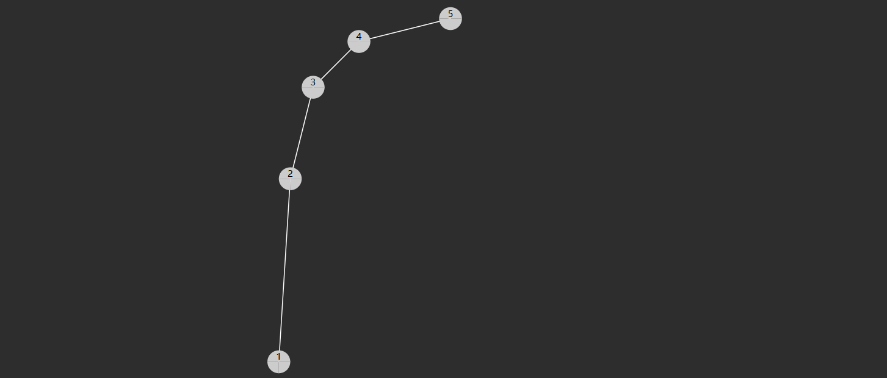

> 注：
>
> * 二叉搜索树 - 英文 binary search tree，简称 BST
> * 二叉排序树 - 英文 binary ordered tree 或 binary sorted tree


### 实现

#### 定义节点

```java
static class BSTNode {
    int key; // 若希望任意类型作为 key, 则后续可以将其设计为 Comparable 接口
    Object value;
    BSTNode left;
    BSTNode right;

    public BSTNode(int key) {
        this.key = key;
        this.value = key;
    }

    public BSTNode(int key, Object value) {
        this.key = key;
        this.value = value;
    }

    public BSTNode(int key, Object value, BSTNode left, BSTNode right) {
        this.key = key;
        this.value = value;
        this.left = left;
        this.right = right;
    }
}
```


#### 查询

**递归实现**

```java
public Object get(int key) {
    return doGet(root, key);
}

private Object doGet(BSTNode node, int key) {
    if (node == null) {
        return null; // 没找到
    }
    if (key < node.key) {
        return doGet(node.left, key); // 向左找
    } else if (node.key < key) {
        return doGet(node.right, key); // 向右找
    } else {
        return node.value; // 找到了
    }
}
```


**非递归实现**

```java
public Object get(int key) {
    BSTNode node = root;
    while (node != null) {
        if (key < node.key) {
            node = node.left;
        } else if (node.key < key) {
            node = node.right;
        } else {
            return node.value;
        }
    }
    return null;
}
```


#### Comparable

如果希望让除 int 外更多的类型能够作为 key，一种方式是 key 必须实现 Comparable 接口。

```java
public class BSTTree2<T extends Comparable<T>> {
    static class BSTNode<T> {
        T key; // 若希望任意类型作为 key, 则后续可以将其设计为 Comparable 接口
        Object value;
        BSTNode<T> left;
        BSTNode<T> right;

        public BSTNode(T key) {
            this.key = key;
            this.value = key;
        }

        public BSTNode(T key, Object value) {
            this.key = key;
            this.value = value;
        }

        public BSTNode(T key, Object value, BSTNode<T> left, BSTNode<T> right) {
            this.key = key;
            this.value = value;
            this.left = left;
            this.right = right;
        }
    }

    BSTNode<T> root;

    public Object get(T key) {
        return doGet(root, key);
    }

    private Object doGet(BSTNode<T> node, T key) {
        if (node == null) {
            return null;
        }
        int result = node.key.compareTo(key);
        if (result > 0) {
            return doGet(node.left, key);
        } else if (result < 0) {
            return doGet(node.right, key);
        } else {
            return node.value;
        }
    }

}
```

还有一种做法不要求 key 实现 Comparable 接口，而是在构造 Tree 时把比较规则作为 Comparator 传入，将来比较 key 大小时都调用此 Comparator 进行比较，这种做法可以参考 Java 中的 java.util.TreeMap


#### 最小

**递归实现**

```java
public Object min() {
    return doMin(root);
}

public Object doMin(BSTNode node) {
    if (node == null) {
        return null;
    }
    // 左边已走到头
    if (node.left == null) { 
        return node.value;
    }
    return doMin(node.left);
}
```


**非递归实现**

```java
public Object min() {
    if (root == null) {
        return null;
    }
    BSTNode p = root;
    // 左边未走到头
    while (p.left != null) {
        p = p.left;
    }
    return p.value;
}
```


#### 最大

**递归实现**

```java
public Object max() {
    return doMax(root);
}

public Object doMax(BSTNode node) {
    if (node == null) {
        return null;
    }
    // 右边已走到头
    if (node.left == null) { 
        return node.value;
    }
    return doMin(node.right);
}
```

**非递归实现**

```java
public Object max() {
    if (root == null) {
        return null;
    }
    BSTNode p = root;
    // 右边未走到头
    while (p.right != null) {
        p = p.right;
    }
    return p.value;
}
```


#### 新增

**递归实现**

```java
public void put(int key, Object value) {
    root = doPut(root, key, value);
}

private BSTNode doPut(BSTNode node, int key, Object value) {
    if (node == null) {
        return new BSTNode(key, value);
    }
    if (key < node.key) {
        node.left = doPut(node.left, key, value);
    } else if (node.key < key) {
        node.right = doPut(node.right, key, value);
    } else {
        node.value = value;
    }
    return node;
}
```

* 若找到 key，走 else 更新找到节点的值
* 若没找到 key，走第一个 if，创建并返回新节点
  * 返回的新节点，作为上次递归时 node 的左孩子或右孩子
  * 缺点是，会有很多不必要的赋值操作


**非递归实现**

```java
public void put(int key, Object value) {
    BSTNode node = root;
    BSTNode parent = null;
    while (node != null) {
        parent = node;
        if (key < node.key) {
            node = node.left;
        } else if (node.key < key) {
            node = node.right;
        } else {
            // 1. key 存在则更新
            node.value = value;
            return;
        }
    }
    // 2. key 不存在则新增
    if (parent == null) {
        root = new BSTNode(key, value);
    } else if (key < parent.key) {
        parent.left = new BSTNode(key, value);
    } else {
        parent.right = new BSTNode(key, value);
    }
}
```


#### 前驱后继


一个节点的前驱（前任）节点是指比它小的节点中，最大的那个

一个节点的后继（后任）节点是指比它大的节点中，最小的那个

例如上图中

* 1 没有前驱，后继是 2
* 2 前驱是 1，后继是 3
* 3 前驱是 2，后继是 4
* ...

简单的办法是中序遍历，即可获得排序结果，此时很容易找到前驱后继

要效率更高，需要研究一下规律，**找前驱**分成 2 种情况：


1. 节点有左子树，此时前驱节点就是左子树的最大值，图中属于这种情况的有
   * 2 的前驱是1
   * 4 的前驱是 3
   * 6 的前驱是 5
   * 7 的前驱是 6
2. 节点没有左子树，若离它最近的祖先自从左而来，此祖先即为前驱，如
   * 3 的祖先 2 自左而来，前驱 2
   * 5 的祖先 4 自左而来，前驱 4
   * 8 的祖先 7 自左而来，前驱 7
   * 1 没有这样的祖先，前驱 null


**找后继**也分成 2 种情况


1. 节点有右子树，此时后继节点即为右子树的最小值，如
   * 2 的后继 3
   * 3 的后继 4
   * 5 的后继 6
   * 7 的后继 8
2. 节点没有右子树，若离它最近的祖先自从右而来，此祖先即为后继，如
   * 1 的祖先 2 自右而来，后继 2
   * 4 的祖先 5 自右而来，后继 5
   * 6 的祖先 7 自右而来，后继 7
   * 8 没有这样的祖先，后继 null


```java
public Object predecessor(int key) {
    BSTNode ancestorFromLeft = null;
    BSTNode p = root;
    while (p != null) {
        if (key < p.key) {
            p = p.left;
        } else if (p.key < key) {
            ancestorFromLeft = p;
            p = p.right;
        } else {
            break;
        }
    }

    if (p == null) {
        return null;
    }
    // 情况1 - 有左孩子
    if (p.left != null) {
        return max(p.left);
    }
    // 情况2 - 有祖先自左而来
    return ancestorFromLeft != null ? ancestorFromLeft.value : null;
}


public Object successor(int key) {
    BSTNode ancestorFromRight = null;
    BSTNode p = root;
    while (p != null) {
        if (key < p.key) {
            ancestorFromRight = p;
            p = p.left;
        } else if (p.key < key) {
            p = p.right;
        } else {
            break;
        }
    }

    if (p == null) {
        return null;
    }
    // 情况1 - 有右孩子
    if (p.right != null) {
        return min(p.right);
    }
    // 情况2 - 有祖先自右而来
    return ancestorFromRight != null ? ancestorFromRight.value : null;
}
```


#### 删除

要删除某节点（称为 D），必须先找到被删除节点的父节点，这里称为 Parent

1. 删除节点没有左孩子，将右孩子托孤给 Parent
2. 删除节点没有右孩子，将左孩子托孤给 Parent
3. 删除节点左右孩子都没有，已经被涵盖在情况1、情况2 当中，把 null 托孤给 Parent
4. 删除节点左右孩子都有，可以将它的后继节点（称为 S）托孤给 Parent，设 S 的父亲为 SP，又分两种情况
   1. SP 就是被删除节点，此时 D 与 S 紧邻，只需将 S 托孤给 Parent
   2. SP 不是被删除节点，此时 D 与 S 不相邻，此时需要将 S 的后代托孤给 SP，再将 S 托孤给 Parent

**非递归实现**

```java
/**
 * <h3>根据关键字删除</h3>
 *
 * @param key 关键字
 * @return 被删除关键字对应值
 */
public Object delete(int key) {
    BSTNode p = root;
    BSTNode parent = null;
    while (p != null) {
        if (key < p.key) {
            parent = p;
            p = p.left;
        } else if (p.key < key) {
            parent = p;
            p = p.right;
        } else {
            break;
        }
    }
    if (p == null) {
        return null;
    }
    // 删除操作
    if (p.left == null) {
        shift(parent, p, p.right); // 情况1
    } else if (p.right == null) {
        shift(parent, p, p.left); // 情况2
    } else {
        // 情况4
        // 4.1 被删除节点找后继
        BSTNode s = p.right;
        BSTNode sParent = p; // 后继父亲
        while (s.left != null) {
            sParent = s;
            s = s.left;
        }
        // 4.2 删除和后继不相邻, 处理后继的后事
        if (sParent != p) {                
            shift(sParent, s, s.right); // 不可能有左孩子
            s.right = p.right;
        }
        // 4.3 后继取代被删除节点
        shift(parent, p, s);
        s.left = p.left;
    }
    return p.value;
}

/**
 * 托孤方法
 *
 * @param parent  被删除节点的父亲
 * @param deleted 被删除节点
 * @param child   被顶上去的节点
 */
// 只考虑让 n1父亲的左或右孩子指向 n2, n1自己的左或右孩子并未在方法内改变
private void shift(BSTNode parent, BSTNode deleted, BSTNode child) {
    if (parent == null) {
        root = child;
    } else if (deleted == parent.left) {
        parent.left = child;
    } else {
        parent.right = child;
    }
}
```


**递归实现**

```java
public Object delete(int key) {
    ArrayList<Object> result = new ArrayList<>();
    root = doDelete(root, key, result);
    return result.isEmpty() ? null : result.get(0);
}

public BSTNode doDelete(BSTNode node, int key, ArrayList<Object> result) {
    if (node == null) {
        return null;
    }
    if (key < node.key) {
        node.left = doDelete(node.left, key, result);
        return node;
    }
    if (node.key < key) {
        node.right = doDelete(node.right, key, result);
        return node;
    }
    result.add(node.value);
    if (node.left != null && node.right != null) {
        BSTNode s = node.right;
        while (s.left != null) {
            s = s.left;
        }
        s.right = doDelete(node.right, s.key, new ArrayList<>());
        s.left = node.left;
        return s;
    }
    return node.left != null ? node.left : node.right;
}
```

说明

1. `ArrayList<Object> result` 用来保存被删除节点的值
2. 第二、第三个 if 对应没找到的情况，继续递归查找和删除，注意后续的 doDelete 返回值代表删剩下的，因此需要更新
3. 最后一个 return 对应删除节点只有一个孩子的情况，返回那个不为空的孩子，待删节点自己因没有返回而被删除
4. 第四个 if 对应删除节点有两个孩子的情况，此时需要找到后继节点，并在待删除节点的右子树中删掉后继节点，最后用后继节点替代掉待删除节点返回，别忘了改变后继节点的左右指针


#### 找小的

```java
public List<Object> less(int key) {
    ArrayList<Object> result = new ArrayList<>();
    BSTNode p = root;
    LinkedList<BSTNode> stack = new LinkedList<>();
    while (p != null || !stack.isEmpty()) {
        if (p != null) {
            stack.push(p);
            p = p.left;
        } else {
            BSTNode pop = stack.pop();
            if (pop.key < key) {
                result.add(pop.value);
            } else {
                break;
            }
            p = pop.right;
        }
    }
    return result;
}
```


#### 找大的

```java
public List<Object> greater(int key) {
    ArrayList<Object> result = new ArrayList<>();
    BSTNode p = root;
    LinkedList<BSTNode> stack = new LinkedList<>();
    while (p != null || !stack.isEmpty()) {
        if (p != null) {
            stack.push(p);
            p = p.left;
        } else {
            BSTNode pop = stack.pop();
            if (pop.key > key) {
                result.add(pop.value);
            }
            p = pop.right;
        }
    }
    return result;
}
```

但这样效率不高，可以用 RNL 遍历

> 注：
>
> - Pre-order, NLR
> - In-order, LNR
> - Post-order, LRN
> - Reverse pre-order, NRL
> - Reverse in-order, RNL
> - Reverse post-order, RLN

```java
public List<Object> greater(int key) {
    ArrayList<Object> result = new ArrayList<>();
    BSTNode p = root;
    LinkedList<BSTNode> stack = new LinkedList<>();
    while (p != null || !stack.isEmpty()) {
        if (p != null) {
            stack.push(p);
            p = p.right;
        } else {
            BSTNode pop = stack.pop();
            if (pop.key > key) {
                result.add(pop.value);
            } else {
                break;
            }
            p = pop.left;
        }
    }
    return result;
}
```


#### 找之间

```java
public List<Object> between(int key1, int key2) {
    ArrayList<Object> result = new ArrayList<>();
    BSTNode p = root;
    LinkedList<BSTNode> stack = new LinkedList<>();
    while (p != null || !stack.isEmpty()) {
        if (p != null) {
            stack.push(p);
            p = p.left;
        } else {
            BSTNode pop = stack.pop();
            if (pop.key >= key1 && pop.key <= key2) {
                result.add(pop.value);
            } else if (pop.key > key2) {
                break;
            }
            p = pop.right;
        }
    }
    return result;
}
```


### 总结

优点：

1. 如果每个节点的左子树和右子树的大小差距不超过一，可以保证搜索操作的时间复杂度是 O(log n)，效率高。
2. 插入、删除结点等操作也比较容易实现，效率也比较高。
3. 对于有序数据的查询和处理，二叉查找树非常适用，可以使用中序遍历得到有序序列。

缺点：

1. 如果输入的数据是有序或者近似有序的，就会出现极度不平衡的情况，可能导致搜索效率下降，时间复杂度退化成O(n)。
2. 对于频繁地插入、删除操作，需要维护平衡二叉查找树，例如红黑树、AVL 树等，否则搜索效率也会下降。
3. 对于存在大量重复数据的情况，需要做相应的处理，否则会导致树的深度增加，搜索效率下降。
4. 对于结点过多的情况，由于树的空间开销较大，可能导致内存消耗过大，不适合对内存要求高的场景。

## AVL树

> [AVL 树](https://zh.wikipedia.org/wiki/AVL%E6%A0%91)是计算机科学中最早被发明的自平衡二叉搜索树。AVL树得名于它的发明者格奥尔吉·阿杰尔松-韦利斯基和叶夫根尼·兰迪斯，他们在1962年的论文《An algorithm for the organization of information》中公开了这一数据结构。
>
> 在二叉搜索树中，如果插入的元素按照特定的顺序排列，可能会导致树变得非常不平衡，从而降低搜索、插入和删除的效率。为了解决这个问题，AVL 树通过在每个节点中维护一个平衡因子来确保树的平衡。平衡因子是左子树的高度减去右子树的高度。如果平衡因子的绝对值大于等于 2，则通过旋转操作来重新平衡树。
>
> AVL 树是用于存储有序数据的一种重要数据结构，它是二叉搜索树的一种改进和扩展。它能够确保树的深度始终保持在 O(log n) 的水平，因此它的查找、插入和删除在平均和最坏情况下的时间复杂度都是 O(log⁡ n)。随着计算机技术的不断发展，AVL 树已经成为了许多高效算法和系统中必不可少的一种基础数据结构。

### 概述

如果一棵二叉搜索树长的不平衡，那么查询的效率会受到影响，如下图：


通过旋转可以让树重新变得平衡，并且不会改变二叉搜索树的性质（即左边仍然小，右边仍然大）。


上图旋转后得到的树就是AVL树，AVL树本质上是二叉搜索树，但是它又具有以下特点：

- 它是一棵空树或它的左右两个子树的高度差的绝对值不超过1
- 左右两个子树也都是一棵平衡二叉树

### 高度处理

**如何得到节点高度**

LeetCode 上有一道题目：[104.二叉树的最大深度](https://leetcode.cn/problems/maximum-depth-of-binary-tree/description/)，其实求的就是根节点的高度。但由于求高度是一个非常频繁的操作，因此将高度作为节点的一个属性，将来新增或删除时及时更新，默认为 1。这样处理效果更好。

```java
static class AVLNode {
    int height = 1;
    int key;
    Object value;
    AVLNode left;
    AVLNode right;
    // ...
}
```

**求高度代码**

高度可以通过height属性获取，但是为了方便求节点为 null 时的高度，因此创建 height 方法：

```java
private int height(AVLNode node) {
    return node == null ? 0 : node.height;
}
```

**更新高度代码**

将来新增、删除、旋转时，高度都可能发生变化，需要更新。下面是更新高度的代码：

```java
private void updateHeight(AVLNode node) {
    node.height = Integer.max(height(node.left), height(node.right)) + 1;
}
```

### 失衡判断

**如何判断失衡**

如果一个节点的左右孩子高度差超过1，则此节点失衡，才需要旋转。

定义平衡因子（balance factor）如下：
$$
平衡因子 = 左子树高度 - 右子树高度
$$
当平衡因子：

* bf = 0，1，-1 时，表示左右平衡
* bf > 1 时，表示左边太高
* bf < -1 时，表示右边太高

对应代码：

```java
private int bf(AVLNode node) {
    return height(node.left) - height(node.right);
}
```

**何时触发失衡判断**

当插入新节点，或删除节点，引起高度变化时，例如：


目前此树平衡，当再插入一个节点4时，节点们的高度都产生了相应的变化，节点8失衡了。


再比如说，下面这棵树一开始也是平衡的。


当删除节点8时，节点们的高度都产生了相应的变化，节点 6 失衡了。


### 失衡情况

**左左型（LL）**


* 失衡节点（图中节点8）的 bf > 1，即左边更高
* 失衡节点的左孩子（图中节点6）的 bf >= 0 即左孩子这边也是左边更高或等高

**左右型（LR）**


* 失衡节点（图中节点8）的 bf > 1，即左边更高
* 失衡节点的左孩子（图中节点3）的 bf < 0 即左孩子这边是右边更高

**右左型（RL）**


* 失衡节点（图中节点3）的 bf <-1，即右边更高，
* 失衡节点的右孩子（图中节点6）的 bf > 0，即右孩子这边左边更高。

**右右型（RR）**


* 失衡节点（图中节点3）的 bf <-1，即右边更高
* 失衡节点的右孩子（图中节点6）的 bf <= 0，即右孩子这边右边更高或等高

### 解决失衡

失衡可以通过树的旋转解决。什么是树的旋转呢？它是在不干扰元素顺序的情况下更改结构，通常用来让树的高度变得平衡。

观察下面一棵二叉搜索树，可以看到，旋转后，并未改变树的左小右大特性，但根、父、孩子节点都发生了变化。

```
      4                                   2
     / \             4 right             / \
    2   5      -------------------->    1   4
   / \         <--------------------       / \
  1   3              2 left               3   5
```

**右旋（处理LL型失衡）**

旋转前


* 红色节点，旧根（失衡节点）
* 黄色节点，旧根的左孩子，将来作为新根，旧根是它右孩子
* 绿色节点，新根的右孩子，将来要托孤作为旧根的左孩子

旋转后


代码

```java
private AVLNode rightRotate(AVLNode red) {
    AVLNode yellow = red.left;
    AVLNode green = yellow.right;
    yellow.right = red;
    red.left = green;
    return yellow;
}
```

**左旋（处理RR型失衡）**

旋转前


* 红色节点，旧根（失衡节点）
* 黄色节点，旧根的右孩子，将来作为新根，旧根是它左孩子
* 绿色节点，新根的左孩子，将来要换托孤作为旧根的右孩子

旋转后


代码

```java
private AVLNode leftRotate(AVLNode red) {
    AVLNode yellow = red.right;
    AVLNode green = yellow.left;
    yellow.left = red;
    red.right = green;
    return yellow;
}
```

**左右旋（处理LR型失衡）**

指先左旋左子树，再右旋根节点（失衡节点），这时一次旋转并不能解决失衡（其实就是把LR型失衡先转换成LL型失衡再处理）。

左子树旋转前


左子树旋转后

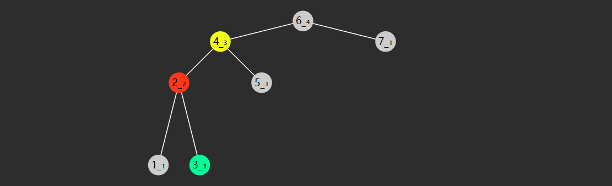

根右旋前


根右旋后


代码

```java
private AVLNode leftRightRotate(AVLNode root) {
    root.left = leftRotate(root.left);
    return rightRotate(root);
}
```

**右左旋（处理RL型失衡）**

指先右旋右子树，再左旋根节点（失衡节点）（其实就是把RL型失衡先转换成RR型失衡再处理）。

右子树右旋前


右子树右旋后

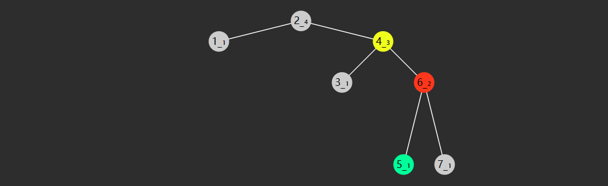

根左旋前

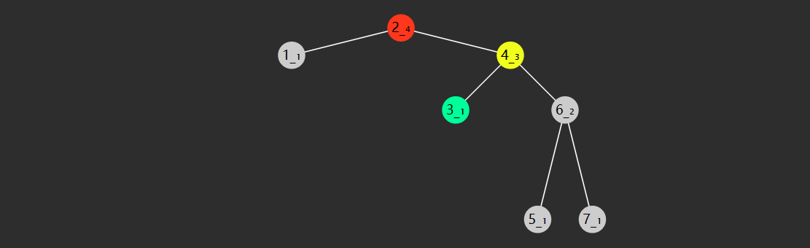

根左旋后


代码

```java
private AVLNode rightLeftRotate(AVLNode root) {
    root.right = rightRotate(root.right);
    return leftRotate(root);
}
```

**注意**

每次旋转后，都需要更新高度，需要更新的节点是红色、黄色，而绿色节点高度不变。

仔细观察可以发现，每次旋转时，以红色和黄色节点为根节点的二叉树结构都会发生变化。由于二叉树的节点高度是通过取左右子树中较大高度加1来计算得出的，因此每次旋转后，红色和黄色节点的高度都需要进行更新。

例如，在右旋的例子中，红色节点4的左子树由黄色节点2变为绿色节点3，而黄色节点2的右子树则由绿色节点3变为红色节点4，其余节点的结构保持不变。

旋转前


旋转后


**在右旋、左旋中加入更新高度的代码**

右旋

```java
private AVLNode rightRotate(AVLNode red) {
    AVLNode yellow = red.left;
    AVLNode green = yellow.right;
    yellow.right = red;
    red.left = green;
    updateHeight(red);
    updateHeight(yellow);
    return yellow;
}
```

左旋

```java
private AVLNode leftRotate(AVLNode red) {
    AVLNode yellow = red.right;
    AVLNode green = yellow.left;
    yellow.left = red;
    red.right = green;
    updateHeight(red);
    updateHeight(yellow);
    return yellow;
}
```

这里也有一个需要注意的点，更新高度时我们要从下往上更新，也就是先更新红色节点，再更新黄色节点。

**判断及调整平衡代码**

```java
private AVLNode balance(AVLNode node) {
    if (node == null) {
        return null;
    }
    int bf = bf(node);
    if (bf > 1 && bf(node.left) >= 0) { //LL型
        return rightRotate(node);
    } else if (bf > 1 && bf(node.left) < 0) { //LR型
        return leftRightRotate(node);
    } else if (bf < -1 && bf(node.right) > 0) { //RL型
        return rightLeftRotate(node);
    } else if (bf < -1 && bf(node.right) <= 0) { //RR型
        return rightRotate(node);
    }
    return node;
}
```

### 代码实现

AVL树的实现与二叉搜索树相似，主要区别在于新增和删除操作时需要进行平衡调整。

**新增**

```java
public void put(int key, Object val) {
    root = doPut(root, key, val);
}

private AVLNode doPut(AVLNode node, int key, Object val) {
    if (node == null) {
        return new AVLNode(key,val);
    }
    if (key == node.key) {
        node.val = val;
        return node;
    }
    if (key < node.key) {
        node.left = doPut(node.left, key, val);
    }
    if (key > node.key) {
        node.right = doPut(node.right, key, val);
    }
    updateHeight(node);
    return balance(node);
}
```

**删除**

```java
public void remove(int key) {
    root = doRemove(root, key);
}

private AVLNode doRemove(AVLNode node, int key) {
    if (node == null) {
        return null;
    }

    if (key < node.key) {
        node.left = doRemove(node.left, key);
    }

    if (key > node.key) {
        node.right = doRemove(node.right, key);
    }

    if (key == node.key) {
        if (node.left == null) {
            node = node.right;
        } else if (node.right == null) {
            node = node.left;
        } else {
            AVLNode replaced = node.right;
            while (replaced.left != null) {
                replaced = replaced.left;
            }
            replaced.right = doRemove(node, replaced.key);
            replaced.left = node.left;
            node = replaced;
        }
    }
    updateHeight(node);
    return balance(node);
}
```

**完整代码**

```java
public class AVLTree {

    AVLNode root;

    static class AVLNode {
        int key;
        Object value;
        AVLNode left;
        AVLNode right;
        int height = 1; 

        public AVLNode(int key, Object value) {
            this.key = key;
            this.value = value;
        }

        public AVLNode(int key) {
            this.key = key;
        }

        public AVLNode(int key, Object value, AVLNode left, AVLNode right) {
            this.key = key;
            this.value = value;
            this.left = left;
            this.right = right;
        }
    }

    private int height(AVLNode node) {
        return node == null ? 0 : node.height;
    }

    private void updateHeight(AVLNode node) {
        node.height = Integer.max(height(node.left), height(node.right)) + 1;
    }

    private int bf(AVLNode node) {
        return height(node.left) - height(node.right);
    }

    private AVLNode rightRotate(AVLNode red) {
        AVLNode yellow = red.left;
        AVLNode green = yellow.right;
        yellow.right = red;   
        red.left = green;     
        updateHeight(red);
        updateHeight(yellow);
        return yellow;
    }

    private AVLNode leftRotate(AVLNode red) {
        AVLNode yellow = red.right;
        AVLNode green = yellow.left;
        yellow.left = red;
        red.right = green;
        updateHeight(red);
        updateHeight(yellow);
        return yellow;
    }

    private AVLNode leftRightRotate(AVLNode node) {
        node.left = leftRotate(node.left);
        return rightRotate(node);
    }

    private AVLNode rightLeftRotate(AVLNode node) {
        node.right = rightRotate(node.right);
        return leftRotate(node);
    }

    private AVLNode balance(AVLNode node) {
        if (node == null) {
            return null;
        }
        int bf = bf(node);
        if (bf > 1 && bf(node.left) >= 0) { // LL
            return rightRotate(node);
        } else if (bf > 1 && bf(node.left) < 0) { // LR
            return leftRightRotate(node);
        } else if (bf < -1 && bf(node.right) > 0) { // RL
            return rightLeftRotate(node);
        } else if (bf < -1 && bf(node.right) <= 0) { // RR
            return leftRotate(node);
        }
        return node;
    }

    public void put(int key, Object value) {
        root = doPut(root, key, value);
    }

    private AVLNode doPut(AVLNode node, int key, Object value) {
        if (node == null) {
            return new AVLNode(key, value);
        }
        
        if (key == node.key) {
            node.value = value;
            return node;
        }
        
        if (key < node.key) {
            node.left = doPut(node.left, key, value); 
        } else {
            node.right = doPut(node.right, key, value); 
        }
        updateHeight(node);
        return balance(node);
    }

    public void remove(int key) {
        root = doRemove(root, key);
    }

    private AVLNode doRemove(AVLNode node, int key) {
        if (node == null) {
            return null;
        }

        if (key < node.key) {
            node.left = doRemove(node.left, key);
        } else if (node.key < key) {
            node.right = doRemove(node.right, key);
        } else {
            if (node.left == null && node.right == null) {
                return null;
            } else if (node.left == null) {
                node = node.right;
            } else if (node.right == null) {
                node = node.left;
            } else {
                AVLNode s = node.right;
                while (s.left != null) {
                    s = s.left;
                }

                s.right = doRemove(node.right, s.key);
                s.left = node.left;
                node = s;
            }
        }

        updateHeight(node);

        return balance(node);
    }
}
```

### 总结

AVL树是一种自平衡二叉搜索树，通过对每个节点的左右子树高度差进行控制，保持树的平衡，确保查找、插入和删除操作的时间复杂度始终为O(log n)。由于树的高度受到严格限制，因此在节点数目较多且查找操作频繁的情况下，AVL树能够提供高效的查找性能。每次插入或删除节点时，AVL树会通过旋转操作来保持平衡，这确保了树的深度不会过大，从而避免了退化成链表的情况。

然而，AVL树的插入和删除操作较为复杂，每次修改树结构时都可能需要进行旋转操作，增加了实现的复杂度和时间开销。特别是在频繁进行插入和删除操作时，旋转操作可能成为性能瓶颈。因此，在节点较少或插入、删除操作占比较高的场景中，AVL树的性能优势可能不如其他数据结构，如红黑树。红黑树虽然也能保持平衡，但其旋转操作较少，适用于插入和删除较为频繁的情况，因此在这些应用场景下更为高效。

<br>

## 红黑树

> [红黑树](https://zh.wikipedia.org/wiki/%E7%BA%A2%E9%BB%91%E6%A0%91)是一种自平衡二叉查找树，最早由一位名叫鲁道夫·贝尔的德国计算机科学家于1972年发明。然而，最初的树形结构不是现在的红黑树，而是一种称为B树的结构，它是一种多叉树，可用于在磁盘上存储大量数据。
>
> 在1980年代早期，计算机科学家利奥尼达斯·J·吉巴斯和罗伯特·塞奇威克推广了红黑树，并证明了它的自平衡性和高效性。从那时起，红黑树成为了最流行的自平衡二叉查找树之一，并被广泛应用于许多领域，如编译器、操作系统、数据库等。
>
> 红黑树的名字来源于红色节点和黑色节点的交替出现，它们的颜色是用来维护树的平衡性的关键。它们的颜色具有特殊的意义，黑色节点代表普通节点，而红色节点代表一个新添加的节点，它们必须满足一些特定的规则才能维持树的平衡性。

### 概述

红黑树也是一种自平衡的二叉搜索树，较之 AVL，插入和删除时旋转次数更少。

#### 红黑树特性

1. 所有节点都有两种颜色：红:red_circle:、黑:black_circle:
2. 每个叶子节点（null节点）都视为黑色:black_circle:
3. 红色:red_circle:节点不能相邻
4. 根节点是黑色:black_circle:
5. 从根节点到任意一个叶子节点，路径中的黑色:black_circle:节点数一样（黑色完美平衡）


根据上面的性质，判断一下下面这棵树是不是红黑树


先下结论，这棵树不是红黑树。

上面这棵树首先很容易就能看出是满足特性1-4条的，关键在于第5条特性，可能乍一看好像也是符合第5条的，但实际就会陷入一个误区，忽略了null节点，这样看的话每一条从根节点到叶子结点的路径确实都经过了两个黑色节点。

但实际上，在红黑树中，最下面的null节点也是需要考虑到的，如下图

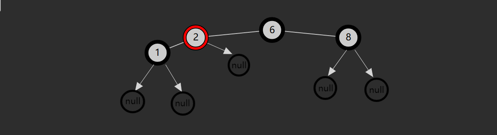

这样一来，每一条从根节点到叶子结点的路径经过的黑色节点数量也不是全都一样，这样特性5就不满足了，所以这棵树并不是一棵红黑树。

#### 推论

1. 红黑树的子树也一定是红黑树。
2. 根节点以外如果所有节点都有兄弟，那么可以不用考虑null节点
3. 在没有考虑null节点的情况下，根节点以外如果某个节点没有兄弟且包含黑色节点，肯定违反了红黑树特性5
4. 根据推论2和特性3，可以推出，根节点以外如果某个节点没有兄弟，那他必定是红色节点，且它的两个孩子必定为null
5. 根据推论2和特性3，还可以推出，一个红色节点，他只能是有两个黑孩子或者两个孩子都为null

### 准备工作

**枚举类**

```java
enum Color {
    RED, BLACK;
}
```

红黑树的颜色有两种，红色和黑色，所以这里先定义一个枚举类型，用来代表两种颜色。

**节点类**

```java
static class Node {
    int key;
    Object value;
    Node left;
    Node right;
    Node parent;        //父节点 操作红黑树时，需要维护parent指向正确的对象
    Color color = RED;  //颜色 默认为红色
    
	// ...
	
    // 是否是左孩子
    boolean isLeftChild() {
        return parent != null && parent.left == this; //节点是根节点时父亲为null
    }

    // 叔叔
    Node uncle() {
        if (parent == null || parent.parent == null) { //节点是根节点或者节点的父节点是根节点都是没有叔叔节点的
            return null;
        }
        if (parent.isLeftChild()) {
            return parent.parent.right;
        } else {
            return parent.parent.left;
        }
    }

    // 兄弟
    Node sibling() {
        if (parent == null) { // 根节点没有兄弟节点
            return null;
        }
        if (this.isLeftChild()) {
            return parent.right;
        } else {
            return parent.left;
        }
    }
}
```

两个比较特殊的属性：parent（父节点）和color（颜色），三个工具方法：isLeftChild（是否是左孩子）、uncle（获取叔叔节点）、sibling（获取兄弟节点）。后面操作红黑树时，这些东西会经常用到，先定义出来，能让我们后面的代码更简洁，思路也更清晰。

根据特性1，红黑树节点的颜色要么是红色要么是黑色，那么在插入新节点时，这个节点应该是红色还是黑色呢？答案是红色，原因也不难理解。如果插入的节点是黑色，那么这个节点所在路径比其他路径多出一个黑色节点，这个调整起来会比较麻烦。如果插入的节点是红色，此时所有路径上的黑色节点数量不变，仅可能会出现红红相邻的情况，违反了特性4，这种情况下，调整起来相对简单，通过变色和旋转进行调整即可。

**判断红、黑**

```java
// 判断红
boolean isRed(Node node) {
	return node != null && node.color == RED;
}

// 判断黑
boolean isBlack(Node node) {
	return !isRed(node);
}
```

方便处理节点为null的情况

**右旋、左旋**

```java
// 右旋
private void rightRotate(Node pink) {
    Node parent = pink.parent;
    Node yellow = pink.left;
    Node green = yellow.right;
    if (green != null) {
        green.parent = pink;
    }
    yellow.right = pink;
    yellow.parent = parent;
    pink.left = green;
    pink.parent = yellow;
    //建立新根yellow与parent的父子关系
    if (parent == null) {
        root = yellow;
    } else if (parent.left == pink) {
        parent.left = yellow;
    } else {
        parent.right = yellow;
    }
}

// 左旋
private void leftRotate(Node pink) {
    Node parent = pink.parent;
    Node yellow = pink.right;
    Node green = yellow.left;
    if (green != null) {
        green.parent = pink;
    }
    yellow.left = pink;
    yellow.parent = parent;
    pink.right = green;
    pink.parent = yellow;
    //建立新根yellow与parent的父子关系
    if (parent == null) {
        root = yellow;
    } else if (parent.left == pink) {
        parent.left = yellow;
    } else {
        parent.right = yellow;
    }
}
```

两个需要注意的点：

- 维护各节点的parent指向正确的对象
- 旋转后新根与父节点的父子关系在方法内直接建立

### 红黑树的操作

红黑树的基本操作和其他树形结构一样，一般都包括查找、插入、删除等操作。前面说到，红黑树是一种自平衡的二叉查找树，既然是二叉查找树的一种，那么查找过程和二叉查找树一样，比较简单，这里不再赘述。相对于查找操作，红黑树的插入和删除操作就要复杂的多。尤其是删除操作，要处理的情况比较多，下面就来分情况讲解。

[插入和删除时的各种情况的例子](/example/tree_redblack)

不过仔细观察可以发现，操作红黑树后，只有两种情况下红黑树需要重新调整平衡

- 红红相连
- 黑色不平衡

#### 插入

前面讲过，插入节点默认为红色。

**case 1：插入节点为根节点，将根节点变黑:black_circle:**

**case 2：插入节点的父亲为黑色:black_circle:，树的红黑性质不变，无需调整**

<br>

插入节点的父亲为红色:red_circle:，触发红红相邻

**case 3：叔叔为红色:red_circle:**

- 父亲变为黑色:black_circle:，为了保证黑色平衡，连带的叔叔也变为黑色:black_circle:
- 祖父如果是黑色不变，会造成这颗子树黑色过多，因此祖父节点变为红色:red_circle:
- 祖父如果变成红色，可能会接着触发红红相邻，因此对将祖父进行递归调整
- 往上递归会一直持续，直到出现以下三种结果：
  - 祖父的父亲是黑色，没有触发红红相邻，进入case2，结束递归
  - 递归到根节点的孩子节点，根据特性4，根节点一定是黑色，因此会进入case2，结束递归
  - 递归到根节点，进入case1，将根节点变成黑色，结束递归，而且经过重复递归调整，整棵红黑树恢复平衡，因为根节点没有兄弟节点，也就不用考虑根节点与兄弟节点的黑色平衡

**case 4：叔叔为黑色:black_circle:**

- 父亲为左孩子，插入节点也是左孩子，此时即 LL 不平衡

  - 让父亲变黑:black_circle:，为了保证这颗子树黑色不变，将祖父变成红:red_circle:，但叔叔子树少了一个黑色
  - 祖父右旋，补齐一个黑色给叔叔，父亲旋转上去取代祖父，由于它是黑色，不会再次触发红红相邻

- 父亲为左孩子，插入节点是右孩子，此时即 LR 不平衡

  - 父亲左旋，变成 LL 情况，按 LL 不平衡来后续处理

- 父亲为右孩子，插入节点也是右孩子，此时即 RR 不平衡

  - 让父亲变黑:black_circle:，为了保证这颗子树黑色不变，将祖父变成红:red_circle:，但叔叔子树少了一个黑色

  - 祖父左旋，补齐一个黑色给叔叔，父亲旋转上去取代祖父，由于它是黑色，不会再次触发红红相邻

- 父亲为右孩子，插入节点是左孩子，此时即 RL 不平衡

  - 父亲右旋，变成 RR 情况，按 RR 不平衡来后续处理

```java
public void put(int key, Object value) {
    Node p = root;
    Node parent = null;
    while (p != null) {
        parent = p;
        if (key < p.key) {
            p = p.left;
        } else if (p.key < key) {
            p = p.right;
        } else {
            p.value = value; // 更新
            return;
        }
    }
    Node inserted = new Node(key, value);
    if (parent == null) {
        root = inserted;
    } else if (key < parent.key) {
        parent.left = inserted;
        inserted.parent = parent;
    } else {
        parent.right = inserted;
        inserted.parent = parent;
    }
    fixRedRed(inserted);
}


void fixRedRed(Node x) {
    // case 1 插入节点是根节点，变黑即可
    if (x == root) {
        x.color = BLACK;
        return;
    }
    // case 2 插入节点父亲是黑色，无需调整
    if (isBlack(x.parent)) {
        return;
    }
    /* case 3 当红红相邻，叔叔为红时
        需要将父亲、叔叔变黑、祖父变红，然后对祖父做递归处理
    */
    Node parent = x.parent;
    Node uncle = x.uncle();
    Node grandparent = parent.parent;
    if (isRed(uncle)) {
        parent.color = BLACK;
        uncle.color = BLACK;
        grandparent.color = RED;
        fixRedRed(grandparent);
        return;
    }

    // case 4 当红红相邻，叔叔为黑时
    if (parent.isLeftChild() && x.isLeftChild()) { // LL
        parent.color = BLACK;
        grandparent.color = RED;
        rightRotate(grandparent);
    } else if (parent.isLeftChild() && !x.isLeftChild()) { // LR
        leftRotate(parent);
        x.color = BLACK;
        grandparent.color = RED;
        rightRotate(grandparent);
    } else if (!parent.isLeftChild() && !x.isLeftChild()) { // RR
        parent.color = BLACK;
        grandparent.color = RED;
        leftRotate(grandparent);
    } else { // RL
        rightRotate(parent);
        x.color = BLACK;
        grandparent.color = RED;
        leftRotate(grandparent);
    }
}
```

#### 删除

**case0：删除节点有两个孩子**

- 交换删除节点和后继节点的 key，value，递归删除后继节点，后继节点必定最多只有一个右孩子，所以会直接进入以下其他case

<br>

删除节点没有孩子或只剩一个孩子

**case 1：删的是根节点**

* 根节点没有孩子，删完了，直接将 root = null
* 根节点只剩一个孩子，用剩余节点替换了根节点的 key，value，根节点孩子 = null，颜色保持黑色:black_circle:不变

<br>

如果删除的节点是红色直接删除，不用作任何调整。但删黑色有一种简单情况

**case 2：删的是黑:black_circle:，替换节点是红:red_circle:**

- 让这个替换的红节点变黑:black_circle:，补上删除失去的黑色资源

<br>

替换节点是黑色:black_circle:，触发**双黑**（本质上是少了一个黑），删除节点和替换节点都是黑色:black_circle:，所以没法通过将替换节点变成黑色来补上删除节点失去的黑色资源。

**注意**！！！删除节点只剩一个孩子节点的情况下，是不会触发双黑的，因为在这个情况下，替换节点只能是删除节点剩下的那个孩子节点，但是红黑树不会存在一个黑色节点没有兄弟节点的情况。

**如何让黑色资源重新平衡**？可以借助兄弟的力量，于是有了这几种情况

**case 3：删除节点的兄弟节点为红:red_circle:**

- 过度情况，可通过旋转变成case 4或者case 5
- 兄弟节点为红，父节点、侄子节点必定是黑，要不就触发红红相邻了
- 而且侄子节点必定不为null，要不黑色平衡不了
- 删除节点是左孩子节点，父节点左旋
- 删除节点是右孩子节点，父节点右旋
- 父节点和兄弟节点要变色，保证旋转后颜色平衡
- 旋转的目的是让黑侄子节点变为删除节点的黑兄弟节点，对删除节点再次递归，进入 case 4 或 case 5

**case 4：删除节点的兄弟节点为黑色:black_circle:，两个侄子节点都为黑 :black_circle:**

* 将兄弟节点变红:red_circle:，目的是将删除节点和兄弟节点那边的黑色数目同时减 1，先达成两兄弟之间的内部黑色平衡
* 如果父节点是红:red_circle:，则需将父节点变为黑，避免红红，且此时路径黑节点数目刚好与删除节点前保持一致
* 如果父节点是黑:black_circle:，说明这条路径还是少黑，再次让父节点触发双黑，进入递归
* 如果一直递归到根节点，所有路径都会比原来少一个黑色，红黑树又恢复平衡，结束递归

**case 5：删除节点的兄弟节点为黑:black_circle:，至少一个红:red_circle:侄子**

* 如果兄弟节点是左孩子节点，左侄子节点是红:red_circle:，LL 不平衡

  - 父节点右旋
  - 将来删除节点这边少个黑，所以最后旋转过来的父节点需要变成黑:black_circle:，平衡起见，左侄子节点也变黑:black_circle:
  - 原来兄弟节点要成为新的父节点，需要变成原来父节点颜色

* 如果兄弟节点是左孩子节点，右侄子节点是红:red_circle:，LR 不平衡

  - 兄弟节点左旋，然后父节点右旋

  * 将来删除节点这边少个黑，所以最后旋转过来的父节点需要变成黑:black_circle:
  * 原来右侄子节点要成为新的父节点，需要变成原来父节点颜色
  * 兄弟节点已经是黑了:black_circle:，无需改变

* 如果兄弟节点是右孩子节点，右侄子节点是红:red_circle:，RR 不平衡

  - 父节点左旋

  * 将来删除节点这边少个黑，所以最后旋转过来的父节点需要变成黑:black_circle:，平衡起见，右侄子节点也变黑:black_circle:
  * 原来兄弟节点要成为新的父节点，需要变成原来父节点颜色

* 如果兄弟节点是右孩子节点，左侄子节点是红:red_circle:，RL 不平衡

  - 兄弟节点右旋，然后父节点左旋

  * 将来删除节点这边少个黑，所以最后旋转过来的父节点需要变成黑:black_circle:
  * 原来左侄子节点要成为新的父节点，需要变成原来父节点颜色
  * 兄弟节点已经是黑了:black_circle:，无需改变

我们将父节点，兄弟节点，删除节点看成一个**待调整区域**，可以发现，case 5 看似复杂，其实四个情况都是做同一件事，将红侄子节点通过旋转拉进**待调整区域**，通过将红侄子变成黑色补上删除节点失去的一个黑色节点，且不改变待调整区域各位置的节点颜色，所以旋转后都要调整颜色，将**待调整区域**各个位置的节点颜色恢复成原来的颜色。

这里讲的有点抽象，我们通过画图观察，这样会更具体一点

其实**待调整区域**这里只会出现两种情况

```
      红         			  红									 黑         			  黑
	 / \     ---------->     / \									 / \     ---------->     / \
    黑  黑      调整完       黑  黑								   黑  黑       调整完       黑  黑
```

当然，调整前后也并不是完全一样，侄子节点会顶替删除节点进入**待调整区域**内，当然，侄子节点不是出现在删除节点的位置上

例如，在LL的情况里

调整前


调整后


其中，4是删除节点，3是父亲节点，2是兄弟节点，1是侄子节点

为什么这样做就可以让红黑树恢复平衡？我们将**待调整区域**以外的区域看成**外部区域**，可以发现，只要父节点不改变颜色并且以父节点内部各路径黑色数目与原来保持一致（**问题A)**，那么**外部区域**不需要任何调整，整棵红黑树也会恢复平衡。

如何解决**问题A**，核心思路就是让**待调整区域**里不失去任何一个位置的节点并且各位置的节点颜色与原来保持一致，但是我们的删除节点就在**待调整区域**里，我们也不能因为解决**问题A**而让其他区域的黑色数目减少，这怎么办？不要忘了我们还有一个红色侄子节点，我们可以通过旋转把它拉近**待调整区域**，再通过调整颜色将**待调整区域**各个位置的节点颜色恢复成原来的颜色，这样做会导致**外部区域**丢失一个红色节点，但是，红节点的丢失是不会对红黑树的平衡造成影响的。

```java
public void remove(int key) {
    Node deleted = find(key);
    if (deleted == null) {
        return;
    }
    doRemove(deleted);
}

public boolean contains(int key) {
    return find(key) != null;
}

// 查找删除节点
private Node find(int key) {
    Node p = root;
    while (p != null) {
        if (key < p.key) {
            p = p.left;
        } else if (p.key < key) {
            p = p.right;
        } else {
            return p;
        }
    }
    return null;
}

// 查找剩余节点
private Node findReplaced(Node deleted) {
    if (deleted.left == null && deleted.right == null) {
        return null;
    }
    if (deleted.left == null) {
        return deleted.right;
    }
    if (deleted.right == null) {
        return deleted.left;
    }
    Node s = deleted.right;
    while (s.left != null) {
        s = s.left;
    }
    return s;
}

// 处理双黑 (case3、case4、case5) (删除的节点是黑色，替换上来的节点也是黑色)
private void fixDoubleBlack(Node x) {
    if (x == root) {
        return;
    }
    Node parent = x.parent;
    Node sibling = x.sibling();
    // case 3 兄弟节点是红色
    if (isRed(sibling)) {
        if (x.isLeftChild()) {
            leftRotate(parent);
        } else {
            rightRotate(parent);
        }
        parent.color = RED;
        sibling.color = BLACK;
        fixDoubleBlack(x);
        return;
    }

    // case 4 兄弟是黑色, 两个侄子也是黑色
    if (isBlack(sibling.left) && isBlack(sibling.right)) {
        sibling.color = RED;
        if (isRed(parent)) {
            parent.color = BLACK;
        } else {
            fixDoubleBlack(parent);
        }
    }
    // case 5 兄弟是黑色, 侄子有红色
    else {
        // LL
        if (sibling.isLeftChild() && isRed(sibling.left)) {
            rightRotate(parent);
            sibling.left.color = BLACK;
            sibling.color = parent.color;
        }
        // LR
        else if (sibling.isLeftChild() && isRed(sibling.right)) {
            sibling.right.color = parent.color;
            leftRotate(sibling);
            rightRotate(parent);
        }
        // RL
        else if (!sibling.isLeftChild() && isRed(sibling.left)) {
            sibling.left.color = parent.color;
            rightRotate(sibling);
            leftRotate(parent);
        }
        // RR
        else {
            leftRotate(parent);
            sibling.right.color = BLACK;
            sibling.color = parent.color;
        }
        parent.color = BLACK;
    }
}

private void doRemove(Node deleted) {
    Node replaced = findReplaced(deleted);
    Node parent = deleted.parent;
    // 没有孩子
    if (replaced == null) {
        // case 1 删除的是根节点
        if (deleted == root) {
            root = null;
        } else {
            //没有孩子，替换节点是null，根据红黑树特性，null也是黑色，如果删除的也是黑色，其实就已经触发了双黑
            if (isBlack(deleted)) {
                // 复杂调整
                fixDoubleBlack(deleted);
            } else {
                // 红色叶子, 无需任何处理
            }
            if (deleted.isLeftChild()) {
                parent.left = null;
            } else {
                parent.right = null;
            }
            deleted.parent = null;
        }
        return;
    }
    // 有一个孩子
    if (deleted.left == null || deleted.right == null) {
        // case 1 删除的是根节点
        if (deleted == root) {
            root.key = replaced.key;
            root.value = replaced.value;
            root.left = root.right = null;
        } else {
            if (deleted.isLeftChild()) {
                parent.left = replaced;
            } else {
                parent.right = replaced;
            }
            replaced.parent = parent;
            deleted.left = deleted.right = deleted.parent = null;
            // case 2 只有一个孩子的情况下，删除节点必定是黑，替换节点（也就是删除节点唯一一个孩子）必定是红，直接让替换节点变黑补上删除的一个黑色
            replaced.color = BLACK;

        }
        return;
    }
    // case 0 有两个孩子 => 有一个孩子 或 没有孩子
    int t = deleted.key;
    deleted.key = replaced.key;
    replaced.key = t;

    Object v = deleted.value;
    deleted.value = replaced.value;
    replaced.value = v;
    doRemove(replaced);
}
```

### 完整代码

```java
public class RedBlackTree {

    enum Color {
        RED, BLACK;
    }

    Node root;

    static class Node {
        int key;
        Object value;
        Node left;
        Node right;
        Node parent;
        Color color = RED;

        public Node(int key, Object value) {
            this.key = key;
            this.value = value;
        }

        public Node(int key) {
            this.key = key;
        }

        public Node(int key, Color color) {
            this.key = key;
            this.color = color;
        }

        public Node(int key, Color color, Node left, Node right) {
            this.key = key;
            this.color = color;
            this.left = left;
            this.right = right;
            if (left != null) {
                left.parent = this;
            }
            if (right != null) {
                right.parent = this;
            }
        }

        boolean isLeftChild() {
            return parent != null && parent.left == this;
        }

        Node uncle() {
            if (parent == null || parent.parent == null) {
                return null;
            }
            if (parent.isLeftChild()) {
                return parent.parent.right;
            } else {
                return parent.parent.left;
            }
        }

        Node sibling() {
            if (parent == null) {
                return null;
            }
            if (this.isLeftChild()) {
                return parent.right;
            } else {
                return parent.left;
            }
        }
    }

    boolean isRed(Node node) {
        return node != null && node.color == RED;
    }

    boolean isBlack(Node node) {
//        return !isRed(node);
        return node == null || node.color == BLACK;
    }

    private void rightRotate(Node pink) {
        Node parent = pink.parent;
        Node yellow = pink.left;
        Node green = yellow.right;
        if (green != null) {
            green.parent = pink;
        }
        yellow.right = pink;
        yellow.parent = parent;
        pink.left = green;
        pink.parent = yellow;
        if (parent == null) {
            root = yellow;
        } else if (parent.left == pink) {
            parent.left = yellow;
        } else {
            parent.right = yellow;
        }
    }

    private void leftRotate(Node pink) {
        Node parent = pink.parent;
        Node yellow = pink.right;
        Node green = yellow.left;
        if (green != null) {
            green.parent = pink;
        }
        yellow.left = pink;
        yellow.parent = parent;
        pink.right = green;
        pink.parent = yellow;
        if (parent == null) {
            root = yellow;
        } else if (parent.left == pink) {
            parent.left = yellow;
        } else {
            parent.right = yellow;
        }
    }
 
    public void put(int key, Object value) {
        Node p = root;
        Node parent = null;
        while (p != null) {
            parent = p;
            if (key < p.key) {
                p = p.left;
            } else if (p.key < key) {
                p = p.right;
            } else {
                p.value = value;
                return;
            }
        }
        Node inserted = new Node(key, value);
        if (parent == null) {
            root = inserted;
        } else if (key < parent.key) {
            parent.left = inserted;
            inserted.parent = parent;
        } else {
            parent.right = inserted;
            inserted.parent = parent;
        }
        fixRedRed(inserted);
    }

    void fixRedRed(Node x) {
        if (x == root) {
            x.color = BLACK;
            return;
        }
        if (isBlack(x.parent)) {
            return;
        }
       
        Node parent = x.parent;
        Node uncle = x.uncle();
        Node grandparent = parent.parent;
        if (isRed(uncle)) {
            parent.color = BLACK;
            uncle.color = BLACK;
            grandparent.color = RED;
            fixRedRed(grandparent);
            return;
        }

        if (parent.isLeftChild() && x.isLeftChild()) { // LL
            parent.color = BLACK;
            grandparent.color = RED;
            rightRotate(grandparent);
        } else if (parent.isLeftChild()) { // LR
            leftRotate(parent);
            x.color = BLACK;
            grandparent.color = RED;
            rightRotate(grandparent);
        } else if (!x.isLeftChild()) { // RR
            parent.color = BLACK;
            grandparent.color = RED;
            leftRotate(grandparent);
        } else { // RL
            rightRotate(parent);
            x.color = BLACK;
            grandparent.color = RED;
            leftRotate(grandparent);
        }
    }

    public void remove(int key) {
        Node deleted = find(key);
        if (deleted == null) {
            return;
        }
        doRemove(deleted);
    }

    public boolean contains(int key) {
        return find(key) != null;
    }

    private Node find(int key) {
        Node p = root;
        while (p != null) {
            if (key < p.key) {
                p = p.left;
            } else if (p.key < key) {
                p = p.right;
            } else {
                return p;
            }
        }
        return null;
    }

    private Node findReplaced(Node deleted) {
        if (deleted.left == null && deleted.right == null) {
            return null;
        }
        if (deleted.left == null) {
            return deleted.right;
        }
        if (deleted.right == null) {
            return deleted.left;
        }
        Node s = deleted.right;
        while (s.left != null) {
            s = s.left;
        }
        return s;
    }

    private void fixDoubleBlack(Node x) {
        if (x == root) {
            return;
        }
        Node parent = x.parent;
        Node sibling = x.sibling();
        if (isRed(sibling)) {
            if (x.isLeftChild()) {
                leftRotate(parent);
            } else {
                rightRotate(parent);
            }
            parent.color = RED;
            sibling.color = BLACK;
            fixDoubleBlack(x);
            return;
        }
        if (sibling != null) {
            if (isBlack(sibling.left) && isBlack(sibling.right)) {
                sibling.color = RED;
                if (isRed(parent)) {
                    parent.color = BLACK;
                } else {
                    fixDoubleBlack(parent);
                }
            }
            else {
                if (sibling.isLeftChild() && isRed(sibling.left)) {
                    rightRotate(parent);
                    sibling.left.color = BLACK;
                    sibling.color = parent.color;
                }
                else if (sibling.isLeftChild() && isRed(sibling.right)) {
                    sibling.right.color = parent.color;
                    leftRotate(sibling);
                    rightRotate(parent);
                }
                else if (!sibling.isLeftChild() && isRed(sibling.left)) {
                    sibling.left.color = parent.color;
                    rightRotate(sibling);
                    leftRotate(parent);
                }
                else {
                    leftRotate(parent);
                    sibling.right.color = BLACK;
                    sibling.color = parent.color;
                }
                parent.color = BLACK;
            }
        } else {
            fixDoubleBlack(parent); // 实际上不会出现这种情况
        }
    }

    private void doRemove(Node deleted) {
        Node replaced = findReplaced(deleted);
        Node parent = deleted.parent;
        if (replaced == null) {
            if (deleted == root) {
                root = null;
            } else {
                if (isBlack(deleted)) {
                    fixDoubleBlack(deleted);
                } else {
                    // 删除节点是红色，不用做平衡调整
                }
                if (deleted.isLeftChild()) {
                    parent.left = null;
                } else {
                    parent.right = null;
                }
                deleted.parent = null;
            }
            return;
        }
        if (deleted.left == null || deleted.right == null) {
            if (deleted == root) {
                root.key = replaced.key;
                root.value = replaced.value;
                root.left = root.right = null;
            } else {
                if (deleted.isLeftChild()) {
                    parent.left = replaced;
                } else {
                    parent.right = replaced;
                }
                replaced.parent = parent;
                deleted.left = deleted.right = deleted.parent = null;
                if (isBlack(deleted) && isBlack(replaced)) { // 实际上不会出现这种情况
                    fixDoubleBlack(replaced);
                } else {
                    replaced.color = BLACK;
                }
            }
            return;
        }
        
        int t = deleted.key;
        deleted.key = replaced.key;
        replaced.key = t;

        Object v = deleted.value;
        deleted.value = replaced.value;
        replaced.value = v;
        doRemove(replaced);
    }
}
```

### 总结

| 维度         | 普通二叉搜索树        | AVL树          | 红黑树                     |
| ------------ | --------------------- | -------------- | -------------------------- |
| 查询         | 平均O(logn)，最坏O(n) | O(logn)        | O(logn)                    |
| 插入         | 平均O(logn)，最坏O(n) | O(logn)        | O(logn)                    |
| 删除         | 平均O(logn)，最坏O(n) | O(logn)        | O(logn)                    |
| 平衡性       | 不平衡                | 严格平衡       | 近似平衡                   |
| 结构         | 二叉树                | 自平衡的二叉树 | 具有红黑性质的自平衡二叉树 |
| 查找效率     | 低                    | 高             | 高                         |
| 插入删除效率 | 低                    | 中等           | 高                         |

普通二叉搜索树插入、删除、查询的时间复杂度与树的高度相关，因此在最坏情况下，时间复杂度为O(n)，而且容易退化成链表，查找效率低。

AVL树是一种高度平衡的二叉搜索树，其左右子树的高度差不超过1。因此，它能够在logn的平均时间内完成插入、删除、查询操作，但是在维护平衡的过程中，需要频繁地进行旋转操作，导致插入删除效率较低。

红黑树是一种近似平衡的二叉搜索树，它在保持高度平衡的同时，又能够保持较高的插入删除效率。红黑树通过节点着色和旋转操作来维护平衡。红黑树在维护平衡的过程中，能够进行较少的节点旋转操作，因此插入删除效率较高，并且查询效率也较高。

综上所述，红黑树具有较高的综合性能，是一种广泛应用的数据结构。

<br>

## B树

> [B树](https://zh.wikipedia.org/wiki/B%E6%A0%91)（B-Tree）结构是一种高效存储和查询数据的方法，它的历史可以追溯到1970年代早期。B树的发明人Rudolf Bayer和Edward M. McCreight分别发表了一篇论文介绍了B树。这篇论文是1972年发表于《ACM Transactions on Database Systems》中的，题目为"Organization and Maintenance of Large Ordered Indexes"。
>
> 这篇论文提出了一种能够高效地维护大型有序索引的方法，这种方法的主要思想是将每个节点扩展成多个子节点，以减少查找所需的次数。B树结构非常适合应用于磁盘等大型存储器的高效操作，被广泛应用于关系数据库和文件系统中。
>
> B树结构有很多变种和升级版，例如B+树，B*树和SB树等。这些变种和升级版本都基于B树的核心思想，通过调整B树的参数和结构，提高了B树在不同场景下的性能表现。
>
> 总的来说，B树结构是一个非常重要的数据结构，为高效存储和查询大量数据提供了可靠的方法。它的历史可以追溯到上个世纪70年代，而且在今天仍然被广泛应用于各种场景。

### 概述

#### B的含义

> B-树的名称是由其发明者Rudolf  Bayer提出的。Bayer和McCreight从未解释B代表什么，人们提出了许多可能的解释，比如Boeing、balanced、between、broad、bushy和Bayer等。但McCreight表示，越是思考B-trees中的B代表什么，就越能更好地理解B-trees

#### B树的特性

**度**（degree）指树中节点孩子数

**阶**（order）指所有节点孩子数的最大值

特性1：节点中 key 可以有多个，以升序存储

特性2：每个非叶子节点中的**度数**是 **key 的数量** + 1、叶子节点**度数**为 0

特性3：如果根节点不是叶子节点，那么它最少有两个子节点

特性4：**最小度数** 、**key 的数量范围**和**B树的阶数**关系如下：

| 最小度数 t | key 的数量范围     | B树的阶数 m |
| ---------- | ------------------ | ----------- |
| 2          | 1 ~ 3              | 4           |
| 3          | 2 ~ 5              | 6           |
| 4          | 3 ~ 7              | 8           |
| ...        | ...                | ...         |
| t          | (t - 1) ~ (2t - 1) | 2t          |

其中

- **最小度数**至少是2，且除根节点和叶子节点外，其他节点需满足**最小度数**
- 当节点中 **key 的数量**达到其最大值时，即 3、5、7 ... 2t - 1，需要分裂
- 除根节点外，当节点中 **key 的数量**小于其最小值时，即 1、2、3 ... t - 1，需要旋转或合并
- 以**最小度数**为基准，m = 2t，以**阶数**为基准，t = ceil(m/2)

特性5：叶子节点的深度都相同

特性6：两个 key（k1，k2）之间的孩子节点的所有 key 都在 (k1，k2) 的范围之内。

例如，图中的 7 和 16 之间的孩子节点 [9, 12] 的所有 key 都满足 7 < key < 16。

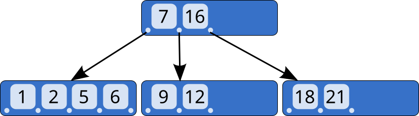

> 问：B-树为什么有最小度数的限制？
>
> 答：B树中有最小度数的限制是为了保证B树的平衡特性。
>
> 在B树中，每个节点都可以有多个子节点，这使得B树可以存储大量的键值，但也带来了一些问题。如果节点的子节点数量太少，那么就可能导致B树的高度过高，从而降低了B树的效率。此外，如果节点的子节点数量太多，那么就可能导致节点的搜索、插入和删除操作变得复杂和低效。
>
> 最小度数的限制通过限制节点的子节点数量，来平衡这些问题。在B树中，每个节点的子节点数量都必须在一定的范围内，即t到2t之间（其中t为最小度数）

#### B-树与 2-3 树、2-3-4 树的关系

可以这样总结它们之间的关系：

- 2-3树是最小度数为2的B树，其中每个节点可以包含2个或3个子节点。
- 2-3-4树是最小度数为2的B树的一种特殊情况，其中每个节点可以包含2个、3个或4个子节点。
- B树是一种更加一般化的平衡树，可以适应不同的应用场景，其节点可以包含任意数量的键值，节点的度数取决于最小度数t的设定。

### 实现

#### 节点类

```java
static class Node {
    boolean leaf = true;
    int keyNumber;
    int t;
    int[] keys;
    Node[] children;    

    public Node(int t) {
        this.t = t;
        this.keys = new int[2 * t - 1];
        this.children = new Node[2 * t];
    }
    
}
```

* leaf 表示是否为叶子节点
* keyNumber 为 keys 中有效 key 数目
* t 为最小度数，它决定了节点中key 的最小、最大数目，分别是 t-1 和 2t-1
* keys 存储此节点的 key
* children 存储此节点的 child

#### 多路查找

为上面节点类添加 get 方法

```java
Node get(int key) {
    int i = 0;
    while (i < keyNumber) {
        if (keys[i] < key) {
            i++;
        } else if (keys[i] > key) {
            break;
        } else {
            return this;
        }        
    }
    // 执行到此时 keys[i]>key 或 i==keyNumber
    if (leaf) {
        return null;
    }
    // 非叶子情况
    return children[i].get(key);
}
```

#### 插入 key 和 child

为上面节点类添加 insertKey 和 insertChild 方法

```java
void insertKey(int key, int index) {
    System.arraycopy(keys, index, keys, index + 1, keyNumber - index);
    keys[index] = key;
    keyNumber++;
}

void insertChild(Node child, int index) {
    System.arraycopy(children, index, children, index + 1, keyNumber - index);
    children[index] = child;
}
```

作用是向 keys 数组或 children 数组指定 index 处插入新数据，注意

* 由于使用了静态数组，并且不会在新增或删除时改变它的大小，因此需要额外的 keyNumber 来指定数组内有效 key 的数目
  * 插入时 keyNumber++
  * 删除时减少  keyNumber 的值即可
* children 不会单独维护数目，它比 keys 多一个
* 如果这两个方法同时调用，注意它们的先后顺序，insertChild 后调用，因为它计算复制元素个数时用到了 keyNumber

#### 定义树

```
public class BTree {
    final int t;
    final int MIN_KEY_NUMBER;
    final int MAX_KEY_NUMBER;
    Node root;

    public BTree() {
        this(2);
    }

    public BTree(int t) {
        this.t = t;
        MIN_KEY_NUMBER = t - 1;
        MAX_KEY_NUMBER = 2 * t - 1;
        root = new Node(t);
    }
    
    public boolean contains(int key) {
        return root.get(key) != null;
    }
}
```

* t ：树中节点的最小度数
* MIN_KEY_NUMBER：树中节点 key 数量的上限
* MIN_KEY_NUMBER：树中节点 key 数量的下限
* contains：树中是否包含某个key

#### 插入

```java
public void put(int key) {
    doPut(root, key, 0, null);
}

private void doPut(Node node, int key, int index, Node parent) {
    int i = 0;
    while(i < node.keyNum) {
        if (key == node.keys[i]) {
            return; //走更新逻辑
        } else if (key < node.keys[i]) {
            break; // 找到了插入位置，即为此时的 i
        } else {
            i++;
        }
    }

    if (node.leaf) {
        node.insertKey(key, i);
    } else {
        doPut(node.children[i], key, i, node);
    }

    if (node.keyNum == MAX_KEY_NUM) {
        split(node, index, parent);
    }
}
```

* 首先查找本节点中的插入位置 i，如果没有空位（key 被找到），应该走更新的逻辑
* 接下来分两种情况
  * 如果节点是叶子节点，可以直接插入了
  * 如果节点是非叶子节点，需要继续在 children[i] 处继续递归插入
* 无论哪种情况，插入完成后都可能超过节点 keys 数目限制，此时应当执行节点分裂
  * 参数中的 parent 和 index 都是给分裂方法用的，代表当前节点父节点，和分裂节点是第几个孩子

#### 分裂

```java
private void split(Node left, int index, Node parent) {
    // 分裂的是根节点
    if (parent == null) {
        Node newRoot = new Node(t);
        newRoot.leaf = false;
        newRoot.insertChild(left, 0);
        parent = newRoot;
        root = newRoot;
    }

    // 1. 创建 right 节点，把 left 中 t 之后的 key 和 child 移动过去
    Node right = new Node(t);
    System.arraycopy(left.keys, t, right.keys, 0, t - 1);
    right.keyNum = t - 1;
    right.leaf = left.leaf;
    // 分裂节点是非叶子的情况
    if (!left.leaf) {
        System.arraycopy(left.children, t, right.children, 0, t);
        for (int i = t; i <= left.keyNum; i++) {
            left.children[i] = null;
        }
    }

    // 2. 中间的 key （t-1 处）插入到父节点
    parent.insertKey(left.keys[t - 1], index);
    // 3. right 节点作为父节点的孩子
    parent.insertChild(right, index + 1);

    left.keyNum = t - 1;
}
```

分两种情况：

* 如果 parent == null 表示要分裂的是根节点，此时需要创建新根，原来的根节点作为新根的 0 孩子
* 否则
  * 创建 right 节点（分裂后大于当前 left 节点的），把 t 以后的 key 和 child 都拷贝过去
  * t-1 处的 key 插入到 parent 的 index 处，index 指 left 作为孩子时的索引
  * right 节点作为 parent 的孩子插入到 index + 1 处
* 核心思想是把分裂节点的keys一分为三，左边，中间，右边，例如下图是一棵节点key数量上限为5的B树，分裂节点[4，5，6，7，8]会被分成[4，5]，[6]，[7，8]三部分，并分别分配到分裂节点，父节点，新节点中去，如果是非叶子节点，还需要把孩子节点平分，左边的保留给分裂节点，右边的分配给新节点


分裂后


#### 删除

**工具方法**

```java
// 移除指定index处的key
int removeKey(int index) {
    int key = keys[index];
    System.arraycopy(keys, index + 1, keys, index, --keyNum - index);
    return key;
}

// 移除指定index处的child
Node removeChild(int index) {
    Node child = children[index];
    System.arraycopy(children, index + 1, children, index, keyNum - index);
    children[keyNum] = null;
    return child;
}

// index孩子左边的兄弟
Node childLeftBro(int index) {
    return index > 0? children[index - 1] : null;
}

// index孩子右边的兄弟
Node childRightBro(int index) {
    return index < keyNum? children[index + 1] : null;
}

// 移动当前节点所有key和child到target
void moveToTarget(Node target) {
    int start = target.keyNum;
    if (!leaf) {
        for (int i = 0; i <= keyNum; i++) {
            target.children[start + i] = children[i];
        }
    }
    for (int i = 0; i < keyNum; i++) {
        target.keys[target.keyNum++] = keys[i];
    }
}
```

**定义三个名词**

删除 key：要删除的那个 key 

前驱 key：小于 key，但是与 key 大小最相近

后继 key：大于 key，但是与 key 大小最相近

**迭代寻找删除 key 的位置**

```java
int i = 0;
while (i < node.keyNum) {
    if (key > node.keys[i]) {
        i++;
    } else {
        break;
    }
}
```

此时 i 为删除 key 在 node.keys 中的索引或者删除 key 所在节点在 node.children 中的索引

**删除情况**

case 1：当前节点是叶子节点，没找到

- 直接return，找不到删除 key，不做任何处理

case 2：当前节点是叶子节点，找到了

- 此时 i 为删除 key 在 node.keys 中的索引，根据索引将删除 key 删除，但可能会导致失衡

case 3：当前节点是非叶子节点，没找到

- 继续往 i 处 子节点递归寻找删除key，但是子节点的平衡调整可能会导致当前节点失衡

case 4：当前节点是非叶子节点，找到了

- 把问题转化为删除后继 key，删除后继 key 做平衡调整一样可能会导致当前节点失衡
- 以当前节点 i + 1处的子节点为起点，一直往索引0处的子节点递归寻找，直到找到叶子节点，叶子节点索引0处的key就是后继 key
- 用后继 key 顶替删除 key 的位置，然后在当前节点 i + 1 处的子节点里递归删除后继 key

**失衡情况**

case 1：根节点的key删完了

- 这种情况下，根节点最多只有一个子节点
- 用子节点代替根节点，没有的话不失衡，不做任何调整，保留 没有 key，没有子节点的根节点

case 2：非根节点且删除后 key 数目 < 下限

分为三种情况：

- 左兄弟富裕，跟左兄弟借（右旋）

  父节点中的前驱 key 右旋下来给失衡节点（插入到 node.keys 头部），左兄弟最后一个key右旋上去顶替前驱 key 的位置

- 右兄弟富裕，跟右兄弟借（左旋）

  父节点中的后继 key 左旋下来给失衡节点（插入到 node.keys 尾部），右兄弟第一个key左旋上去顶替前驱 key 的位置

- 两边都不够借，向左合并

​		父节点移除右边子节点，父节点中的前驱key左旋下来（插入到左边节点的尾部），右边节点的所有 key 和子节点移动到左边节点

​		有左兄弟时，失衡节点向左兄弟合并，此时左兄弟是左边节点，失衡节点是右边节点

​		没有左兄弟时，右兄弟向失衡节点合并，此时失衡节点是左边节点，右兄弟是右边节点

```java
public void remove(int key) {
    doRemove(root, key, null, 0);
}

private void doRemove(Node node, int key, Node parent, int index) {
    int i = 0;
    while (i < node.keyNum) {
        if (key > node.keys[i]) {
            i++;
        } else {
            break;
        }
    }

    // i 没找到： 代表到第i个孩子继续查找
    // i 找到：代表待删除 key 的索引
    if (node.leaf) {
        if (notFound(node, key, i)) { // case1
            return;
        } else { // case2
            node.removeKey(i);
        }
    } else { // case3
        if (notFound(node, key, i)) {
            doRemove(node.children[i], key, node, i);
        } else { // case4
            // 1. 寻炸后继 key
            Node s = node.children[i + 1];
            while (!s.leaf) {
                s = s.children[0];
            }
            int skey = s.keys[0];
            // 2. 替换待删除 key
            node.keys[i] = skey;
            // 3. 删除后继 key
            doRemove(node.children[i + 1], skey, node, i + 1);
        }
    }

    if (node.keyNum < MIN_KEY_NUM) {
        // 调整平衡 case 5 case 6
        balance(node, parent, index);
    }
}

//平衡调整
private void balance(Node x, Node parent, int index) {
    // case 1 根节点
    if (x == root) {
        if (x.keyNum == 0 && x.children[0] != null) {
            root = x.children[0];
        }
        return;
    }

    Node left = parent.childLeftBro(index);
    Node right = parent.childRightBro(index);
    // case 2-1 左边富裕，右旋
    if (left != null && left.keyNum > MIN_KEY_NUM) {
        // a) 父节点中前驱key旋转下来
        x.insertKey(parent.removeKey(index - 1), 0);
        if (!left.leaf) {
            // b) left中最大的孩子换爹
            x.insertChild(left.removeChild(left.keyNum), 0);
        }
        // c) left中最大的key旋转上去到父节点
        parent.insertKey(left.removeKey(left.keyNum - 1), index - 1);

    // case 2-2 右边富裕，左旋
    } else if (right != null && right.keyNum > MIN_KEY_NUM) {
        // a) 父节点中后继key旋转下来
        x.insertKey(parent.removeKey(index), x.keyNum);
        // b) right中最小的孩子换爹
        if (!right.leaf) {
            x.insertChild(right.removeChild(0), x.keyNum);
        }
        // c) right中最小的key旋转上去
        parent.insertKey(right.removeKey(0), index);

    // case 2-3 两边都不够借，向左合并
    } else {
        if (left != null) {
            // 自己向左兄弟合并
            parent.removeChild(index);
            left.insertKey(parent.removeKey(index - 1), left.keyNum);
            x.moveToTarget(left);
        } else {
            // 右兄弟向自己合并
            parent.removeChild(index + 1);
            x.insertKey(parent.removeKey(index), x.keyNum);
            right.moveToTarget(x);
        }
    }
}
```

#### 完整代码

```java
public class BTree {

    static class Node {
        int[] keys; 
        Node[] children; 
        int keyNum; 
        boolean leaf = true; 
        int t; 

        public Node(int t) {
            this.t = t;
            this.keys = new int[2 * t - 1];
            this.children = new Node[2 * t];
        }

        @Override
        public String toString() {
            return Arrays.toString(Arrays.copyOfRange(keys, 0, keyNum));
        }

        Node get(int key) {
            int i = 0;
            while (i < keyNum) {
                if (key == keys[i]) {
                    return this;
                } else if (key < keys[i]) {
                    break;
                }
                i++;
            }
            
            if (leaf) {
                return null;
            }
            return children[key].get(key);
        }

        void insertKey(int key, int index) {
            System.arraycopy(keys, index, keys, index+1, keyNum - index);
            keys[index] = key;
            keyNum++;
        }

        void insertChild(Node child, int index) {
            System.arraycopy(children, index, children, index + 1, keyNum - index);
            children[index] = child;
        }

        int removeKey(int index) {
            int key = keys[index];
            System.arraycopy(keys, index + 1, keys, index, --keyNum - index);
            return key;
        }

        Node removeChild(int index) {
            Node child = children[index];
            System.arraycopy(children, index + 1, children, index, keyNum - index);
            children[keyNum] = null;
            return child;
        }

        Node childLeftBro(int index) {
            return index > 0? children[index - 1] : null;
        }

        Node childRightBro(int index) {
            return index < keyNum? children[index + 1] : null;
        }

        void moveToTarget(Node target) {
            int start = target.keyNum;
            if (!leaf) {
                for (int i = 0; i <= keyNum; i++) {
                    target.children[start + i] = children[i];
                }
            }
            for (int i = 0; i < keyNum; i++) {
                target.keys[target.keyNum++] = keys[i];
            }
        }
    }

    Node root;
    int t; 
    int MIN_KEY_NUM; 
    int MAX_KEY_NUM; 

    public BTree() {
        this(2);
    }

    public BTree(int t) {
        this.t = t;
        this.root = new Node(t);
        this.MIN_KEY_NUM = t - 1;
        this.MAX_KEY_NUM = 2 * t - 1;
    }

    public boolean contains(int key) {
        return root.get(key) != null;
    }

    public void put(int key) {
        doPut(root, key, 0, null);
    }

    private void doPut(Node node, int key, int index, Node parent) {
        int i = 0;
        while(i < node.keyNum) {
            if (key == node.keys[i]) {
                return; 
            } else if (key < node.keys[i]) {
                break; 
            } else {
                i++;
            }
        }

        if (node.leaf) {
            node.insertKey(key, i);
        } else {
            doPut(node.children[i], key, i, node);
        }

        if (node.keyNum == MAX_KEY_NUM) {
            split(node, index, parent);
        }
    }

    private void split(Node left, int index, Node parent) {
        if (parent == null) {
            Node newRoot = new Node(t);
            newRoot.leaf = false;
            newRoot.insertChild(left, 0);
            parent = newRoot;
            root = newRoot;
        }

        Node right = new Node(t);
        System.arraycopy(left.keys, t, right.keys, 0, t - 1);
        right.keyNum = t - 1;
        right.leaf = left.leaf;
        if (!left.leaf) {
            System.arraycopy(left.children, t, right.children, 0, t);
            for (int i = t; i <= left.keyNum; i++) {
                left.children[i] = null;
            }
        }

        parent.insertKey(left.keys[t - 1], index);
        parent.insertChild(right, index + 1);

        left.keyNum = t - 1;
    }

    public void remove(int key) {
        doRemove(root, key, null, 0);
    }

    private void doRemove(Node node, int key, Node parent, int index) {
        int i = 0;
        while (i < node.keyNum) {
            if (key > node.keys[i]) {
                i++;
            } else {
                break;
            }
        }

        if (node.leaf) {
            if (notFound(node, key, i)) {
                return;
            } else {
                node.removeKey(i);
            }
        } else {
            if (notFound(node, key, i)) {
                doRemove(node.children[i], key, node, i);
            } else {
                Node s = node.children[i + 1];
                while (!s.leaf) {
                    s = s.children[0];
                }
                int skey = s.keys[0];
                node.keys[i] = skey;
                doRemove(node.children[i + 1], skey, node, i + 1);
            }
        }

        if (node.keyNum < MIN_KEY_NUM) {
            balance(node, parent, index);
        }
    }

    private void balance(Node x, Node parent, int index) {
        if (x == root) {
            if (x.keyNum == 0 && x.children[0] != null) {
                root = x.children[0];
            }
            return;
        }

        Node left = parent.childLeftBro(index);
        Node right = parent.childRightBro(index);
        if (left != null && left.keyNum > MIN_KEY_NUM) {
            x.insertKey(parent.removeKey(index - 1), 0);
            if (!left.leaf) {
                x.insertChild(left.removeChild(left.keyNum), 0);
            }
            parent.insertKey(left.removeKey(left.keyNum - 1), index - 1);
        } else if (right != null && right.keyNum > MIN_KEY_NUM) {
            x.insertKey(parent.removeKey(index), x.keyNum);
            if (!right.leaf) {
                x.insertChild(right.removeChild(0), x.keyNum);
            }
            parent.insertKey(right.removeKey(0), index);
        } else {
            if (left != null) {
                parent.removeChild(index);
                left.insertKey(parent.removeKey(index - 1), left.keyNum);
                x.moveToTarget(left);
            } else {
                parent.removeChild(index + 1);
                x.insertKey(parent.removeKey(index), x.keyNum);
                right.moveToTarget(x);
            }
        }
    }

    private static boolean notFound(Node node, int key, int i) {
        return i == node.keyNum || key != node.keys[i];
    }
}
```

<br>

## 哈希表

> [哈希表](https://zh.wikipedia.org/wiki/%E5%93%88%E5%B8%8C%E8%A1%A8)（Hash table）的概念最早出现在20世纪50年代，最初由数学家霍普克罗夫特和拉维提出。1956年，计算机科学家哈特进一步研究了哈希表，并探讨了哈希函数和冲突解决方法。到了1970年代，哈希表作为一种高效的数据结构被广泛应用于数据库、编程语言实现等领域。1974年，计算机科学家Donald Knuth在其《计算机程序设计艺术》一书中详细介绍了哈希表的原理，阐述了不同类型的哈希函数和冲突解决策略。至今，哈希表仍然是许多计算机系统中用于快速查找、插入和删除元素的核心数据结构。
>
> 哈希表在理想情况下提供常数时间复杂度 O(1) 的查找、插入和删除操作，通过哈希函数将键映射到表中的位置，从而实现高效存取。由于哈希表的空间有限，可能会出现不同的键映射到相同的位置，因此需要通过冲突处理方法，如链表法或开放地址法，来解决冲突。此外，哈希表中的元素没有固定顺序，无法按插入顺序或键的顺序进行遍历。为了避免哈希表过于拥挤，通常在负载因子达到一定阈值时进行动态扩展，重新调整哈希表的大小。

### 概述

如何快速查找到数据？我们脑海中可能会想到红黑树、B树等数据结构，它们的查找速度已经相当快，时间复杂度通常是对数级别的。但如果我们追求更高效的查找呢？**映射**。

我先给所有的数据分配一个编号，比方说，我有一堆人物数据

|   0   |   1   |  2   |  3   |  4   |  5   |   6   |  7   |
| :---: | :---: | :--: | :--: | :--: | :--: | :---: | :--: |
| 0  赵 | 1  钱 | 2 孙 | 3 李 | 4 周 | 5 吴 | 6  郑 | 7 王 |

我给赵分配一个编号0，给钱分配一个编号1，以此类推，接下来，我再准备一张表格，当然，在代码程序中，我们可以用一维数组代表表格，这样，数据有编号了，表格也准备好了，接下来，我就去建立编号与表格索引之间的关系，比如，刚才编号0的数据（赵）我把它放在表格索引0的位置，编号1的数据（钱）我把它放在表格索引1的位置，这样一一建立好关系，将来，我知道了编号，就可以快速找到这个数据了，比如，将来我要去查找李这个人物数据，我知道它的编号是3，那我只要访问表格索引3的位置，就可以轻松的就可以定位到它了，这种查找方法的时间复杂度是O(1)，跟数据规模大小没有关系，其实，不止查找的时间复杂度是O(1)，新增，修改，删除也是。

> 问题
>
> 理想情况编号当唯一，数组能容纳所有数据，现实是不能说为了容纳所有数据造一个超大数组，编号也有可能重复
>
> 解决
>
> 1. 有限长度的数组，以【拉链】方式存储数据
>
>    数组 + 链表，数组存储链表的头指针，但是引入链表后性能会降低，我们要在空间与时间上做平衡
>
> 2. 允许编号适当重复，通过数据自身来进行区分

### 基础实现

#### hash 码映射索引

在哈希表中，编号用 hash 码表示，但是我们先不考虑 hash 码的生成，假定该 hash 码由我们提供。

hash 码有可能超出数组索引的边界值，所以 hash 码与数组的索引不能是一对一的关系，我们可以用求模运算来表示 hash 码与索引之间的关系
$$
\text{索引} = \text{hash} \ \% \ \text{数组长度}
$$
但是求模运算的性能不太好，我们可以用位运算代替，前提是数组长度必须是 2 的 n 次方
$$
\text{索引} = \text{hash} \ \& \ (\text{数组长度} - 1)
$$

#### 搭架子

```java
public class HashTable {

    //节点类
    static class Entry {
       int hash; //哈希码，定位元素在表格中存储的位置
       Object key; //键
       Object value; //值
       Entry next; //下一个节点的指针

       public Entry(int hash, Object key, Object value) {
           this.hash = hash;
           this.key = key;
           this.value = value;
       }
    }

    Entry[] table = new Entry[16]; //表格, 数组长度为2的n次方
    int size; //元素个数
    float loadFactor = 0.75f; //负载因子
    int threshold = (int) (table.length * loadFactor); //阈值

    // 根据 hash 码获取 value
    Object get(int hash, Object key) {
        return null;
    }

    // 向 hash 表存入新 key value，如果 key 重复，则更新 value
    void put(int hash, Object key ,Object value) {

    }

    //数组扩容
    private void expand() {
        
    }
    
    // 根据 hash 码删除，返回删除的 value
    Object remove(int hash, Object key) {
        return null;
    }
    
}
```

#### 查找

```java
Object get(int hash, Object key) {
    int idx = hash & (table.length - 1);
    Entry p = table[idx];
    while (p != null) {
        if (p.key.equals(key)) {
            return p.value;
        }
        p = p.next;
    }
    return null;
}
```

#### 新增

```java
void put(int hash, Object key ,Object value) {
    int idx = hash & (table.length - 1);
    Entry p = table[idx];
    if (p == null) {
        // 1. idx 处有空位, 直接新增
        table[idx] = new Entry(hash, key, value);
    } else {
        while (true) {
            // 2. idx 处无空位, 沿链表查找 有重复key更新，否则新增
            if (p.key.equals(key)) {
                p.value = value; // 更新
                return;
            }
            if (p.next == null) {
                break;
            }
            p = p.next;
        }
        p.next = new Entry(hash, key, value); // 新增
    }
    size++;
    if (size > threshold) { // 扩容
        expand();
    }
}
```

#### 扩容

当哈希表数据量积累到一定程度时，需要进行扩容，扩容的时候我们一般选择将容量翻倍，因为翻倍之后它还是 2 的 n 次方。

如果哈希表的容量固定，存储的链表会越来越长，影响哈希表增删改查的效率。什么时候扩容比较合适？

前面我们搭架子的时候，定义了一个变量 loadFactor（负载因子）:
$$
loadFactor (\alpha) = \frac{元素个数}{数组长度}
$$
这个负载因子不宜过小也不宜过大，过小容易造成空间的浪费，过大容易让哈希表中一些格子穿成链表，影响增删改查的效率，我们需要在空间与时间上做平衡，那这个负载因子取值是多少合适，在Java的实现中，它的取值是0.75。

前面我们搭架子的时候，还定义了另一个变量 threshold（阈值）:
$$
threshold = 数组长度 * loadFactor
$$
当元素个数超过这个阈值的时候，扩容比较合适。

阈值不用反复计算，loadFactor 是固定的，当数组长度确定，把它计算出来即可，也就是说，每次扩容重新计算即可，随数组长度的改变而动

扩容后有些数据的索引会发生改变，有些不会，我们需要重新计算所有数据的索引，原来在同一个链表里的数据经过索引的重新计算后不一定在同一个链表里，所以，我们需要对旧数组里的链表进行拆分

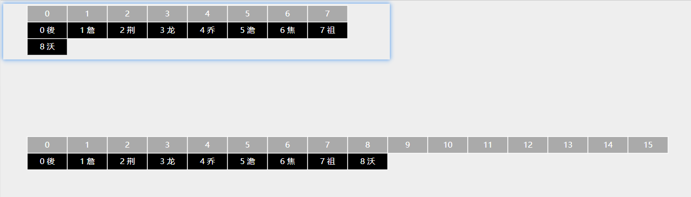

这个拆分是有规律的，前提是数组的长度是2的n次方

- 一个链表最多拆成两个
- hash & table.length == 0 的一组，索引不变
- hash & table.length != 0 的一组，索引是原索引 + table.length
- table.length指的是旧数组长度

为什么是这样？

从二进制的角度出发，扩容一倍，就是余数要多考虑一位，比如从 8 -> 16

容量为8时，余数是后三位，容量为16时，余数是后四位

余数一样的索引一样，会被分配到同一链表

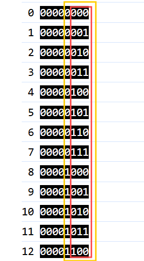

哪些数字扩容后索引不变，哪些数字扩容后索引会变？

很明显，后三位和后四位取值一致的不变，取值不一致的会变，也就是说，多考虑的那一位是0的不变，是1的会变

如何检查多考虑的那一位是0还是1呢？多考虑的那一位保留，其他位置清0，等于0的是0，不等于0的是1

我们需要找到一个数字，它的二进制数在多考虑的那一位是1，其他位置都是0，然后与其他数字做按位与运算，即可达到我们想要的效果

因为 x & 1 = x，x & 0 = 0，比如说，上面这个例子，我们要找的数字就是 8（00001000），检查倒数第4位

8（00001000）& 1（00000001）= 0（00000000），8（00001000）& 9（00001001）= 8（00001000）

8（00001000）& 2（00000010）= 0（00000000），8（00001000）& 10（00001010）= 8（00001000）

而 8 刚好就是旧数组的长度，当然这不是巧合，只要数组长度是2的n次方，这个规律会一直有效

```
旧数组长度 8 二进制 => 1000 检查倒数第4位
旧数组长度 16 二进制 => 10000 检查倒数第5位
```

hash & 旧数组长度 就是用来检查扩容前后索引位置（余数）会不会变

为什么拆分后的两条链表，一个原索引不变，另一个是原索引+旧数组长度？

还是看上面那个例子，那些多考虑的那一位是0的扩容前后的后三位和后四位取值一致，所以原索引不变，多考虑的那一位是1的取值不一致，区别在多考虑的那一位多了一个1，所以它们要加上这个1，对应到十进制也就是旧数组长度

```java
private void expand() {
    Entry[] newTable = new Entry[table.length << 1];
    for (int i = 0; i < table.length; i++) {
        Entry p = table[i];
        Entry a = null;
        Entry b = null;
        // 规律： a 链表保持索引位置不变，b 链表索引位置+table.length
        while (p != null) {
            if ((p.hash & table.length) == 0) {
                if (a == null) {
                    // 链表保持索引位置不变
                    newTable[i] = p;
                } else {
                    a.next = p;
                }
                a = p; // 分配到a
            } else {
                if (b == null) {
                    // 链表索引位置+table.length
                    newTable[i + table.length] = p;
                } else {
                    b.next = p;
                }
                b = p; // 分配到b
            }
            p = p.next;
        }
        if (a != null) {
            a.next = null;
        }
        if (b != null) {
            b.next = null;
        }
    }
    table = newTable;
    threshold = (int) (table.length * loadFactor);
}
```

#### 删除

```java
Object remove(int hash, Object key) {
    int idx = hash & (table.length - 1);
    Entry p = table[idx];
    Entry pre = null;
    while (p != null) {
        if (p.key.equals(key)) {
            // 找到了, 删除
            if (pre == null) { // 头节点
                table[idx] = p.next;
            } else { // 非头节点
                pre.next = p.next;
            }
            size --;
            return p.value;
        }
        pre = p;
        p = p.next;
    }
    //找不到对应key
    return null;
}
```

### 哈希算法

哈希算法又叫散列算法和摘要算法


hash 算法是将任意对象，分配一个**编号**的过程，其中编号是一个有限范围内的数字（如 int 范围内）

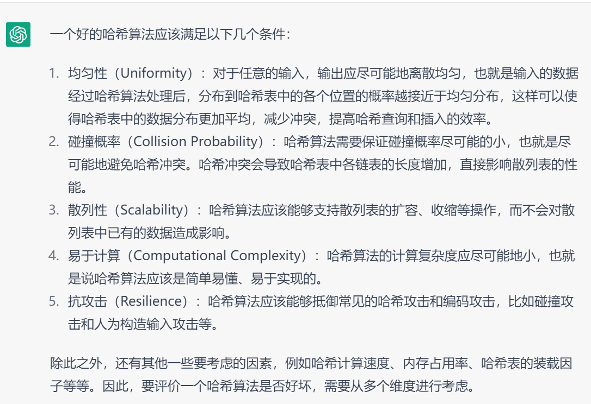

#### Object.hashCode

* Object 的 hashCode 方法默认是生成随机数作为 hash 值（会缓存在对象头当中），不同的对象生成出来的hashCode不一样
* 缺点是包含相同**值**的不同对象，他们的 hashCode 不一样，不能够用 hash 值来反映对象的**值**特征，因此诸多子类都会重写 hashCode 方法

#### String.hashCode

```java
public static void main(String[] args) {
    String s1 = "bac";                     
    String s2 = new String("abc");         

    System.out.println(s1.hashCode());
    System.out.println(s2.hashCode());

    // 原则：值相同的字符串生成相同的 hash 码, 尽量让值不同的字符串生成不同的 hash 码
    /*
    加权重
    对于 abc  a * 100 + b * 10 + c
    对于 bac  b * 100 + a * 10 + c
     */
    int hash = 0;
    for (int i = 0; i < s1.length(); i++) {
        char c = s1.charAt(i);
        System.out.println((int) c);
        // (a*10 + b)*10 + c  ==>  a*100 + b*10 + c  2^5
        hash = (hash << 5) - hash + c;     
    }
    System.out.println(hash);
}
```

* 字符串由一个个字符组成，在计算机里每个字符代表一个数字，可以将它们组合起来形成一个hashCode
* 加权重避免 "abc" 和 "bac" 式的哈希冲突（a + b + c = 97 + 98 + 99 = 294，b + a + c = 98 + 97 + 99 = 294）
* 经验表明如果每次乘的是较大质数，可以有更好地降低 hash 冲突，因此改【乘 10】为【乘 31】
* 【乘 31】可以等价为【乘 32 - hash】，进一步可以转为更高效地【左移5位 - hash】

#### 检查 hash 表的分散性

```java
public void print() {
    int[] sum = new int[table.length]; // 存储哈希表中每个链表的长度
    for (int i = 0; i < table.length; i++) {
        Entry p = table[i];
        while (p != null) {
            sum[i]++;
            p = p.next;
        }
    }
    // System.out.println(Arrays.toString(sum));

    Map<Integer, Long> result = Arrays.stream(sum).boxed()
        .collect(Collectors.groupingBy(s -> s, Collectors.counting())); // 分组统计各链表长度的数量
    System.out.println(result);
}
```

**测试**

```java
public static void main(String[] args) throws IOException {
    // 测试 Object.hashCode
    HashTable obTable = new HashTable();
    for (int i = 0; i < 200000; i++) {
        Object object = new Object();
        obTable.put(object, object);
    }
    System.out.println("测试 Object.hashCode");
    obTable.print();

    // 测试 String.hashCode
    HashTable strTable = new HashTable();
    List<String> strings = Files.readAllLines(Path.of("words")); // words里有大概20万个字符串
    for (String string : strings) {
        strTable.put(string, string);
    }
    System.out.println("测试 String.hashCode");
    strTable.print();
}
```

**结果**

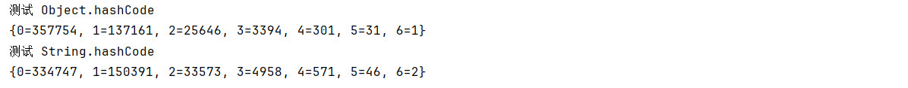

可以看到，效果都不错

其中，都有30多万的格子没有存储元素，造成了空间的浪费，但这个是不可避免的

其他链表长度的数量情况还是挺理想的，链表长度为 1 的占了绝大部分

也没有出现绝大部分数据往少数几个格子里跑的现象，分散性都挺好

#### MurmurHash


想要在java里使用 MurmurHash，首先要导入谷歌的依赖

```xml
<dependency>
    <groupId>com.google.guava</groupId>
    <artifactId>guava</artifactId>
    <version>30.1-jre</version>
</dependency>
```

它提供了一个 Hashing 工具类，支持很多种不同的 hash 算法，我们使用的是 MurmurHash

```java
int abc = Hashing.murmur3_32().hashString("abc", StandardCharsets.UTF_8).asInt();
```

其中 3 代表版本，32 代表生成 32 位的 hashCode，hashString 代表针对字符串

**检查分散性**

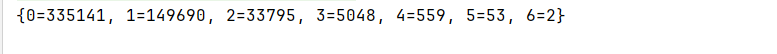

可以看到，分散性跟上面两种 hash 算法差不多

### 最终实现

目前的实现中，我们还需要提供一个参数：hash码，如果是让使用者来提供这个 hash 码，很难保证不发生冲突

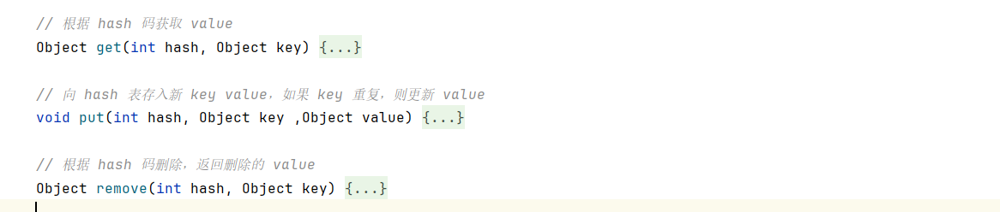

所以我们要改造原来代码，新增一个生成 hash 码的方法和三个对使用者提供的方法

```java
// 获取
Object get(Object key) {
	int hash = hash(key);
    return get(hash, key);
}

// 新增
void put(Object key ,Object value) {
    int hash = hash(key);
    put(hash, key, value);
}

// 删除
Object remove(Object key) {
    int hash = hash(key);
    return remove(hash, key);
}

// 生成 hash 码
private static int hash(Object key) {
    if (key instanceof String k) {
    	return Hashing.murmur3_32().hashString(k, StandardCharsets.UTF_8).asInt();
    }
    return key.hashCode();
}
```

**完整代码**

```java
public class HashTable {

    static class Entry {
       int hash; 
       Object key; 
       Object value; 
       Entry next; 

       public Entry(int hash, Object key, Object value) {
           this.hash = hash;
           this.key = key;
           this.value = value;
       }
    }

    Entry[] table = new Entry[16]; 
    int size; 
    float loadFactor = 0.75f; 
    int threshold = (int) (table.length * loadFactor);

    Object get(int hash, Object key) {
        int idx = hash & (table.length - 1);
        Entry p = table[idx];
        while (p != null) {
            if (p.key.equals(key)) {
                return p.value;
            }
            p = p.next;
        }
        return null;
    }

    void put(int hash, Object key ,Object value) {
        int idx = hash & (table.length - 1);
        Entry p = table[idx];
        if (p == null) {
            table[idx] = new Entry(hash, key, value);
        } else {
            while (true) {
                if (p.key.equals(key)) {
                    p.value = value; 
                    return;
                }
                if (p.next == null) {
                    break;
                }
                p = p.next;
            }
            p.next = new Entry(hash, key, value); 
        }
        size++;
        if (size > threshold) { 
            expand();
        }
    }

    Object remove(int hash, Object key) {
        int idx = hash & (table.length - 1);
        Entry p = table[idx];
        Entry pre = null;
        while (p != null) {
            if (p.key.equals(key)) {
                if (pre == null) { 
                    table[idx] = p.next;
                } else { 
                    pre.next = p.next;
                }
                size --;
                return p.value;
            }
            pre = p;
            p = p.next;
        }
        return null;
    }

    private void expand() {
        Entry[] newTable = new Entry[table.length << 1];
        for (int i = 0; i < table.length; i++) {
            Entry p = table[i];
            Entry a = null;
            Entry b = null;
            while (p != null) {
                if ((p.hash & table.length) == 0) {
                    if (a == null) {
                        newTable[i] = p;
                    } else {
                        a.next = p;
                    }
                    a = p; 
                } else {
                    if (b == null) {
                        newTable[i + table.length] = p;
                    } else {
                        b.next = p;
                    }
                    b = p; 
                }
                p = p.next;
            }
            if (a != null) {
                a.next = null;
            }
            if (b != null) {
                b.next = null;
            }
        }
        table = newTable;
        threshold = (int) (table.length * loadFactor);
    }

    Object get(Object key) {
        int hash = hash(key);
        return get(hash, key);
    }

    void put(Object key ,Object value) {
        int hash = hash(key);
        put(hash, key, value);
    }

    Object remove(Object key) {
        int hash = hash(key);
        return remove(hash, key);
    }

    private static int hash(Object key) {
        if (key instanceof String k) {
            return Hashing.murmur3_32().hashString(k, StandardCharsets.UTF_8).asInt();
        }
        return key.hashCode();
    }
}
```

### 思考

1. 我们的代码里使用了尾插法，如果改成头插法呢？

   答：没问题，在 Java 中，HashTable用的就是头插法，HashMap在 JDK1.7 及之前用的也是头插法，但其实头插法和尾插法在性能上并没有太大区别，那为什么在 JDK1.8 以后改成了尾插法呢？因为在多线程下，头插法会带来死循环的问题，为了避免这个问题，所以改成了尾插法。

2. JDK 的 HashMap 中采用了将对象 hashCode 高低位相互异或的方式减少冲突，怎么理解？

   答：这样做的目的是混合高位和低位的位信息，避免它们之间的规律性，从而提高哈希值的随机性，减少冲突的概率，优化存储性能。具体实现是：h ^= (h >>> 16)，这将原 hashCode 的高 16 位与低 16 位混合，改善哈希表的分布，提升性能。当然，这样做的前提是 HashMap 的容量是 2 的 n 次方。如果我们使用的不是 2 的 n 次方这种策略，那可以不做异或运算，没什么区别。

3. 我们的 HashTable 中表格容量是 2 的 n 次方，很多优化都是基于这个前提，能否不用 2 的 n 次方作为表格容量？

   答：可以。在 Java 自带的 Hashtable 中，它的初始容量是11，一个质数，它就不是 2 的 n 次方，质数在取模的时候得到的哈希值的分散性会比较好，而 2 的 n 次方它的分散性会比较差，从二进制的角度上看，取模相当于只看了后几位，高位都用不上，所以我们才需要做高低位异或运算。

   但正如题目所说，很多优化都是基于 2 的 n 次方这个前提：

   - 求模 -> 按位与
   - 拆分链表
   - 高低位异或

   如果我们不用 2 的 n 次方作为表格容量，性能会稍逊。

   所以容量是否选择 2 的 n 次方主要是在效率和分散性之间去做选择。

4. JDK 的 HashMap 在链表长度过长会转换成红黑树，对此你怎么看？

   这个操作是在 JDK1.8 后才有的，它会在链表长度超过8的时候将链表转换成红黑树。

   在哈希表中，当多个键值对被映射到同一个位置上（即哈希值相同的情况下），这些键值对会以链表的形式存储。在某些情况下，哈希冲突会导致链表长度过长，这会影响查找、插入、删除等操作的性能。

   但实际上，这个操作主要是为了防患于未然，有的非正常用户会专门造一些相互之间会发生冲突的哈希数据，一旦冲突，就会形成一些非常长的链表，让整个服务器的性能下降，这个时候，这个转换操作可以保底，避免这种恶意攻击对性能造成的影响太大。如果是正常的数据，哈希值分散性比较好，链表长度并不会过长，比如，在前面的例子中，20万的数据量，链表长度最多也只是6，而且也没几个。

## 图

> [图](https://zh.wikipedia.org/wiki/图_(数学))是图论的主要研究对象。图是由若干给定的顶点及连接两顶点的边所构成的图形，这种图形通常用来描述某些事物之间的某种特定关系。顶点用于代表事物，连接两顶点的边则用于表示两个事物间具有这种关系。
>
> [图论](https://zh.wikipedia.org/wiki/图论)起源于著名的柯尼斯堡七桥问题。该问题于1736年被欧拉解决，因此普遍认为欧拉是图论的创始人。

### 概念

图是由顶点（vertex）和边（edge）组成的数据结构，例如

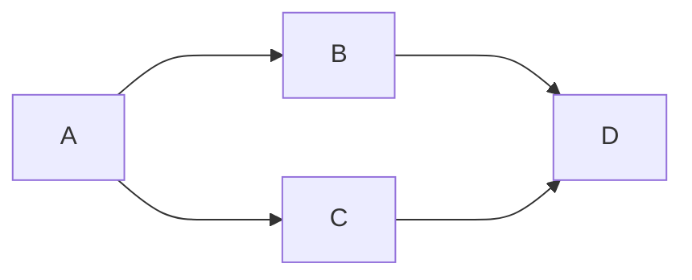
```mermaid
graph LR
    A--->B
    A--->C
    B--->D
    C--->D

```

该图有四个顶点：A、B、C、D 以及四条有向边，有向图中，边是单向的

#### 有向 VS 无向

如果是无向图，那么边是双向的，下面是一个无向图的例子

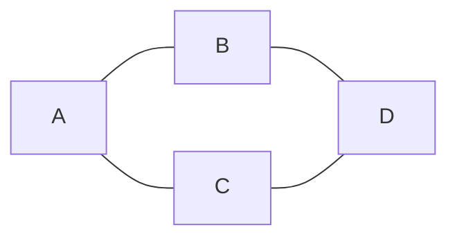
```mermaid
graph LR
    A---B
    A---C
    B---D
    C---D
```

#### 度

**度**是指与该顶点相邻的边的数量

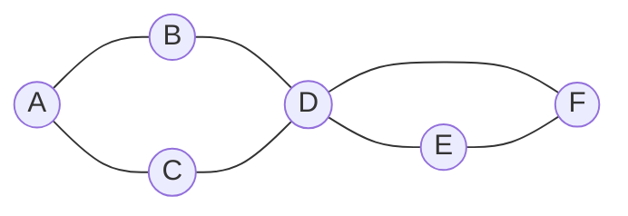
```mermaid
graph LR
    A((A))---B((B))
    A---C((C))
    B---D((D))
    C---D
    D---E((E))
    D---F((F))
    E---F
    A & B & C & D & E & F

```

例如上图中

* A、B、C、E、F 这几个顶点度数为 2
* D 顶点度数为 4


有向图中，细分为**入度**和**出度**，参见下图

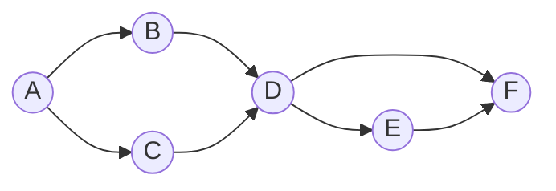
```mermaid
graph LR
    A((A))-->B((B))
    A-->C((C))
    B-->D((D))
    C-->D
    D-->E((E))
    D-->F((F))
    E-->F
    A & B & C & D & E & F

```

* A (2 out / 0 in)
* B、C、E (1 out / 1 in)
* D (2 out / 2 in)
* F (0 out / 2 in)


#### 权

边可以有权重，代表从源顶点到目标顶点的距离、费用、时间或其他度量。

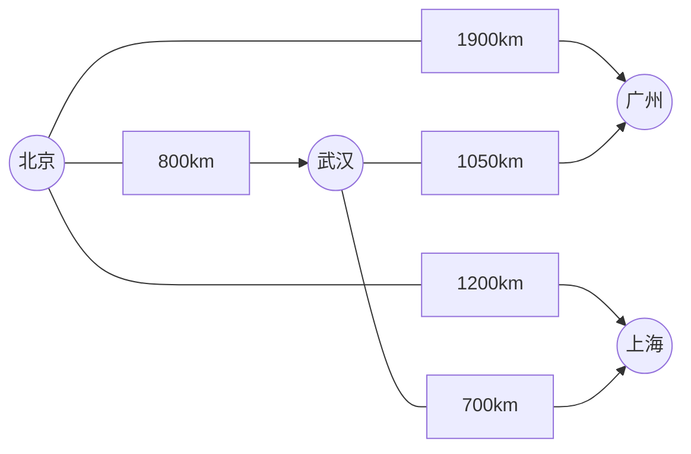
```mermaid
graph LR
    BJ((北京))
    WH((武汉))
    GZ((广州))
    SH((上海))
    BJ---800km-->WH
    BJ---1900km-->GZ
    BJ---1200km-->SH
    WH---1050km-->GZ
    WH---700km-->SH

```

#### 路径

路径被定义为从一个顶点到另一个顶点的一系列连续边，例如上图中【北京】到【上海】有多条路径

* 北京 - 上海
* 北京 - 武汉 - 上海

路径长度

* 不考虑权重，长度就是边的数量
* 考虑权重，一般就是权重累加


#### 环

在有向图中，从一个顶点开始，可以通过若干条有向边返回到该顶点，那么就形成了一个环

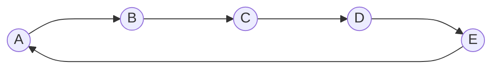
```mermaid
graph LR
  A((A))
  B((B))
  C((C))
  D((D))
  E((E))

  A--->B
  B--->C
  C--->D
  D--->E
  E--->A

```


#### 图的连通性

如果两个顶点之间存在路径，则这两个顶点是连通的，所有顶点都连通，则该图被称之为连通图，若子图连通，则称为连通分量

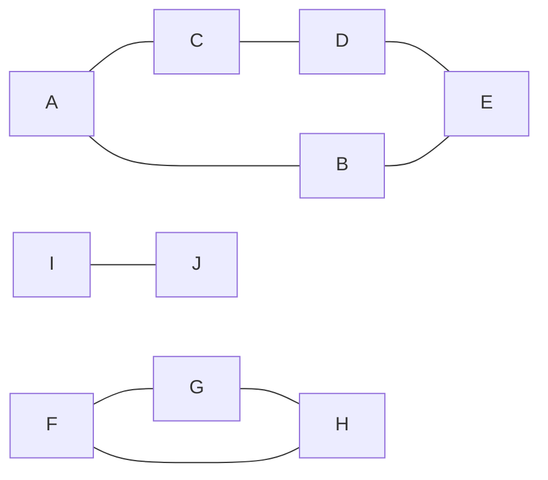
```mermaid
graph LR
    A --- B
    A --- C
    C --- D
    D --- E
    B --- E
    F --- G
    G --- H
    H --- F
    I --- J

```


### 图的表示

比如说，下面的图


```mermaid
graph LR
    A---B
    A---C
    B---D
    C---D
```

用**邻接矩阵**可以表示为：

```
  A B C D
A 0 1 1 0
B 1 0 0 1 
C 1 0 0 1
D 0 1 1 0
```

用**邻接表**可以表示为：

```
A -> B -> C
B -> A -> D
C -> A -> D
D -> B -> C
```

有向图的例子


```mermaid
graph LR
    A--->B
    A--->C
    B--->D
    C--->D
```

```
  A B C D
A 0 1 1 0
B 0 0 0 1
C 0 0 0 1
D 0 0 0 0
```

```
A - B - C
B - D
C - D
D - empty
```

### Java 表示

顶点

```java
public class Vertex {
    String name;
    List<Edge> edges;
    
    // 拓扑排序相关
    int inDegree;
    int status; // 状态 0-未访问 1-访问中 2-访问过，用在拓扑排序

    // dfs, bfs 相关
    boolean visited;

    // 求解最短距离相关
    private static final int INF = Integer.MAX_VALUE;
    int dist = INF;
    Vertex prev = null;
}
```

边

```java
public class Edge {

    Vertex linked;
    int weight;

    public Edge(Vertex linked) {
        this(linked, 1);
    }

    public Edge(Vertex linked, int weight) {
        this.linked = linked;
        this.weight = weight;
    }
}
```

### DFS

```java
public class Dfs {
    public static void main(String[] args) {
        Vertex v1 = new Vertex("v1");
        Vertex v2 = new Vertex("v2");
        Vertex v3 = new Vertex("v3");
        Vertex v4 = new Vertex("v4");
        Vertex v5 = new Vertex("v5");
        Vertex v6 = new Vertex("v6");

        v1.edges = List.of(new Edge(v3), new Edge(v2), new Edge(v6));
        v2.edges = List.of(new Edge(v4));
        v3.edges = List.of(new Edge(v4), new Edge(v6));
        v4.edges = List.of(new Edge(v5));
        v5.edges = List.of();
        v6.edges = List.of(new Edge(v5));

        dfsWithLoop(v1);
    }

    private static void dfsWithLoop(Vertex v) {
        LinkedList<Vertex> stack = new LinkedList<>();
        stack.push(v);
        while (!stack.isEmpty()) {
            Vertex pop = stack.pop();
            pop.visited = true;
            System.out.println(pop.name);
            for (Edge edge : pop.edges) {
                if (!edge.linked.visited) {
                    stack.push(edge.linked);
                }
            }
        }
    }

    private static void dfsWithRecursion(Vertex v) {
        v.visited = true;
        System.out.println(v.name);
        for (Edge edge : v.edges) {
            if (!edge.linked.visited) {
                dfsWithRecursion(edge.linked);
            }
        }
    }
}
```

### BFS

```java
public class Bfs {
    public static void main(String[] args) {
        Vertex v1 = new Vertex("v1");
        Vertex v2 = new Vertex("v2");
        Vertex v3 = new Vertex("v3");
        Vertex v4 = new Vertex("v4");
        Vertex v5 = new Vertex("v5");
        Vertex v6 = new Vertex("v6");

        v1.edges = List.of(new Edge(v3), new Edge(v2), new Edge(v6));
        v2.edges = List.of(new Edge(v4));
        v3.edges = List.of(new Edge(v4), new Edge(v6));
        v4.edges = List.of(new Edge(v5));
        v5.edges = List.of();
        v6.edges = List.of(new Edge(v5));

        bfs(v1);
    }

    private static void bfs(Vertex v) {
        LinkedList<Vertex> queue = new LinkedList<>();
        v.visited = true;
        queue.offer(v);
        while (!queue.isEmpty()) {
            Vertex poll = queue.poll();
            System.out.println(poll.name);
            for (Edge edge : poll.edges) {
                if (!edge.linked.visited) {
                    edge.linked.visited = true;
                    queue.offer(edge.linked);
                }
            }
        }
    }
}
```

### 拓补排序

在图论中，拓扑排序（Topological Sorting）是一个有向无环图（DAG, Directed Acyclic Graph）的所有顶点的线性序列。且该序列必须满足下面两个条件：

- 每个顶点出现且只出现一次。
- 若存在一条从顶点 A 到顶点 B 的路径，那么在序列中顶点 A 出现在顶点 B 的前面。

有向无环图（DAG）才有拓扑排序，非DAG图没有拓扑排序一说。

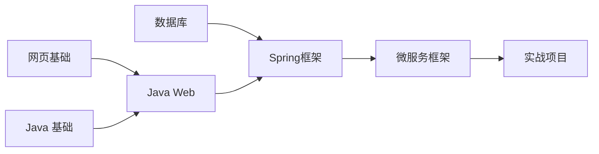
```mermaid
graph LR
	HTML[网页基础] --> WEB
    SE[Java 基础] --> WEB[Java Web] 
    DB[数据库] --> Spring
    WEB --> Spring[Spring框架]
    Spring --> Micro[微服务框架]
    Micro --> Project[实战项目]
```

#### Kahn

基本思想：

- **入度为0的顶点优先**：选择当前入度为0的顶点加入结果序列，因为这类顶点不依赖任何其他顶点，符合拓扑排序的要求。
- **动态更新入度**：每处理一个顶点，将其邻接顶点的入度减1，模拟“移除”该顶点及其出边。若邻接顶点的入度变为0，则将其加入候选队列。
- **环检测**：若最终结果序列的顶点数少于图中总顶点数，说明图中存在环，无法进行拓扑排序。

```java
public class TopologicalSort {
    public static void main(String[] args) {
        Vertex v1 = new Vertex("网页基础");
        Vertex v2 = new Vertex("Java基础");
        Vertex v3 = new Vertex("JavaWeb");
        Vertex v4 = new Vertex("Spring框架");
        Vertex v5 = new Vertex("微服务框架");
        Vertex v6 = new Vertex("数据库");
        Vertex v7 = new Vertex("实战项目");

        v1.edges = List.of(new Edge(v3)); // +1
        v2.edges = List.of(new Edge(v3)); // +1
        v3.edges = List.of(new Edge(v4));
        v6.edges = List.of(new Edge(v4));
        v4.edges = List.of(new Edge(v5));
        v5.edges = List.of(new Edge(v7));
        v7.edges = List.of();

        List<Vertex> graph = List.of(v1, v2, v3, v4, v5, v6, v7);
        // 1. 统计每个顶点的入度
        for (Vertex v : graph) {
            for (Edge edge : v.edges) {
                edge.linked.inDegree++;
            }
        }
        /*for (Vertex vertex : graph) {
            System.out.println(vertex.name + " " + vertex.inDegree);
        }*/
        // 2. 将入度为0的顶点加入队列
        LinkedList<Vertex> queue = new LinkedList<>();
        for (Vertex v : graph) {
            if (v.inDegree == 0) {
                queue.offer(v);
            }
        }
        // 3. 队列中不断移除顶点，每移除一个顶点，把它相邻顶点入度减1，若减到0则入队
        List<String> result = new ArrayList<>();
        while (!queue.isEmpty()) {
            Vertex poll = queue.poll();
//            System.out.println(poll.name);
            result.add(poll.name);
            for (Edge edge : poll.edges) {
                edge.linked.inDegree--;
                if (edge.linked.inDegree == 0) {
                    queue.offer(edge.linked);
                }
            }
        }
        if (result.size() != graph.size()) {
            System.out.println("出现环");
        } else {
            for (String key : result) {
                System.out.println(key);
            }
        }
    }
}
```


#### DFS

基本思想：

- **深度优先搜索（DFS）**：从任意未访问节点开始，递归访问其邻接节点。
- **标记节点状态**：节点有三种状态：
  - **未访问**：尚未处理。
  - **访问中**：正在递归访问其邻接节点。
  - **已访问**：该节点及其邻接节点已处理完毕。
- **完成时间记录**：当节点及其邻接节点处理完毕时，将其加入结果列表。
- **结果反转**：最终将结果列表反转，得到拓扑排序。

```java
public class TopologicalSortDFS {

    public static void main(String[] args) {
        Vertex v1 = new Vertex("网页基础");
        Vertex v2 = new Vertex("Java基础");
        Vertex v3 = new Vertex("JavaWeb");
        Vertex v4 = new Vertex("Spring框架");
        Vertex v5 = new Vertex("微服务框架");
        Vertex v6 = new Vertex("数据库");
        Vertex v7 = new Vertex("实战项目");

        v1.edges = List.of(new Edge(v3));
        v2.edges = List.of(new Edge(v3));
        v3.edges = List.of(new Edge(v4));
        v6.edges = List.of(new Edge(v4));
        v4.edges = List.of(new Edge(v5));
        v5.edges = List.of(new Edge(v7));
        v7.edges = List.of();

        List<Vertex> graph = List.of(v1, v2, v3, v4, v5, v6, v7);
        LinkedList<String> result = new LinkedList<>();
        for (Vertex v : graph) {
            if(v.status==0) {
                dfs(v, result);
            }
        }
        System.out.println(result);
    }

    private static void dfs(Vertex v, LinkedList<String> result) {
        if (v.status == 2) {
            return;
        }
        if (v.status == 1) {
            throw new RuntimeException("发现环");
        }
        v.status = 1;
        for (Edge edge : v.edges) {
            dfs(edge.linked, result);
        }
        v.status = 2;
        result.push(v.name);
    }
}
```

### 最短路径

寻找从某个节点到图中各个节点的最短距离

#### Dijkstra

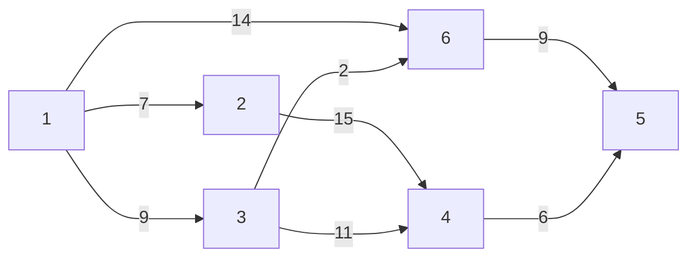
```mermaid
graph LR
    1--7-->2
    1--9--->3
    1--14--->6
    6--9--->5
    3--2--->6
    2--15--->4
    3--11--->4
    4--6--->5
```

算法描述：

1. 将所有顶点标记为未访问。创建一个未访问顶点的集合。
2. 为每个顶点分配一个临时距离值
   * 对于我们的初始顶点，将其设置为零
   * 对于所有其他顶点，将其设置为无穷大。
3. 每次选择最小临时距离的未访问顶点，作为新的当前顶点
4. 对于当前顶点，遍历其所有未访问的邻居，并更新它们的临时距离为更小
   * 例如，1->6 的距离是 14，而1->3->6 的距离是11。这时将距离更新为 11
   * 否则，将保留上次距离值
5. 当前顶点的邻居处理完成后，把它从未访问集合中删除

```java
public class Dijkstra {
    public static void main(String[] args) {
        Vertex v1 = new Vertex("v1");
        Vertex v2 = new Vertex("v2");
        Vertex v3 = new Vertex("v3");
        Vertex v4 = new Vertex("v4");
        Vertex v5 = new Vertex("v5");
        Vertex v6 = new Vertex("v6");

        v1.edges = List.of(new Edge(v3, 9), new Edge(v2, 7), new Edge(v6, 14));
        v2.edges = List.of(new Edge(v4, 15));
        v3.edges = List.of(new Edge(v4, 11), new Edge(v6, 2));
        v4.edges = List.of(new Edge(v5, 6));
        v5.edges = List.of();
        v6.edges = List.of(new Edge(v5, 9));

        List<Vertex> graph = List.of(v1, v2, v3, v4, v5, v6);

        dijkstra(graph, v1);
    }

    private static void dijkstra(List<Vertex> graph, Vertex source) {
        ArrayList<Vertex> list = new ArrayList<>(graph);
        source.dist = 0;

        while (!list.isEmpty()) {
            // 3. 选取当前顶点
            Vertex curr = chooseMinDistVertex(list);
            // 4. 更新当前顶点邻居距离
            updateNeighboursDist(curr, list);
            // 5. 移除当前顶点
            list.remove(curr);
        }

        for (Vertex v : graph) {
            System.out.println(v.name + " " + v.dist);
        }
    }

    private static void updateNeighboursDist(Vertex curr, ArrayList<Vertex> list) {
        for (Edge edge : curr.edges) {
            Vertex n = edge.linked;
            if (list.contains(n)) {
                int dist = curr.dist + edge.weight;
                if (dist < n.dist) {
                    n.dist = dist;
                }
            }
        }
    }

    private static Vertex chooseMinDistVertex(ArrayList<Vertex> list) {
        Vertex min = list.get(0);
        for (int i = 1; i < list.size(); i++) {
            if (list.get(i).dist < min.dist) {
                min = list.get(i);
            }
        }
        return min;
    }

}
```


改进 - 优先级队列

1. 创建一个优先级队列，放入所有顶点（队列大小会达到边的数量）
2. 为每个顶点分配一个临时距离值
   * 对于我们的初始顶点，将其设置为零
   * 对于所有其他顶点，将其设置为无穷大。
3. 每次选择最小临时距离的未访问顶点，作为新的当前顶点
4. 对于当前顶点，遍历其所有未访问的邻居，并更新它们的临时距离为更小，若距离更新需加入队列
   * 例如，1->6 的距离是 14，而1->3->6 的距离是11。这时将距离更新为 11
   * 否则，将保留上次距离值
5. 当前顶点的邻居处理完成后，把它从队列中删除

```java
public class DijkstraPriorityQueue {
    public static void main(String[] args) {
        Vertex v1 = new Vertex("v1");
        Vertex v2 = new Vertex("v2");
        Vertex v3 = new Vertex("v3");
        Vertex v4 = new Vertex("v4");
        Vertex v5 = new Vertex("v5");
        Vertex v6 = new Vertex("v6");

        v1.edges = List.of(new Edge(v3, 9), new Edge(v2, 7), new Edge(v6, 14));
        v2.edges = List.of(new Edge(v4, 15));
        v3.edges = List.of(new Edge(v4, 11), new Edge(v6, 2));
        v4.edges = List.of(new Edge(v5, 6));
        v5.edges = List.of();
        v6.edges = List.of(new Edge(v5, 9));

        List<Vertex> graph = List.of(v1, v2, v3, v4, v5, v6);

        dijkstra(graph, v1);
    }

    private static void dijkstra(List<Vertex> graph, Vertex source) {
        PriorityQueue<Vertex> queue = new PriorityQueue<>(Comparator.comparingInt(v -> v.dist));
        source.dist = 0;
        for (Vertex v : graph) {
            queue.offer(v);
        }

        while (!queue.isEmpty()) {
            System.out.println(queue);
            // 3. 选取当前顶点
            Vertex curr = queue.peek();
            // 4. 更新当前顶点邻居距离
            if(!curr.visited) {
                updateNeighboursDist(curr, queue);
                curr.visited = true;
            }
            // 5. 移除当前顶点
            queue.poll();
        }

        for (Vertex v : graph) {
            System.out.println(v.name + " " + v.dist + " " + (v.prev != null ? v.prev.name : "null"));
        }
    }

    private static void updateNeighboursDist(Vertex curr, PriorityQueue<Vertex> queue) {
        for (Edge edge : curr.edges) {
            Vertex n = edge.linked;
            if (!n.visited) {
                int dist = curr.dist + edge.weight;
                if (dist < n.dist) {
                    n.dist = dist;
                    n.prev = curr;
                    queue.offer(n);
                }
            }
        }
    }

}
```

**问题**

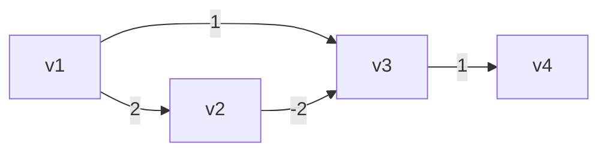
```mermaid
graph LR
v1 --2--> v2
v1 --1--> v3
v2 --"-2"--> v3
v3 --1--> v4
```

按照 Dijkstra 算法，得出

* v1 -> v2 最短距离2
* v1 -> v3 最短距离1
* v1 -> v4 最短距离2

事实应当是

* v1 -> v2 最短距离2
* v1 -> v3 最短距离0
* v1 -> v4 最短距离1

#### Bellman-Ford

核心思想：

- 初始化初始顶点的距离为0，其他顶点的距离为无穷大（∞）。
- 对所有的边进行 **V - 1** 次松弛操作，其中 V 是图中节点的数量。每次松弛操作都会检查每条边，更新目标节点的最短路径估计值。
- 在完成 V - 1 次松弛操作后，检查是否还有边的松弛操作能够更新距离值。如果可以更新，说明图中存在负权环。

为什么是 V - 1 次？

在一个没有负权环的图中，任意两个顶点之间的最短路径最多包含 V - 1 条边。

```java
public class BellmanFord {
    public static void main(String[] args) {
        // 正常情况
        /*Vertex v1 = new Vertex("v1");
        Vertex v2 = new Vertex("v2");
        Vertex v3 = new Vertex("v3");
        Vertex v4 = new Vertex("v4");
        Vertex v5 = new Vertex("v5");
        Vertex v6 = new Vertex("v6");

        v1.edges = List.of(new Edge(v3, 9), new Edge(v2, 7), new Edge(v6, 14));
        v2.edges = List.of(new Edge(v4, 15));
        v3.edges = List.of(new Edge(v4, 11), new Edge(v6, 2));
        v4.edges = List.of(new Edge(v5, 6));
        v5.edges = List.of();
        v6.edges = List.of(new Edge(v5, 9));

        List<Vertex> graph = List.of(v4, v5, v6, v1, v2, v3);*/

        // 负边情况
        /*Vertex v1 = new Vertex("v1");
        Vertex v2 = new Vertex("v2");
        Vertex v3 = new Vertex("v3");
        Vertex v4 = new Vertex("v4");

        v1.edges = List.of(new Edge(v2, 2), new Edge(v3, 1));
        v2.edges = List.of(new Edge(v3, -2));
        v3.edges = List.of(new Edge(v4, 1));
        v4.edges = List.of();
        List<Vertex> graph = List.of(v1, v2, v3, v4);*/

        // 负环情况
        Vertex v1 = new Vertex("v1");
        Vertex v2 = new Vertex("v2");
        Vertex v3 = new Vertex("v3");
        Vertex v4 = new Vertex("v4");

        v1.edges = List.of(new Edge(v2, 2));
        v2.edges = List.of(new Edge(v3, -4));
        v3.edges = List.of(new Edge(v4, 1), new Edge(v1, 1));
        v4.edges = List.of();
        List<Vertex> graph = List.of(v1, v2, v3, v4);

        bellmanFord(graph, v1);
    }

    private static void bellmanFord(List<Vertex> graph, Vertex source) {
        source.dist = 0;
        int size = graph.size();
        // 1. 进行 顶点个数 - 1 轮处理
        for (int i = 0; i < size - 1; i++) {
            // 2. 遍历所有的边
            for (Vertex s : graph) {
                for (Edge edge : s.edges) {
                    // 3. 处理每一条边
                    Vertex e = edge.linked;
                    if (s.dist != Integer.MAX_VALUE && s.dist + edge.weight < e.dist) {
                        e.dist = s.dist + edge.weight;
                        e.prev = s;
                    }
                }
            }
        }
        
        // 负环检测
        for (Vertex s : graph) {
            for (Edge edge : s.edges) {
                Vertex e = edge.linked;
                if (s.dist + edge.weight < e.dist) {
                    throw new RuntimeException("出现负环");
                }
            }
        }
        
        for (Vertex v : graph) {
            System.out.println(v + " " + (v.prev != null ? v.prev.name : "null"));
        }
    }
}
```


**负环**

负环指的是环内路径的权重总和是负数，如下图，2 + -4 + 1 = -1，即出现了负环

如果出现负环，环的起点在每一轮绕环结束后起点的最短路径都会被减少，找不到最短路径

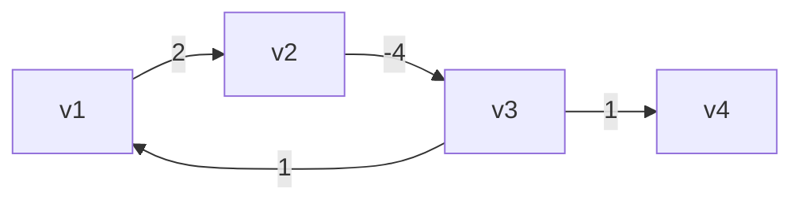
```mermaid
graph LR
v1 --2--> v2
v2 --"-4"--> v3
v3 --1--> v4
v3 --1--> v1

```

在代码中，可以通过这个方法发现负环，如果在【顶点-1】轮处理完成后，还能继续找到更短距离，表示发现了负环

#### Floyd-Warshall

核心思想：

- 初始化一个距离矩阵 `dist[i][j]`，矩阵中每个位置表示从节点 `i` 到节点 `j` 的临时最短路径。
- 通过三重循环，逐个遍历中介节点 `k` 更新所有节点对 `(i, j)` 的最短路径：`dist[i][j] = min(dist[i][j], dist[i][k] + dist[k][j])`，其实就是逐个判断 i -> k -> j 和 i -> j 哪个是最短路径

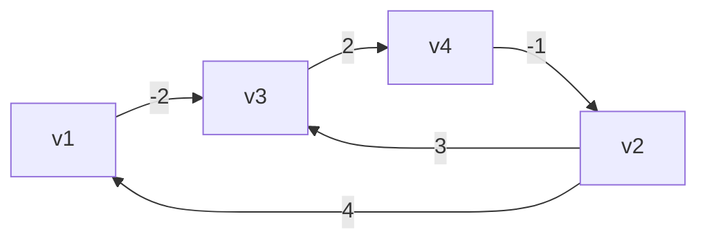
```mermaid
graph LR
v1 --"-2"--> v3
v2 --"4"--> v1
v2 --"3"--> v3
v3 --2--> v4
v4 --"-1"--> v2
```

```java
public class FloydWarshall {
    public static void main(String[] args) {
        Vertex v1 = new Vertex("v1");
        Vertex v2 = new Vertex("v2");
        Vertex v3 = new Vertex("v3");
        Vertex v4 = new Vertex("v4");

        v1.edges = List.of(new Edge(v3, -2));
        v2.edges = List.of(new Edge(v1, 4), new Edge(v3, 3));
        v3.edges = List.of(new Edge(v4, 2));
        v4.edges = List.of(new Edge(v2, -1));
        List<Vertex> graph = List.of(v1, v2, v3, v4);

        /*
                直接连通
                v1  v2  v3  v4
            v1  0   ∞   -2  ∞
            v2  4   0   3   ∞
            v3  ∞   ∞   0   2
            v4  ∞   -1  ∞   0

                k=0 借助v1到达其它顶点
                v1  v2  v3  v4
            v1  0   ∞   -2  ∞
            v2  4   0   2   ∞
            v3  ∞   ∞   0   2
            v4  ∞   -1  ∞   0

                k=1 借助v2到达其它顶点
                v1  v2  v3  v4
            v1  0   ∞   -2  ∞
            v2  4   0   2   ∞
            v3  ∞   ∞   0   2
            v4  3   -1  1   0

                k=2 借助v3到达其它顶点
                v1  v2  v3  v4
            v1  0   ∞   -2  0
            v2  4   0   2   4
            v3  ∞   ∞   0   2
            v4  3   -1  1   0

                k=3 借助v4到达其它顶点
                v1  v2  v3  v4
            v1  0   -1   -2  0
            v2  4   0   2   4
            v3  5   1   0   2
            v4  3   -1  1   0
         */
        floydWarshall(graph);
    }

    static void floydWarshall(List<Vertex> graph) {
        int size = graph.size();
        int[][] dist = new int[size][size];
        Vertex[][] prev = new Vertex[size][size];
        // 1）初始化
        for (int i = 0; i < size; i++) {
            Vertex v = graph.get(i); // v1 (v3)
            Map<Vertex, Integer> map = v.edges.stream().collect(Collectors.toMap(e -> e.linked, e -> e.weight));
            for (int j = 0; j < size; j++) {
                Vertex u = graph.get(j); // v3
                if (v == u) {
                    dist[i][j] = 0;
                } else {
                    dist[i][j] = map.getOrDefault(u, Integer.MAX_VALUE);
                    prev[i][j] = map.get(u) != null ? v : null;
                }
            }
        }
        print(prev);
        // 2）看能否借路到达其它顶点
        /*
            v2->v1          v1->v?
            dist[1][0]   +   dist[0][0]
            dist[1][0]   +   dist[0][1]
            dist[1][0]   +   dist[0][2]
            dist[1][0]   +   dist[0][3]
         */
        for (int k = 0; k < size; k++) {
            for (int i = 0; i < size; i++) {
                for (int j = 0; j < size; j++) {
//                    dist[i][k]   +   dist[k][j] // i行的顶点，借助k顶点，到达j列顶点
//                    dist[i][j]                  // i行顶点，直接到达j列顶点
                    if (dist[i][k] != Integer.MAX_VALUE &&
                            dist[k][j] != Integer.MAX_VALUE &&
                            dist[i][k] + dist[k][j] < dist[i][j]) {
                        dist[i][j] = dist[i][k] + dist[k][j];
                        prev[i][j] = prev[k][j];
                    }
                }
            }
//            print(dist);
        }
        print(prev);
    }

    static void path(Vertex[][] prev, List<Vertex> graph, int i, int j) {
        LinkedList<String> stack = new LinkedList<>();
        System.out.print("[" + graph.get(i).name + "," + graph.get(j).name + "] ");
        stack.push(graph.get(j).name);
        while (i != j) {
            Vertex p = prev[i][j];
            stack.push(p.name);
            j = graph.indexOf(p);
        }
        System.out.println(stack);
    }

    static void print(int[][] dist) {
        System.out.println("-------------");
        for (int[] row : dist) {
            System.out.println(Arrays.stream(row).boxed()
                    .map(x -> x == Integer.MAX_VALUE ? "∞" : String.valueOf(x))
                    .map(s -> String.format("%2s", s))
                    .collect(Collectors.joining(",", "[", "]")));
        }
    }

    static void print(Vertex[][] prev) {
        System.out.println("-------------------------");
        for (Vertex[] row : prev) {
            System.out.println(Arrays.stream(row).map(v -> v == null ? "null" : v.name)
                    .map(s -> String.format("%5s", s))
                    .collect(Collectors.joining(",", "[", "]")));
        }
    }

}
```


**负环**

如果在 3 层循环结束后，在 dist 数组的对角线处（i==j 处）发现了负数，表示出现了负环

### 最小生成树

有n个节点，寻找能把所有节点连通并且总权重加起来最少的边的集合

#### Prim

核心思想跟最短路径的Dijkstra算法一致，只是这里按照题目要求我们只看路径的权重就行

```java
public class Prim {
    public static void main(String[] args) {
        Vertex v1 = new Vertex("v1");
        Vertex v2 = new Vertex("v2");
        Vertex v3 = new Vertex("v3");
        Vertex v4 = new Vertex("v4");
        Vertex v5 = new Vertex("v5");
        Vertex v6 = new Vertex("v6");
        Vertex v7 = new Vertex("v7");

        v1.edges = List.of(new Edge(v2, 2), new Edge(v3, 4), new Edge(v4, 1));
        v2.edges = List.of(new Edge(v1, 2), new Edge(v4, 3), new Edge(v5, 10));
        v3.edges = List.of(new Edge(v1, 4), new Edge(v4, 2), new Edge(v6, 5));
        v4.edges = List.of(new Edge(v1, 1), new Edge(v2, 3), new Edge(v3, 2),
                new Edge(v5, 7), new Edge(v6, 8), new Edge(v7, 4));
        v5.edges = List.of(new Edge(v2, 10), new Edge(v4, 7), new Edge(v7, 6));
        v6.edges = List.of(new Edge(v3, 5), new Edge(v4, 8), new Edge(v7, 1));
        v7.edges = List.of(new Edge(v4, 4), new Edge(v5, 6), new Edge(v6, 1));

        List<Vertex> graph = List.of(v1, v2, v3, v4, v5, v6, v7);

        prim(graph, v1);

    }

    static void prim(List<Vertex> graph, Vertex source) {
        ArrayList<Vertex> list = new ArrayList<>(graph);
        source.dist = 0;

        while (!list.isEmpty()) {
            Vertex min = chooseMinDistVertex(list);
            updateNeighboursDist(min);
            list.remove(min);
            min.visited = true;
            System.out.println("---------------");
            for (Vertex v : graph) {
                System.out.println(v);
            }
        }


    }

    private static void updateNeighboursDist(Vertex curr) {
        for (Edge edge : curr.edges) {
            Vertex n = edge.linked;
            if (!n.visited) {
                int dist = edge.weight;
                if (dist < n.dist) {
                    n.dist = dist;
                    n.prev = curr;
                }
            }
        }
    }

    private static Vertex chooseMinDistVertex(ArrayList<Vertex> list) {
        Vertex min = list.get(0);
        for (int i = 1; i < list.size(); i++) {
            if (list.get(i).dist < min.dist) {
                min = list.get(i);
            }
        }
        return min;
    }
}
```


#### Kruskal

核心思想：

- **初始化**：将所有边按权重从小到大排序。
- **选择边**：依次选择权重最小的边，如果这条边的两个顶点不在同一个连通分量中，则将其加入生成树。
- **重复**：重复步骤2，直到生成树包含所有顶点，其实我们只要找到 V - 1条边，就代表生成树包含所有顶点，V指顶点数量。

```java
public class Kruskal {
    static class Edge implements Comparable<Edge> {
        List<Vertex> vertices;
        int start;
        int end;
        int weight;

        public Edge(List<Vertex> vertices, int start, int end, int weight) {
            this.vertices = vertices;
            this.start = start;
            this.end = end;
            this.weight = weight;
        }

        public Edge(int start, int end, int weight) {
            this.start = start;
            this.end = end;
            this.weight = weight;
        }

        @Override
        public int compareTo(Edge o) {
            return Integer.compare(this.weight, o.weight);
        }

        @Override
        public String toString() {
            return vertices.get(start).name + "<->" + vertices.get(end).name + "(" + weight + ")";
        }
    }

    public static void main(String[] args) {
        Vertex v1 = new Vertex("v1");
        Vertex v2 = new Vertex("v2");
        Vertex v3 = new Vertex("v3");
        Vertex v4 = new Vertex("v4");
        Vertex v5 = new Vertex("v5");
        Vertex v6 = new Vertex("v6");
        Vertex v7 = new Vertex("v7");

        List<Vertex> vertices = List.of(v1, v2, v3, v4, v5, v6, v7);
        PriorityQueue<Edge> queue = new PriorityQueue<>(List.of(
                new Edge(vertices,0, 1, 2),
                new Edge(vertices,0, 2, 4),
                new Edge(vertices,0, 3, 1),
                new Edge(vertices,1, 3, 3),
                new Edge(vertices,1, 4, 10),
                new Edge(vertices,2, 3, 2),
                new Edge(vertices,2, 5, 5),
                new Edge(vertices,3, 4, 7),
                new Edge(vertices,3, 5, 8),
                new Edge(vertices,3, 6, 4),
                new Edge(vertices,4, 6, 6),
                new Edge(vertices,5, 6, 1)
        ));

        kruskal(vertices.size(), queue);
    }

    static void kruskal(int size, PriorityQueue<Edge> queue) {
        List<Edge> result = new ArrayList<>();
        DisjointSet set = new DisjointSet(size);
        while (result.size() < size - 1) {
            Edge poll = queue.poll();
            int s = set.find(poll.start);
            int e = set.find(poll.end);
            if (s != e) {
                result.add(poll);
                set.union(s, e);
            }
        }

        for (Edge edge : result) {
            System.out.println(edge);
        }
    }
}
```

### 不相交集合（并查集合）

验证两个节点之间是否连通

#### 基础

核心思想详解：

[【算法与数据结构】—— 并查集-CSDN博客](https://blog.csdn.net/the_zed/article/details/105126583)

```java
public class DisjointSet {
    int[] s;
    // 索引对应顶点
    // 元素是用来表示与之有关系的顶点
    /*
        索引  0  1  2  3  4  5  6
        元素 [0, 1, 2, 3, 4, 5, 6] 表示一开始顶点直接没有联系（只与自己有联系）

    */

    public DisjointSet(int size) {
        s = new int[size];
        for (int i = 0; i < size; i++) {
            s[i] = i;
        }
    }

    // find 是找到老大
    public int find(int x) {
        if (x == s[x]) {
            return x;
        }
        return find(s[x]);
    }

    // union 是让两个集合“相交”，即选出新老大，x、y 是原老大索引
    public void union(int x, int y) {
        s[y] = x;
    }

    @Override
    public String toString() {
        return Arrays.toString(s);
    }

}
```


#### 路径压缩

```java
public int find(int x) { // x = 2
    if (x == s[x]) {
        return x;
    }
    return s[x] = find(s[x]); // 0    s[2]=0
}
```


#### Union By Size

```java
public class DisjointSetUnionBySize {
    int[] s;
    int[] size;
    public DisjointSetUnionBySize(int size) {
        s = new int[size];
        this.size = new int[size];
        for (int i = 0; i < size; i++) {
            s[i] = i;
            this.size[i] = 1;
        }
    }

    // find 是找到老大 - 优化：路径压缩
    public int find(int x) { // x = 2
        if (x == s[x]) {
            return x;
        }
        return s[x] = find(s[x]); // 0    s[2]=0
    }

    // union 是让两个集合“相交”，即选出新老大，x、y 是原老大索引
    public void union(int x, int y) {
//        s[y] = x;
        if (size[x] < size[y]) {
            int t = x;
            x = y;
            y = t;
        }
        s[y] = x;
        size[x] = size[x] + size[y];
    }

    @Override
    public String toString() {
        return "内容："+Arrays.toString(s) + "\n大小：" + Arrays.toString(size);
    }
}
```

