# Java基础

## 概念

### Java的特点

- **跨平台**：一次编码，到处运行。Java编译器将源代码编译成字节码，字节码可以在任何安装了Java虚拟机（JVM）的系统上运行。
- **内存管理**：Java内置垃圾回收机制，自动管理内存和回收不再使用的对象。开发者不需要手动管理内存，从而减少内存泄漏和其它内存相关问题。
- **面向对象**：封装、继承、多态、抽象。Java是一门严格面向对象的编程语言，几乎一切都是对象，面向对象（OOP）的特性使得代码更易于维护和重用。

###  Java为什么是跨平台的？

Java能支持跨平台，主要依赖于JVM。JVM也是一个软件，不同的平台有不同的版本。

我们编写的Java代码，在经过编译后，会产生.class文件，也就是字节码文件，JVM负责将字节码解释成特定平台的机器码然后运行，也就是说，只要在不同平台上安装对应的JVM，都可以Java程序，这一过程中，Java程序不需要有任何改变。

编译的结果是字节码，而字节码需要经过JVM解释成机器码后，才能运行。不同平台下编译生成的字节码是一样的，但是经过JVM解释后的机器码却不一样。所以，运行Java程序必须要有JVM的支持，必须通过JVM将编译生成的字节码解释成特定平台的机器码。即使你将Java程序打包成可执行文件（例如 .exe），仍然需要JVM的支持。

跨平台的是Java程序，不是JVM，JVM是用C/C++开发的，内部是编译后的机器码，不能跨平台，不同平台要下载不同版本的JVM。

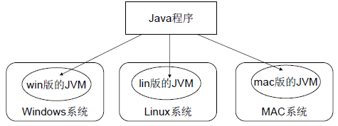

### JDK、JRE、JVM三者的关系

- **JDK**：Java开发工具包， JDK是提供给Java开发人员使用的，其中包含了`Java的开发工具`和`JRE`。其中的开发工具包括：`编译工具（javac.exe）`、`打包工具（jar.exe）`、`调试工具`等。
- **JRE**：Java运行环境， JRE包括`Java虚拟机`和`Java程序所需的核心类库`（如`java.lang`、`java.util`等），如果想要运行一个开发好的Java程序，计算机中只需要安装JRE即可。 
- **JVM**：Java虚拟机。 它负责将`.class`文件中的字节码进行识别并解释成特定平台机器码，并执行程序。JVM是Java能够跨平台的核心机制。它还提供了`内存管理`和`安全性`等相关功能。

简单来说，JDK 包含 JRE，JRE 包含 JVM。

### 为什么说Java是编译与解释共存的语言

在解释这个问题之前首先要知道什么是编译型语言和解释型语言

计算机是不能理解高级语言的，更不能直接执行高级语言，它只能执行机器语言，所以使用任何高级语言编写的程序若想被计算机运行，都必须将其转换成计算机语言，也就是机器码。而这种转换的方式有两种：

- 编译

- 解释


由此高级语言也分为编译型语言和解释型语言。

**编译型语言**：在程序执行之前，将源代码编译成字节码或者机器码，生成可执行文件。执行时直接运行编译后的代码，速度快，但跨平台性较差。

**解释型语言**：在程序执行时，逐行解释执行源代码，不生成独立的可执行文件。通常由解释器动态解释并执行代码，跨平台性好，但执行速度较慢。

典型的编译型语言如C、C++，典型的解释型语言如Python、JavaScript。

**Java为什么两者兼具**

- 源代码编译：首先，源代码被编译器编译成字节码。字节码是一种中间代码，平台无关。这一步骤是传统的编译过程。

- 字节码解释执行：编译后的字节码文件由JVM中的解释器逐条解释执行。解释器读取字节码，将其转换成对应平台的机器码并执行。
- 然而，Java 的执行机制并不止于此。为了提高执行效率，JVM还引入了即时编译器（JIT)，JIT 会在程序运行时监视字节码的执行情况，如果某段代码被频繁执行（即“热点代码”），JIT就会将这部分字节码编译成与当前平台对应的机器码，并缓存起来供后续直接使用。这个过程称为“即时编译”。

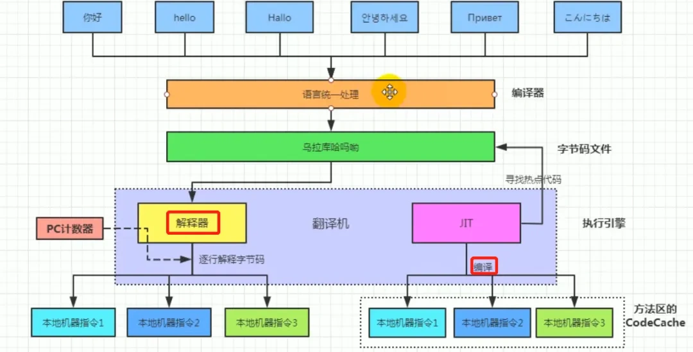

### Java和Python区别是什么

Java是一种编译+解释型语言，源代码先经过编译器编译成字节码，再由JVM解释执行或JIT编译优化。

Python是一种解释型语言，代码逐行解释执行（通过解释器如 CPython），无需编译为机器码。

## 数据类型

### 八种基本的数据类型

Java支持数据类型分为两类： 基本数据类型和引用数据类型。

基本的数据类型由八种，可以分为三类：

- 数值型：整数类型（byte、short、int、long）、浮点类型（double、float）
- 字符型：char
- 布尔型：boolean

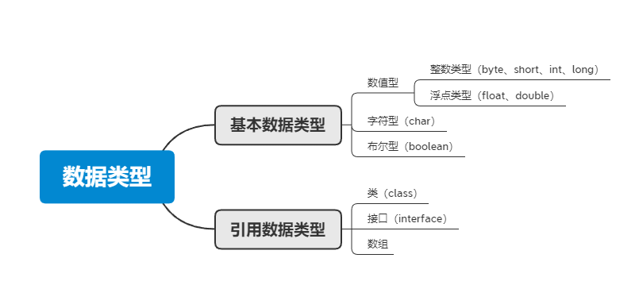

8种基本数据类型的默认值、位数、取值范围，如下表所示：

|     数据类型     | 位数 | 默认值 |     取值范围      |
| :--------------: | :--: | :----: | :---------------: |
|       byte       |  8   |   0    |  - 2^7 ~ 2^7 - 1  |
|      short       |  16  |   0    | - 2^15 ~ 2^15 - 1 |
|  **int(默认)**   |  32  |   0    | - 2^31 ~ 2^31 - 1 |
|       long       |  64  |   0    | - 2^63 ~ 2^63 - 1 |
|      float       |  32  |  0.0f  | - 2^31 ~ 2^31 - 1 |
| **double(默认)** |  64  |  0.0d  | - 2^63 ~ 2^63 - 1 |
|       char       |  16  |   空   |   0 ~ 2^15 - 1    |
|     boolean      |  8   | false  |    true、false    |

- Float和Double的最小值和最大值是以科学记数法的方式输出的，结尾的"E+数字"表示的是E前面的数字要乘以10的几次方。比如3.14E3表示的就是 3.14 x 10^3 = 3140，3.14E-3就是3.14 x 10^-3 = 0.00314
- 八种基本数据类型的字节数：1字节（byte，boolean）、2字节（short，char）、4字节（int、float）、8字节（long、double）
- 浮点数的默认类型是double，如果需要声明float类型的浮点数，需要在末尾加上f或F。整数的默认类型是int，声明long类型的整数，需要在末尾加上l或L
- char类型随时无符号的，所有取值范围从0开始

### long和int可以互转吗

可以的。但是`long`类型的取值范围比`int`类型大，所以`int`转`long`是安全的、`long`转`int`可能会导致数值丢失或溢出

`int`转`long`可以通过直接赋值实现：

```java
int intValue = 10;
long longValue = intValue; // 自动转换，安全的
```

`long`转`int`需要通过强制类型转换实现，但需要注意潜在的数值丢失或溢出问题：

```java
long longValue = 10;
int intValue = (int) longValue; // 强制类型转换，可能会有数据丢失或溢出
```

`long`转`int`时，如果`longValue`的数值超出`int`类型的范围，转换结果将是阶段后的地位部分

### 数据类型转换的方式

- 自动类型转换（隐式转换）：当目标类型的取值范围大于源类型，Java将会自动将源类型转换为目标类型，不需要任何显式的类型转换。比如，`int`转`long`，`float`转`double`等

- 强制类型转换（显式转换）：当目标类型的取值范围小于源类型，需要显式的强制类型转换，这可能会导致数值丢失或溢出。比如，`long`转`int`，`double`转`float`等。语法：

  ```
  目标类型 变量名 = (目标类型) 源类型变量
  ```

- 数据类型之间的转换：Java中提供了许多数据类型之间的转换方法，如将整型转换为字符型，将字符型转换为整型等，可以通过类型的包装类来实现，如`Integer`、`Character`等包装类都提供了相应的转换方法。

- 字符型转换：此外，还可以使用 `String.valueOf()` 方法将其他类型（包括对象）转换为字符串，反之使用 `Integer.parseInt()`, `Double.parseDouble()` 等将字符串转换为基本数据类型。

## 集合

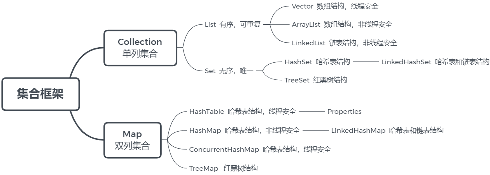

其中，比较高频会被问到的是

- ArrayList，ArrayList底层实现是数组
- LinkedList，LinkedList底层实现是双向链表
- HashMap，HashMap的底层实现使用了众多数据结构，包含了数组、链表、散列表、红黑树等
- ConcurrentHashMap，线程安全，但不是通过加锁实现的，效率也很高

> **面试官**：说一说Java提供的常见集合？（画一下集合结构图）
>
> **候选人**：
>
> 嗯~~，好的。
>
> 在java中提供了量大类的集合框架，主要分为两类：
>
> 第一个是Collection  属于单列集合，第二个是Map  属于双列集合
>
> - 在Collection中有两个子接口List和Set。在我们平常开发的过程中用的比较多像list接口中的实现类ArrarList和LinkedList。  在Set接口中有实现类HashSet和TreeSet。
> - 在map接口中有很多的实现类，平时比较常见的是HashMap、TreeMap，还有一个线程安全的map:ConcurrentHashMap

### 数组

数组（Array）是一种用**连续的存储空间**存储**相同数据类型**数据的线性数据结构。

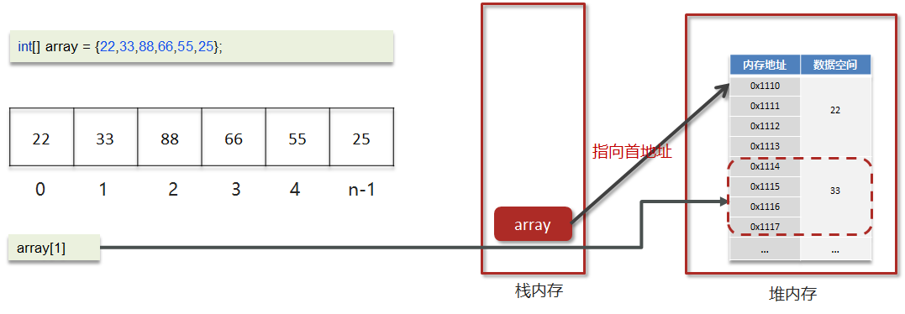

**寻址公式**

数组内元素的地址值是通过寻址公式计算得出的

```java
a[i] = baseAddress + i * dataTypeSize
```

- baseAddress： 数组的首地址
- dataTypeSize：代表数组中元素类型的大小，int型的数据，dataTypeSize=4个字节
- i：数组内元素的索引，从0开始

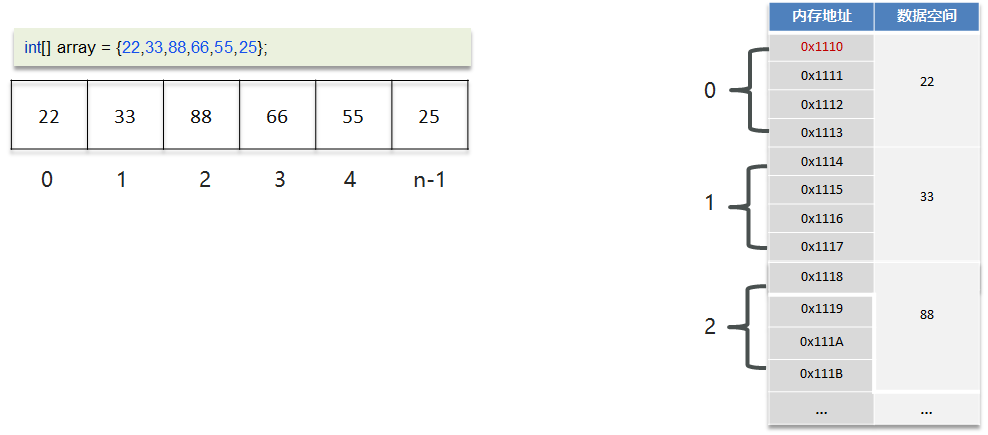

为什么 i 要从 0 开始，而不是从一开始？

如果从 1 开始，那么寻址公式将会变成这样

```java
a[i] = baseAddress + (i - 1) * dataTypeSize
```

因为数组内元素在内存是从`baseAddress`开始连续存储的，因此，第一个元素的首个地址值必定是baseAddress

而如果数组的索引从1开始，寻址公式中，就需要增加一次减法操作，才能从数组首地址baseAddress开始寻找数组内元素，对于CPU来说就多了一次指令，性能不高。

**操作数组的时间复杂度**

- 随机查询(根据索引查询)

数组元素的访问是通过下标来访问的，计算机通过数组的首地址和寻址公式能够很快速的找到想要访问的元素。

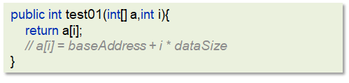

因此根据索引查询的时间复杂度是O(1)。

- 未知索引查询

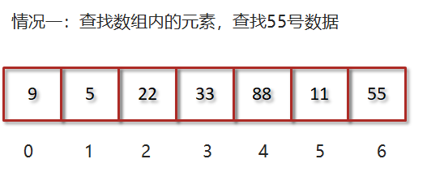

只能遍历数组对比，直到找到值为55的元素，时间复杂度是O(n)。

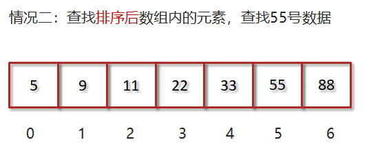

对数组排序后，可以使用二分查找寻找值为55的元素，时间复杂度是O(logn)。

- 插入和删除

数组是一段连续的内存空间，因此为了保证数组的连续性会使得数组的插入和删除的效率变的很低。

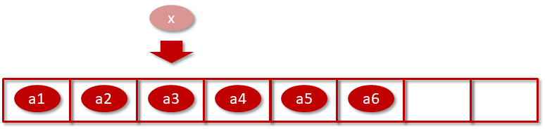

插入或删除元素的位置后的元素需要移位，如果是删除则是往前移动，插入则是往后移动。

因此最好情况下是O(1)的，在尾插和尾删时，最坏情况下是O(n)的，平均情况下的时间复杂度是O(n)。

### ArrayList

#### 源码分析

分析ArrayList源码主要从三个方面去翻阅：成员变量，构造函数，关键方法

> 以下源码都来源于jdk1.8

**成员变量**

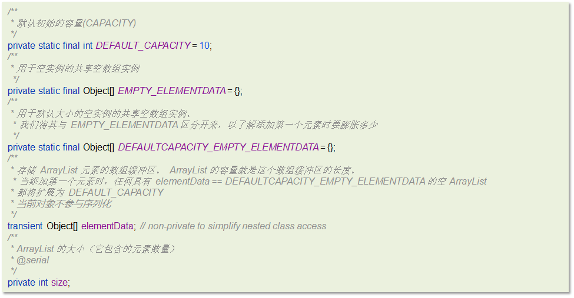

**构造函数**

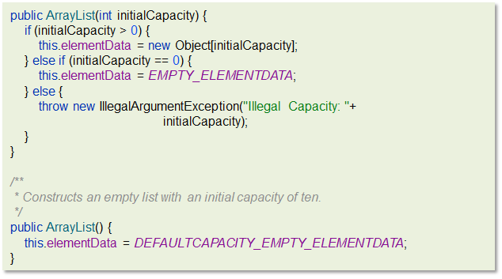

第一个构造是带初始化容量的构造函数，可以按照指定的容量初始化数组

第二个是无参构造函数，默认赋予同一个空集合`DEFAULTCAPACITY_EMPTY_ELEMENTDATA`

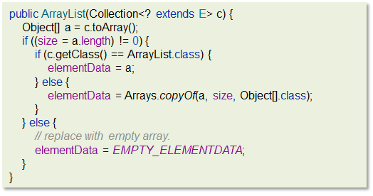

第三个是将collection对象转换成数组，然后将数组的地址的赋给elementData。

**关键方法**

add方法

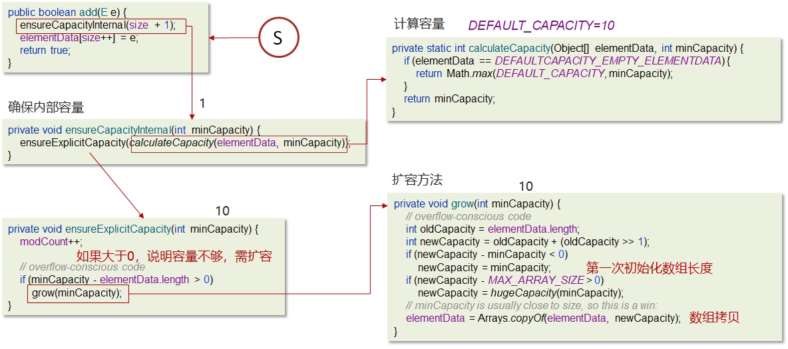

**结论**

- 底层数据结构

ArrayList底层是用动态的数组实现的

- 初始容量

ArrayList初始容量为0，当第一次添加数据的时候才会初始化容量为10

- 扩容逻辑

ArrayList在进行扩容的时候是原来容量的1.5倍，每次扩容都需要拷贝数组

- 添加逻辑

  确保数组已使用长度（size）加1之后足够存下下一个数据 

  计算数组的容量，如果当前数组已使用长度+1后的大于当前的数组长度，则调用grow方法扩容（原来的1.5倍）

  确保新增的数据有地方存储之后，则将新元素添加到位于size的位置上。

  返回添加成功布尔值。

> **面试官**：ArrayList底层是如何实现的？
>
> **候选人**：
>
> 嗯~，我阅读过arraylist的源码，我主要说一下add方法吧
>
> 第一：确保数组已使用长度（size）加1之后足够存下下一个数据 
>
> 第二：计算数组的容量，如果当前数组已使用长度+1后的大于当前的数组长度，则调用grow方法扩容（原来的1.5倍）
>
> 第三：确保新增的数据有地方存储之后，则将新元素添加到位于size的位置上。 
>
> 第四：返回添加成功布尔值。 

#### ArrayList list=new ArrayList(10)中的list扩容几次

该语句只是声明和实例了一个 ArrayList，指定了容量为 10，未扩容 ，如图


> **面试官**：ArrayList list=new ArrayList(10)中的list扩容几次
>
> **候选人**：
>
> ​	是new了一个ArrarList并且给了一个构造参数10，对吧？(问题一定要问清楚再答)
>
> **面试官**：是的
>
> **候选人**：
>
> ​    好的，在ArrayList的源码中提供了一个带参数的构造方法，这个参数就是指定的集合初始长度，所以给了一个10的参数，就是指定了集合的初始长度是10，这里面并没有扩容。

#### 如何实现数组和List之间的转换


数组转List，可以用Arrays.asList();

List转数组，可以用List里封装的toArray()方法，无参toArray方法返回 Object数组，传入初始化长度的数组对象，返回该对象数组

Arrays.asList转换list之后，如果修改了数组的内容，list会受影响，因为它的底层使用的Arrays类中的一个内部类ArrayList来构造的集合，在这个集合的构造器中，把我们传入的这个数组进行了包装而已，最终指向的都是同一个内存地址。

list用了toArray转数组后，如果修改了list内容，数组不会影响，当调用了toArray以后，在底层是它是进行了数组的拷贝，跟原来的元素就没啥关系了，所以即使list修改了以后，数组也不受影响。

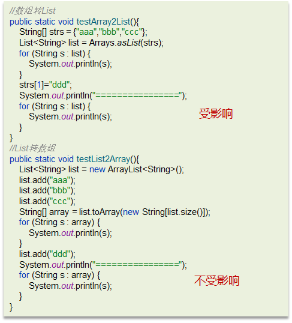

但需要注意的是，它是浅拷贝，也就是说，如果修改了数组里元素的内部状态，那么List里的元素也还是会受到影响。

```java
public static void main(String[] args) {
        ArrayList<List<Integer>> list = new ArrayList<>();
        List<Integer> x = new ArrayList<>();
        x.add(1);
        x.add(2);
        x.add(3);
        list.add(x);
    	// 一开始 list.get(0) = {1, 2, 3}
        List[] array = list.toArray(new List[3]);
        List l = array[0];
        // 修改数组里元素的内部状态, 添加元素 4
        l.add(4);
        for (Integer i : list.getFirst()) {
            // 输出list.get(0)内部元素 1, 2, 3, 4
            System.out.println(i);
        }
    }
```

> **面试官**：如何实现数组和List之间的转换
>
> **候选人**：
>
> ​	嗯，这个在我们平时开发很常见
>
> ​    数组转list，可以使用jdk自动的一个工具类Arrars，里面有一个asList方法可以转换为数组
>
> ​    List 转数组，可以直接调用list中的toArray方法，需要给一个参数，指定数组的类型，需要指定数组的长度。
>
> **面试官**：用Arrays.asList转List后，如果修改了数组内容，list受影响吗？List用toArray转数组后，如果修改了List内容，数组受影响吗
>
> **候选人**：
>
> Arrays.asList转换list之后，如果修改了数组的内容，list会受影响，因为它的底层使用的Arrays类中的一个内部类ArrayList来构造的集合，在这个集合的构造器中，把我们传入的这个集合进行了包装而已，最终指向的都是同一个内存地址
>
> list用了toArray转数组后，如果修改了list内容，数组不会影响，当调用了toArray以后，在底层是它是进行了数组的拷贝，跟原来的元素就没啥关系了，所以即使list修改了以后，数组也不受影响

### 链表

#### 单向链表

- 链表中的每一个元素称之为结点（Node）

- 物理存储单元上，非连续、非顺序的存储结构

- 每个结点包括两个部分：一个是存储数据元素的数据域，另一个是存储下一个结点地址的指针域。记录下个结点地址的指针叫作后继指针 next

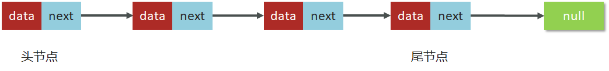

代码实现参考，链表中的某个节点为B，B的下一个节点为C，表示： B.next==C.next

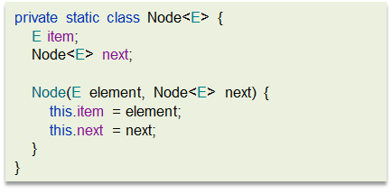

**时间复杂度分析**

- 查询

只有在查询头节点的时候不需要遍历链表，时间复杂度是O(1)

查询其他结点需要遍历链表，时间复杂度是O(n)

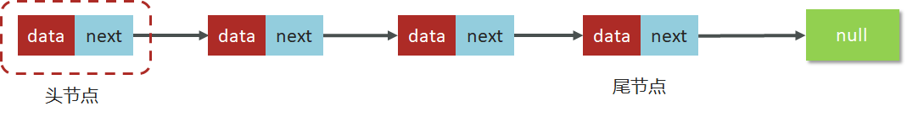

- 插入\删除操作

只有在添加和删除头节点的时候不需要遍历链表，时间复杂度是O(1)

添加或删除其他结点需要遍历链表找到对应节点后，才能完成新增或删除节点，时间复杂度是O(n)

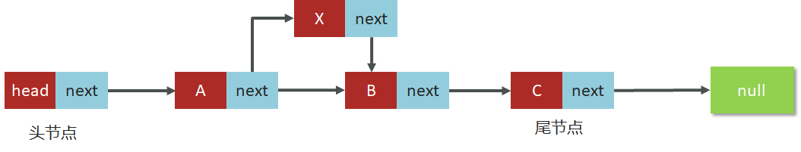

#### 双向链表

双向链表，顾名思义，它支持两个方向

- 每个结点不止有一个后继指针 next 指向后面的结点
- 有一个前驱指针 prev 指向前面的结点

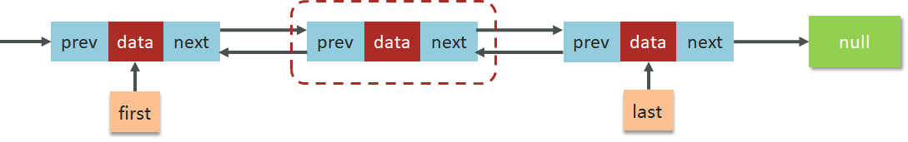

参考代码


对比单链表：

- 双向链表需要额外的两个空间来存储后继结点和前驱结点的地址
- 支持双向遍历，这样也带来了双向链表操作的灵活性

**时间复杂度分析**

- 查询

查询头尾结点的时间复杂度是O(1)

平均的查询时间复杂度是O(n)

给定节点找前驱节点的时间复杂度为O(1)

- 增删操作

头尾结点增删的时间复杂度为O(1)

其他部分结点增删的时间复杂度是 O(n)

给定节点增删的时间复杂度为O(1)

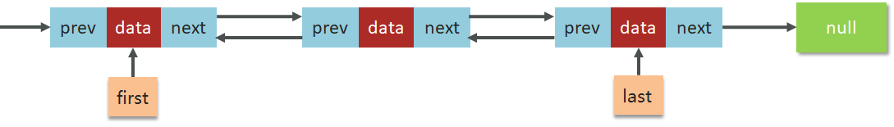

### LinkedList

LinkedList底层的数据结构就是双向链表

#### ArrayList 和 LinkedList 的区别是什么？

**底层数据结构**

- ArrayList 是动态数组的数据结构实现
- LinkedList 是双向链表的数据结构实现

**操作数据效率**

- ArrayList按照下标查询的时间复杂度O(1)【内存是连续的，根据寻址公式】， LinkedList不支持下标查询
- 查找（未知索引）： ArrayList需要遍历，链表也需要链表，时间复杂度都是O(n)

- ArrayList尾部插入和删除，时间复杂度是O(1)；其他部分增删需要挪动数组，时间复杂度是O(n)
- LinkedList头尾节点增删时间复杂度是O(1)，其他都需要遍历链表，时间复杂度是O(n)

**内存空间占用**

- ArrayList底层是数组，内存连续，节省内存
- LinkedList 是双向链表需要存储数据，和两个指针，更占用内存

> **面试官**：ArrayList 和 LinkedList 的区别是什么？
>
> **候选人**：
>
> 嗯，它们两个主要是底层使用的数据结构不一样，ArrayList 是动态数组，LinkedList 是双向链表，这也导致了它们很多不同的特点。
>
> 1，从操作数据效率来说
>
> ArrayList按照下标查询的时间复杂度O(1)【内存是连续的，根据寻址公式】， LinkedList不支持下标查询
>
> 查找（未知索引）： ArrayList需要遍历，链表也需要链表，时间复杂度都是O(n)
>
> 新增和删除
>
> - ArrayList尾部插入和删除，时间复杂度是O(1)；其他部分增删需要挪动数组，时间复杂度是O(n)
> - LinkedList头尾节点增删时间复杂度是O(1)，其他都需要遍历链表，时间复杂度是O(n)
>
> 2，从内存空间占用来说
>
> ArrayList底层是数组，内存连续，节省内存
>
> LinkedList 是双向链表需要存储数据，和两个指针，更占用内存
>
> 3，从线程安全来说，ArrayList和LinkedList都不是线程安全的

### 线程安全

ArrayList和LinkedList都不是线程安全的，如果需要保证线程安全，有两种方案：

- 在方法内使用，局部变量则是线程安全的
- 使用线程安全的ArrayList和LinkedList

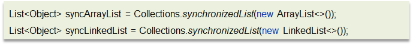

> **面试官**：嗯，好的，刚才你说了ArrayList 和 LinkedList 不是线程安全的，你们在项目中是如何解决这个的线程安全问题的？
>
> **候选人**：
>
> 嗯，是这样的，主要有两种解决方案：
>
> 第一：我们使用这个集合，优先在方法内使用，定义为局部变量，这样的话，就不会出现线程安全问题。
>
> 第二：如果非要在成员变量中使用的话，可以使用线程安全的集合来替代
>
> ArrayList可以通过Collections 的 synchronizedList 方法将 ArrayList 转换成线程安全的容器后再使用。
>
> LinkedList 换成ConcurrentLinkedQueue来使用

### 二叉树

#### 二叉树概述

二叉树，顾名思义，每个节点最多有两个“叉”，也就是两个子节点，分别是左子节点和右子节点。不过，二叉树并不要求每个节点都有两个子节点，有的节点只有左子节点，有的节点只有右子节点。

二叉树每个节点的左子树和右子树也分别满足二叉树的定义。

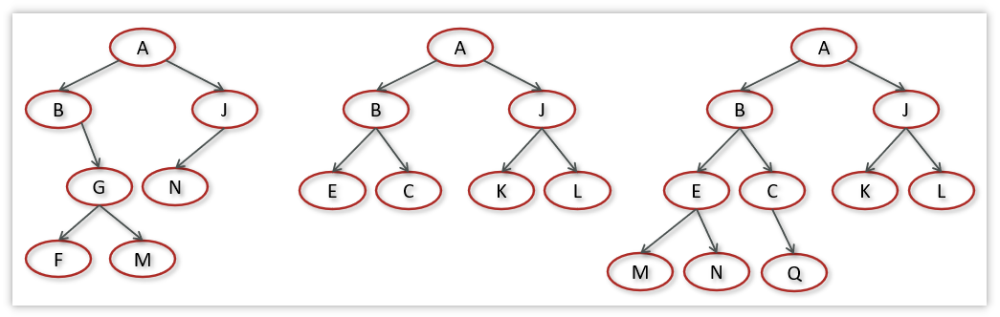

Java中有两个方式实现二叉树：数组存储，链式存储。

基于链式存储的树的节点可定义如下：


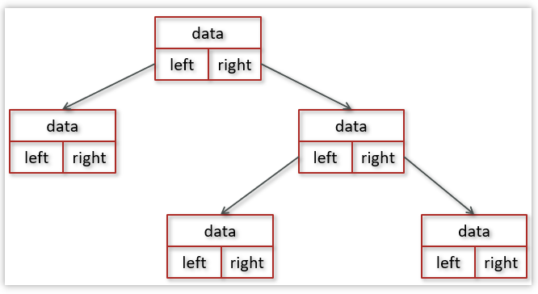

在二叉树中，比较常见的二叉树有：

- 满二叉树

- 完全二叉树

- **二叉搜索树**

- **红黑树**

#### 二叉搜索树

二叉搜索树(Binary Search Tree,BST)又名二叉查找树，有序二叉树或者排序二叉树，是二叉树中比较常用的一种类型

二叉查找树要求，在树中的任意一个节点，其左子树中的每个节点的值，都要小于这个节点的值，而右子树节点的值都大于这个节点的值


**二叉搜索树-时间复杂度分析**

实际上由于二叉查找树的形态各异，时间复杂度也不尽相同，我画了几棵树我们来看一下插入，查找，删除的时间复杂度

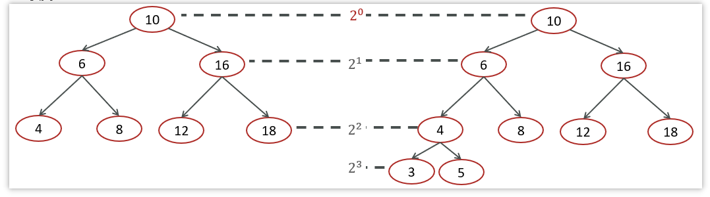

插入，查找，删除的时间复杂度**O(logn)**


极端情况下二叉搜索的时间复杂度


对于图中这种情况属于最坏的情况，二叉查找树已经退化成了链表，左右子树极度不平衡，此时查找的时间复杂度肯定是O(n)。

#### 红黑树

**红黑树（Red Black Tree）**：一种自平衡的二叉搜索树(BST)，之前叫做平衡二叉B树（Symmetric Binary B-Tree）


**红黑树的特质**

性质1：节点要么是**红色**,要么是**黑色**

性质2：根节点是**黑色**

性质3：叶子节点都是黑色的空节点

性质4：红黑树中红色节点的子节点都是黑色

性质5：从任一节点到叶子节点的所有路径都包含相同数目的黑色节点

**在添加或删除节点的时候，如果不符合这些性质会发生旋转，以达到所有的性质，保证红黑树的平衡**

红黑树的时间复杂度分析

- 查找：

  红黑树也是一棵BST（二叉搜索树）树，查找操作的时间复杂度为：O(log n)

- 添加：

  添加先要从根节点开始找到元素添加的位置，时间复杂度O(log n)

  添加完成后涉及到复杂度为O(1)的旋转调整操作

  故整体复杂度为：O(log n)

- 删除：

  首先从根节点开始找到被删除元素的位置，时间复杂度O(log n)

  删除完成后涉及到复杂度为O(1)的旋转调整操作

  故整体复杂度为：O(log n)

### 散列表

在HashMap中的最重要的一个数据结构就是散列表，在散列表中又使用到了红黑树和链表

#### 散列表（Hash Table）概述

散列表(Hash Table)又名哈希表/Hash表，是根据键（Key）直接访问在内存存储位置值（Value）的数据结构，它是由数组演化而来的，利用了数组支持按照下标进行随机访问数据的特性

举个例子：


假设有100个人参加马拉松，编号是1-100，如果要编程实现根据选手的编号迅速找到选手信息？


可以把选手信息存入数组中，选手编号就是数组的下标，数组的元素就是选手的信息。

当我们查询选手信息的时候，只需要根据选手的编号到数组中查询对应的元素就可以快速找到选手的信息，如下图：

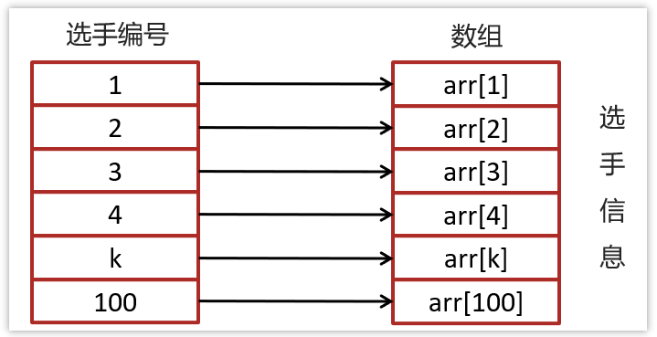

现在需求升级了：

假设有100个人参加马拉松，不采用1-100的自然数对选手进行编号，编号有一定的规则比如：2023ZHBJ001，其中2023代表年份，ZH代表中国，BJ代表北京，001代表原来的编号，那此时的编号2023ZHBJ001不能直接作为数组的下标，此时应该如何实现呢？

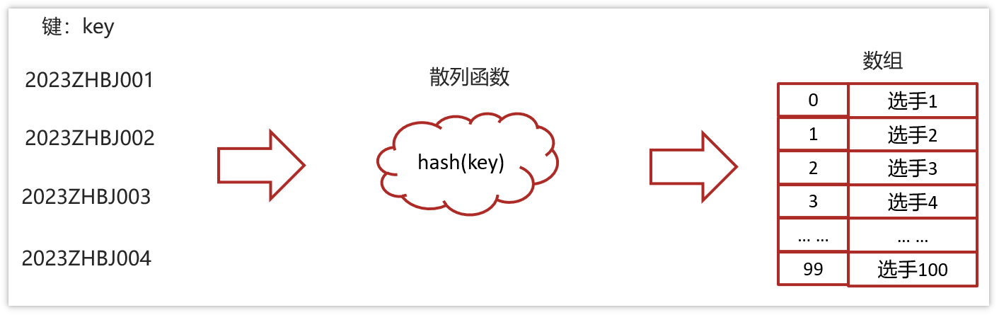

我们目前是把选手的信息存入到数组中，不过选手的编号不能直接作为数组的下标，不过，可以把选手的选号进行转换，转换为数值就可以继续作为数组的下标了？转换可以使用散列函数进行转换

#### 散列函数和散列冲突

将键(key)映射为数组下标的函数叫做散列函数。可以表示为：hashValue = hash(key)

散列函数的基本要求：

- 散列函数计算得到的散列值必须是大于等于0的正整数，因为hashValue需要作为数组的下标。

- 如果key1==key2，那么经过hash后得到的哈希值也必相同即：hash(key1) == hash(key2）

- **如果key1 != key2，那么经过hash后得到的哈希值也必不相同即：hash(key1) != hash(key2)**


实际的情况下想找一个散列函数能够做到对于不同的key计算得到的散列值都不同几乎是不可能的，即便像著名的MD5,SHA等哈希算法也无法避免这一情况，这就是散列冲突(或者哈希冲突，哈希碰撞，**就是指多个key映射到同一个数组下标位置**)


#### 散列冲突-链表法（拉链）

在散列表中，数组的每个下标位置我们可以称之为桶（bucket）或者槽（slot），每个桶(槽)会对应一条链表，所有散列值相同的元素我们都放到相同槽位对应的链表中。


简单就是，如果有多个key最终的hash值是一样的，就会存入数组的同一个下标中，下标中挂一个链表存入多个数据

#### 时间复杂度-散列表

插入操作，通过散列函数计算出对应的散列槽位，将其插入到对应链表中即可，插入的时间复杂度是 O(1)


>通过计算就可以找到元素

当查找、删除一个元素时，我们同样通过散列函数计算出对应的槽，然后遍历链表查找或者删除

- 平均情况下基于链表法解决冲突时查询的时间复杂度是O(1)

- 散列表可能会退化为链表,查询的时间复杂度就从 O(1) 退化为 O(n)

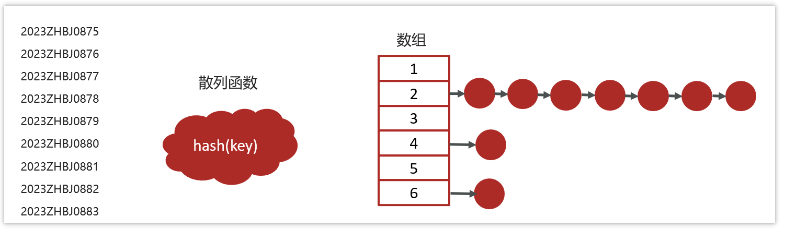

- 将链表法中的链表改造为其他高效的动态数据结构，比如红黑树，查询的时间复杂度是 O(logn)


将链表法中的链表改造红黑树还有一个非常重要的原因，可以防止DDos攻击

>DDos 攻击:
>
>分布式拒绝服务攻击(英文意思是Distributed Denial of Service，简称DDoS）
>
>指处于不同位置的多个攻击者同时向一个或数个目标发动攻击，或者一个攻击者控制了位于不同位置的多台机器并利用这些机器对受害者同时实施攻击。由于攻击的发出点是分布在不同地方的，这类攻击称为分布式拒绝服务攻击，其中的攻击者可以有多个

### HashMap

#### 说一下HashMap的实现原理？

HashMap的数据结构： 底层使用hash表数据结构，即数组和链表或红黑树

- 当我们往HashMap中put元素时，利用key的hashCode重新hash计算出当前对象的元素在数组中的下标 

- 存储时，如果出现hash值相同的key，此时有两种情况：

    a. 如果key相同，则覆盖原始值；

    b. 如果key不同（出现冲突），则将当前的key-value放入链表或红黑树中 

获取时，直接找到hash值对应的下标，在进一步判断key是否相同，从而找到对应值。


> **面试官**：说一下HashMap的实现原理？
>
> **候选人**：
>
> ​	嗯。它主要分为了一下几个部分：
>
> 1，底层使用hash表数据结构，即数组+（链表 | 红黑树）
>
> 2，添加数据时，计算key的值确定元素在数组中的下标
>
> ​	key相同则替换
>
> ​	不同则存入链表或红黑树中
>
> 3，获取数据通过key的hash计算数组下标获取元素

#### HashMap的jdk1.7和jdk1.8有什么区别？

- JDK1.8之前采用的是拉链法。拉链法：将链表和数组相结合。也就是说创建一个链表数组，数组中每一格就是一个链表。若遇到哈希冲突，则将冲突的值加到链表中即可。

- jdk1.8在解决哈希冲突时有了较大的变化，当链表长度大于阈值（默认为8） 时并且数组长度达到64时，将链表转化为红黑树，以减少搜索时间。扩容 resize( ) 时，红黑树拆分成的树的结点数小于等于临界值6个，则退化成链表

> **面试官**：HashMap的jdk1.7和jdk1.8有什么区别
>
> **候选人**：
>
> - JDK1.8之前采用的拉链法，数组+链表
>
> - JDK1.8之后采用数组+链表+红黑树，链表长度大于8且数组长度大于64则会从链表转化为红黑树

### HashMap的put方法的具体流程

#### HashMap常见属性

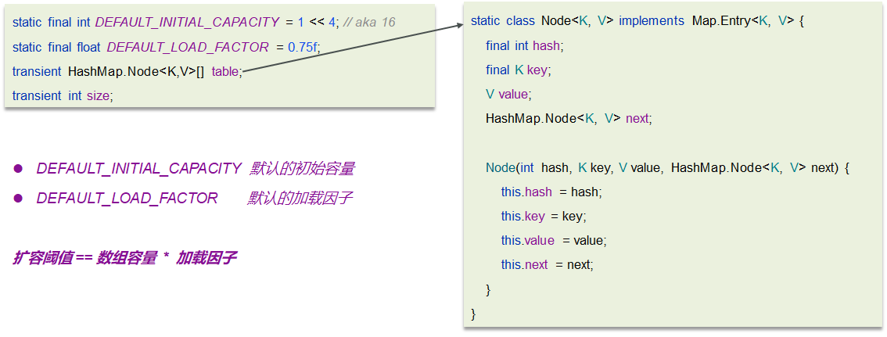

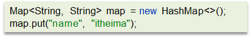

- HashMap是懒惰加载，在创建对象时并没有初始化数组
- 在无参的构造函数中，设置了默认的加载因子是0.75

#### put方法的具体流程图

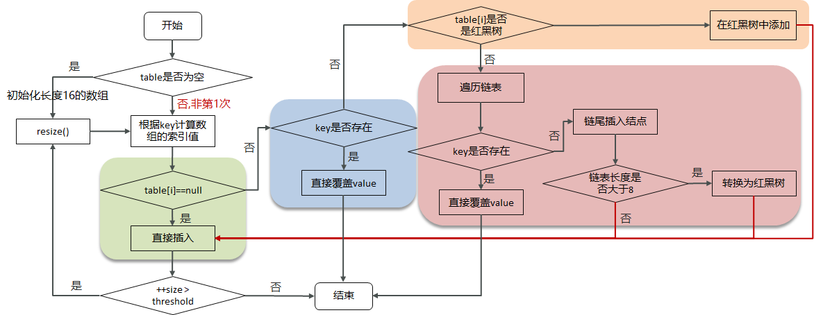

具体的源码：

```java
public V put(K key, V value) {
    return putVal(hash(key), key, value, false, true);
}

final V putVal(int hash, K key, V value, boolean onlyIfAbsent,
                   boolean evict) {
    Node<K,V>[] tab; Node<K,V> p; int n, i;
    //判断数组是否未初始化
    if ((tab = table) == null || (n = tab.length) == 0)
        //如果未初始化，调用resize方法 进行初始化
        n = (tab = resize()).length;
    //通过 & 运算求出该数据（key）的数组下标并判断该下标位置是否有数据
    if ((p = tab[i = (n - 1) & hash]) == null)
        //如果没有，直接将数据放在该下标位置
        tab[i] = newNode(hash, key, value, null);
    //该数组下标有数据的情况
    else {
        Node<K,V> e; K k;
        //判断该位置数据的key和新来的数据是否一样
        if (p.hash == hash &&
            ((k = p.key) == key || (key != null && key.equals(k))))
            //如果一样，证明为修改操作，该节点的数据赋值给e,后边会用到
            e = p;
        //判断是不是红黑树
        else if (p instanceof TreeNode)
            //如果是红黑树的话，进行红黑树的操作
            e = ((TreeNode<K,V>)p).putTreeVal(this, tab, hash, key, value);
        //新数据和当前数组既不相同，也不是红黑树节点，证明是链表
        else {
            //遍历链表
            for (int binCount = 0; ; ++binCount) {
                //判断next节点，如果为空的话，证明遍历到链表尾部了
                if ((e = p.next) == null) {
                    //把新值放入链表尾部
                    p.next = newNode(hash, key, value, null);
                    //因为新插入了一条数据，所以判断链表长度是不是大于等于8
                    if (binCount >= TREEIFY_THRESHOLD - 1) // -1 for 1st
                        //如果是，进行转换红黑树操作
                        treeifyBin(tab, hash);
                    break;
                }
                //判断链表当中有数据相同的值，如果一样，证明为修改操作
                if (e.hash == hash &&
                    ((k = e.key) == key || (key != null && key.equals(k))))
                    break;
                //把下一个节点赋值为当前节点
                p = e;
            }
        }
        //判断e是否为空（e值为修改操作存放原数据的变量）
        if (e != null) { // existing mapping for key
            //不为空的话证明是修改操作，取出老值
            V oldValue = e.value;
            //一定会执行  onlyIfAbsent传进来的是false
            if (!onlyIfAbsent || oldValue == null)
                //将新值赋值当前节点
                e.value = value;
            afterNodeAccess(e);
            //返回老值
            return oldValue;
        }
    }
    //计数器，计算当前节点的修改次数
    ++modCount;
    //当前数组中的数据数量如果大于扩容阈值
    if (++size > threshold)
        //进行扩容操作
        resize();
    //空方法
    afterNodeInsertion(evict);
    //添加操作时 返回空值
    return null;
}
```

1. 判断键值对数组table是否为空或为null，否则执行resize()进行扩容（初始化）

2. 根据键值key计算hash值得到数组索引

3. 判断table[i]==null，条件成立，直接新建节点添加

4. 如果table[i]==null ,不成立

   4.1 判断table[i]的首个元素是否和key一样，如果相同直接覆盖value

   4.2 判断table[i] 是否为treeNode，即table[i] 是否是红黑树，如果是红黑树，则直接在树中插入键值对

   4.3 遍历table[i]，链表的尾部插入数据，然后判断链表长度是否大于8，大于8的话把链表转换为红黑树，在红黑树中执行插入操 作，遍历过程中若发现key已经存在直接覆盖value

5. 插入成功后，判断实际存在的键值对数量size是否超多了最大容量threshold（数组长度*0.75），如果超过，进行扩容。

> **面试官**：好的，你能说下HashMap的put方法的具体流程吗？
>
> **候选人**：
>
> 嗯好的。
>
> 1. 判断键值对数组table是否为空或为null，否则执行resize()进行扩容（初始化）
>
> 2. 根据键值key计算hash值得到数组索引
>
> 3. 判断table[i]==null，条件成立，直接新建节点添加
>
> 4. 如果table[i]==null ,不成立
>
>   4.1 判断table[i]的首个元素是否和key一样，如果相同直接覆盖value
>
>   4.2 判断table[i] 是否为treeNode，即table[i] 是否是红黑树，如果是红黑树，则直接在树中插入键值对
>
>   4.3 遍历table[i]，链表的尾部插入数据，然后判断链表长度是否大于8，大于8的话把链表转换为红黑树，在红黑树中执行插入操 作，遍历过程中若发现key已经存在直接覆盖value
>
> 5. 插入成功后，判断实际存在的键值对数量size是否超多了最大容量threshold（数组长度*0.75），如果超过，进行扩容。

### HashMap的扩容机制

#### 扩容流程图

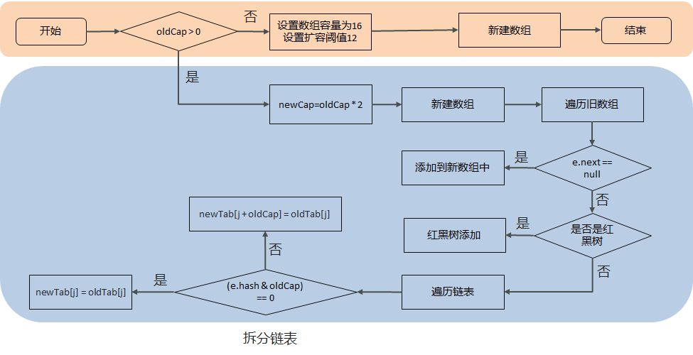

源码：

```java
//扩容、初始化数组
final Node<K,V>[] resize() {
        Node<K,V>[] oldTab = table;
    	//如果当前数组为null的时候，把oldCap老数组容量设置为0
        int oldCap = (oldTab == null) ? 0 : oldTab.length;
        //老的扩容阈值
    	int oldThr = threshold;
        int newCap, newThr = 0;
        //判断数组容量是否大于0，大于0说明数组已经初始化
    	if (oldCap > 0) {
            //判断当前数组长度是否大于最大数组长度
            if (oldCap >= MAXIMUM_CAPACITY) {
                //如果是，将扩容阈值直接设置为int类型的最大数值并直接返回
                threshold = Integer.MAX_VALUE;
                return oldTab;
            }
            //如果在最大长度范围内，则需要扩容  OldCap << 1等价于oldCap*2
            //运算过后判断是不是最大值并且oldCap需要大于16
            else if ((newCap = oldCap << 1) < MAXIMUM_CAPACITY &&
                     oldCap >= DEFAULT_INITIAL_CAPACITY)
                newThr = oldThr << 1; // double threshold  等价于oldThr*2
        }
    	//如果oldCap<0，但是已经初始化了，像把元素删除完之后的情况，那么它的临界值肯定还存在，       			如果是首次初始化，它的临界值则为0
        else if (oldThr > 0) // initial capacity was placed in threshold
            newCap = oldThr;
        //数组未初始化的情况，将阈值和扩容因子都设置为默认值
    	else {               // zero initial threshold signifies using defaults
            newCap = DEFAULT_INITIAL_CAPACITY;
            newThr = (int)(DEFAULT_LOAD_FACTOR * DEFAULT_INITIAL_CAPACITY);
        }
    	//初始化容量小于16的时候，扩容阈值是没有赋值的
        if (newThr == 0) {
            //创建阈值
            float ft = (float)newCap * loadFactor;
            //判断新容量和新阈值是否大于最大容量
            newThr = (newCap < MAXIMUM_CAPACITY && ft < (float)MAXIMUM_CAPACITY ?
                      (int)ft : Integer.MAX_VALUE);
        }
    	//计算出来的阈值赋值
        threshold = newThr;
        @SuppressWarnings({"rawtypes","unchecked"})
        //根据上边计算得出的容量 创建新的数组       
    	Node<K,V>[] newTab = (Node<K,V>[])new Node[newCap];
    	//赋值
    	table = newTab;
    	//扩容操作，判断不为空证明不是初始化数组
        if (oldTab != null) {
            //遍历数组
            for (int j = 0; j < oldCap; ++j) {
                Node<K,V> e;
                //判断当前下标为j的数组如果不为空的话赋值个e，进行下一步操作
                if ((e = oldTab[j]) != null) {
                    //将数组位置置空
                    oldTab[j] = null;
                    //判断是否有下个节点
                    if (e.next == null)
                        //如果没有，就重新计算在新数组中的下标并放进去
                        newTab[e.hash & (newCap - 1)] = e;
                   	//有下个节点的情况，并且判断是否已经树化
                    else if (e instanceof TreeNode)
                        //进行红黑树的操作
                        ((TreeNode<K,V>)e).split(this, newTab, j, oldCap);
                    //有下个节点的情况，并且没有树化（链表形式）
                    else {
                        //比如老数组容量是16，那下标就为0-15
                        //扩容操作*2，容量就变为32，下标为0-31
                        //低位：0-15，高位16-31
                        //定义了四个变量
                        //        低位头          低位尾
                        Node<K,V> loHead = null, loTail = null;
                        //        高位头		   高位尾
                        Node<K,V> hiHead = null, hiTail = null;
                        //下个节点
                        Node<K,V> next;
                        //循环遍历
                        do {
                            //取出next节点
                            next = e.next;
                            //通过 与操作 计算得出结果为0
                            if ((e.hash & oldCap) == 0) {
                                //如果低位尾为null，证明当前数组位置为空，没有任何数据
                                if (loTail == null)
                                    //将e值放入低位头
                                    loHead = e;
                                //低位尾不为null，证明已经有数据了
                                else
                                    //将数据放入next节点
                                    loTail.next = e;
                                //记录低位尾数据
                                loTail = e;
                            }
                            //通过 与操作 计算得出结果不为0
                            else {
                                 //如果高位尾为null，证明当前数组位置为空，没有任何数据
                                if (hiTail == null)
                                    //将e值放入高位头
                                    hiHead = e;
                                //高位尾不为null，证明已经有数据了
                                else
                                    //将数据放入next节点
                                    hiTail.next = e;
                               //记录高位尾数据
                               	hiTail = e;
                            }
                            
                        } 
                        //如果e不为空，证明没有到链表尾部，继续执行循环
                        while ((e = next) != null);
                        //低位尾如果记录的有数据，是链表
                        if (loTail != null) {
                            //将下一个元素置空
                            loTail.next = null;
                            //将低位头放入新数组的原下标位置
                            newTab[j] = loHead;
                        }
                        //高位尾如果记录的有数据，是链表
                        if (hiTail != null) {
                            //将下一个元素置空
                            hiTail.next = null;
                            //将高位头放入新数组的(原下标+原数组容量)位置
                            newTab[j + oldCap] = hiHead;
                        }
                    }
                }
            }
        }
    	//返回新的数组对象
        return newTab;
    }
```

- 在添加元素或初始化的时候需要调用resize方法进行扩容，第一次添加数据初始化数组长度为16，以后每次每次扩容都是达到了扩容阈值（数组长度 * 0.75）

- 每次扩容的时候，都是扩容之前容量的2倍； 

- 扩容之后，会新创建一个数组，需要把老数组中的数据挪动到新的数组中
  - 没有hash冲突的节点，则直接使用 e.hash & (newCap - 1) 计算新数组的索引位置
  - 如果是红黑树，走红黑树的添加
  - 如果是链表，则需要遍历链表，可能需要拆分链表，判断(e.hash & oldCap)是否为0，该元素的位置要么停留在原始位置，要么移动到原始位置+增加的数组大小这个位置上

> **面试官**：好的，刚才你多次介绍了hsahmap的扩容，能讲一讲HashMap的扩容机制吗？
>
> **候选人**：
>
> 好的
>
> - 在添加元素或初始化的时候需要调用resize方法进行扩容，第一次添加数据初始化数组长度为16，以后每次每次扩容都是达到了扩容阈值（数组长度 * 0.75）
>
> - 每次扩容的时候，都是扩容之前容量的2倍； 
>
> - 扩容之后，会新创建一个数组，需要把老数组中的数据挪动到新的数组中
>  - 没有hash冲突的节点，则直接使用 e.hash & (newCap - 1) 计算新数组的索引位置
>  - 如果是红黑树，走红黑树的添加
>  - 如果是链表，则需要遍历链表，可能需要拆分链表，判断(e.hash & oldCap)是否为0，该元素的位置要么停留在原始位置，要么移动到原始位置+增加的数组大小这个位置上

### hashMap的寻址算法

#### 分析

在putVal方法中，有一个hash(key)方法，这个方法就是来去计算key的hash值的。首先获取key的hashCode值，然后右移16位 异或运算 原来的hashCode值，主要作用就是使原来的hash值更加均匀，减少hash冲突，有了hash值之后，就很方便的去计算当前key的在数组中存储的下标，(n-1) & hash : 得到数组中的索引，代替取模，性能更好，数组长度必须是2的n次幂。

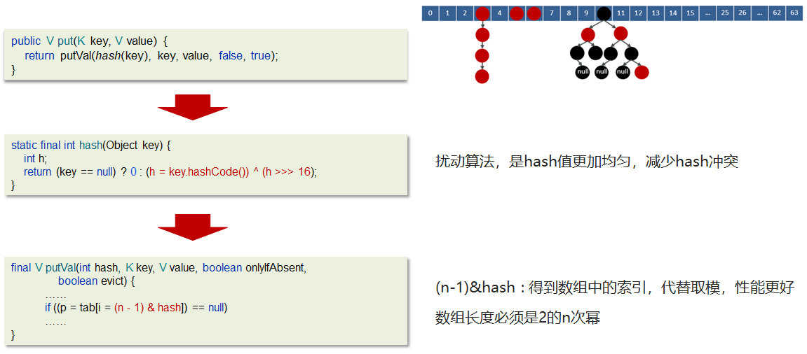

> **面试官**：好的，刚才你说的通过hash计算后找到数组的下标，是如何找到的呢，你了解hashMap的寻址算法吗？
>
> **候选人**：
>
> 这个哈希方法首先计算出key的hashCode值，然后通过这个hash值右移16位后的二进制进行按位**异或运算**得到最后的hash值。
>
> 在putValue的方法中，计算数组下标的时候使用hash值与数组长度取模得到存储数据下标的位置，hashmap为了性能更好，并没有直接采用取模的方式，而是使用了数组长度-1 得到一个值，用这个值按位与运算hash值，最终得到数组的位置。

#### 为何HashMap的数组长度一定是2的次幂？

- 计算索引时效率更高：如果是 2 的 n 次幂可以使用位与运算代替取模
- 扩容时重新计算索引效率更高： hash & oldCap == 0 的元素留在原来位置 ，否则新位置 = 旧位置 + oldCap，而且扩容后的新数组容量也可以用 旧数组容量 >>> 1 得到，也就是位运算，比普通运算效率更高。

> **面试官**：为何HashMap的数组长度一定是2的次幂？
>
> **候选人**：
>
> 嗯，好的。hashmap这么设计主要有两个原因：
>
> 第一：
>
> 计算索引时效率更高：如果是 2 的 n 次幂可以使用位与运算代替取模
>
> 第二：
>
> 扩容时重新计算索引效率更高：在进行扩容是会进行判断 hash值按位与运算旧数组长租是否 == 0 
>
> 如果等于0，则把元素留在原来位置 ，否则新位置是等于旧位置的下标+旧数组长度

### hashmap在1.7情况下的多线程死循环问题

jdk7的的数据结构是：数组+链表

在数组进行扩容的时候，因为链表是头插法，在进行数据迁移的过程中，有可能导致死循环

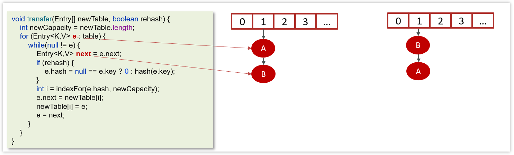

- 变量e指向的是需要迁移的对象

- 变量next指向的是下一个需要迁移的对象

- Jdk1.7中的链表采用的头插法

- 在数据迁移的过程中并没有新的对象产生，只是改变了对象的引用


产生死循环的过程：

线程1和线程2的变量e和next都引用了这个两个节点

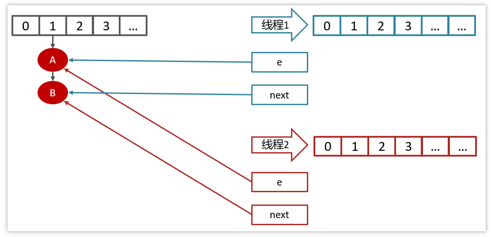

线程2扩容后，由于头插法，链表顺序颠倒，但是线程1的临时变量e和next还引用了这两个节点


第一次循环

由于线程2迁移的时候，已经把B的next执行了A

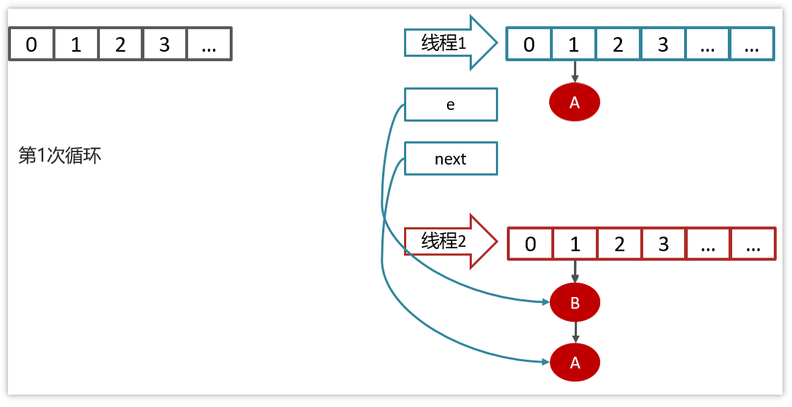

第二次循环


第三次循环


在jdk1.7的hashmap中在数组进行扩容的时候，因为链表是头插法，在进行数据迁移的过程中，有可能导致死循环

比如说，现在有两个线程

线程一：读取到当前的hashmap数据，数据中一个链表，在准备扩容时，线程二介入

线程二：也读取hashmap，直接进行扩容。因为是头插法，链表的顺序会进行颠倒过来。比如原来的顺序是AB，扩容后的顺序是BA，线程二执行结束。

线程一：继续执行的时候就会出现死循环的问题。

线程一先将A移入新的链表，再将B插入到链头，由于另外一个线程的原因，B的next指向了A，

所以B->A->B,形成循环。

当然，JDK 8 将扩容算法做了调整，不再将元素加入链表头（而是保持与扩容前一样的顺序），**尾插法**，就避免了jdk7中死循环的问题。

> **面试官**：好的，我看你对hashmap了解的挺深入的，你知道hashmap在1.7情况下的多线程死循环问题吗？
>
> **候选人**：
>
> 嗯，知道的。是这样
>
> jdk7的的数据结构是：数组+链表
>
> 在数组进行扩容的时候，因为链表是**头插法**，在进行数据迁移的过程中，有可能导致死循环
>
> 比如说，现在有两个线程
>
> 线程一：**读取**到当前的hashmap数据，数据中一个链表，在准备扩容时，线程二介入
>
> 线程二也读取hashmap，直接进行扩容。因为是头插法，链表的顺序会进行颠倒过来。比如原来的顺序是AB，扩容后的顺序是BA，线程二执行结束。
>
> 当线程一再继续执行的时候就会出现死循环的问题。
>
> 线程一先将A移入新的链表，再将B插入到链头，由于另外一个线程的原因，B的next指向了A，所以B->A->B,形成循环。
>
> 当然，JDK 8 将扩容算法做了调整，不再将元素加入链表头（而是保持与扩容前一样的顺序），**尾插法**，就避免了jdk7中死循环的问题。
>
> **面试官**：好的，hashmap是线程安全的吗？
>
> **候选人**：不是线程安全的
>
> **面试官**：那我们想要使用线程安全的map该怎么做呢？
>
> **候选人**：我们可以采用ConcurrentHashMap进行使用，它是一个线程安全的HashMap
>
> **面试官**：那你能聊一下ConcurrentHashMap的原理吗？
>
> **候选人**：好的，请参考《多线程相关面试题》中的ConcurrentHashMap部分的讲解

### HashSet与HashMap的区别

- HashSet实现了Set接口, 仅存储对象; HashMap实现了 Map接口, 存储的是键值对.

- HashSet底层其实是用HashMap实现存储的, HashSet封装了一系列HashMap的方法. 依靠HashMap来存储元素值,(利用hashMap的key键进行存储), 而value值默认为Object对象. 所以HashSet也不允许出现重复值, 判断标准和HashMap判断标准相同, 两个元素的hashCode相等并且通过equals()方法返回true.

> **面试官**：HashSet与HashMap的区别？
>
> **候选人**：嗯，是这样。
>
> HashSet底层其实是用HashMap实现存储的, HashSet封装了一系列HashMap的方法. 依靠HashMap来存储元素值,(利用hashMap的key键进行存储), 而value值默认为Object对象. 所以HashSet也不允许出现重复值, 判断标准和HashMap判断标准相同, 两个元素的hashCode相等并且通过equals()方法返回true.

### HashTable与HashMap的区别

主要区别：

| **区别**       | **HashTable**                  | **HashMap**      |
| -------------- | ------------------------------ | ---------------- |
| 数据结构       | 数组+链表                      | 数组+链表+红黑树 |
| 是否可以为null | Key和value都不能为null         | 可以为null       |
| hash算法       | key的hashCode()                | 二次hash         |
| 扩容方式       | 当前容量翻倍 +1                | 当前容量翻倍     |
| 线程安全       | 同步(synchronized)的，线程安全 | 非线程安全       |

在实际开中不建议使用HashTable，在多线程环境下可以使用ConcurrentHashMap类

> **面试官**：HashTable与HashMap的区别
>
> **候选人**：
>
> 嗯，他们的主要区别是有几个吧
>
> 第一，数据结构不一样，hashtable是数组+链表，hashmap在1.8之后改为了数组+链表+红黑树
>
> 第二，hashtable存储数据的时候都不能为null，而hashmap是可以的
>
> 第三，hash算法不同，hashtable是用本地修饰的hashcode值，而hashmap经常了二次hash
>
> 第四，扩容方式不同，hashtable是当前容量翻倍+1，hashmap是当前容量翻倍
>
> 第五，hashtable是线程安全的，操作数据的时候加了锁synchronized，hashmap不是线程安全的，效率更高一些
>
> 在实际开中不建议使用HashTable，在多线程环境下可以使用ConcurrentHashMap类