# 消息中间件

## RabbitMQ

### RabbitMQ如何保证消息不丢失?

**MQ的使用场景**

- 异步发送（验证码、短信、邮件…）
- MYSQL和Redis , ES之间的数据同步
- 分布式事务
- 削峰填谷
- …

像这些场景，都需要MQ具备高可用性，最基础的也就是保证消息不丢失，那如何做到呢？

下面是一个消息从发送到被消费的正常过程，消息在传递的过程中，在哪一个环节有可能丢失消息呢？注意！在哪一个环节都有可能丢失。

**生产者确认机制**

RabbitMQ中提供了publish confirm 机制来确认消息成功到达MQ的队列中，如果消息成功到达队列中，返回的是`ack publish-confirm`标识给消费者，当然，在这个过程中有两个地方可能会发送消息失败，一个是从生产者发送到交换机失败，一个是从交换机路由到队列失败，它们会返回不同的提示信息，如图。

消息失败之后如何处理呢？

- 回调方法即时重发
- 记录日志
- 如果还是失败，保存到数据库然后定时重发，成功发送后即刻删除表中的数据
- 如果还是失败，就只能交给人工解决了

**消息持久化**

MQ默认是内存存储消息，开启持久化功能可以确保缓存在MQ中的消息不丢失。

- 交换机持久化：

- 队列持久化：

- 消息持久化，SpringAMQP中的的消息默认是持久的，可以通过MessageProperties中的DeliveryMode来指定

**消费者确认机制**

RabbitMQ支持消费者确认机制，即：消费者处理消息后可以向MQ发送ack回执，MQ收到ack回执后才会删除该消息。而SpringAMQP则允许配置三种确认模式：

- manual：手动ack，需要在业务代码结束后，调用api发送ack。
- auto：自动ack，由spring监测listener代码是否出现异常，没有异常则返回ack；抛出异常则返回nack
- none：关闭ack，MQ假定消费者获取消息后会成功处理，因此消息投递后立即被删除

相应的，可以在配置文件中开启配置失败重试策略

> **面试官：RabbitM**Q-如何保证消息不丢失
>
> **候选人**：
>
> 嗯！我们当时MYSQL和Redis的数据双写一致性就是采用RabbitMQ实现同步的，这里面就要求了消息的高可用性，我们要保证消息的不丢失。主要从三个层面考虑
>
> 第一个是开启生产者确认机制，确保生产者的消息能到达队列，如果报错可以先记录到日志中，再去修复数据
>
> 第二个是开启持久化功能，确保消息未消费前在队列中不会丢失，其中的交换机、队列、和消息都要做持久化
>
> 第三个是开启消费者确认机制为auto，由spring确认消息处理成功后完成ack，当然也需要设置一定的重试次数，我们当时设置了3次，如果重试3次还没有收到消息，就将失败后的消息投递到异常交换机，交由人工处理

### RabbitMQ消息的重复消费问题

发生重复消费问题的场景：

- 网络抖动
- 消费者处理完业务逻辑后还未向MQ发送ack就宕机了，造成MQ中消息未正常删除

这也是个典型的幂等性问题，可以参考幂等性问题的解决方案。

比如说唯一标识（适用于新增操作）：

其他方案：

每条消息设置一个唯一的标识id

- 消费者监听到消息后获取id，先去查询这个id是否存中
- 如果不存在，则正常消费消息，并把消息的id存入 数据库或者redis中，这个操作注意要和其他业务逻辑具有原子性，失败一起失败，成功一起成功
- 如果存在则丢弃此消息

幂等方案：【 分布式锁、数据库锁（悲观锁、乐观锁） 。。。】

> **面试官**：RabbitMQ消息的重复消费问题如何解决的
>
> **候选人**：
>
> 嗯，这个我们还真遇到过，是这样的，我们当时消费者是设置了自动确认机制，当服务还没来得及给MQ确认的时候，服务宕机了，导致服务重启之后，又消费了一次消息。这样就重复消费了
>
> 因为我们当时处理的支付（订单|业务唯一标识），它有一个业务的唯一标识，我们再处理消息时，先到数据库查询一下，这个数据是否存在，如果不存在，说明没有处理过，这个时候就可以正常处理这个消息了。如果已经存在这个数据了，就说明消息重复消费了，我们就不需要再消费了
>
> **面试官**：那你还知道其他的解决方案吗？
>
> **候选人**：
>
> 嗯，我想想~
>
> 其实这个就是典型的幂等的问题，比如，redis分布式锁、数据库的锁都是可以的

### RabbitMQ的延迟队列

RabbitMQ中的延迟队列是由**死信交换机** + **TTL（消息存活时间）**实现的。

主要的应用场景有：超时订单、限时优惠、定时发布

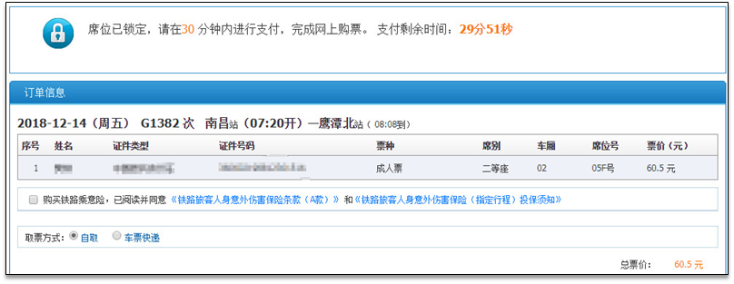

**死信交换机**

当一个队列中的消息出现以下情况，会成为死信：

- 消费者返回`basic.reject`或者`basic.nack`声明消息消费失败，并且消息的requeue参数设置为false
- 消息过期无人消费
- 队列中堆满消息，后续再有消息发来，最早的消息可能会成为死信

如果该队列配置了dead-letter-exchange属性，指定了一个交换机，那么队列中的死信就会投递到这个交换机中，而这个交换机称为死信交换机（Dead Letter Exchange，简称DLX）。

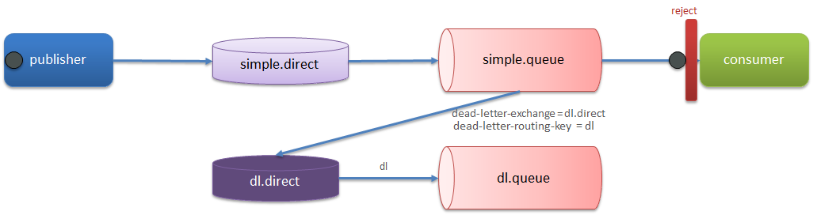

在创建队列时指定死信交换机

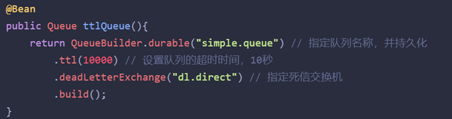

**TTL**

TTL，也就是Time-To-Live。如果一个队列中的消息TTL结束仍未消费，则会变为死信，ttl超时分为两种情况：

- 消息所在的队列设置了存活时间
- 消息本身设置了存活时间
- 以最小的为准

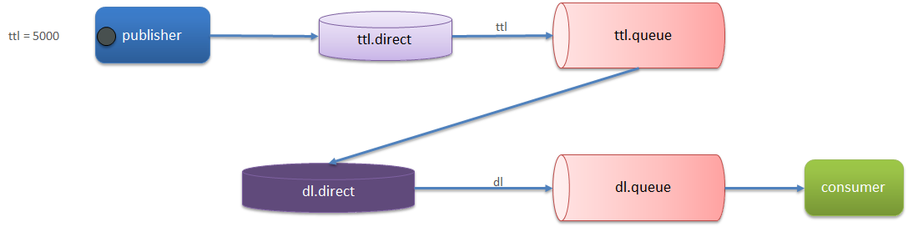

在消息本身设置存活时间：

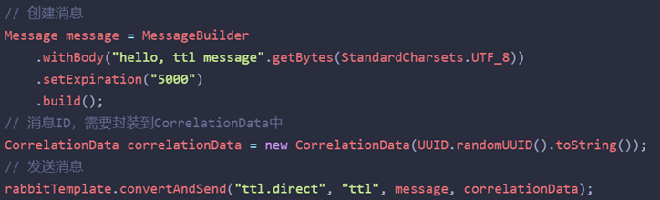

**延迟队列插件**

除死信交换机外，还可以安装插件实现延迟队列功能

DelayExchange插件，需要安装在RabbitMQ中

RabbitMQ有一个官方的插件社区，地址为：https://www.rabbitmq.com/community-plugins.html 

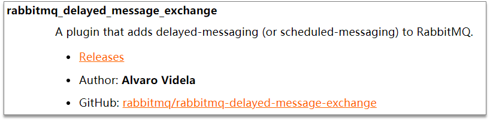

DelayExchange的本质还是官方的三种交换机，只是添加了延迟功能。因此使用时只需要声明一个交换机，交换机的类型可以是任意类型，然后设定delayed属性为true即可。

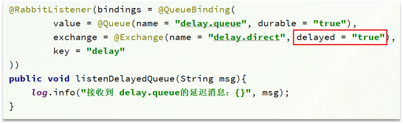

在创建消息时需要传递`x-delay`参数，设置延迟时间。

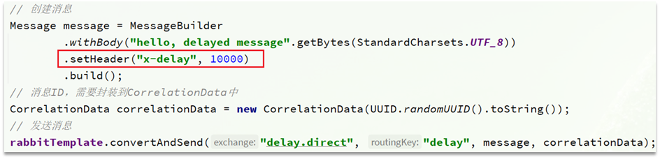

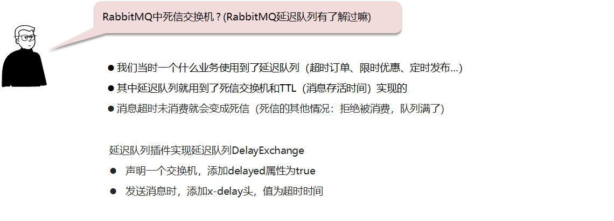

> **面试官**：RabbitMQ中死信交换机 ? （RabbitMQ延迟队列有了解过嘛）
>
> **候选人**：
>
> 嗯！了解过！
>
> 我们当时的xx项目有一个xx业务，需要用到延迟队列，其中就是使用RabbitMQ来实现的。
>
> 延迟队列就是用到了死信交换机和TTL（消息存活时间）实现的。
>
> 如果消息超时未消费就会变成死信，在RabbitMQ中如果消息成为死信，队列可以绑定一个死信交换机，在死信交换机上可以绑定其他队列，在我们发消息的时候可以按照需求指定TTL的时间，这样就实现了延迟队列的功能了。
>
> 我记得RabbitMQ还有一种方式可以实现延迟队列，在RabbitMQ中安装一个死信插件，这样更方便一些，我们只需要在声明交互机的时候，指定这个就是死信交换机，然后在发送消息的时候直接指定超时时间就行了，相对于死信交换机+TTL要省略了一些步骤

### RabbitMQ如果有100万消息堆积在MQ , 如何解决？

当生产者发送消息的速度超过了消费者消费消息的速度，队列中的消息堆积到容量上限，就会造成消息成为死信，可能会被丢弃，这就是**消息堆积问题**。

解决**消息堆积问题**主要有三种思路：

- 增加消费者的数量
- 消费者开启多线程提高消费消息的速率
- 扩大队列容量，提高容量上限

**惰性队列（扩大容量）**

惰性队列的特征如下：

- 接收到消息直接存入磁盘而非内存
- 消费者需要消费消息时从磁盘中加载到内存
- 支持数百万条消息堆积

开启方式如下：

在创建队列时，添加`lazy`属性

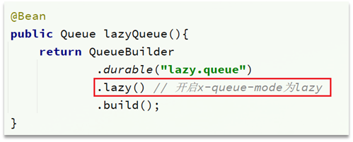

如果是注解方式创建队列，则比较麻烦，需要传递如图参数。

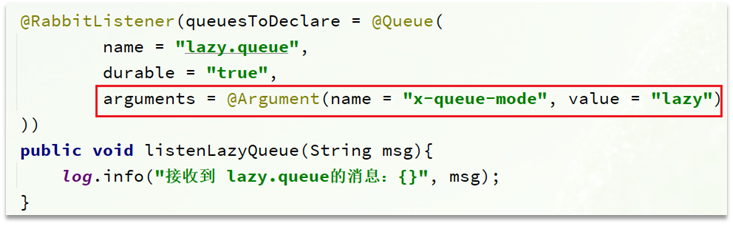

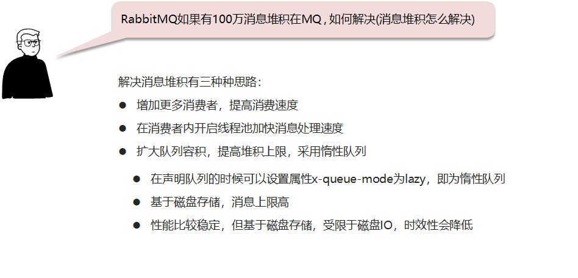

> **面试官**：如果有100万消息堆积在MQ , 如何解决 ?
>
> **候选人**：
>
> 我在实际的开发中，没遇到过这种情况，不过，如果发生了堆积的问题，解决方案也所有很多的
>
> 第一:提高消费者的消费能力 ,可以使用多线程消费任务
>
> 第二：增加更多消费者，提高消费速度 
>
> ​			 使用工作队列模式, 设置多个消费者消费消费同一个队列中的消息
>
> 第三：扩大队列容积，提高堆积上限 
>
> 可以使用RabbitMQ惰性队列，惰性队列的好处主要是
>
> ①接收到消息后直接存入磁盘而非内存
>
> ②消费者要消费消息时才会从磁盘中读取并加载到内存
>
> ③支持数百万条的消息存储

### RabbitMQ的高可用机制

在生产环境下，可以使用集群来保证RabbitMQ的高可用性。

RabbitMQ的集群有三种模式：、

- 标准集群
- 镜像集群
- 仲裁队列

**标准集群**

标准集群具备以下特征：

- 会在集群的各个节点之间共享部分信息，包括交换机、队列、绑定关系等元信息，但不包括队列中的消息。
- 当访问集群某节点（入口节点），但对应队列不在这个节点，该访问请求会被路由到队列所在节点处理，然后通过入口节点将结果返回给用户。

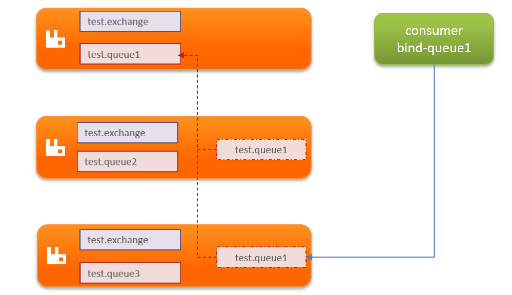

这种模式存在一个问题，如图，假如节点一宕机了，那么节点一中存储的所有消息就都会丢失。

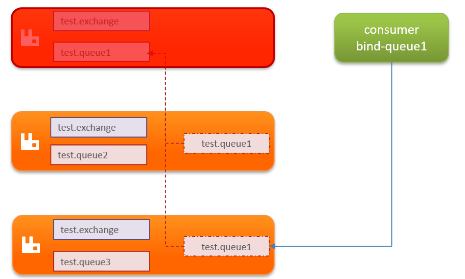

**镜像集群**

这种集群本质上只主从模式，只不过它的主从是相对的。具备以下特征：

- 交换机、队列、绑定关系、队列中的消息都会在各个节点之间同步备份
- 创建队列的节点称为该队列的主节点，其他节点会维护一份该队列的镜像，称为该队列的镜像节点。有多少个节点维护镜像，取决于HA策略
- 一个队列的主节点可能是另一个队列的镜像节点
- 针对该队列的所有操作都由主节点执行，然后将数据同步给镜像节点
- 主节点宕机后，每个备份了该队列的镜像节点都有机会成为该队列的主节点

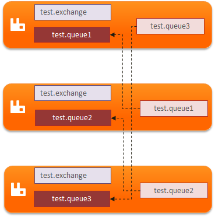

**仲裁队列**

仲裁队列：仲裁队列是3.8版本以后才有的新功能，用来替代镜像队列，具备下列特征：

- 与镜像队列一样，都是主从模式，支持主从数据同步
- 使用非常简单，没有复杂的配置
- 主从同步基于Raft协议，强一致

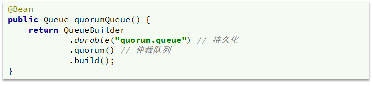

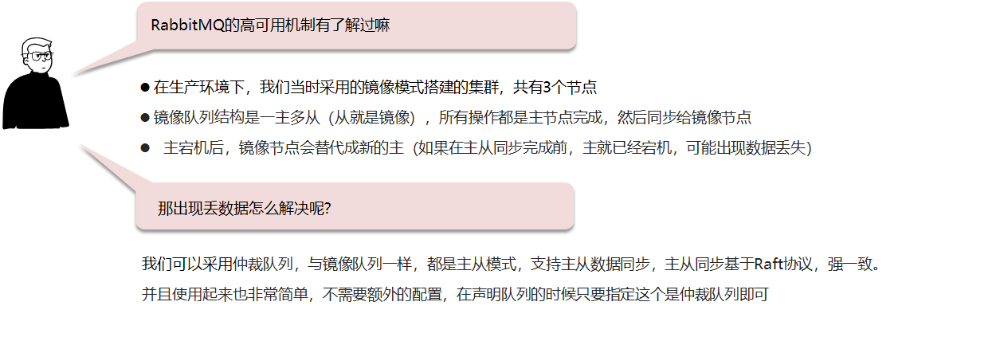

> **面试官**：RabbitMQ的高可用机制有了解过嘛
>
> **候选人**：
>
> 嗯，熟悉的~
>
> 我们当时项目在生产环境下，使用的集群，当时搭建是镜像模式集群，使用了3台机器。
>
> 镜像队列结构是一主多从，所有操作都是主节点完成，然后同步给镜像节点，如果主节点宕机后，镜像节点会替代成新的主节点，不过在主从同步完成前，主节点就已经宕机，可能出现数据丢失
>
> **面试官**：那出现丢数据怎么解决呢？
>
> **候选人**：
>
> 我们可以采用仲裁队列，与镜像队列一样，都是主从模式，支持主从数据同步，主从同步基于Raft协议，强一致。
>
> 并且使用起来也非常简单，不需要额外的配置，在声明队列的时候只要指定这个是仲裁队列即可

## Kafka

### Kafka如何保证消息不丢失

下面是一个简单的Kafka架构图，其中producer是生产者，broker可以理解为一个Kafka节点，topic是存储消息的地方，一般它会有很多个分区（partition)，consumer则是消费者。

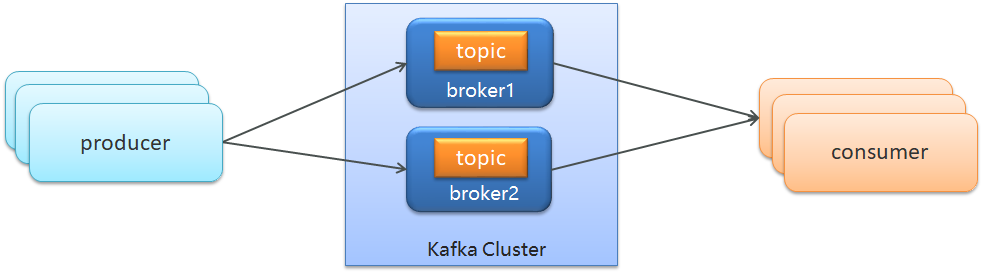

使用Kafka在消息的收发过程都会出现消息丢失 ：

- 生产者发送消息到Brocker丢失
- 消息在Brocker中存储丢失
- 消费者从Brocker接收消息丢失

针对这些情况，Kafka给出了不同的解决方案。

**生产者发送消息到Brocker丢失**

Kafka中发送消息有两种方式；同步和异步。同步会阻塞，异步是非阻塞。

发送消息失败也分为两种方式进行处理：

如果是同步的话，我们利用`try..catch`捕获异常即可

如果是异步的话，`Kafka`中异步发送消息提供了回调函数，我们可以在回调函数中编写消息发送失败的处理逻辑，比如说重新发送消息，但注意防止无限重试。

其中`RecordMetadata`中封装了消息的一些信息，比如说它的分区，偏移量，还有topic，`Exception`则是发送消息异常，如果发送消息成功，`Exception = null`。

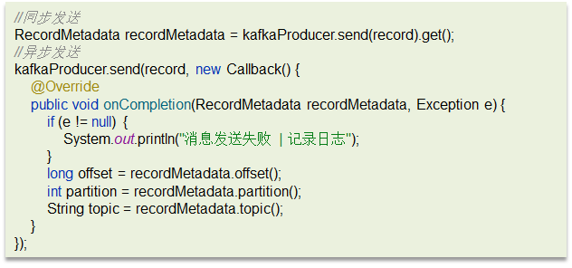

其实Kafka中也已经给我们提供好了生产者消息重试机制了，具体操作可以在配置文件或配置类中配置Kafka。但它是针对可重试异常而言的，比如说网络抖动，所以前面提到的异常捕获和回调函数可以作为一种补偿手段。

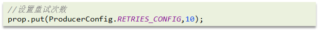

**消息在Brocker中存储丢失**

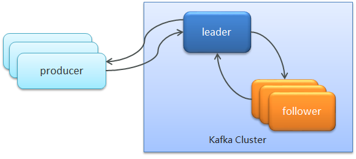

一般来说，topic是会有多个分区的，分区里面是有多个副本的，副本也会在不同brocker中，而分区里面的副本又会分为两个角色，一个是leader，一个分区中只会有一个，一个是follower，一个分区中可能会有多个。消息的收发由leader完成，leader收发数据后，会同步更新给follower。如果leader崩溃了，follower就可以承担leader的责任了，消息丢失的风险其实也不大。

Kafka不同于RabbitMQ，RabbitMQ默认写内存，而Kafka是顺序写入磁盘的，所以理论上Kafka的数据不会有丢失风险。但是，不出意外的话就要出意外，在消息在Brocker中进行传递同步时，它是会有丢失风险的。从生产者发送给leader，leader同步给follower，这两个过程都有消息丢失的风险。

这里先了解一个概念：

**ISR：**同步副本集，跟上了Leader 写入进度、保持与 Leader 数据一致的副本集合，只有处于 ISR 中的 Follower 副本才有资格参与 Leader 选举。

在Kafka中，有一个发送确认机制，它规定了三个发送确认策略：

| **确认机制**     | **说明**                                                     |
| ---------------- | ------------------------------------------------------------ |
| acks=0           | 生产者在成功写入消息之前不会等待任何来自服务器的响应,消息有丢失的风险，但是速度最快 |
| acks=1（默认值） | 只要集群首领节点收到消息，生产者就会收到一个来自服务器的成功响应 |
| acks=all         | 只有 ISR 副本都写入收到的消息后，生产者才会收到一个来自服务器的成功响应 |

这个acks是个参数，可以在项目配置文件中配置。

**消费者从Brocker接收消息丢失**

Kafka 中的分区机制指的是将每个topic划分成多个分区（Partition）,并且这些分区有可能在不同的brocker中。topic的每个分区中消息只能由同一个消费者组中的一个消费者处理。

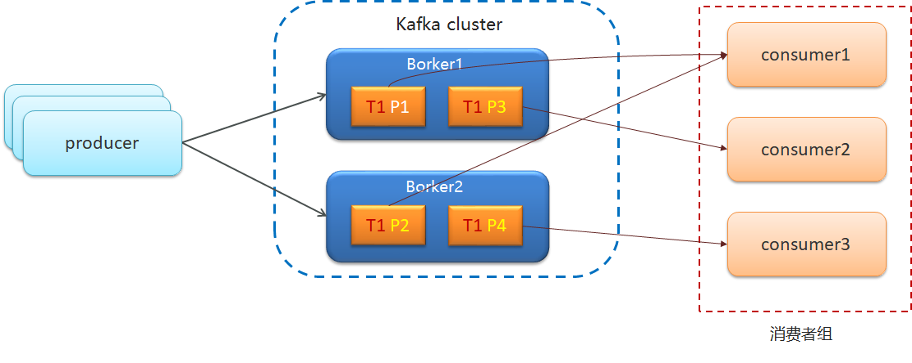

分区内的消息是有序的，并且每个消息具有一个在分区中唯一的偏移量，每个分区都是按照偏移量存储数据的。

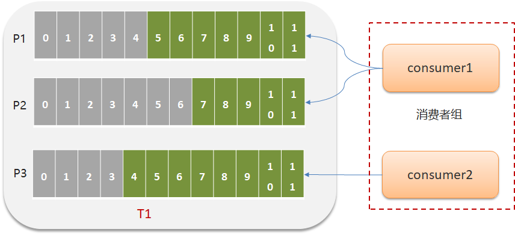

消费者默认是自动按期提交已经消费的偏移量，默认是每隔5s提交一次。提交的偏移量与消费的消息量（收到的消息）有关，与业务处理是否成功无关，也就是说，消费者只要“消费了”消息（拉取到消息后），即使业务逻辑失败，偏移量也可能已经提交了，导致消息丢失风险。

如果出现重平衡的情况，可能会**重复消费**或**丢失消息。

比如说，消费者2崩溃了，消费者1接手消费者2的分区，但在之前，消费者2已经消费到偏移量5了，但提交的偏移量只有3，因为消费者提交已经消费的偏移量是由时间空袭的，不是强一致，这时候消费者1就会从偏移量3的地方开始消费消息，这就导致**重复消费**了。

比如说，消费者2消费了消息，然后提交了对应偏移量，但在业务没正常处理完成之前，宕机了，这时候可能提交的偏移量是5，但实际处理完的偏移量只有3，消费者2宕机后消费者1接收分区，但它会从提交的偏移量5处开始消费消息，这就导致丢失消息了。

如何解决：

禁用自动提交偏移量，改为手动。业务逻辑成功了，才提交偏移量。

Kafka中提供了两种手动提交的方式：异步提交和同步提交。

异步提交有提交失败风险，但同步提交会阻塞。

一般项目中可以才有异步提交+同步提交的方案最大化提高性能。

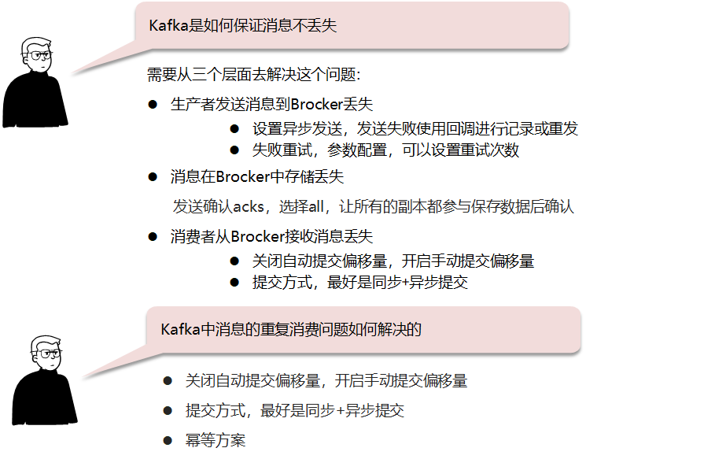

> **面试官**：Kafka是如何保证消息不丢失
>
> **候选人**：
>
> 嗯，这个保证机制很多，在发送消息到消费者接收消息，在每个阶段都有可能会丢失消息，所以我们解决的话也是从多个方面考虑
>
> 第一个是生产者发送消息的时候，可以使用异步回调发送，如果消息发送失败，我们可以通过回调获取失败后的消息信息，可以考虑重试或记录日志，后边再做补偿都是可以的。同时在生产者这边还可以设置消息重试，有的时候是由于网络抖动的原因导致发送不成功，就可以使用重试机制来解决
>
> 第二个在broker中消息有可能会丢失，我们可以通过kafka的复制机制来确保消息不丢失，在生产者发送消息的时候，可以设置一个acks，就是确认机制。我们可以设置参数为all，这样的话，当生产者发送消息到了分区之后，不仅仅只在leader分区保存确认，在follwer分区也会保存确认，只有当所有的副本都保存确认以后才算是成功发送了消息，所以，这样设置就很大程度了保证了消息不会在broker丢失
>
> 第三个有可能是在消费者端丢失消息，kafka消费消息都是按照offset进行标记消费的，消费者默认是自动按期提交已经消费的偏移量，默认是每隔5s提交一次，如果出现重平衡的情况，可能会重复消费或丢失数据。我们一般都会禁用掉自动提价偏移量，改为手动提交，当消费成功以后再报告给broker消费的位置，这样就可以避免消息丢失和重复消费了
>
> **面试官**：Kafka中消息的重复消费问题如何解决的
>
> **候选人**：
>
> kafka消费消息都是按照offset进行标记消费的，消费者默认是自动按期提交已经消费的偏移量，默认是每隔5s提交一次，如果出现重平衡的情况，可能会重复消费或丢失数据。我们一般都会禁用掉自动提价偏移量，改为手动提交，当消费成功以后再报告给broker消费的位置，这样就可以避免消息丢失和重复消费了
>
> 为了消息的幂等，我们也可以设置唯一主键来进行区分，或者是加锁，数据库的锁，或者是redis分布式锁，都能解决幂等的问题

### Kafka如何保证消息消费的顺序性

应用场景：

- 即时消息中的单对单聊天和群聊，保证发送方消息发送顺序与接收方的顺序一致
- 充值转账两个渠道在同一个时间进行余额变更，短信通知必须要有顺序

正常情况下，Kafka并不能保证消息消费的顺序性，因为同一个topic可能会被分发到不同分区，在不同分区内的消息顺序是没有联系的，因此解决思路就是把要保证消息消费的顺序性的业务消息都存储进同一个分区里，因为同一个分区内的消息是有序的，且同一个分区只能由消费者组中的一个消费者消费。

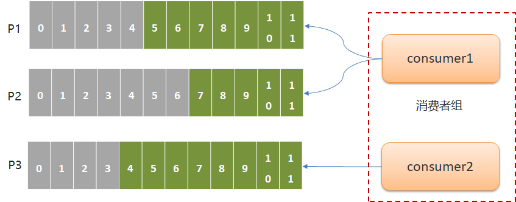

可以通过以下两种方式实现：

- 指定同一个分区序号
- 指定同一个key，如果指定了key，消息就会按照key的哈希值分发到不同分区，如果指定了同一个key，哈希值肯定也是一样的，消息也自然会在同一个分区里了。

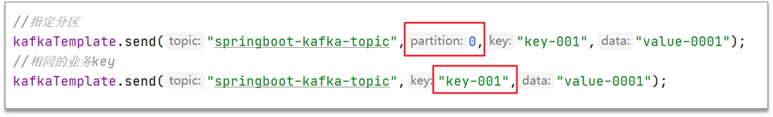

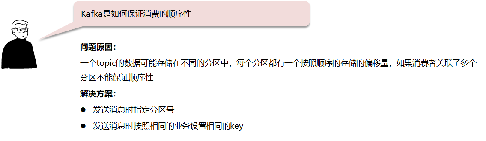

>**面试官**：Kafka是如何保证消费的顺序性
>
>**候选人**：
>
>kafka默认存储和消费消息，是不能保证顺序性的，因为一个topic数据可能存储在不同的分区中，每个分区都有一个按照顺序的存储的偏移量，如果消费者关联了多个分区不能保证顺序性
>
>如果有这样的需求的话，我们是可以解决的，把消息都存储同一个分区下就行了，有两种方式都可以进行设置，第一个是发送消息时指定分区号，第二个是发送消息时按照相同的业务设置相同的key，因为默认情况下分区也是通过key的hashcode值来选择分区的，hash值如果一样的话，分区肯定也是一样的

### Kafka的高可用机制

谈到高可用，就应该想到集群。

**集群模式**

其实 Kafka 是“天然集群”的分布式系统，Kafka 的服务器端由被称为 Broker 的服务进程构成，即一个 Kafka 集群由多个 Broker 组成。这样如果集群中某一台机器宕机，其他机器上的 Broker 也依然能够对外提供服务。这其实就是 Kafka 提供高可用的手段之一。

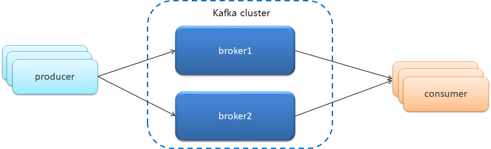

**分区备份机制**

Kafka中一个topic有多个分区，一个分区有多个副本，其中，只有一个是leader副本，其余的都是follower副本。

同一个分区的不同副本它们存储的数据是一样的，但是这多个副本会被存储到不同的broker中，这就是Kafka实现高可用的关键。如果leader副本所在的broker宕机了，那么，就会从**ISR副本**中挑选一个出来成为新的leader。这就能保证，即使某一个broker宕机了，Kafka集群中的其他broker也能对外提供完整的正常服务。

那问题就来了，什么是**ISR副本**呢？

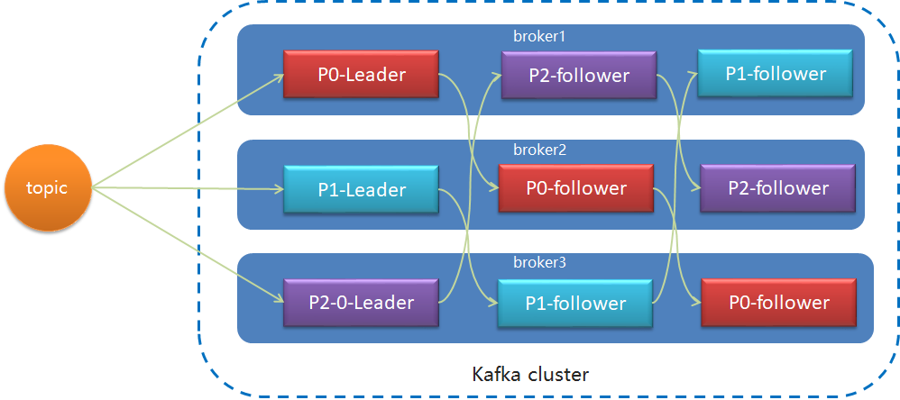

**ISR副本**

ISR（in-sync replica）指的是需要跟leader同步复制保存的follower

普通副本的话只会异步复制保存

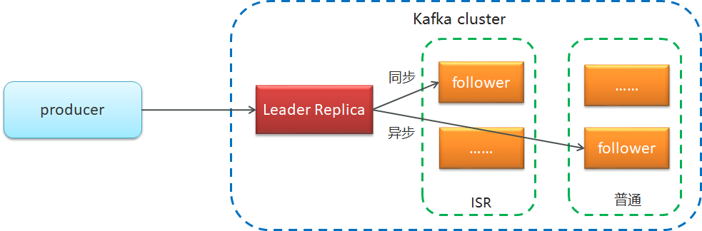

如果leader失效后，需要选出新的leader，选举的原则如下：

第一：选举时优先从ISR中选定，因为这个列表中follower的数据是与leader同步的

第二：如果ISR列表中的follower都不行了，就只能从其他follower中选取

ISR的数量可以在项目的配置文件中配置，一般不建议设置太多个，因为同步复制是比较消耗性能的，但也至少要设置一个。

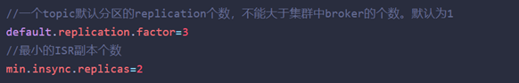

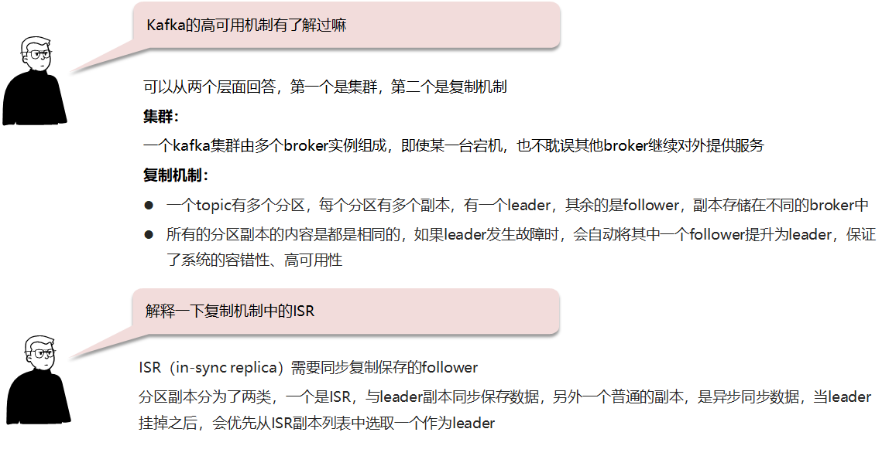

>**面试官**：Kafka的高可用机制有了解过嘛
>
>**候选人**：
>
>嗯，主要是有两个层面，第一个是集群，第二个是提供了复制机制
>
>kafka集群指的是由多个broker实例组成，即使某一台宕机，也不耽误其他broker继续对外提供服务
>
>复制机制是可以保证kafka的高可用的，一个topic有多个分区，每个分区有多个副本，有一个leader，其余的是follower，副本存储在不同的broker中；所有的分区副本的内容是都是相同的，如果leader发生故障时，会自动将其中一个follower提升为leader，保证了系统的容错性、高可用性
>
>**面试官**：解释一下复制机制中的ISR
>
>**候选人**：
>
>ISR的意思是in-sync replica，就是需要同步复制保存的follower
>
>其中分区副本有很多的follower，分为了两类，一个是ISR，与leader副本同步保存数据，另外一个普通的副本，是异步同步数据，当leader挂掉之后，会优先从ISR副本列表中选取一个作为leader，因为ISR是同步保存数据，数据更加的完整一些，所以优先选择ISR副本列表

### Kafka数据清理机制

**文件存储结构**

Kafka中，一个topic会有不同分区，分区内部，就存储了数据，但是一个分区的数据文件在存储时，如果这个数据文件过大，也是会分段存储的，分成多个segment。有什么好处呢？其实就是提高了在大数据量下的数据查找速度，可以看一下一个segment下文件的命名规则，都是以偏移量命名的，然后跟上后缀，当然，从图中可以看到，一个segment下是不止一个文件的。根据偏移量命名，将来在查找某个数据时，就可以快速定位到它的位置了。还有一个是，提高了无用文件清理效率。分段之后，一些数据文件比较久远了，已经无用了，就可以直接将整个文件删除，而不会涉及到其他有用数据，效率也会得到提高。

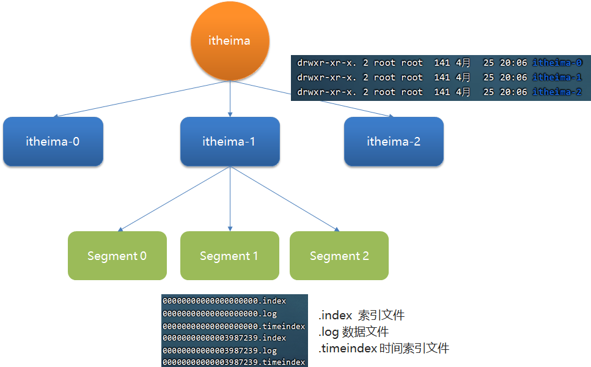

**数据清理机制**

日志的清理策略有两个：

根据消息的保留时间，当消息在kafka中保存的时间超过了指定的时间，就会触发清理过程

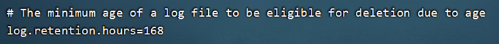

根据topic存储的数据大小，当topic所占的日志文件大小大于一定的阈值，则开始删除最久的消息。需手动开启

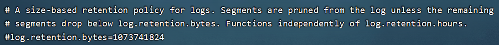

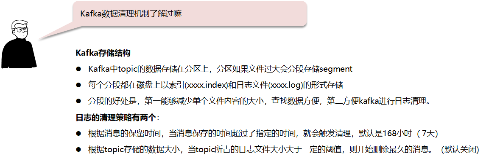

> **面试官**：Kafka数据清理机制了解过嘛
>
> **候选人**：
>
> 嗯，了解过~~
>
> Kafka中topic的数据存储在分区上，分区如果文件过大会分段存储segment
>
> 每个分段都在磁盘上以索引(xxxx.index)和日志文件(xxxx.log)的形式存储，这样分段的好处是，第一能够减少单个文件内容的大小，查找数据方便，第二方便kafka进行日志清理。
>
> 在kafka中提供了两个日志的清理策略：
>
> 第一，根据消息的保留时间，当消息保存的时间超过了指定的时间，就会触发清理，默认是168小时（ 7天）
>
> 第二是根据topic存储的数据大小，当topic所占的日志文件大小大于一定的阈值，则开始删除最久的消息。这个默认是关闭的
>
> 这两个策略都可以通过kafka的broker中的配置文件进行设置

### Kafka中实现高性能的设计

主要体现在以下几点：

- **消息分区：不受单台服务器的限制，可以不受限的处理更多的数据**
- **顺序读写：磁盘顺序读写，提升读写效率**
- **页缓存：把磁盘中的数据缓存到内存中，把对磁盘的访问变为对内存的访问**
- **零拷贝：减少上下文切换及数据拷贝**
- 消息压缩：减少磁盘IO和网络IO
- 分批发送：将消息打包批量发送，减少网络开销

**顺序读写**

Kafka中是顺序寻址，而不是随机寻址，数据都是按顺序排列的，当然效率更高

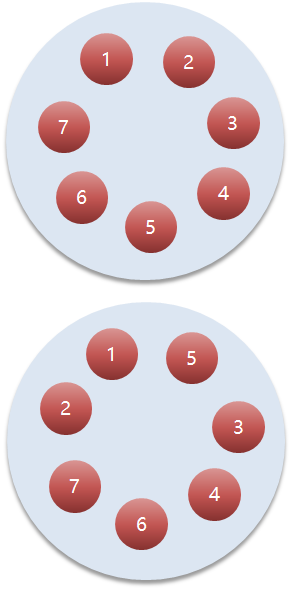

**零拷贝**

在linux中，正常的消息收发流程是这样的：

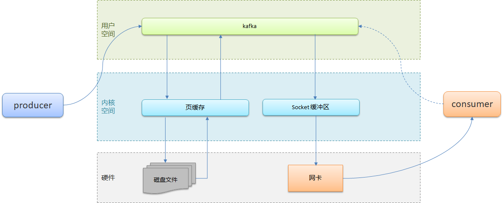

Kafka把发消息的操作委托给了内核空间，由内核空间把页缓存中的数据拷贝到网卡发送出去。

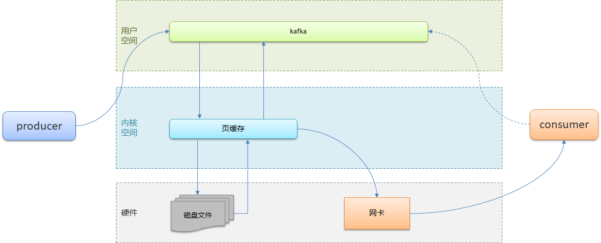

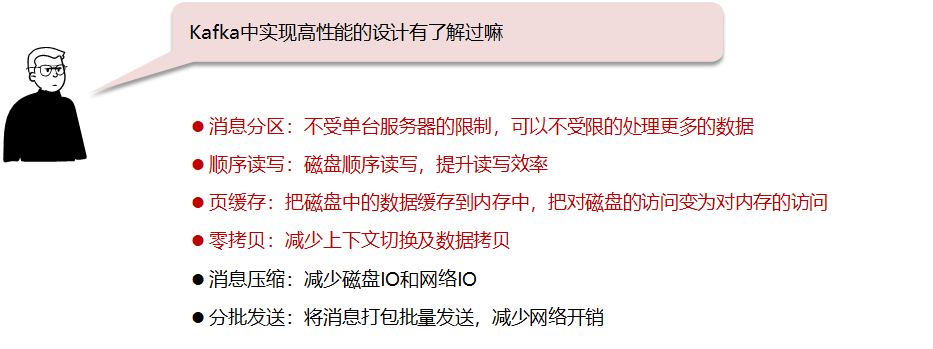

> **面试官**：Kafka中实现高性能的设计有了解过嘛
>
> **候选人**：
>
> Kafka 高性能，是多方面协同的结果，包括宏观架构、分布式存储、ISR 数据同步、以及高效的利用磁盘、操作系统特性等。主要体现有这么几点：
>
> 消息分区：不受单台服务器的限制，可以不受限的处理更多的数据
>
> 顺序读写：磁盘顺序读写，提升读写效率
>
> 页缓存：把磁盘中的数据缓存到内存中，把对磁盘的访问变为对内存的访问
>
> 零拷贝：减少上下文切换及数据拷贝
>
> 消息压缩：减少磁盘IO和网络IO
>
> 分批发送：将消息打包批量发送，减少网络开销

