# MySQL

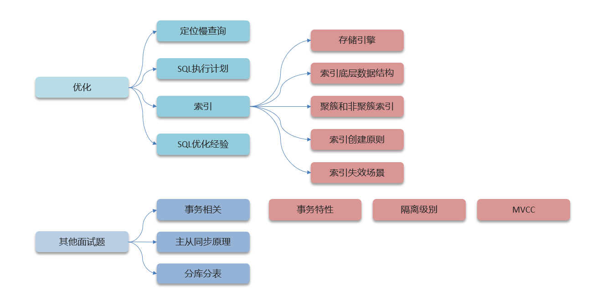

## 优化

### 如何定位慢查询？

通常情况下，慢查询出现的场景如下：

- 聚合查询
- 多表查询
- 表数据量过大查询
- 深度分页查询

主要变现形式为：页面加载过慢、接口压测响应时间过长（超过1s）

定位慢查询主要有以下两种方式：

**方案一：开源工具**

- 调试工具：Arthas 
- 运维工具：Prometheus 、Skywalking

如图Skywalking

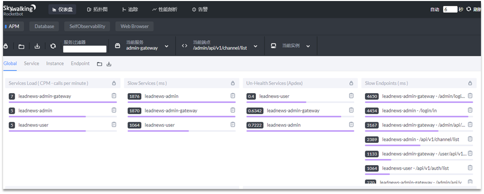

在它的图形化界面里，会有一些指标数据，我们可以实时查看一些接口的响应情况，并且它还对接口做了排序，响应越慢的接口排在越前面

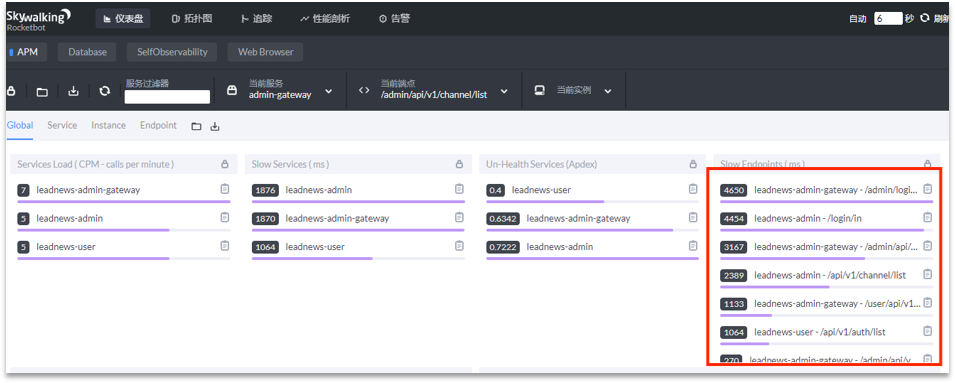

它还提供了追踪功能

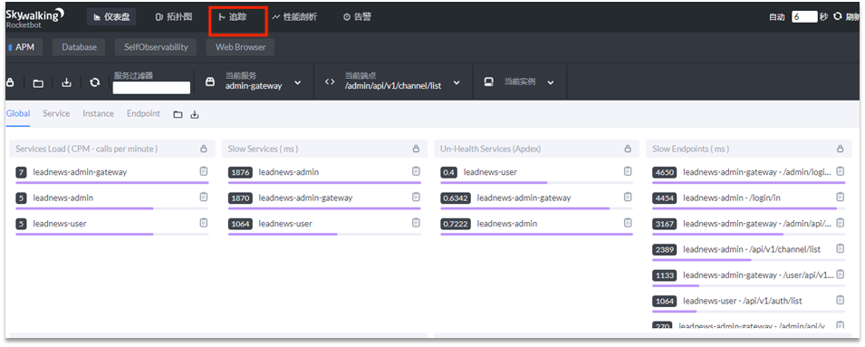

在这里，我们可以查看每个接口详细的执行情况，如下图，它展示了某个接口每个阶段的执行耗时，其中也包括了sql的执行耗时。

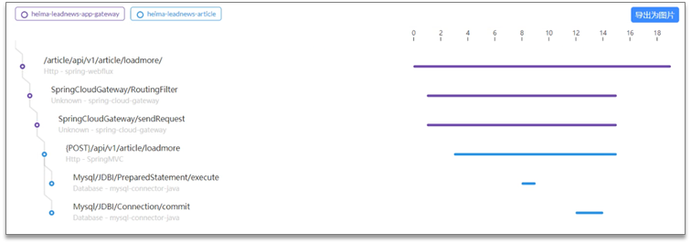

**方案二：MySQL自带慢日志查询**

慢查询日志记录了所有执行时间超过指定参数（long_query_time，单位：秒，默认10秒）的所有SQL语句的日志

MySQL默认是没有开启慢查询日志的，如果要开启慢查询日志，需要在MySQL的配置文件（/etc/my.cnf）中配置如下信息：

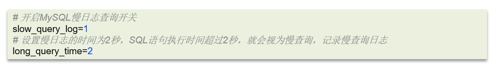

其中slow_query_log为1表示开启，为0表示未开启。

long_query_time一般在项目中设置为2秒，如果配置的时间太长了，就失去记录慢查询日志的意义了。

配置完毕之后，重新启动MySQL，就可以查看慢日志文件中记录的信息 。

它会将执行耗时超过设定值的sql记录到这个文件里：/var/lib/mysql/localhost-slow.log

里面记录的信息长下图这个样子

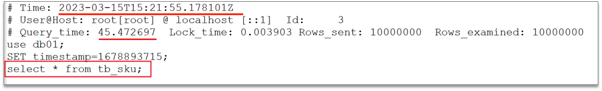

标红处为关键信息，从上到下分别为sql的执行时间，执行耗时以及这条sql长什么样子。

需要注意的是，一般在调试阶段才会开启慢查询日志的功能，生产环境会关闭这个功能，因为它会损耗一些MySQL的性能。

> **面试官：**MySQL中，如何定位慢查询?
>
> **候选人：**
>
> 嗯~，我们当时做压测的时候有的接口非常的慢，接口的响应时间超过了2秒以上，因为我们当时的系统部署了运维的监控系统Skywalking ，在展示的报表中可以看到是哪一个接口比较慢，并且可以分析这个接口哪部分比较慢，这里可以看到SQL的具体的执行时间，所以可以定位是哪个sql出了问题
>
> 如果，项目中没有这种运维的监控系统，其实在MySQL中也提供了慢日志查询的功能，可以在MySQL的系统配置文件中开启这个慢日志的功能，并且也可以设置SQL执行超过多少时间来记录到一个日志文件中，我记得上一个项目配置的是2秒，只要SQL执行的时间超过了2秒就会记录到日志文件中，我们就可以在日志文件找到执行比较慢的SQL了。

### 如何分析慢SQL？

可以采用MySQL中提供的工具EXPLAIN 或者 DESC命令获取 MySQL 如何执行 SELECT 语句的信息

具体语法如下：

```mysql
-直接在select语句之前加上关键字explain
EXPLAIN SELECT 字段列表 FROM 表名 WHERE 条件;
```

如图，加了explain后展示的就不是表中数据了，而是这条sql执行的情况。

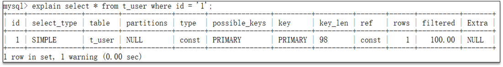

里面有很多字段，关键字段如下：

- type：这条sql的连接的类型
- possible_key：当前sql可能会使用到的索引
- key：当前sql实际命中的索引
- key_len：命中索引占用的大小，以字节为单位
- Extra：额外的优化建议

其中，可以通过key以及key_len观察是否命中索引或者索引是否失效

Extra除了null外，可能还会出现以下两种情况：
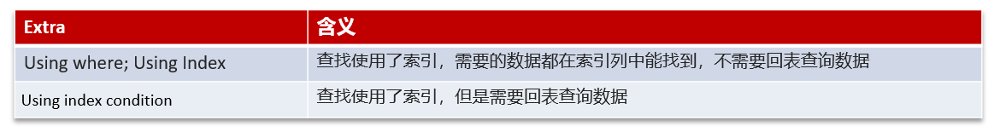

我们可以通过type来判断sql语句的性能，他的值有：性能由好到差为NULL、system、const、eq_ref、ref、range、 index、all 

- NULL：没有使用到表，开发中比较少见，了解即可
- system：查询系统中的表，即MySQL中内置的表，也是比较少见
- const：根据主键查询，常见情况，性能
- eq_ref：主键索引查询或唯一索引查询（单条数据）
- ref：索引查询（很有可能多条数据）
- range：走的是索引，但是是范围查询
- index：全索引扫描，效率不高
- all：不走索引，全盘扫描，效率最低

如果某条sql的type是index或all，那就需要优化了。

> **面试官：**那这个SQL语句执行很慢, 如何分析呢？
>
> **候选人：**如果一条sql执行很慢的话，我们通常会使用mysql自动的执行计划explain来去查看这条sql的执行情况，比如在这里面可以通过key和key_len检查是否命中了索引，如果本身已经添加了索引，也可以判断索引是否有失效的情况，第二个，可以通过type字段查看sql是否有进一步的优化空间，是否存在全索引扫描或全盘扫描，第三个可以通过extra建议来判断，是否出现了回表的情况，如果出现了，可以尝试添加索引或修改返回字段来修复

### 什么是索引？ Mysql索引的底层数据结构 ? 

索引（index）是帮助数据库高效获取数据的数据结构(有序)。在数据之外，数据库系统还维护着实现高级查找算法的数据结构（如B+树），这些数据结构以某种方式引用（指向）数据， 这种数据结构就是索引。

查询的时候，在没有索引的情况下，只能逐条比较数据，做全表扫描，时间复杂度是O(n)。

如图，我们要查找age为45的数据，它会从id为1开始逐条向下寻找，直到找到id为7的数据，它的age就是45，但是，找到了这个数据以后，他还是会继续逐条向下寻找，因为下面可能还存在age为45的数据，它会把整张表都遍历一遍。

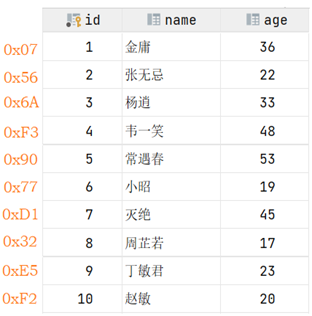

这种逐条查找的方法效率肯定是不高的，我们可以通过添加索引来提高查找效率。

比如，数据库里还维护着一棵二叉查找树（左小右大），当然，MySQL索引默认的底层数据结构并不是二叉查找树，这里只是假设，以方便理解索引的作用。

如图是一棵二叉查找树，假设它是数据库中维护的数据机构，很明显，树中节点的值就是表中的age，有了这个数据机构后，我们再去查找age为45的数据就方便多了，从根节点开始，拿节点值与查找的45做比较，如果45比较小就往左走，比较大就往右走，这种查找的方法效率就快多了，时间复杂度为O(logn)。

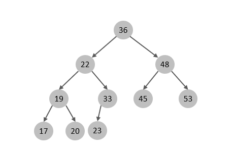

这就是索引的好处了，他就是来提升查找效率的。

实际上，mysql索引的默认底层数据结构是B+树，了解B+树前，要先了解B树对比二叉树的优势。

如图都是二叉查找树，左小右大，可以看出来，二叉查找树在极端情况下会退化成链表，时间复杂度依然是O(n)，如果以二叉查找树作为索引的底层的数据结构，在这种情况下创建索引就没有作用了。

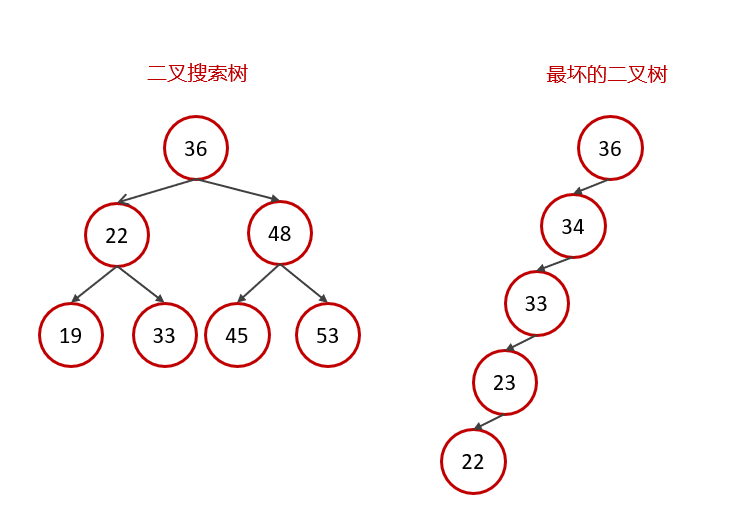

当然，还有红黑树，它就是一种自平衡的二叉查找树，不会出现退化成链表的情况，如图

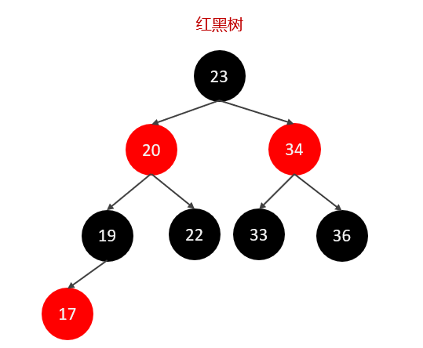

但是，红黑树它是一种二叉树，也就意味着每个节点最多只能有两个子节点，当表数据量过大时，红黑树就会变得很高，所以在查找数据时，可能要去遍历很多的层级，查找效率就不是很理想了。

那有效率高的树吗？有的兄弟，有的，B树。

B树是一种自平衡的多路查找树，相对于二叉树，B树每个节点可以有多个分支，即多路。以一棵5阶的B树为例，即这个B树每个节点最多存储4个key，5个子节点，如图是一棵5阶的B树。

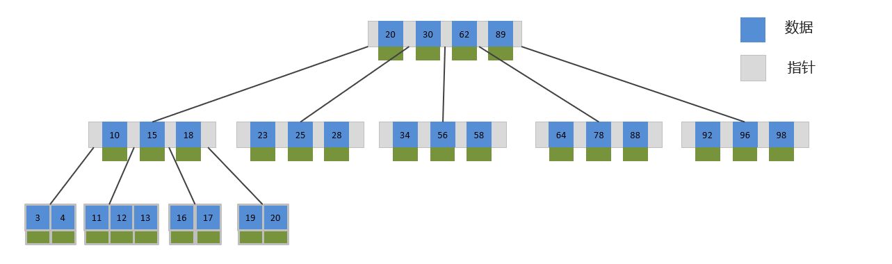

可以看出，由于分叉较多，相对与二叉树，它是一棵矮胖树，意味着它的高度相比较二叉树而言也低了很多，所以查找数据时不用遍历很深的层级，效率就比较高了。

那为什么还要有B+树呢？当然是因为B+树比B树更优秀了。

B+树在B树基础上做了优化，使其更适合实现外存储索引结构，MySQL默认的InnoDB存储引擎就是用B+树实现其索引结构。如图是一棵B+树。

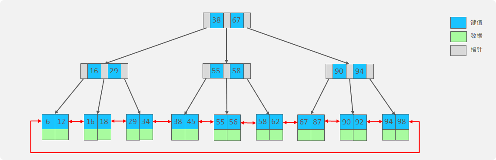

它与B树的区别如下：

- B树的所有节点都会存储数据，而B+树的数据只存储在叶子节点上，非叶子节点的作用只是存储指针逐层指向最下面的叶子节点，当然路径上所有键值对应的数据都会被记录到最下面的叶子节点中。
- B+树的叶子节点是用双向指针连接起来的。

因此，与B树对比，B+树有以下优势：

- 磁盘读写代价B+树更低

  > B+树非叶子节点只存储指针，存储压力低，且B树会加载路径上每个key对应的数据，会加载额外的资源，增加不必要的磁盘I/O操作

- 查询效率B+树更加稳定

- B+树便于扫库和区间查询

> **面试官：**了解过索引吗？（什么是索引）
>
> **候选人：**嗯，索引在项目中还是比较常见的，它是帮助MySQL高效获取数据的数据结构，主要是用来提高数据检索的效率，降低数据库的IO成本，同时通过索引列对数据进行排序，降低数据排序的成本，也能降低了CPU的消耗
>
> **面试官：**索引的底层数据结构了解过嘛 ? 
>
> **候选人：**MySQL的默认的存储引擎InnoDB采用的B+树的数据结构来存储索引，选择B+树的主要的原因是：第一阶数更多，路径更短，第二个磁盘读写代价B+树更低，非叶子节点只存储指针，叶子阶段存储数据，第三是B+树便于扫库和区间查询，叶子节点是一个双向链表
>
> **面试官：**B树和B+树的区别是什么呢？
>
> **候选人**：第一：在B树中，非叶子节点和叶子节点都会存放数据，而B+树的所有的数据都会出现在叶子节点，在查询的时候，B+树查找效率更加稳定
>
> 第二：在进行范围查询的时候，B+树效率更高，因为B+树都在叶子节点存储，并且叶子节点是一个双向链表

### 聚簇索引（聚集索引）？非聚簇索引（二级索引）？

**聚簇索引**：将数据存储与索引放在一块，索引结构的叶子节点存放了整行数据，必须有，且只能存在一个。

**非聚簇索引**：将数据与索引分开存储，索引结构的叶子节点只关联数据对应主键，可以没有，也可以存在多个。

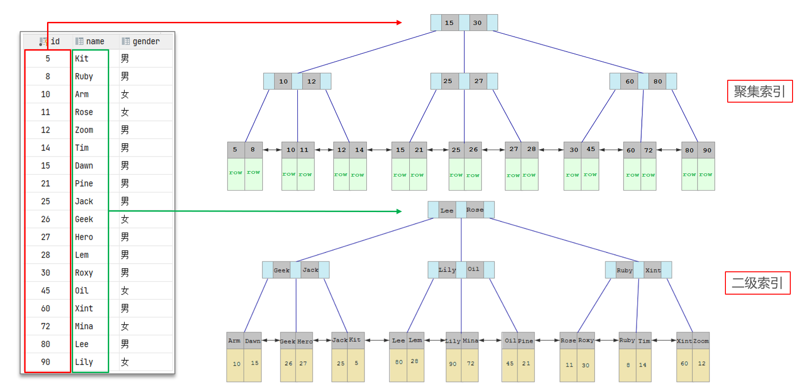

需要注意的是，一个表中，不是每个字段都可以当聚簇索引，聚簇索引的选举有如下规则：

- 表中如果存在主键，主键为聚簇索引
- 表中如果不存在主键，将使用第一个唯一索引作为聚簇索引
- 表中如果主键和合适的唯一索引都没有，则InnoDB会自动生成一个rowid作为隐藏的聚簇索引。

> **面试官：**什么是聚簇索引什么是非聚簇索引 ?
>
> **候选人：**
>
> 好的~，聚簇索引主要是指数据与索引放到一块，B+树的叶子节点保存了整行数据，有且只有一个，一般情况下主键在作为聚簇索引的
>
> 非聚簇索引值的是数据与索引分开存储，B+树的叶子节点保存对应的主键，可以有多个，一般我们自己定义的索引都是非聚簇索引

### 覆盖索引？回表？

如图，图中sql语句`where`关键字后面跟的条件是`id`，因此执行这条sql语句时会优先到聚集索引里检索，从聚集索引就可以直接检索到整行的数据，它一次性就能把所有要找的数据找到，这个就是**覆盖索引**。

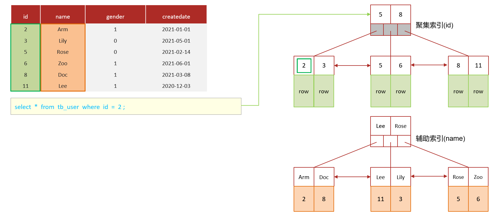

如图，图中sql语句`where`关键字后面跟的条件是`name`，因此执行这条sql语句时会优先到二级索引里检索，从二级索引就可以直接一次性检索到要找的数据id和name，因此这个也是**覆盖索引**。

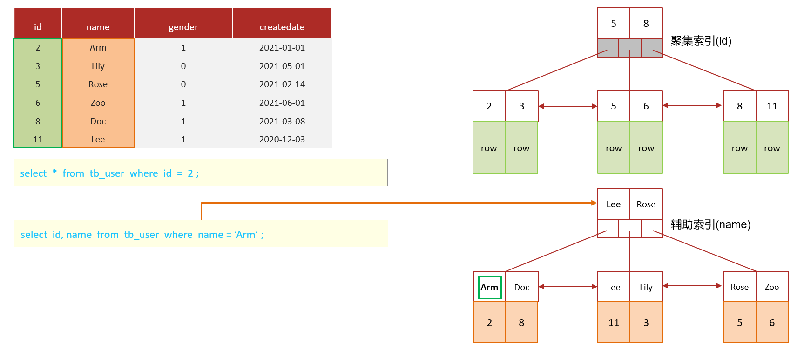

如图，图中sql语句`where`关键字后面跟的条件是`name`，因此执行这条sql语句时会优先到二级索引里检索，从二级索引可以直接检索到要找的数据id和name，但并不能找到gender，这个时候会先拿到对应的id的值，再到聚集索引里寻找对应的数据，最终才找到这一行数据，把gender给拿到，这种情况就是发生了**回表**。

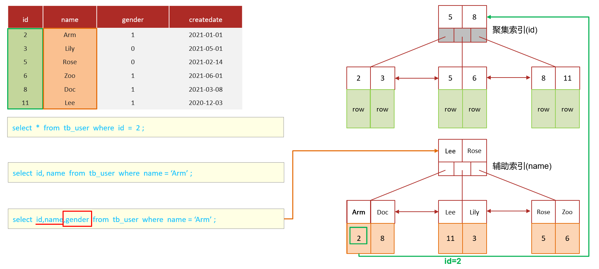

很显然，覆盖索引可以将一次性将数据查出来，而回表不行，因此覆盖索引的查询效率高于回表。

如果返回的列中没有创建索引，有可能会触发回表查询，因此在实际开发中应尽量避免使用select *。

> **面试官：**知道什么叫覆盖索引嘛 ? 
>
> **候选人：**嗯~，清楚的
>
> 覆盖索引是指select查询语句使用了索引，在返回的列，必须在索引中全部能够找到，如果我们使用id查询，它会直接走聚集索引查询，一次索引扫描，直接返回数据，性能高。
>
> 如果按照二级索引查询数据的时候，返回的列中没有创建索引，有可能会触发回表查询，尽量避免使用select *，尽量在返回的列中都包含添加索引的字段
>
> **面试官：**知道什么是回表查询嘛 ?
>
> **候选人：**嗯，其实跟刚才介绍的聚簇索引和非聚簇索引是有关系的，回表的意思就是通过二级索引找到对应的主键值，然后再通过主键值找到聚集索引中所对应的整行数据，这个过程就是回表
>
> 【**备注**：如果面试官直接问回表或者覆盖索引，则需要先介绍聚簇索引和非聚簇索引】

### MySQL超大分页怎么处理 ?

在数据量比较大时，如果进行limit分页查询，在查询时，越往后，分页查询效率越低。

我们一起来看看执行limit分页查询耗时对比：

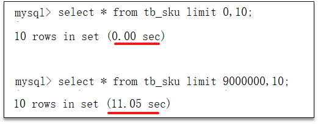

因为，当在进行分页查询时，如果执行 limit 9000000,10 ，此时需要MySQL排序前9000010 记录，仅仅返回 9000000 - 9000010 的记录，其他记录丢弃，查询排序的代价非常大 。

另外，这个sql语句执行时走的是聚簇索引，如果是以下这个sql，且name字段已经建立索引，那么执行时将会回表9000010次，相当恐怖。

```mysql
select * from tb_sku where name = "a" limit 9000000,10
```

优化思路：一般分页查询时，通过覆盖索能够比较好地提高性能，超大分页的话可以通过覆盖索引加子查询形式进行优化。

```mysql
select * from 
tb_sku t,
	(select id from tb_sku order by id limit 9000000,10) a 
where t.id = a.id;
```

优点：

- 避免了可能存在的大规模回表操作。
- 子查询仅扫描9,000,010 条 ID 并返回最后 10 条，避免整行读取，显著降低 I/O 与 CPU 开销。
- 根据子查询返回的 10 条 ID，最后整个sql语句走的是聚簇索引且只会查询 10 条数据。

> **面试官：**MYSQL超大分页怎么处理 ?
>
> **候选人：**嗯，超大分页一般都是在数据量比较大时，我们使用了limit分页查询，并且需要对数据进行排序，这个时候效率就很低，我们可以采用覆盖索引和子查询来解决
>
> 先分页查询数据的id字段，确定了id之后，再用子查询来过滤，只查询这个id列表中的数据就可以了
>
> 因为查询id的时候，走的覆盖索引，所以效率可以提升很多

### 索引创建原则有哪些？

- 针对于数据量较大，且查询比较频繁的表建立索引。单表超过**10万**数据（增加用户体验）可以考虑建立索引。
- 针对于常作为查询条件（where）、排序（order by）、分组（group by）操作的字段建立索引。
- 尽量选择区分度高的列作为索引，尽量建立唯一索引，区分度越高，使用索引的效率越高。
- 如果是字符串类型的字段，字段的长度较长，可以针对于字段的特点，建立前缀索引。
- 尽量使用联合索引，减少单列索引，查询时，联合索引很多时候可以覆盖索引，节省存储空间，避免回表，提高查询效率。
- 要控制索引的数量，索引并不是多多益善，索引越多，维护索引结构的代价也就越大，会影响增删改的效率。
- 如果索引列不能存储NULL值，请在创建表时使用NOT NULL约束它。当优化器知道每列是否包含NULL值时，它可以更好地确定哪个索引最有效地用于查询。

简洁版：

- **数据量较大，且查询比较频繁的表**
- **常作为查询条件、排序、分组的字段**
- **字段内容区分度高**
- 内容较长，使用前缀索引
- **尽量联合索引**
- **要控制索引的数量**
- 如果索引列不能存储NULL值，请在创建表时使用NOT NULL约束它

> **面试官：**索引创建原则有哪些？
>
> **候选人：**嗯，这个情况有很多，不过都有一个大前提，就是表中的数据要超过10万以上，我们才会创建索引，并且添加索引的字段是查询比较频繁的字段，一般也是像作为查询条件，排序字段或分组的字段这些。
>
> 还有就是，我们通常创建索引的时候都是使用复合索引来创建，一条sql的返回值，尽量使用覆盖索引，如果字段的区分度不高的话，我们也会把它放在组合索引后面的字段。
>
> 如果某一个字段的内容较长，我们会考虑使用前缀索引来使用，当然并不是所有的字段都要添加索引，这个索引的数量也要控制，因为添加索引也会导致新增改的速度变慢。

### 什么情况下索引会失效？

MySQL自带的执行计划工具explain可以很好的帮助我们判断索引是否失效，可以观察key和key_len字段来分析。

如图我们创建联合索引

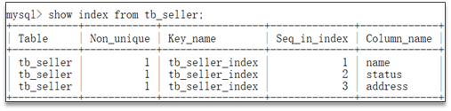

一般来说索引失效存在以下这些场景：

**违反最左匹配原则**

如果索引了多列，要遵守最左前缀法则。指的是查询的时候使用到的索引从最左前列开始，并且不跳过索引中的列。

匹配最左前缀法则，走索引：

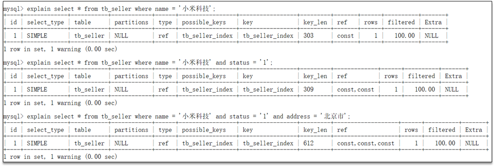

违法最左前缀法则 ， 索引失效：

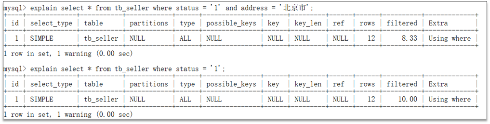

如果符合最左法则，但是出现跳跃某一列，只有最左列索引生效：

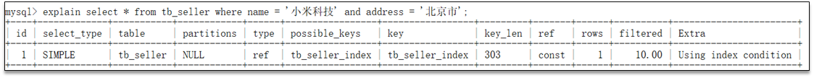

也就是说，如果有一个 2 列的索引 (a, b)，则实际上只在 (a)、(a, b)上 建立了索引；

如果有一个 3 列索引 (a, b, c)，则实际上只在 (a)、(a, b)、(a, b, c) 上建立了索引；

**范围查询右边的列，索引失效**

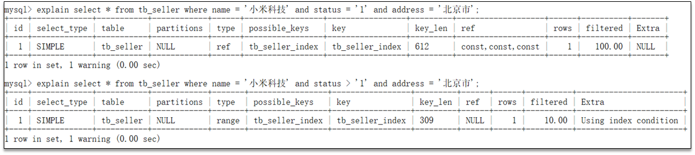

第一条sql是完全命中联合索引的，根据第一条sql的索引命中情况，可以观察到第二条sql前两个字段 name ， status 查询是走索引的， 但是最后一个条件address没有用到索引。

**在索引列上进行运算操作或者使用内部函数， 索引失效**

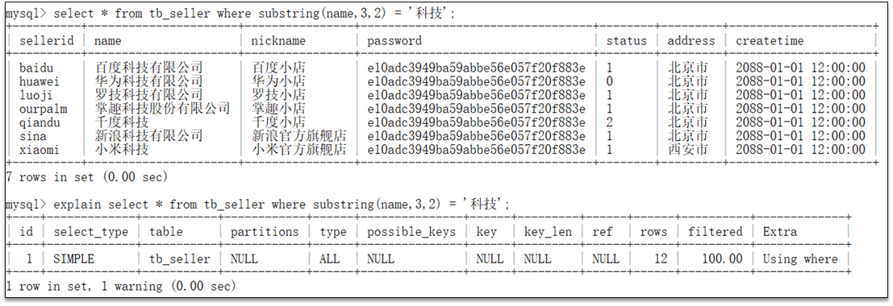

**字符串不加单引号，索引失效**

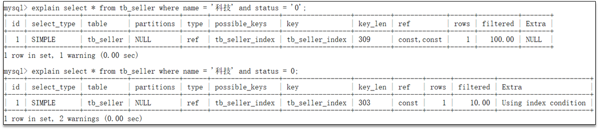

由于在查询时没有对字符串加单引号， MySQL的查询优化器，会自动的进行类型转换，造成索引失效。

**模糊查询**

以%开头的Like模糊查询，索引失效。如果仅仅是尾部模糊匹配，索引不会失效。如果是头部模糊匹配，索引失效。

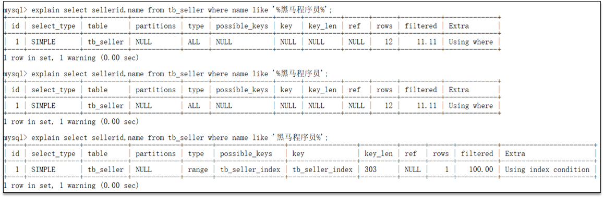

简洁版：

- 违反最左前缀法则
- 范围查询右边的列，不能使用索引
- 不要在索引列上进行运算操作或使用内部函数， 索引将失效
- 字符串不加单引号，造成索引失效。(自动类型转换)
- 以%开头的Like模糊查询，索引失效

> **面试官：**什么情况下索引会失效 ?
>
> **候选人：**嗯，这个情况比较多，我说一些自己的经验，以前遇到过的
>
> 比如，索引在使用的时候没有遵循最左匹配法则，第二个是，模糊查询，如果%号在前面也会导致索引失效，如果在添加索引的字段上进行了运算操作或者类型转换或者使用了内置函数也都会导致索引失效。
>
> 我们之前还遇到过一个就是，如果使用了复合索引，中间使用了范围查询，右边的条件索引也会失效
>
> 所以，通常情况下，想要判断出这条sql是否有索引失效的情况，可以使用explain执行计划来分析

### 模糊查询导致索引失效如何优化？

B+ 树索引通过前缀来定位记录。使用前置通配符（`LIKE '%xxx'` 或 `'%xxx%'`）时，MySQL 无法确定查找起点，因而只能退化为全表扫描或全索引扫描。

**覆盖索引**

通过覆盖索引可以让模糊匹配且%出现在第一个字符的情况下依然走索引扫描，避免出现大量回表情况，但走的是全索引扫描，也就是会将所有叶子节点遍历一遍，效率不太理想。

**避免使用“前置通配符”**

业务允许情况下，尽量避免使用前置通配符。

**反向索引**

反向索引适用于优化 **单侧前置通配符**（如 `LIKE '%abc'`），通存储反转字符串并建立索引（如 `WHERE reversed_col LIKE 'cba%'`），MySQL在8.0版本后支持在索引中直接使用表达式（如 `REVERSE()`）创建反向索引，无需单独存储反转字符串，但无法解决双端模糊查询（`LIKE '%abc%'`）导致索引失效的问题。

**缩小数据范围**

大多数情况下，业务要求都是双端模糊匹配，那就避免不了使用前置通配符了，这种情况下，如果可以通过其他条件缩小扫描的数据范围，应在模糊匹配前增加更多限制条件，缩小模糊匹配扫描的数据范围。

```mysql
SELECT * FROM users WHERE created_at >='2023-01-01'AND username LIKE '%John%';
```

**存入缓存**

针对变化较少且查询频繁的数据，可以考虑存入redis提高访问速度。

**全文索引**

MySQL的全文索引是针对文本列构建的倒排索引。它将文本拆分为词项并记录每个词项对应的行号，查询时通过 `MATCH(col) AGAINST('关键词')` 语法匹配词项，而不是使用`like`关键字，但是这种方式针对短文本的处理效果不太理想，因其依赖分词机制，而短文本可能无法有效分词。

**ES、分库分表**

如果数据量过大，可以考虑ES和分库分表。

> 首先，业务允许的情况下，尽量避免使用前置`%`，如必须要使用前置%，可以考虑这些方式优化查询效率，结合其他条件模糊匹配缩小扫描数据量；或者可通过存储反转字符串并建立反向索引，MySQL 8.0后的话支持利用函数创建反向索引，将查询`LIKE '%abc'`转化为`LIKE 'cba%'`；不过大多数业务情况中都会是双端模糊`%abc%`，可尝试覆盖索引减少回表，或对长文本启用全文索引（`MATCH...AGAINST`替代`LIKE`）；若数据频繁查询且变动少，可缓存结果到Redis，而对海量数据或复杂搜索场景，则可以考虑分库分表减少单表数据量或者引入Elasticsearch这类搜索引擎。

### 动态查询导致索引失效如何优化？

在真实的业务场景中动态查询很常见且可能会破坏最左匹配原则，如图，如果我们对请假类型，单据编号，请假人创建索引，按照我们原先的计划，sql语句应该是长这样的`XXX where 请假类型 = 'XX' and 单据编号 = = 'XX' and 请假人 = 'XX'`，这种情况是会走索引的，但如果查询时只使用了请假人，就会破坏最左匹配原则。

因此，为了最大程度保证遵循最左前缀原则，在选择最常用字段作为索引字段的基础上，对于创建索引的字段的顺序也是有讲究的，如创建索引（a，b，c），a应为最常用字段，b为次常用，c为末常用，以此类推。

但即使这也，动态查询仍有可能导致索引失效，假设我们经过分析，认为应创建索引（请假类型， 单据编号，请假人），也就是说请假类型为最常用， 单据编号为次常用，请假人为末常用），但是用户的行为是不可预料的，有些用户他可能在某次操作可能就是没有使用最常用字段作为查询条件，如还是只使用了请假人，此时还是违反最左匹配原则，因此，在业务允许的情况下，我们其实可以为最左边的字段（请假类型）设置默认值，让它永远都会被使用到，如图：


在业务允许，并且也能保证用户的查询需求的情况下，为了优化动态查询导致索引失效的问题，让最左边的索引字段的查询条件框里一值都有值，这样的方式无疑是最好的。

总结：

- 使用最常用字段建立联合索引
- 根据常用性设置索引顺序
- 给最左边的索引字段设置默认值（业务允许）

当然，在数据量特别大的情况下，如果使用以上的方式仍然达不到理想的效果，还可以考虑以下的方案可以继续优化

- 分库分表
- ES、大数据

> **面试官：**动态查询导致索引失效如何优化？
>
> **候选人：**动态查询在项目中还是比较常见的，它导致索引失效的原因主要是它可能会破坏最左匹配原则，针对这个问题的话，还是有很多方法可以降低它导致索引失效的概率的，但是无法做到让这个概率为0，首先在创建索引的时候，要遵守索引创建原则，选择最常用的字段建立联合索引，而且，在索引字段内部，还要基于字段常用性做排序，让更常用的字段排在索引的最前面，在业务允许的情况下，还可以给最前面的字段设置一个默认值，让它每次查询都保持不为空，都会被使用到。当然，在数据量特别大的情况下，分库分表或者使用ES、大数据其实是一种更好的SQL优化手段。

### SQL优化？

**表的设计优化（参考阿里开发手册《嵩山版》）**

- 慎重考虑字段类型选择

  > 比如设置合适的数值（tinyint  int  bigint），要根据实际情况选择
  >
  > 比如设置合适的字符串类型（char和varchar）char定长效率高，varchar可变长度，效率稍低

- 遵循三范式

  > **第一范式（1NF）：**表中的每一列都具有**原子性**，也就是说每个字段都只能包含单一值，不能是集合、数组或其他表。
  >
  > **第二范式（2NF）：** 在满足1NF的基础上，所有非主属性**完全依赖于主键**，不能只依赖主键的一部分（针对复合主键而言）。
  >
  > **第三范式（3NF）：**在满足2NF的基础上，非主属性**不能依赖于其他非主属性**（也就是说，不能有传递依赖）。

**索引优化**

可以从索引创建原则，索引失效角度叙述。

**SQL语句优化**

- SELECT语句务必指明字段名称（避免直接使用select * ），其实就是尽量保证索引覆盖
- SQL语句要避免造成索引失效的写法
- 尽量用union all代替union  union会多一次过滤，效率低
- 避免在where子句中对字段进行表达式操作
- Join优化 能用inner join就不用left join 或者 right join，如必须使用 一定要以小表为驱动，内连接会对两个表进行优化，优先把小表放到外边，把大表放到里边。left join 或 right join，不会重新调整顺序

**主从复制、读写分离**

如果数据库的使用场景读的操作比较多的时候，为了避免写的操作所造成的性能影响 可以采用读写分离的架构。

读写分离解决的是，数据库的写入，影响了查询的效率。

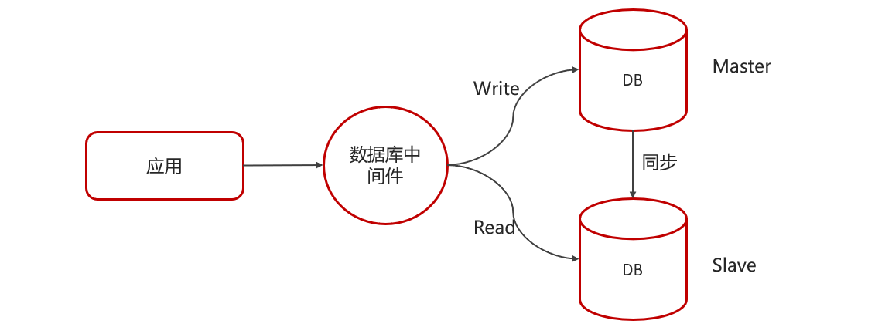

**分库分表** 

单表数据量超过1000万或者20G后，才考虑进行分库分表。

> **面试官：**sql的优化的经验
>
> **候选人：**嗯，这个在项目还是挺常见的，当然如果直说sql优化的话，我们会从这几方面考虑，比如
>
> 建表的时候、使用索引、sql语句的编写、主从复制，读写分离，还有一个是如果量比较大的话，可以考虑分库分表
>
> **面试官：**创建表的时候，你们是如何优化的呢？
>
> **候选人：**这个我们主要参考的阿里出的那个开发手册《嵩山版》，就比如，在定义字段的时候需要结合字段的内容来选择合适的类型，如果是数值的话，像tinyint、int 、bigint这些类型，要根据实际情况选择。如果是字符串类型，也是结合存储的内容来选择char和varchar或者text类型
>
> **面试官：**那在使用索引的时候，是如何优化呢？
>
> **候选人：**参考索引创建原则以及索引失效情况进行描述
>
> **面试官：**你平时对sql语句做了哪些优化呢？
>
> **候选人：**嗯，这个也有很多，比如SELECT语句务必指明字段名称，不要直接使用select * ，还有就是要注意SQL语句避免造成索引失效的写法；如果是聚合查询，尽量用union all代替union ，union会多一次过滤，效率比较低；如果是表关联的话，尽量使用innerjoin ，不要使用用left join right join，如必须使用 一定要以小表为驱动

## 事务

### 事务的特性是什么？

事务是一组操作的集合，它是一个不可分割的工作单位，事务会把所有的操作作为一个整体一起向系统提交或撤销操作请求，即这些操作要么同时成功，要么同时失败。

ACID：

原子性（**A**tomicity）：事务是不可分割的最小操作单元，要么全部成功，要么全部失败。

一致性（**C**onsistency）：事务完成时，必须使所有的数据都保持一致状态。

隔离性（**I**solation）：数据库系统提供的隔离机制，保证事务在不受外部并发操作影响的独立环境下运行。

持久性（**D**urability）：事务一旦提交或回滚，它对数据库中的数据的改变就是永久的。


> **面试官：**事务的特性是什么？可以详细说一下吗？
>
> **候选人：**嗯，这个比较清楚，ACID，分别指的是：原子性、一致性、隔离性、持久性；我举个例子：
>
> A向B转账500，转账成功，A扣除500元，B增加500元，原子操作体现在要么都成功，要么都失败
>
> 在转账的过程中，数据要一致，A扣除了500，B必须增加500
>
> 在转账的过程中，隔离性体现在A像B转账，不能受其他事务干扰
>
> 在转账的过程中，持久性体现在事务提交后，要把数据持久化（可以说是落盘操作）

### 并发事务带来哪些问题？

并发事务问题：脏读、不可重复读、幻读

脏读：指一个事务读到了另一个事务还没提交的数据。，比如事务B读到了事务A未提交事务的修改数据，如果事务A发生了回滚，那么事务B读到的数据就是无效的，称为脏数据，这就是脏读。

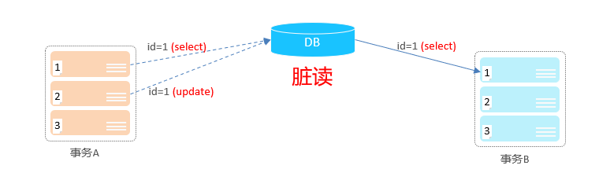

不可重复读：指在同一个事务中，前后两次读取到的数据内容不一样。比如事务A第一次读取了id为1的数据，然后事务B修改了id为1的数据，再然后事务A第二次读取了id为1的数据，事务A会发现前后两次读取的id为1的数据内容发生了变化，这就是不可重复度。

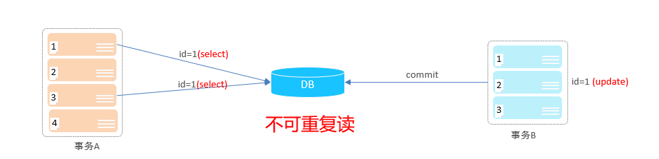

幻读：指在同一个事务中，前后两次查询读取到的结果集数量不同。比如事务A第一次查询数据表中的所有数据，发现数据量为0，然后事务B往表中新增一条数据，再然后事务A第二次查询表中的所有数据，事务A会发现前后两次查询的数据量对不上，这就是幻读。

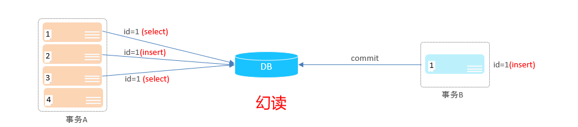

> **面试官**：并发事务带来哪些问题？
>
> **候选人**：
>
> 我们在项目开发中，多个事务并发进行是经常发生的，并发也是必然的，有可能导致一些问题
>
> 第一是脏读， 当一个事务正在访问数据并且对数据进行了修改，而这种修改还没有提交到数据库中，这时另外一个事务也访问了这个数据，因为这个数据是还没有提交的数据，那么另外一个事务读到的这个数据是“脏数据”，依据“脏数据”所做的操作可能是不正确的。
>
> 第二是不可重复读：比如在一个事务内多次读同一数据。在这个事务还没有结束时，另一个事务也访问该数据。那么，在第一个事务中的两次读数据之间，由于第二个事务的修改导致第一个事务两次读取的数据可能不太一样。这就发生了在一个事务内两次读到的数据是不一样的情况，因此称为不可重复读。
>
> 第三是幻读（Phantom read）：幻读与不可重复读类似。它发生在一个事务（T1）读取了几行数据，接着另一个并发事务（T2）插入了一些数据时。在随后的查询中，第一个事务（T1）就会发现多了一些原本不存在的记录，就好像发生了幻觉一样，所以称为幻读。

### 怎么解决并发事务问题？MySQL的默认隔离级别是？

针对并发事务问题的解决方案就是对事务就行隔离，不同隔离级别天然地限制了哪些并发问题可以发生，MySQL、Oracle 等主流数据库都支持标准的四个隔离级别。

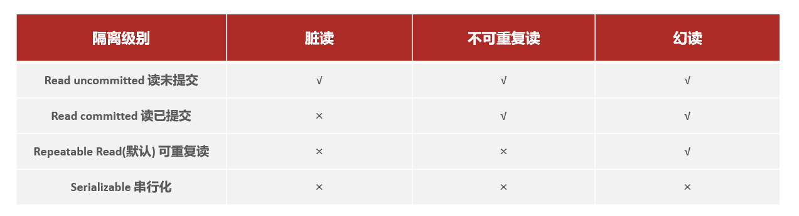

注意：事务隔离级别越高，数据越安全，但是性能越低。

> **面试官**：怎么解决并发事务问题？MySQL的默认隔离级别是？
>
> **候选人**：解决方案是对事务进行隔离
>
> MySQL支持四种隔离级别，分别有：
>
> 第一个是，读未提交（read uncommitted）它解决不了刚才提出的所有问题，一般项目中也不用这个。第二个是读已提交（read committed）它能解决脏读的问题的，但是解决不了不可重复读和幻读。第三个是可重复读（repeatable read）它能解决脏读和不可重复读，但是解决不了幻读，这个也是mysql默认的隔离级别。第四个是串行化（serializable）它可以解决刚才提出来的所有问题，但是由于让是事务串行执行的，也就是一个事务提交完才能开始执行其他事务，这个等同于放弃了并发事务，性能比较低。所以，我们一般使用的都是mysql默认的隔离级别:可重复读

### undo log和redo log的区别?

首先要了解以下两个概念

**缓冲池（buffer pool）**:主内存中的一个区域，里面可以缓存磁盘上经常操作的真实数据，在执行增删改查操作时，先操作缓冲池中的数据（若缓冲池没有对应数据，则从磁盘加载某一页的数据并缓存，缓冲池中的页叫做脏页），以一定频率刷新到磁盘，从而减少磁盘IO，加快处理速度

**数据页（page）**:是InnoDB 存储引擎磁盘管理的最小单元，每个页的大小默认为 16KB。页中存储的是行数据

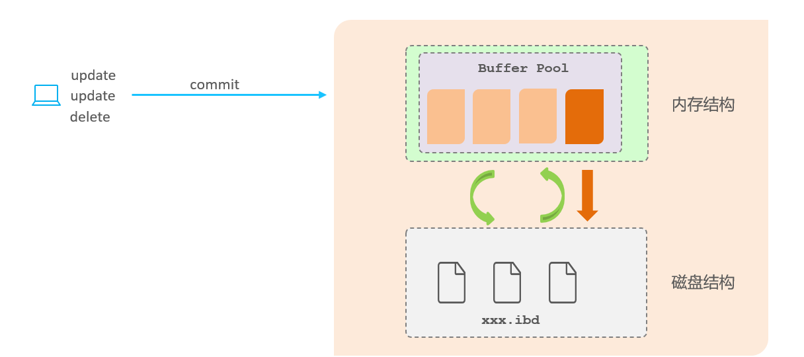

但是，假如现在已经操作完的数据，也就是在缓冲池中的这个脏页，它还没有同步到磁盘中，服务宕机了，那缓冲池中的数据可能就会丢失，因为缓冲池是在内存中的，但是操作完的数据还没有写入磁盘，那这种情况就违背事务的特性，持久化了。

**redo log**

因此，mysql中引入了一种日志文件，redo log。

redo log 是重做日志，记录的是事务提交时数据页的物理修改，是**用来实现事务的持久性**。

该日志文件由两部分组成：重做日志缓冲（redo log buffer）以及重做日志文件（redo log file）,前者是在内存中，后者在磁盘中。

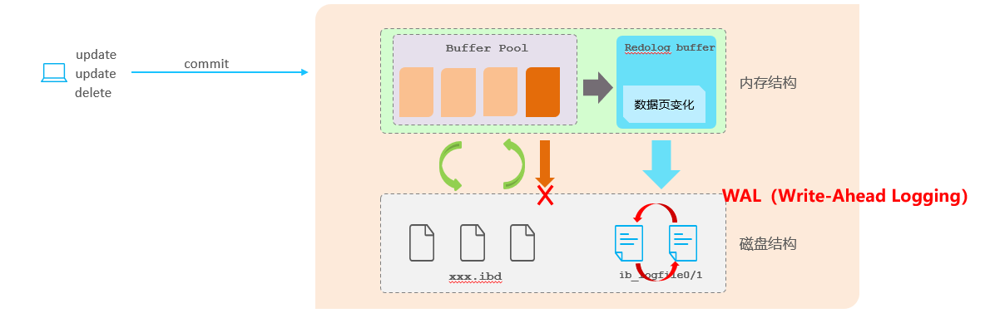

每当 InnoDB 对某个页作修改时，也就是增删改查时，buffer pool里的数据会发生变化，同时会把对应的数据追加到内存中的重做日志缓冲 （redo log buffer），然后在事务真正完成提交之前，InnoDB 需要保证把该事务对应的 redo log 从内存中的 redo log buffer 刷写到磁盘上的 redo log file 文件, 用于在刷新脏页到磁盘,发生错误时, 进行数据恢复使用。

如果当对脏页中的数据进行刷盘失败了，就可以从redo log 日志中来恢复数据了，最终就能保证事务的持久性了。

**undo log**

undo log 是回滚日志，用于记录数据被修改前的信息 , 作用包含两个 : 提供回滚 和 MVCC(多版本并发控制) 。undo log和redo log记录物理日志不一样，它是逻辑日志。

可以认为当delete一条记录时，undo log中会记录一条对应的insert记录，反之亦然。当然，不要误会，这里不是说undo log记录的是SQL语句，实际上undo log存的是旧版本数据，事务回滚时正是利用这些镜像“倒着”写回数据页。

当update一条记录时，它记录一条对应相反的update记录。当执行rollback时，就可以从undo log中的逻辑记录读取到相应的内容并进行回滚。

undo log 可以实现事务的一致性和原子性

**总结**

- redo log: 记录的是数据页的物理变化，服务宕机可用来同步数据
- undo log ：记录的是逻辑日志，当事务回滚时，通过逆操作恢复原来的数据
- redo log保证了事务的持久性，undo log保证了事务的原子性和一致性

> **面试官**：undo log和redo log的区别
>
> **候选人**：好的，其中redo log日志记录的是数据页的物理变化，服务宕机可用来同步数据，而undo log 不同，它主要记录的是逻辑日志，当事务回滚时，通过逆操作恢复原来的数据，比如我们删除一条数据的时候，就会在undo log日志文件中新增一条insert语句，如果发生回滚就执行逆操作；
>
> redo log保证了事务的持久性，undo log保证了事务的原子性和一致性

### 事务中的隔离性是如何保证的呢（MVCC）？

- 锁：排他锁（如一个事务获取了一个数据行的排他锁，其他事务就不能再获取该行的其他锁）
- mvcc : 多版本并发控制

**MVCC**

全称 Multi-Version Concurrency Control，多版本并发控制。指维护一个数据的多个版本，使得读写操作没有冲突。

什么意思呢？看以下这个例子

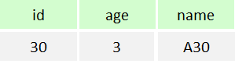

假如现在同时有四个事务，操作同一张表的同一行数据，具体操作如图

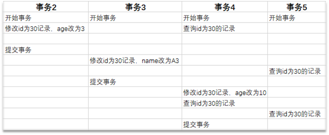

除事务5外其他事务分别对数据进行了修改，事务5没有修改数据，只是对数据做了两次查询。

那现在有个问题，事务5对数据的两次查询，查的是哪个事务版本的记录呢？目前同时操作数据的事务有4个，5没有修改数据不用管，主要是看一下到底是访问事务2，事务3，还是事务4修改过的数据，或者是没有修改过的原先的数据？

想要弄明白这个问题，那就需要了解MVCC了。MVCC它的主要作用，就是在多个事务并发时，来确定应该访问数据的哪个版本。

当然，如果是不同的隔离级别，访问的结果也不太一样。这个后面会详解。

MVCC的具体实现，主要依赖于**数据库记录中的隐式字段**、**undo log日志**、**readView**。

**数据库记录中的隐式字段**

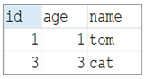

这是一张表，表中三个字段id、age、name，这是我们自定义的，可见的，但是，在内部其实还隐藏了三个mysql提供好的字段。


如图，分别是DB_TRX_ID、DB_ROLL_PTR、DB_ROW_ID，那它们是干什么的呢？

- **DB_TRX_ID：**最近修改事务id，记录这条记录或最后一次修改该记录的事务id。
- **DB_ROLL_PTR：**回滚指针，指向这条记录的上一个版本，用于配合undo log，指向上一个版本。
- **DB_ROW_ID：**隐藏主键，如果表结构没有指定主键，将会生成该隐藏字段。

重点关注**DB_TRX_ID**与**DB_ROLL_PTR**。

**undo log日志**

回滚日志，在insert、update、delete的时候产生的便于数据回滚的日志。

当insert的时候，产生的undo log日志只在回滚时需要，在事务提交后，可被立即删除。

而update、delete的时候，产生的undo log日志不仅在回滚时需要，mvcc版本访问也需要，不会立即被删除。

**undo log版本链**

这个又是什么呢？以下用一个例子解释。

如图，现在有一行数据，DB_RTX_ID为1，DB_ROLL_PTR目前没有指向任何数据版本

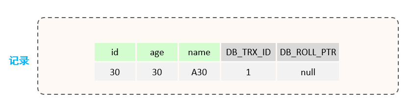

假如现在有四个事务同时操作这一行记录，它们是并发事务

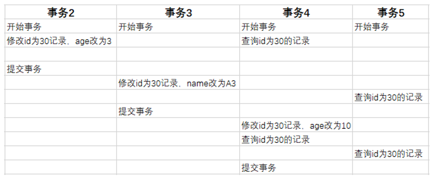

我们从左到右按顺序看操作执行时会发生什么？

先看事务2。

它先开启事务。

然后将age修改为3，这时表中原先age为30的整行数据（上一个版本数据）会被先记录到undo log日志里，然后表中的最新数据age被修改为3，DB_TRX_ID自增，DB_ROLL_PTR指向undo log中的上一个版本数据的地址。

最后事务2提交事务。

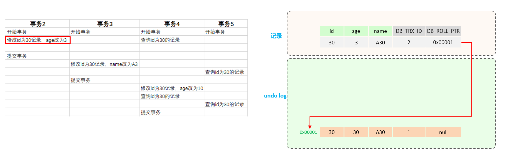

再看事务3。

首先它也是开启事务。

然后将name修改为A3，这时undo log要先记录一下表中原先name为A30的整行数据（上一个版本数据），然后表中的最新数据name被修改为A3，DB_TRX_ID自增，DB_ROLL_PTR指向undo log中的上一个版本数据的地址。

最后提交事务。

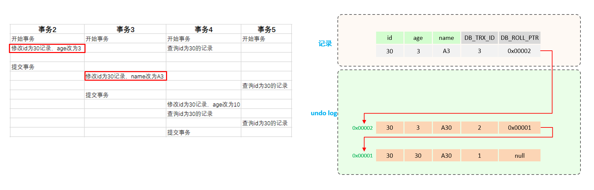

以此类推，事务4流程也是这个逻辑。

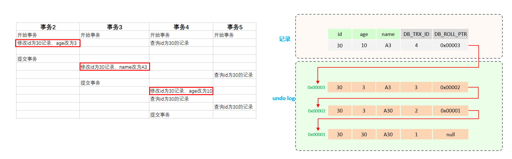

也就是说，不同事务或相同事务对同一条记录进行修改，会导致该记录的undolog生成一条记录版本链表，链表的头部是最新的旧记录，链表尾部是最早的旧记录。

最后看事务5，它并没有修改数据，而只是查询了两次数据，回到起初的那个问题，事务5对数据的两次查询，查的是哪个事务版本的记录呢？

当然这个也不是undo log版本链能决定的，他只是做一个记录，具体的判断依据还需要了解MVCC中最后一个内容，**readView**。

**readview**

ReadView（读视图）是 **快照读** SQL执行时提取数据的依据，记录了**当前活跃（未提交）事务的 ID 列表**，并设定了一个可见性的判断规则。

那什么是快照读呢？

这里有两个概念，**当前读**和**快照读**

**当前读**指的是读取记录的最新版本（已提交的），读取时会对数据加锁，保证其他并发事务无法修改这条记录。

常见的当前读操作包括：`SELECT ... LOCK IN SHARE MODE`（加共享锁）、`SELECT ... FOR UPDATE`、`UPDATE`、`INSERT`、`DELETE`（加排它锁）。

例如，当一个事务执行 `UPDATE` 修改某行数据时，会为该行加上排它锁（X锁）。在事务提交或回滚之前，其他事务无法对这行数据进行当前读，只能等待锁释放。

需要注意的是，当前读加的锁不会阻塞普通的快照读（即无锁的普通 `SELECT`），快照读仍可以通过读取历史版本获得一致性视图。

**快照读**就是执行普通的 `SELECT` 查询（不加锁），它读取的是记录的“可见版本”，有时候可能是历史数据。因为不加锁，所以快照读是非阻塞的，也就是不会影响其他事务的操作。

ReadView中记录的具体内容包含了四个核心字段：

- **m_ids**：当前活跃的事务ID集合
- **min_trx_id**：最小活跃事务ID
- **max_trx_id**：最大活跃事务ID，当前最大事务ID+1（因为事务ID是自增的）
- **creator_trx_id**：ReadView创建者的事务ID

活跃的事务指的是未提交的事务，如图事务5在执行第一次查询时，事务2已提交，事务3、4、5未提交，此时事务3、4、5就是活跃事务。当然，目前事务3、4、5最小的就是3，因此最小活跃事务ID就是事务3；最大的是5，因此最大活跃事务ID就是事务5 ；因为目前是事务5在执行快照读，因此ReadView创建者的事务ID就是事务5。

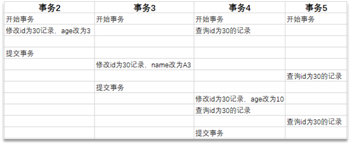

在不同的隔离级别下，ReadView的生成时机也有区别。

- Read Committed：每次快照读，都生成一个ReadView。

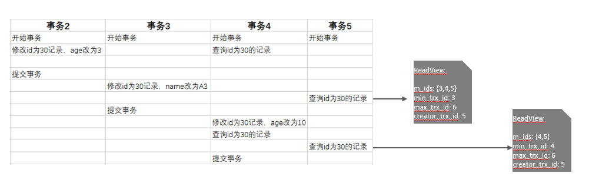

- Repeatable Read：开启事务后第一个快照读才是生成ReadView的地方，后续都服用该ReadView。

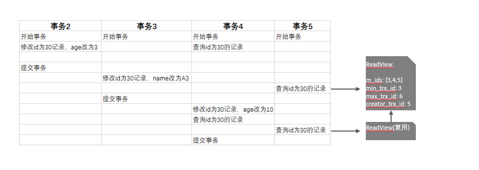

那记录这些字段有什么作用呢？还记得前面讲过的**undo log版本链**吗？

为了能从**undo log版本链**中获取正确的数据，readview 还根据这些字段定义了一些数据访问的规则，如下。


图中的trx_id其实指的就是**undo log版本链**每一个数据版本的**DB_TRX_ID**字段，执行快照读时，我们先从最新的数据版本开始，将**DB_TRX_ID**代入规则，直到找到第一个可以访问的数据版本，就是当前快照读能够访问的版本。

> **面试官**：事务中的隔离性是如何保证的呢？(你解释一下MVCC)
>
> **候选人**：事务的隔离性是由锁和mvcc实现的。
>
> 其中mvcc的意思是多版本并发控制。指维护一个数据的多个版本，使得读写操作没有冲突，它的底层实现主要是分为了三个部分，第一个是隐藏字段，第二个是undo log日志，第三个是readView读视图
>
> 隐藏字段是指：在mysql中给每个表都设置了隐藏字段，有一个是trx_id(事务id)，记录每一次操作的事务id，是自增的；另一个字段是roll_pointer(回滚指针)，指向上一个版本的事务版本记录地址
>
> undo log主要的作用是记录回滚日志，存储老版本数据，在内部会形成一个版本链，在多个事务并行操作某一行记录，记录不同事务修改数据的版本，通过roll_pointer指针形成一个链表
>
> readView解决的是一个事务查询选择版本的问题，在内部定义了一些匹配规则和当前的一些事务id判断该访问那个版本的数据，不同的隔离级别快照读是不一样的，最终的访问的结果不一样。如果是rc隔离级别，每一次执行快照读时生成ReadView，如果是rr隔离级别仅在事务中第一次执行快照读时生成ReadView，后续复用

## 其他

### MySQL主从同步原理 

主从架构

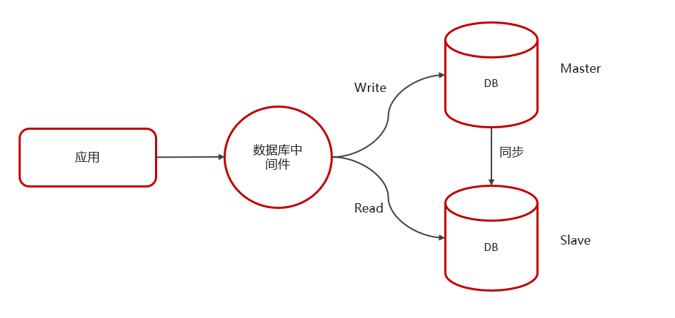

MySQL主从复制的核心就是二进制日志，二进制日志（BINLOG）记录了所有的 DDL（数据定义语言）语句和 DML（数据操纵语言）语句，但不包括数据查询（SELECT、SHOW）语句。

复制分成三步：

- Master 主库在事务提交时，会把数据变更记录在二进制日志文件 Binlog 中。
- 从库读取主库的二进制日志文件 Binlog ，写入到从库的中继日志 Relay Log 。
- Slave重做中继日志中的事件，将改变反映它自己的数据。

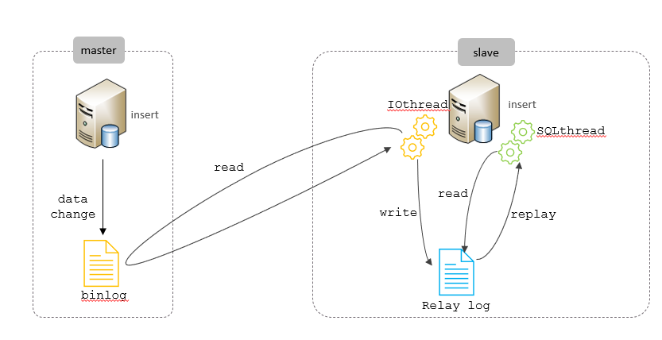

> **面试官**：MySQL主从同步原理 
>
> **候选人**：MySQL主从复制的核心就是二进制日志(DDL（数据定义语言）语句和 DML（数据操纵语言）语句)，它的步骤是这样的：
>
> 第一：主库在事务提交时，会把数据变更记录在二进制日志文件 Binlog 中。
>
> 第二：从库读取主库的二进制日志文件 Binlog ，写入到从库的中继日志 Relay Log 。
>
> 第三：从库重做中继日志中的事件，将改变反映它自己的数据

### MySQL分库分表

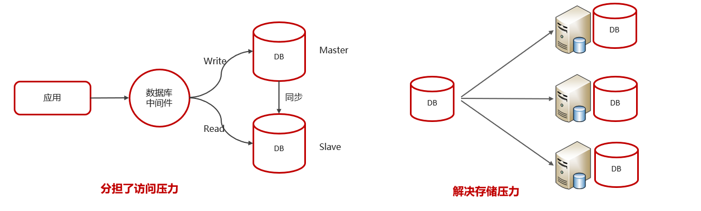

主从架构的话是解决不了海量数据存储的问题的，因为主从架构的主库和从库里的数据是一样的，它主要解决的是访问的压力，让读写分开进行访问，分担压力。

如果想要缓解海量数据存储的压力，就需要分库分表了。

但是，分库分表是有前提的，这个前提就是海量数据，一般到达以下时机，可以考虑分库分表

- 项目业务数据逐渐增多，或业务发展比较迅速，单表的数据量达**1000W**或**20G**以后
- 优化已解决不了性能问题（主从读写分离、查询索引…）
- IO瓶颈（磁盘IO、网络IO）、CPU瓶颈（聚合查询、连接数太多）

**拆分策略**

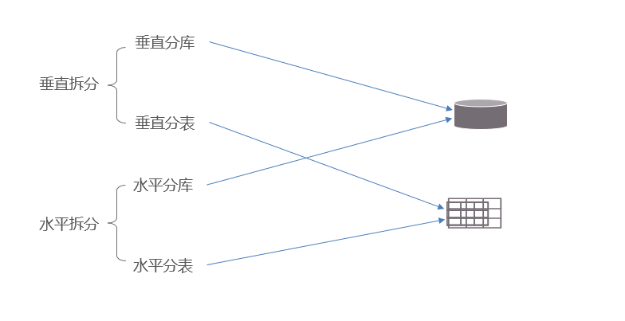

- 垂直分库

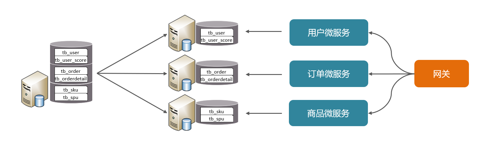

以表为依据，根据业务将不同表拆分到不同库中。

特点：

1. 按业务对数据分级管理、维护、监控、扩展
2. 在高并发下，提高磁盘IO和数据量连接数

- 垂直分表

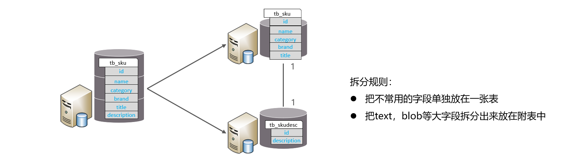

以字段为依据，根据字段属性将不同字段拆分到不同表中（不一定拆分到不同库中）

特点：

1. 冷热数据分离
2. 减少IO过渡争抢，两表互不影响

- 水平分库

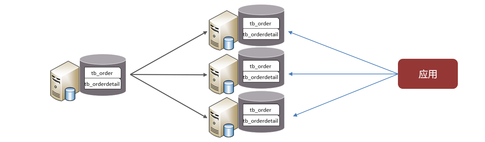

将一个库的数据拆分到多个库中。

拆分后所有库的数据整合起来才是某个业务的所有数据，因此需要考虑数据访问路由规则。

1. 根据id节点取模
2. 按id也就是范围路由，节点1(1-100万 ),节点2(100万-200万)
3. 其他字段。。。

特点：

1. 解决了单库大数量，高并发的性能瓶颈问题
2. 提高了系统的稳定性和可用性

- 水平分表

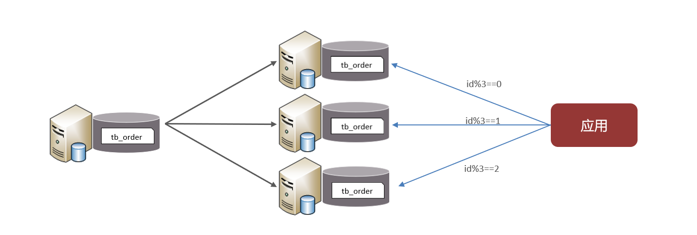

将一个表的数据拆分到多个表中(可以在同一个库内)。同样需要考虑路由规则。

特点：

1. 优化单一表数据量过大而产生的性能问题;
2. 避免IO争抢并减少锁表的几率;

> **面试官**：那你之前使用过水平分库吗？
>
> **候选人**：
>
> 嗯，这个是使用过的，我们当时的业务是(xxx)，一开始，我们也是单库，后来这个业务逐渐发展，业务量上来的很迅速，其中(xx)表已经存放了超过1000万的数据，我们做了很多优化也不好使，性能依然很慢，所以当时就使用了水平分库。
>
> 我们一开始先做了3台服务器对应了3个数据库，由于库多了，需要分片，我们当时采用的mycat来作为数据库的中间件。数据都是按照id（自增）取模的方式来存取的。
>
> 当然一开始的时候，那些旧数据，我们做了一些清洗的工作，我们也是按照id取模规则分别存储到了各个数据库中，好处就是可以让各个数据库分摊存储和读取的压力，解决了我们当时性能的问题

**新的问题和新的技术**

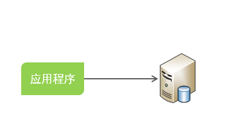

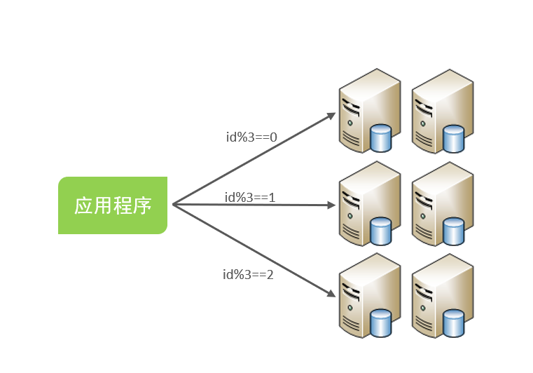

从原先的单库到多库，肯定会产生一系列的问题，如：

- 分布式事务一致性问题
- 跨节点联表查询
- 跨节点分页、排序函数
- 主键避重

针对这些问题，我们可以考虑使用中间件，降低开发的难度。

主流的关于分库分表问题的中间件如下：

分库分表中间件：

- sharding-sphere
- mycat

一般项目中如果进行了分库分表，就可以考虑上这些中间件了。

> **面试官**：那你之前使用过水平分库吗？
>
> **候选人**：
>
> 嗯，这个是使用过的，我们当时的业务是(xxx)，一开始，我们也是单库，后来这个业务逐渐发展，业务量上来的很迅速，其中(xx)表已经存放了超过1000万的数据，我们做了很多优化也不好使，性能依然很慢，所以当时就使用了水平分库。
>
> 我们一开始先做了3台服务器对应了3个数据库，由于库多了，需要分片，我们当时采用的mycat来作为数据库的中间件。数据都是按照id（自增）取模的方式来存取的。
>
> 当然一开始的时候，那些旧数据，我们做了一些清洗的工作，我们也是按照id取模规则分别存储到了各个数据库中，好处就是可以让各个数据库分摊存储和读取的压力，解决了我们当时性能的问题

