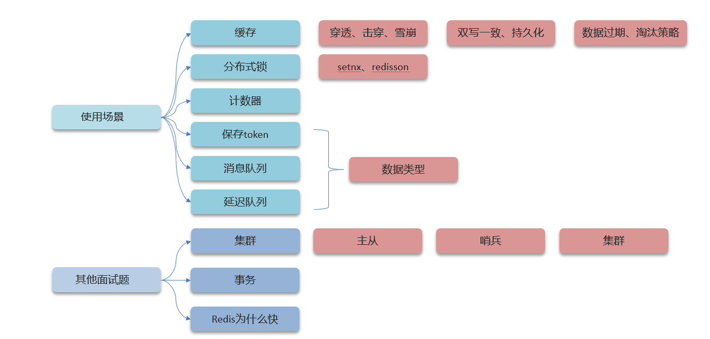
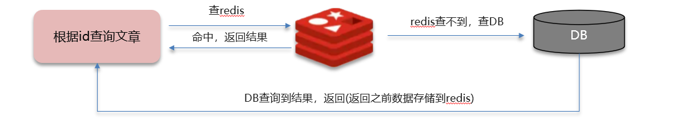
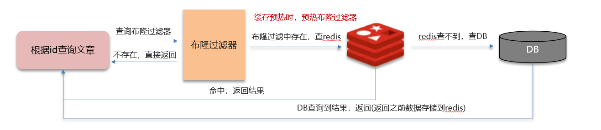
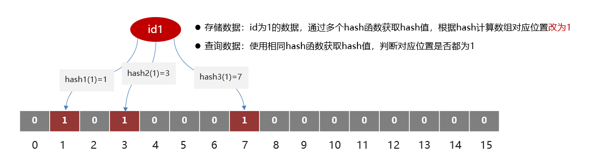
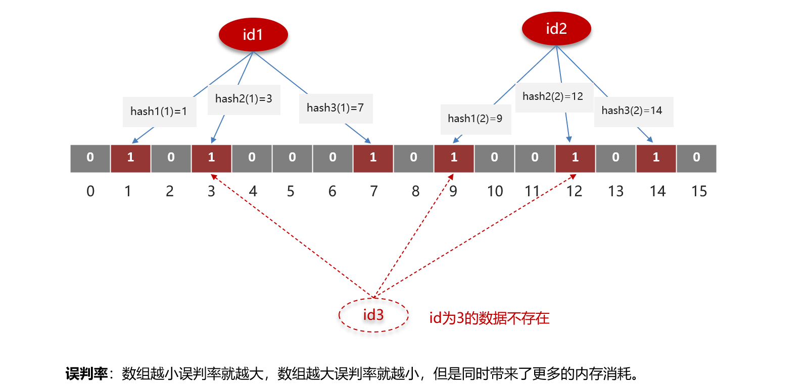

# Redis

## 使用场景

### Redis常见的使用场景？

- 缓存（穿透、击穿、雪崩、双写一致、持久化、数据过期策略，数据淘汰策略）
- 分布式锁（setnx、redisson）
- 消息队列、延迟队列、排行榜（数据类型）

### Redis的基本数据类型？

Redis 有五种基本数据类型，这五种数据类型分别是：字符串（String）、哈希（Hash）、列表（List）、集合（Set）、有序集合（Sorted Set，也叫 Zset）。

**字符串（String）**

字符串是最基础的数据类型，key是字符串，value可以是字符串、数字或者是二进制（图像、音频、视频......）。

典型使用场景：

- 计数器
- 缓存
- 分布式锁
- 保存token

**哈希（Hash）**

键值对集合，key 是字符串，value 是一个 map 集合，比如说 `value = {name: '小智', age: 18}`，`name` 和 `age` 属于键，`小智` 和 `18` 属于值 。

典型应用场景：存储对象属性（如用户ID对应姓名、年龄等）。

**列表（List）**

双向链表结构，元素从左到右组成一个有序的集合，支持头尾插入/弹出，元素可重复。

典型使用场景：

- 消息队列
- 文章列表

**集合（Set）**

无序且元素唯一，支持交、并、差运算。

典型使用场景：

- 标签系统（去重）
- 共同好友（交集）

**有序集合（Zset）**

元素唯一，每个元素关联一个分数（score）用于排序。

典型使用场景：

- 排行榜（如游戏积分排序）
- 延时队列（按时间戳排序）

### 缓存穿透、缓存击穿、缓存雪崩

#### 什么是缓存穿透 ? 怎么解决 ?

缓存穿透是缓存系统中常见的一种问题，指查询一个数据库中不存在的数据，导致请求直接穿透缓存层，频繁访问数据库的现象。如果恶意攻击者利用这一漏洞发起大量无效请求，可能导致数据库负载过高甚至崩溃。

**解决方案一  缓存空值/默认值**

从数据库查询出来的数据为空，依然把这个空值或者设置一个默认值写入缓存，并设置一个合理的过期时间，优点是实现简单，缺点是过期时间难以设置，可能会导致大量内存浪费，还要注意数据不一致的问题，如某个键本来不存在数据，在查询后将空值写入缓存，但后来又新增了数据。

**解决方案二  布隆过滤器**

通过布隆过滤器存储所有可能存在的合法数据的键，当请求到达时，先通过布隆过滤器判断该键是否存在：

- 如果布隆过滤器认为该键不存在，直接返回空，不会执行后续查询。
- 如果布隆过滤器认为该键可能存在，则查询缓存和数据库。

优点是内存占用较少，不存在多余的key，缺点是实现复杂，存在误判率。

**布隆过滤器**

首先要知道一个概念，**位图（bitmap）**，它相当于是一个以（bit）位为单位的数组，数组中每个单位只能存储二进制数0或1。

而布隆过滤器的实现主要依赖于位图，它利用位图来判断一个元素是否存在一个集合中，实现细节如图：

但它是存在误判率的：

实际上，在具体的实现方案中，我们通常是可以去控制这个误判率的，像 `Redisson` 和 `Guava` 都提供了布隆过滤器的具体实现方案，它们也都提供了对设置误判率的支持。

#### 什么是缓存击穿 ? 怎么解决 ?

#### 什么是缓存雪崩? 怎么解决 ?

