# Redis

## 使用场景

### Redis常见的使用场景？

- 缓存（穿透、击穿、雪崩、双写一致、持久化、数据过期策略，数据淘汰策略）
- 分布式锁（setnx、redisson）
- 消息队列、延迟队列、排行榜（数据类型）

### Redis的基本数据类型？

Redis 有五种基本数据类型，这五种数据类型分别是：字符串（String）、哈希（Hash）、列表（List）、集合（Set）、有序集合（Sorted Set，也叫 Zset）。

**字符串（String）**

字符串是最基础的数据类型，key是字符串，value可以是字符串、数字或者是二进制（图像、音频、视频......）。

典型使用场景：

- 计数器
- 缓存
- 分布式锁
- 保存token

**哈希（Hash）**

键值对集合，key 是字符串，value 是一个 map 集合，比如说 `value = {name: '小智', age: 18}`，`name` 和 `age` 属于键，`小智` 和 `18` 属于值 。

典型应用场景：存储对象属性（如用户ID对应姓名、年龄等）。

**列表（List）**

双向链表结构，元素从左到右组成一个有序的集合，支持头尾插入/弹出，元素可重复。

典型使用场景：

- 消息队列
- 文章列表

**集合（Set）**

无序且元素唯一，支持交、并、差运算。

典型使用场景：

- 标签系统（去重）
- 共同好友（交集）

**有序集合（Zset）**

元素唯一，每个元素关联一个分数（score）用于排序。

典型使用场景：

- 排行榜（如游戏积分排序）
- 延时队列（按时间戳排序）

### 什么是缓存穿透 ? 怎么解决 ?

缓存穿透是缓存系统中常见的一种问题，指查询一个数据库中不存在的数据，导致请求直接穿透缓存层，频繁访问数据库的现象。如果恶意攻击者利用这一漏洞发起大量无效请求，可能导致数据库负载过高甚至崩溃。

**解决方案一  缓存空值/默认值**

从数据库查询出来的数据为空，依然把这个空值或者设置一个默认值写入缓存，并设置一个合理的过期时间，优点是实现简单，缺点是过期时间难以设置，可能会导致大量内存浪费，还要注意数据不一致的问题，如某个键本来不存在数据，在查询后将空值写入缓存，但后来又新增了数据。

**解决方案二  布隆过滤器**

通过布隆过滤器存储所有可能存在的合法数据的键，当请求到达时，先通过布隆过滤器判断该键是否存在：

- 如果布隆过滤器认为该键不存在，直接返回空，不会执行后续查询。
- 如果布隆过滤器认为该键可能存在，则查询缓存和数据库。

优点是内存占用较少，不存在多余的key，缺点是实现复杂，存在误判率。

**布隆过滤器**

首先要知道一个概念，**位图（bitmap）**，它相当于是一个以（bit）位为单位的数组，数组中每个单位只能存储二进制数0或1。

而布隆过滤器的实现主要依赖于位图，它利用位图来判断一个元素是否存在一个集合中，实现细节如图：

但它是存在误判率的：

实际上，在具体的实现方案中，我们通常是可以去控制这个误判率的，像 `Redisson` 和 `Guava` 都提供了布隆过滤器的具体实现方案，它们也都提供了对设置误判率的支持。

> **面试官**：什么是缓存穿透 ? 怎么解决 ?
>
> **候选人**：
>
> 嗯~~，我想一下
>
> 缓存穿透是指查询一个一定**不存在**的数据，如果从存储层查不到数据则不写入缓存，这将导致这个不存在的数据每次请求都要到 DB 去查询，可能导致 DB 挂掉。这种情况大概率是遭到了攻击。
>
> 解决方案的话，我们通常都会用布隆过滤器来解决它
>
> **面试官**：好的，你能介绍一下布隆过滤器吗？
>
> **候选人**：
>
> 嗯，是这样~
>
> 布隆过滤器主要是用于检索一个元素是否在一个集合中。我们当时使用的是redisson实现的布隆过滤器。
>
> 它的底层主要是先去初始化一个比较大数组，里面存放的二进制0或1。在一开始都是0，当一个key来了之后经过3次hash计算，模于数组长度找到数据的下标然后把数组中原来的0改为1，这样的话，三个数组的位置就能标明一个key的存在。查找的过程也是一样的。
>
> 当然是有缺点的，布隆过滤器有可能会产生一定的误判，我们一般可以设置这个误判率，大概不会超过5%，其实这个误判是必然存在的，要不就得增加数组的长度，其实已经算是很划分了，5%以内的误判率一般的项目也能接受，不至于高并发下压倒数据库。

### 什么是缓存击穿 ? 怎么解决 ?

缓存击穿指给某一个key设置了过期时间，当key过期的时候，恰好这时间点对这个key有大量的并发请求过来，这些并发的请求可能会瞬间把数据库压垮

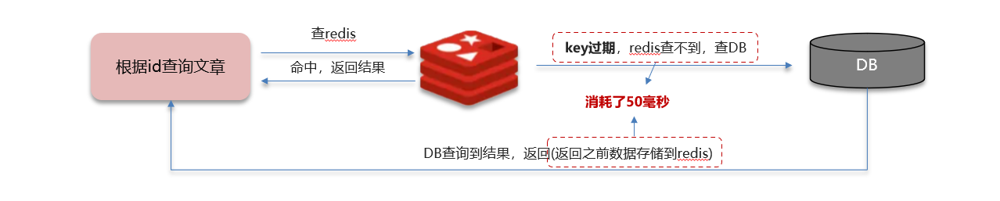

**解决方案一：**互斥锁

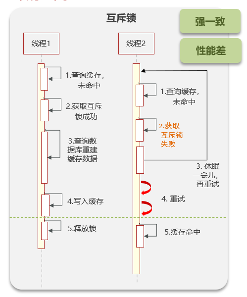

**解决方案二：**逻辑过期

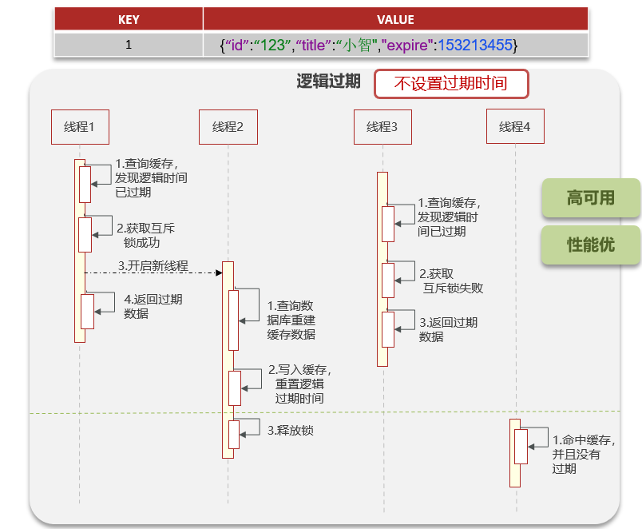

> **面试官**：什么是缓存击穿 ? 怎么解决 ?
>
> **候选人**：
>
> 嗯！！
>
> 缓存击穿的意思是对于设置了过期时间的key，缓存在某个时间点过期的时候，恰好这时间点对这个Key有大量的并发请求过来，这些请求发现缓存过期一般都会从后端 DB 加载数据并回设到缓存，这个时候大并发的请求可能会瞬间把 DB 压垮。
>
> 解决方案有两种方式：
>
> 第一可以使用互斥锁：当缓存失效时，不立即去load db，先使用如 Redis 的 setnx 去设置一个互斥锁，当操作成功返回时再进行 load db的操作并回设缓存，否则重试get缓存的方法
>
> 第二种方案可以设置当前key逻辑过期，大概是思路如下：
>
> ①：在设置key的时候，设置一个过期时间字段一块存入缓存中，不给当前key设置过期时间
>
> ②：当查询的时候，从redis取出数据后判断时间是否过期
>
> ③：如果过期则去设置一个互斥锁，如果设置成功就去开通另外一个线程进行数据同步，同步完成后释放锁，而当前线程正常返回数据，这个数据不是最新的
>
> 当然两种方案各有利弊：
>
> 如果选择数据的强一致性，建议使用分布式锁的方案，性能上可能没那么高，锁需要等，也有可能产生死锁的问题
>
> 如果选择key的逻辑删除，则优先考虑的高可用性，性能比较高，但是数据同步这块做不到强一致。

### 什么是缓存雪崩? 怎么解决 ?

缓存雪崩是指在同一时段大量的缓存key同时失效或者Redis服务宕机，导致大量请求到达数据库，带来巨大压力。

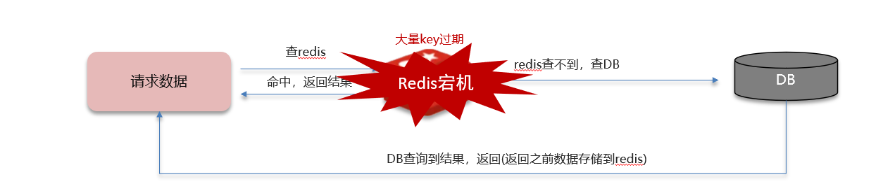

**解决方案：**

- 给不同的Key的TTL添加随机值
- 利用Redis集群提高服务的可用性（哨兵模式、集群模式）
- 给缓存业务添加降级限流策略（ngxin或spring cloud gateway)
- 给业务添加多级缓存(Guava或Caffeine)

> **面试官**：什么是缓存雪崩 ? 怎么解决 ?
>
> **候选人**：
>
> 嗯！！
>
> 缓存雪崩意思是设置缓存时采用了相同的过期时间，导致缓存在某一时刻同时失效，请求全部转发到DB，DB 瞬时压力过重雪崩。与缓存击穿的区别：雪崩是很多key，击穿是某一个key缓存。
>
> 解决方案主要是可以将缓存失效时间分散开，比如可以在原有的失效时间基础上增加一个随机值，比如1-5分钟随机，这样每一个缓存的过期时间的重复率就会降低，就很难引发集体失效的事件。

### 双写一致

双写一致：当修改了数据库的数据也要同时更新缓存的数据，缓存和数据库的数据要保持一致。

**先更新数据库，还是先更新缓存？**

先说结论，两种方式都行不通，详情见下图。

- 先更新数据库，再更新缓存

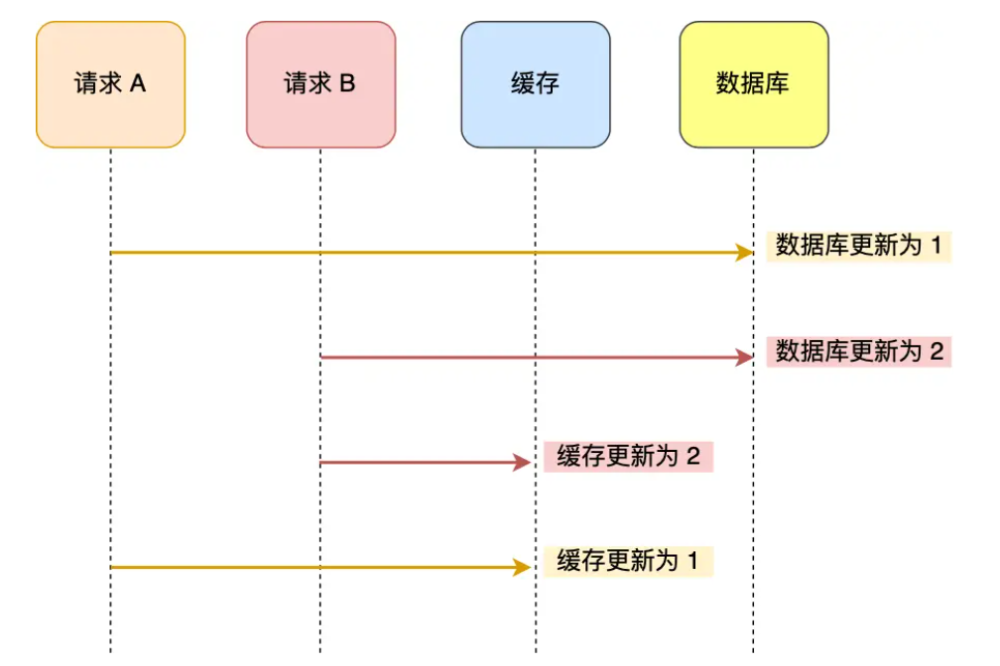

线程A和线程B同时修改数据，最终数据库中的数据为2，缓存中的数据为1。

- 先更新缓存，再更新数据库

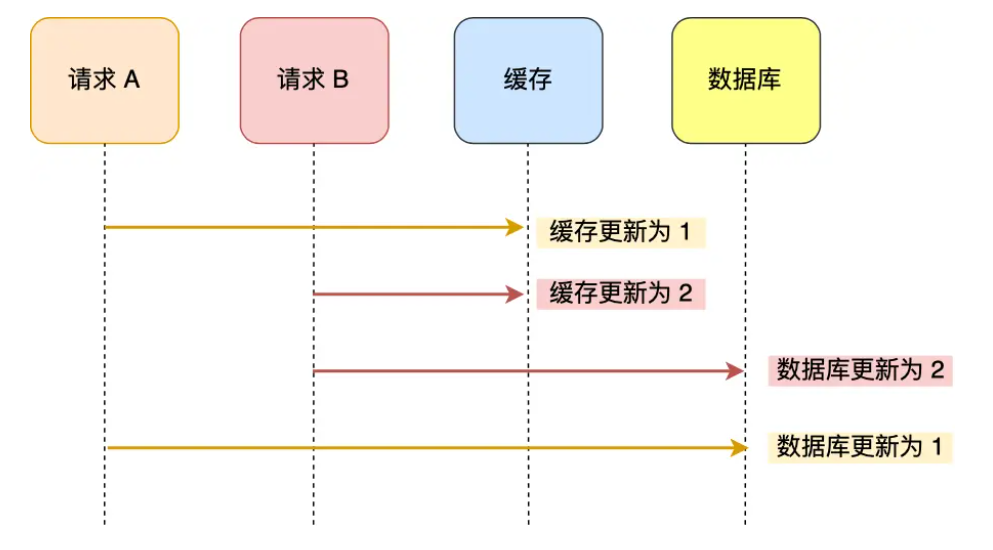

线程A和线程B同时修改数据，最终数据库中的数据为1，缓存中的数据为2。

可见，在并发环境下，无论是先更新数据库，还是先更新缓存，都有可能出现数据库与缓存数据不一致的现象。

另外更新缓存的代价有时候是很高的。是不是说，每次修改数据库的时候，都一定要将其对应的缓存更新一份?也许有的场景是这样，但是对于比较复杂的缓存数据计算的场景，就不是这样了。如果你频繁修改一个缓存涉及的多个表，缓存也频繁更新，问题就来了，这个缓存会不会被频繁访问到？如果不会被频繁访问到，那每次修改都直接更新缓存，是不是就很浪费性能了。

一般我们在面对双写一致问题时，采用的都是`Cache Aside`策略，中文叫做旁路缓存策略。`Cache Aside`指的是在更新数据库时，直接删除缓存，等待下一次读取数据时，无法命中缓存，再从数据库里获取最新数据，加载到缓存中。该策略又可以细分为读策略和写策略。

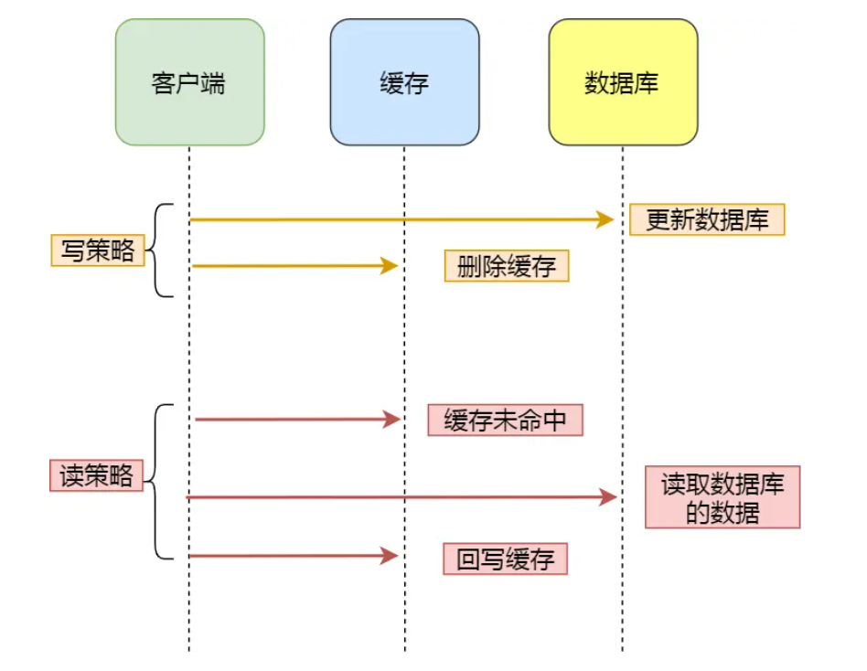

**新的问题——先更新数据库，还是先删除缓存？**

- 先删除缓存，再更新数据库

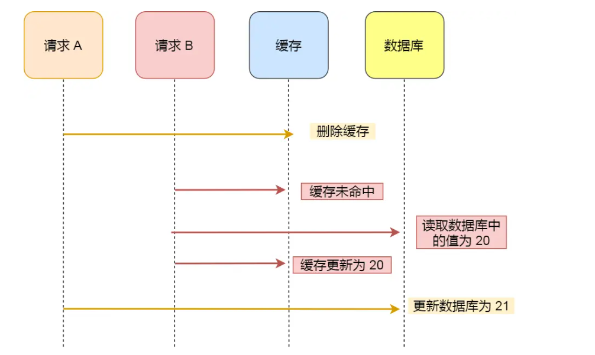

最终，该数据在数据库中的值为21，在缓存中的值为20。

可以看到，先删除缓存再更新数据库，在`读+写`的并发下，还是会出现数据不一致的问题。

- 先更新数据库，再删除缓存

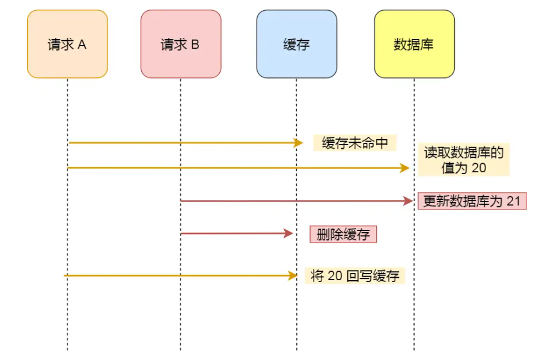

最终，该数据在数据库中的值为21，在缓存中的值为20。

从上面的理论分析结果来看，先更新数据库，再删除缓存的方案似乎也是行不通的，但实际上，像图中那样的情况出现的概率并不高，首先要刚好在数据不存在缓存中的时候，而且请求B读取数据库要在线程A更新数据库之前，但是缓存的写入通常远远快于数据库的写入，所以很难出现请求B已经更新完数据库且删除缓存后，请求A才更新缓存的情况。

只要请求A回写缓存的操作在请求B删除缓存之前，后续的请求就会因为缓存未命中而进入数据库重新读取到最新的数据，就不会出现数据不一致的情况。

所以，先更新数据库 + 再删除缓存的方案，很大程度上是可以保证数据一致性的。

当然，我们还可以给缓存加上过期时间，就算在这期间出现了数据不一致的情况，有过期时间来兜底，这样也能达到最终一致。

上面的方案看起来天衣无缝，但很遗憾，还是有问题。

先更新数据库，再删除缓存其实是两个操作，前面的分析忽略了这两个操作无法同时执行成功的可能，如果第二个操作删除缓存失败了，就会导致缓存中的数据依然是旧数据的情况。

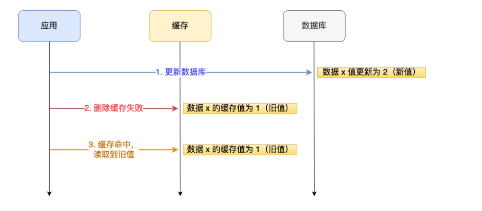

但不是还设置了过期时间吗？等缓存过期了，不是还会从数据库中拉起到最新数据吗？

过期时间的设置确实能保证数据的最终一致性，但从用户的角度来看，这样的方案带来的体验很差，如果用户在修改数据时，系统的第二个操作删除缓存失败了，就会导致用户要等待很长一段时间，才能看到自己修改数据生效。那如果把过期时间设置的很短呢？如果过期时间设置的过于短了，就会对缓存的命中率造成很大的影响，导致要频繁的执行访问数据库，回写缓存的操作，这样缓存就没啥意义了，还不如不要缓存。

所以新的问题来了，**如何保证先更新数据库，再删除缓存这两个操作都能执行成功？**

有两种方法：

- 消息队列重试机制

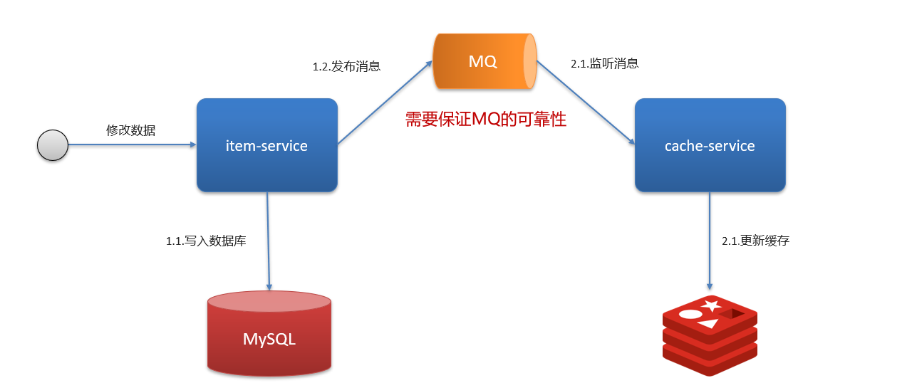

我们可以引入消息队列，将第二个操作（删除缓存）要操作的数据交给消息队列，然后消息队列通知应用的消费者来执行。如果删除缓存失败，可以从消息队列中重新读取数据，然后再次删除缓存，这个就是重试机制。当然，如果重试超过一定次数，还是没成功，就需要业务层发送报错信息了。

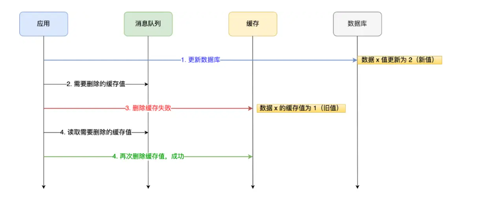

这个方案的缺点是，对代码的侵入性较强，因为它需要改造原来的业务代码。

- 订阅 MySQL binlog，再操作缓存

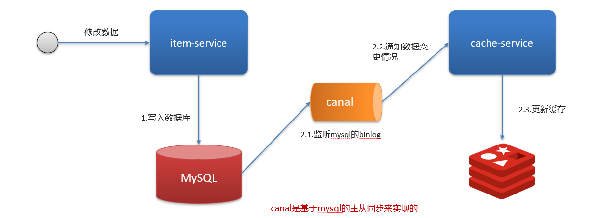

先更新数据库，再删除缓存的第一步是先更新数据库，那么只要更新数据库成功，就会在 binlog 里生成一条变更日志。于是我们就可以通过订阅 binlog 日志，拿到要操作的具体数据，再执行删除缓存，阿里巴巴开源的中间件 Canal 就是基于这个实现的。

Canal 服务把自己伪装成 MySQL 的一个从节点，当 MySQL 数据更新以后，Canal 会读取 binlog 数据，然后缓存服务再通过 Canal 的客户端获取到数据，删除缓存即可。

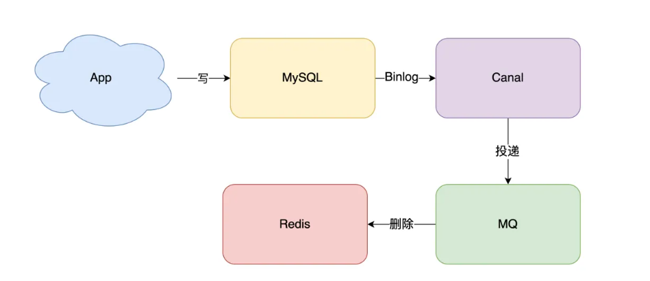

前面说过消息队列重试机制的代码侵入性强，那么Canal 方案就可以很好的规避这个问题，但缺点就是额外引入组件，会增加运维的复杂度。

**延迟双删和主从库延迟**

前面分析过，「先更新数据库，再删除缓存」在极端情况下有可能导致数据不一致。

其实在「先更新数据库，再删除缓存」方案下，「读写分离 + 主从库延迟」也可能导致数据不一致：

- 线程 A 更新主库 X = 2（原值 X = 1）
- 线程 A 删除缓存
- 线程 B 查询缓存，没有命中，查询「从库」得到旧值（从库 X = 1）
- 从库「同步」完成（主从库 X = 2）
- 线程 B 将「旧值」写入缓存（X = 1）

针对这两个问题有一个**理论上**的解决方案——**延迟双删**。

**延迟双删的核心逻辑分析：**

- **先删缓存**：强制后续读请求直接查数据库，避免读到旧值。
- **更新数据库**：完成数据持久化。
- **延迟等待**：关键设计，覆盖主从同步时间和可能的旧值回写窗口。
- **再删缓存**：清理期间可能被旧值污染的缓存

问题来了，为什么说是**理论上**的呢？

在分布式和高并发场景下，**延迟等待**的时间，其实是很难评估的，属于是玄学了。

很多时候，我们都是凭借经验大致估算这个延迟时间，例如延迟 1-5s，只能尽可能地降低不一致的概率。

所以你看，采用这种方案，也只是尽可能保证一致性而已，极端情况下，还是有可能发生不一致。

所以实际使用中，建议还是采用「先更新数据库，再删除缓存」的方案，同时，要尽可能地保证「主从复制」不要有太大延迟，降低出问题的概率。

**强一致**

以上所有分析，都是基于**最终一致**的思想进行的，那如果非要让缓存和数据库**强一致**呢？

可以加互斥锁

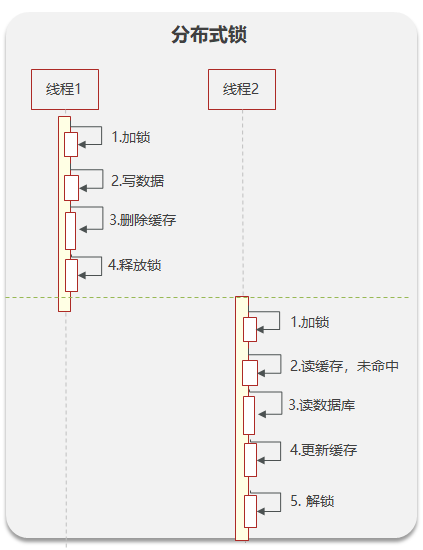

以上这种方式只能有一个线程读或写，其他线程需要等待锁释放，才能进行读或写，这样肯定就可以保持强一致性了，但是，这种方式的性能是非常低的。

可以稍微优化一下，要知道一个前提，一般存入缓存的数据，都是读多写少，如果写多读少，不建议存入缓存，直接操作数据库更省事，因此优化的方式就是用读写锁来代替互斥锁。读数据时添加共享锁，写数据时添加排他锁。

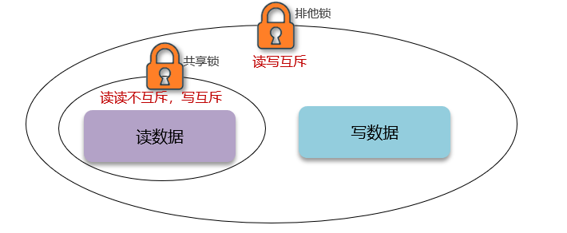

- **共享锁：**读锁readLock，加锁之后，其他线程可以共享读操作   
- **排他锁：**独占锁writeLock也叫，加锁之后，阻塞其他线程读写操作

这种方式既保证绝对的强一致，性能也比较好。具体实现代码如下图

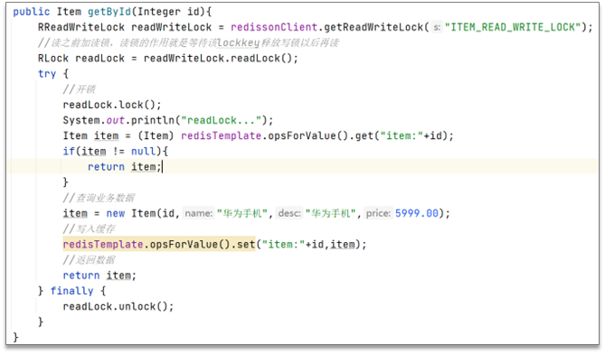

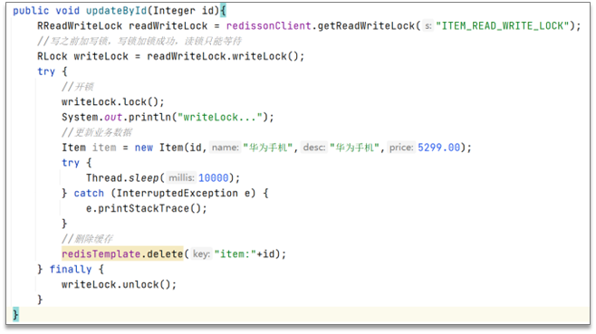

以上加锁的方案是基于**强一致**的思想实现的，跟**最终一致**的方案相比性能肯定是不高的，即使做了优化，加的是读写锁，但是写的时候依然会阻塞其他线程，读的时候也会阻塞其他写的线程。

**最终一致与强一致**

实际开发中，**最终一致**才是主流方案，除非业务要求必须**强一致**。

一般项目中引入缓存的目的是为了提升性能，但是性能和一致性就像天平的两端，无法做到同时满足。

就拿通过加锁实现**强一致**的方案来讲，加锁带来的性能损失有可能都超过了引入缓存带来的性能提升，那这样引入缓存就没有意义了。

因此，一般项目中既然决定使用缓存，为了性能的要求得到保证，就要容忍**一致性**问题，我们只能尽可能地去降低问题出现的概率。

而且缓存都是有**失效时间**的，就算在这期间存在短期不一致，我们依旧有失效时间来兜底，这样也能达到最终一致。

> **面试官**：redis做为缓存，mysql的数据如何与redis进行同步呢？（双写一致性）
>
> **候选人**：嗯！就说我最近做的这个项目，里面有xxxx（**根据自己的简历上写**）的功能，需要让数据库与redis高度保持一致，因为要求时效性比较高，我们当时采用的读写锁保证的强一致性。
>
> 我们采用的是redisson实现的读写锁，在读的时候添加共享锁，可以保证读读不互斥，读写互斥。当我们更新数据的时候，添加排他锁，它是读写，读读都互斥，这样就能保证在写数据的同时是不会让其他线程读数据的，避免了脏数据。这里面需要注意的是读方法和写方法上需要使用同一把锁才行。
>
> 
>
> **面试官**：那这个排他锁是如何保证读写、读读互斥的呢？
>
> **候选人**：其实排他锁底层使用也是setnx，保证了同时只能有一个线程操作锁住的方法
>
> 
>
> **面试官**：你听说过延时双删吗？为什么不用它呢？
>
> **候选人**：延迟双删，如果是写操作，我们先把缓存中的数据删除，然后更新数据库，最后再延时删除缓存中的数据，其中这个延时多久不太好确定，在延时的过程中可能会出现脏数据，并不能保证强一致性，所以没有采用它。
>
> 
>
> **面试官**：redis做为缓存，mysql的数据如何与redis进行同步呢？（双写一致性）
>
> **候选人**：嗯！就说我最近做的这个项目，里面有xxxx（**根据自己的简历上写**）的功能，数据同步可以有一定的延时（符合大部分业务）
>
> 我们当时采用的阿里的canal组件实现数据同步：不需要更改业务代码，部署一个canal服务。canal服务把自己伪装成mysql的一个从节点，当mysql数据更新以后，canal会读取binlog数据，然后在通过canal的客户端获取到数据，更新缓存即可。

### 持久化

Redis中提供了两种数据持久化的方式：1、RDB  2、AOF

**RDB**

RDB全称Redis Database Backup file（Redis数据备份文件），也被叫做Redis数据快照。简单来说就是把内存中的所有数据都记录到磁盘中。当Redis实例故障重启后，从磁盘读取快照文件，恢复数据。

Redis 提供了两个命令来生成 RDB 文件，分别是 save 和 bgsave：

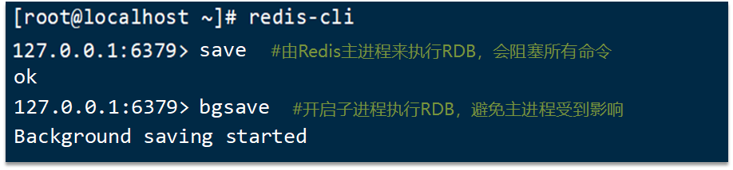

Redis内部有触发RDB的机制，可以在redis.conf文件中找到，格式如下：

选项名叫`save`,实际上执行的`bgsave`命令，也就是会创建子进程来生成 RDB 快照文件。只要满足上面条件的任意一个，就会执行 bgsave，它们的意思分别是：

- 900 秒之内，对数据库进行了至少 1 次修改；
- 300 秒之内，对数据库进行了至少 10 次修改；
- 60 秒之内，对数据库进行了至少 10000 次修改。

**RDB的执行原理？**

`bgsave`开始执行时会fork主进程得到子进程，子进程共享主进程的内存数据，完成fork后读取内存数据并写入 RDB 文件。这个操作是异步的，只有在fork主进程时会对主进程产生阻塞，但这个阻塞是纳秒级的，可以忽略不计，也就是对主进程几乎没有阻塞。

在Linux系统中，所有的进程都无法直接操作物理内存，而是由操作系统给每一个进程分配一个虚拟内存，然后操作系统会维护一个记录虚拟内存和物理内存之间的映射关系表，叫做页表。

现在有一个Redis的主进程，主进程只能操作虚拟内存，而虚拟内存基于页表的映射关联到物理内存中数据真正的存储位置，这样就能实现对物理内存的读写操作了。

前面讲过，执行`bgsave`会fork主进程创建一个子进程去执行RDB。而子进程会复制主进程的页表，因此子进程在操作自己的虚拟内存时，因为映射关系（页表）跟主进程是一样的，最终映射到的物理内存区域跟主进程肯定是一样的。这样就实现了主进程与子进程之间的内存共享了。无需拷贝物理内存中的数据，只需复制页表，这个速度是很快的，这样阻塞的时间就尽可能缩短了，也就是前面提到的纳秒级别的阻塞。

子进程拿到页表后，它就可以基于页表读到物理内存中的数据了，然后就可以把读到的数据写入磁盘中，一个新的RDB文件，写完后，新的RDB文件会替换旧的RDB文件。

子进程在写RDB的过程中，主进程依然可以接受用户的请求去修改内存中的数据，这就要考虑主进程和子进程之间的读写冲突问题了，毕竟操作的是同一块内存。为了避免这个问题的发生，fork底层采用了copy-on-write（写时复制）技术。

当执行`bgsave`时，会把共享内存标记为`read-only`（只读模式）。如果主进程执行读操作，则访问共享内存；如果主进程执行写操作时，则会拷贝一份数据，执行写操作，一旦拷贝数据之后，主进程在读数据时，读的也是新的数据了，页表的映射关系，也会映射到新的数据中去。当然子进程读的依然是原来的数据。

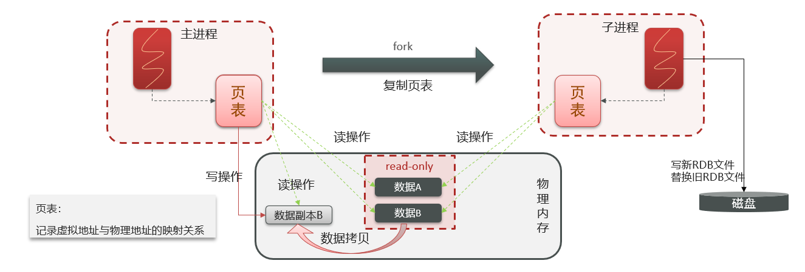

**AOF**

AOF全称为Append Only File（追加文件）。Redis处理的每一个写命令都会记录在AOF文件，可以看做是命令日志文件。

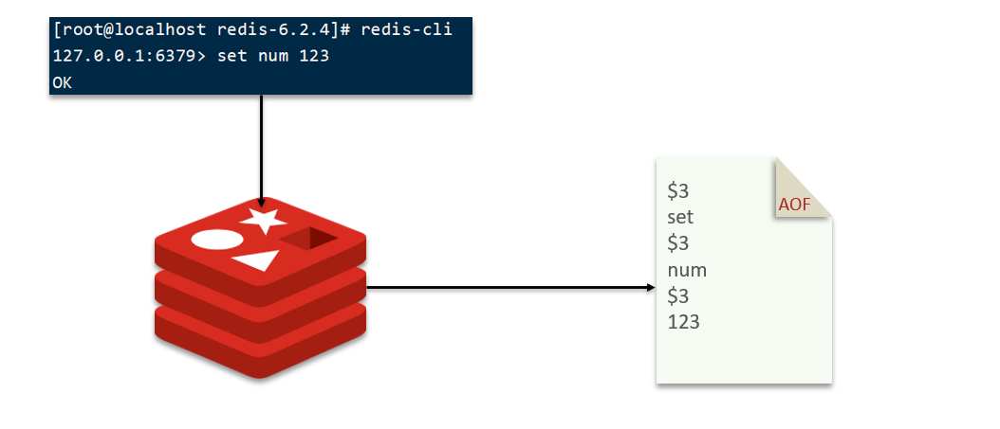

AOF默认是关闭的，需要修改redis.conf配置文件来开启AOF：

AOF的命令记录的频率（刷盘策略）也可以通过redis.conf文件来配：

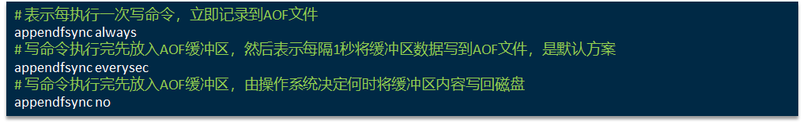

| **配置项** | **刷盘时机** | **优点**               | **缺点**                     |
| ---------- | ------------ | ---------------------- | ---------------------------- |
| always     | 同步刷盘     | 可靠性高，几乎不丢数据 | 性能影响大                   |
| everysec   | 每秒刷盘     | 性能适中               | 最多丢失1秒数据              |
| no         | 操作系统控制 | 性能最好               | 可靠性较差，可能丢失大量数据 |

一般项目中，采用的是 everysec。

因为是记录命令，AOF文件会比RDB文件大的多。而且AOF会记录对同一个key的多次写操作，但只有最后一次写操作才有意义。通过执行bgrewriteaof命令，可以让AOF文件执行重写功能，用最少的命令达到相同效果。

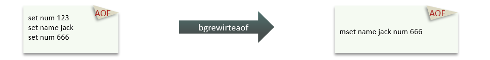

Redis也会在触发阈值时自动去重写AOF文件。阈值也可以在redis.conf中配置：

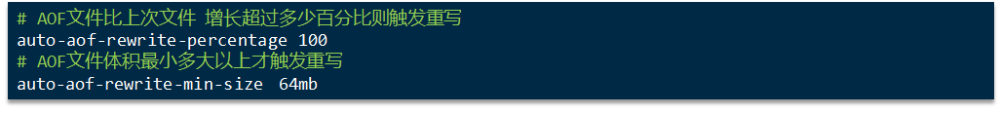

**RDB与AOF对比**

|                | **RDB**                                      | **AOF**                                                  |
| -------------- | -------------------------------------------- | -------------------------------------------------------- |
| 持久化方式     | 定时对整个内存做快照                         | 记录每一次执行的命令                                     |
| 数据完整性     | 不完整，两次备份之间会丢失                   | 相对完整，取决于刷盘策略                                 |
| 文件大小       | 会有压缩，文件体积小                         | 记录命令，文件体积很大                                   |
| 宕机恢复速度   | 很快                                         | 慢                                                       |
| 数据恢复优先级 | 低，因为数据完整性不如AOF                    | 高，因为数据完整性更高                                   |
| 系统资源占用   | 高，大量CPU和内存消耗                        | 低，主要是磁盘IO资源  但AOF重写时会占用大量CPU和内存资源 |
| 使用场景       | 可以容忍数分钟的数据丢失，追求更快的启动速度 | 对数据安全性要求较高常见                                 |

> **面试官**：redis做为缓存，数据的持久化是怎么做的？
>
> **候选人**：在Redis中提供了两种数据持久化的方式：1、RDB  2、AOF
>
> **面试官**：这两种持久化方式有什么区别呢？
>
> **候选人**：RDB是一个快照文件，它是把redis内存存储的数据写到磁盘上，当redis实例宕机恢复数据的时候，方便从RDB的快照文件中恢复数据。
>
> AOF的含义是追加文件，当redis操作写命令的时候，都会存储这个文件中，当redis实例宕机恢复数据的时候，会从这个文件中再次执行一遍命令来恢复数据
>
> **面试官**：这两种方式，哪种恢复的比较快呢？
>
> **候选人**：RDB因为是二进制文件，在保存的时候体积也是比较小的，它恢复的比较快，但是它有可能会丢数据，我们通常在项目中也会使用AOF来恢复数据，虽然AOF恢复的速度慢一些，但是它丢数据的风险要小很多，在AOF文件中可以设置刷盘策略，我们当时设置的就是每秒批量写入一次命令

### 数据的删除策略

Redis对数据设置数据的有效时间，数据过期以后，就需要将数据从内存中删除掉。可以按照不同的规则进行删除，这种删除规则就被称之为数据的删除策略（数据过期策略）。Redis里提供了两种数据的删除策略，惰性删除和定期删除。

**惰性删除**

惰性删除：设置该key过期时间后，我们不去管它，当需要该key时，我们在检查其是否过期，如果过期，我们就删掉它，反之返回该key

**优点** ：对CPU友好，只会在使用该key时才会进行过期检查，对于很多用不到的key不用浪费时间进行过期检查

**缺点** ：对内存不友好，如果一个key已经过期，但是一直没有使用，那么该key就会一直存在内存中，内存永远不会释放

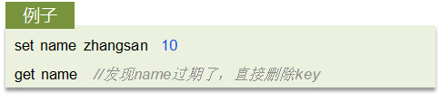

**定期删除**

每隔一段时间，我们就对一些key进行检查，删除里面过期的key(从一定数量的数据库中取出一定数量的随机key进行检查，并删除其中的过期key)。

定期清理有两种模式：

- SLOW模式是定时任务，执行频率默认为10hz，每次不超过25ms，以通过修改配置文件redis.conf 的hz 选项来调整这个次数
- FAST模式执行频率不固定（每次事件循环会尝试执行），但两次间隔不低于2ms，每次耗时不超过1ms

**优点**：可以通过限制删除操作执行的时长和频率来减少删除操作对 CPU 的影响。另外定期删除，也能有效释放过期键占用的内存。

**缺点**：难以确定删除操作执行的时长和频率。

Redis的过期删除策略：**惰性删除** **+** **定期删除**两种策略进行配合使用

> **面试官**：Redis的数据过期策略有哪些 ? 
>
> **候选人**：
>
> 嗯~，在redis中提供了两种数据过期删除策略
>
>
> 第一种是惰性删除，在设置该key过期时间后，我们不去管它，当需要该key时，我们在检查其是否过期，如果过期，我们就删掉它，反之返回该key。
>
> 第二种是 定期删除，就是说每隔一段时间，我们就对一些key进行检查，删除里面过期的key
>
> 定期清理的两种模式：
>
> - SLOW模式是定时任务，执行频率默认为10hz，每次不超过25ms，以通过修改配置文件redis.conf 的 **hz** 选项来调整这个次数
> - FAST模式执行频率不固定，每次事件循环会尝试执行，但两次间隔不低于2ms，每次耗时不超过1ms
>
> Redis的过期删除策略：**惰性删除 + 定期删除**两种策略进行配合使用。

### 数据的淘汰策略

当Redis中的内存不够用时，此时在向Redis中添加新的key，那么Redis就会按照某一种规则将内存中的数据删除掉，这种数据的删除规则被称之为内存的淘汰策略。

Redis支持8种不同策略来选择要删除的key：

- unoeviction： 不淘汰任何key，但是内存满时不允许写入新数据，默认就是这种策略。
- uvolatile-ttl： 对设置了TTL的key，比较key的剩余TTL值，TTL越小越先被淘汰
- uallkeys-random：对全体key ，随机进行淘汰。
- uvolatile-random：对设置了TTL的key ，随机进行淘汰。
- uallkeys-lru： 对全体key，基于LRU算法进行淘汰
- uvolatile-lru： 对设置了TTL的key，基于LRU算法进行淘汰
- uallkeys-lfu： 对全体key，基于LFU算法进行淘汰
- uvolatile-lfu： 对设置了TTL的key，基于LFU算法进行淘汰

**LRU和LFU**

**LRU**（**L**east **R**ecently **U**sed）最近最少使用。用当前时间减去最后一次访问时间，这个值越大则淘汰优先级越高。

**LFU**（**L**east **F**requently **U**sed）最少频率使用。会统计每个key的访问频率，值越小淘汰优先级越高。

**淘汰策略使用建议**

- 优先使用 allkeys-lru 策略。充分利用 LRU 算法的优势，把最近最常访问的数据留在缓存中。如果业务有明显的冷热数据区分，建议使用。
- 如果业务中数据访问频率差别不大，没有明显冷热数据区分，建议使用 allkeys-random，随机选择淘汰。
- 如果业务中有置顶的需求，可以使用 volatile-lru 策略，同时置顶数据不设置过期时间，这些数据就一直不被删除，会淘汰其他设置过期时间的数据。
- 如果业务中有短时高频访问的数据，可以使用 allkeys-lfu 或 volatile-lfu 策略。

> **面试官**：Redis的数据淘汰策略有哪些 ? 
>
> **候选人**：
>
> 嗯，这个在redis中提供了很多种，默认是noeviction，不删除任何数据，内部不足直接报错
>
> 是可以在redis的配置文件中进行设置的，里面有两个非常重要的概念，一个是LRU，另外一个是LFU
>
> LRU的意思就是最少最近使用，用当前时间减去最后一次访问时间，这个值越大则淘汰优先级越高。
>
> LFU的意思是最少频率使用。会统计每个key的访问频率，值越小淘汰优先级越高
>
> 我们在项目设置的allkeys-lru，挑选最近最少使用的数据淘汰，把一些经常访问的key留在redis中
>
> **面试官**：数据库有1000万数据 ,Redis只能缓存20w数据, 如何保证Redis中的数据都是热点数据 ?
>
> **候选人**：
>
> 嗯，我想一下~~
>
> 可以使用 allkeys-lru （挑选最近最少使用的数据淘汰）淘汰策略，那留下来的都是经常访问的热点数据
>
> **面试官**：Redis的内存用完了会发生什么？
>
> **候选人**：
>
> 嗯~，这个要看redis的数据淘汰策略是什么，如果是默认的配置，redis内存用完以后则直接报错。我们当时设置的 allkeys-lru 策略。把最近最常访问的数据留在缓存中。

### 分布式锁

分布式锁是用于分布式环境下并发控制的一种机制，用于控制某个资源在同一时刻只能被一个应用所使用。

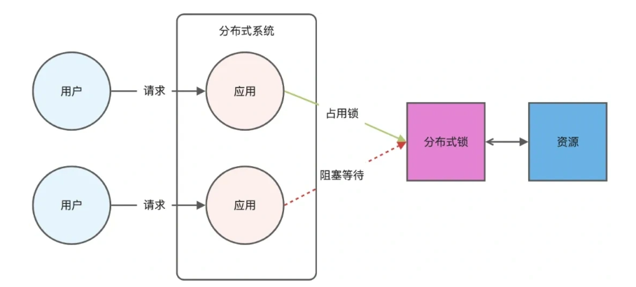

分布式锁使用的场景：集群情况下的定时任务、抢券抢单、幂等性场景

**抢券场景**

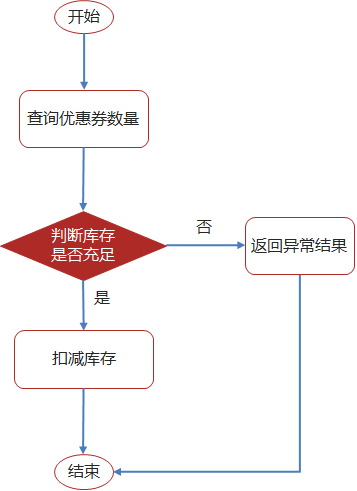

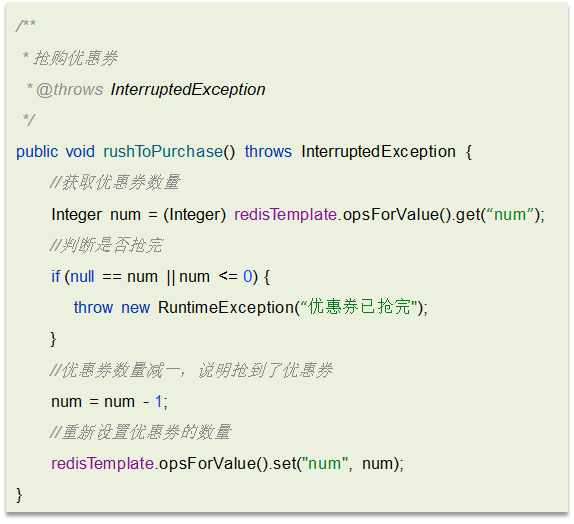

这个是正常的情况：

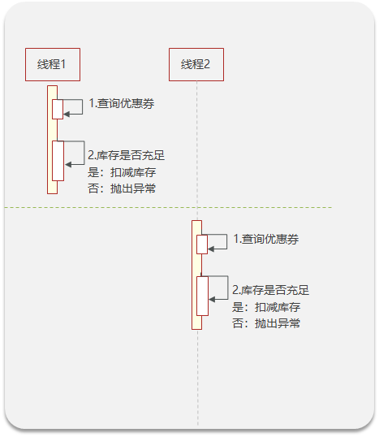

但因为线程之间是交替执行的，就有可能出现以下情况，如果库存刚好只剩一个，就出问题了（超卖问题）。

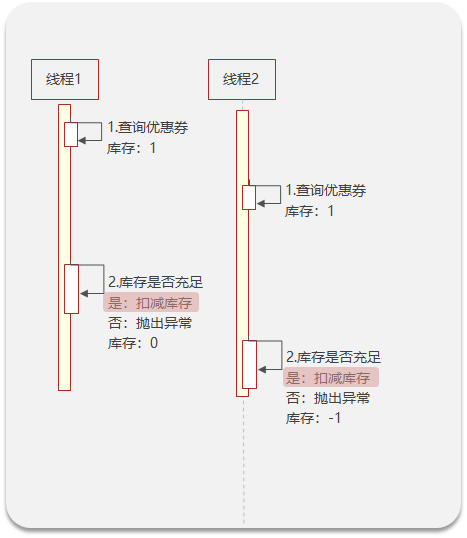

很容易可以想到使用`synchronized`锁

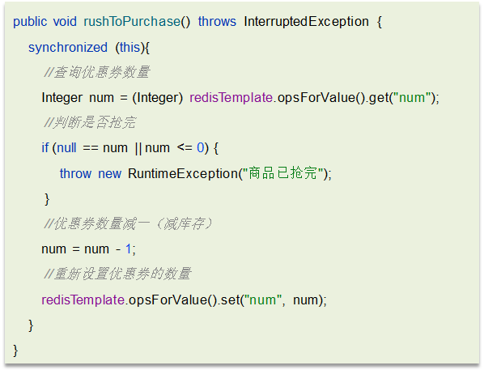

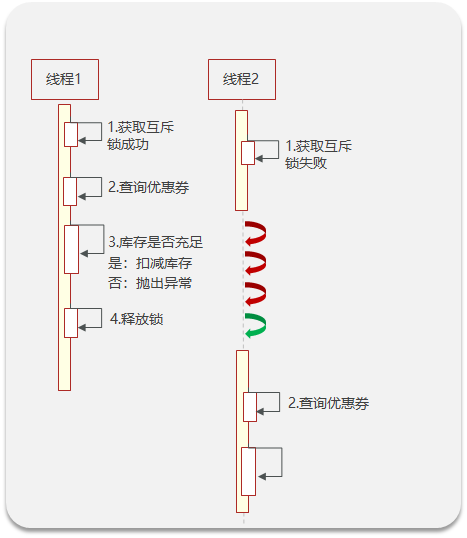

如果是一个单体项目，并且只启动了一台服务，上面这种做法没问题。

但往往为了项目能够支撑更多的并发请求，会把服务做成集群部署。

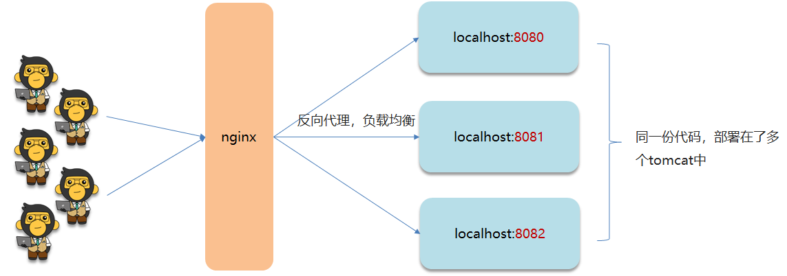

如果还是使用`synchronized`锁，就会出现以下情况。

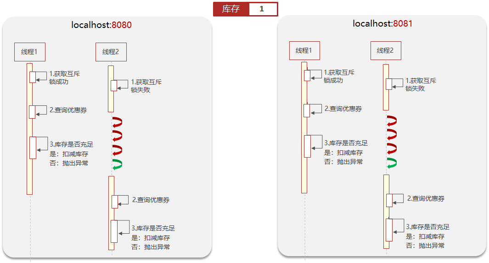

即使库存是1，但两台服务的线程1都能成功获取锁并成功扣减库存，因为`synchronized`锁是依赖于JVM的，两台服务意味着有两个JVM。

内部的锁不行，可以使用外部的锁，两个服务共享一个外部的锁，也就是分布式锁。

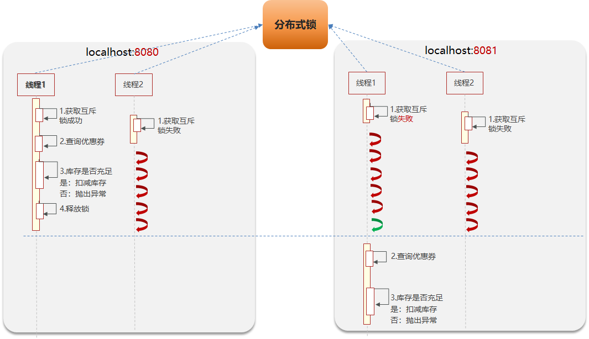

**Redis为啥适合做分布式锁？**

- 支持原子操作（SETNX、Lua）
- 高性能、部署方便
- TTL 能自动释放死锁

**Redis如何实现分布式锁**

Redis实现分布式锁主要利用Redis的setnx命令。setnx是SET if not exists(如果不存在，则 SET)的简写。

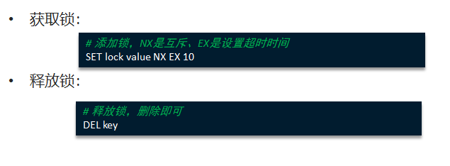

为什么获取锁的命令要写这么长，不能分开写吗？先用 setnx 设置值，再对值设置过期时间。

不能，写成一条命令是为了保证原子性。

那不设置过期时间可以吗？

也不行，过期时间的设置是为了预防死锁的产生。获取锁之后，如果在还没释放锁之前服务宕机了，那这个锁就无法释放了，其他线程也无法获取锁，这就导致了死锁的问题。所以需要去设置过期时间兜底，即使出现了服务宕机，锁依然会在一定时间后得到释放。

Redis实现分布式锁如何合理的控制锁的有效时长？

设置过期时间后，假如业务执行时间太长了，超过了锁的过期时间，锁就会自动释放，但是业务还没执行完成，而这个时候其他线程都是可以正常获取锁，然后执行业务的，这就出问题了。

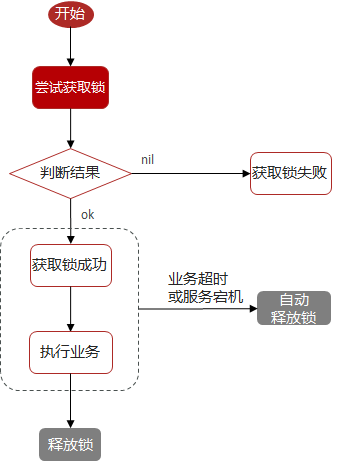

可以根据业务执行时间预估吗？

不行，因为即使你加长了锁的过期时间，但在实际场景中，万一出现了卡顿或网络抖动都会导致业务执行时间变慢，所以这个时间是不好控制的。

正确的方案是给锁续期。

什么意思？其实就是一开始给锁设置过期时间，然后再开启另外一个线程监控执行业务的线程，来判断业务的执行情况，如果业务执行的时间比较长，就增加这个线程持有锁的时长。

但是实现太麻烦，其实关于这个实现已经有现成的轮子了，比如说`Redisson`。

**Redisson实现的分布式锁**

Redisson实现的分布式锁也是基于redis的`set nx`命令来实现的，但是它做了很多增强和优化。如图：

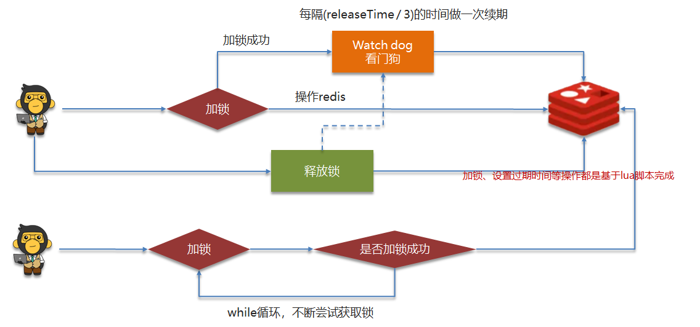

Redisson 中的分布式锁自带自动续期机制，使用起来非常简单，原理也比较简单，其提供了一个专门用来监控和续期锁的 **Watch Dog（ 看门狗）**，如果操作共享资源的线程还未执行完成的话，Watch Dog 会不断地延长锁的过期时间，进而保证锁不会因为超时而被释放。

续期规则是每隔(releaseTime / 3)的时间做一次续期，每次都会重置锁的过期时间，这个releaseTime指的是锁的过期时间，默认是30秒，也就是这个**Watch Dog**每隔10秒就会给这个持有锁的线程延长锁的过期时间， 将锁的过期时间重置为30秒。这样就可以根据业务的执行时长来控制锁的过期时间了。

业务执行完毕后，就跟原来一样手动释放锁，当然，释放锁的同时，还会自动通知对应的**Watch Dog**停止监控。

还有一点，如果服务宕机了，**Watch Dog**也就停止服务了，自然也就不会给锁续期，因为**Watch Dog**也是依赖于JVM的，锁在等待过期时间走完之后会自动释放，不用担心服务宕机，但**Watch Dog**还会给锁续期，导致其他线程无法获取锁的问题。

当然，Redisson所做的增强和优化不止如此，假如现在来了一个新的线程，想要获取锁，他也是先尝试加锁，看能否加锁成功，假如加锁成功了，那就跟上面的流程一样，加锁失败的话，不会终止线程，而是进入尝试获取锁的循环，如果在设定的时间内，线程一释放了锁，线程二就可以直接获取锁，如果超过设定的时间，则获取锁失败。

实现代码如下：

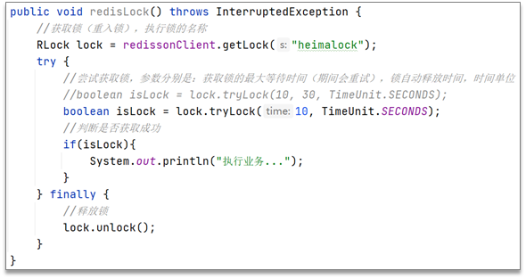

需要注意的是，tryLock这个方法，如果传参不包括锁自动释放时间，或者锁自动释放时间为-1，才会触发**Watch Dog**，如果设置了锁自动释放时间，Redisson会认为你能够自己控制锁的过期时间，也就不用自动给锁续期了。

Redisson的这些加锁、给锁设置过期时间的操作都是基于lua脚本完成的，它可以保证多条命令执行的原子性。

**可重入的分布式锁**

Redisson实现的分布式锁是可重入的。来看这样的代码：

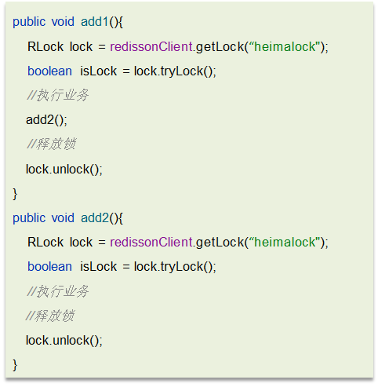

`add1`方法在加锁成功之后调用`add2`方法，`add2`方法中尝试获取一样的锁，它是可以获取成功的。

这是如何实现的？

`add1`方法调用了`add2`方法，它俩在同一个线程下，而每个线程都有一个唯一的线程id做标识，它是实现的关键点。

Redisson 实现的分布式锁并不是简单地在 Redis 中用 `SETNX` 存一个字符串，而是为每个锁资源维护了一个 Hash（散列）结构：

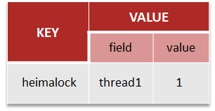

- key：记录锁名称
- field：记录线程id
- value：记录重入次数

第一次加锁时，如果这个 field 不存在，Redisson 会调用 Lua 脚本原子性地创建它，并将 value 设为 1。

若同一个线程再次尝试获取同一把锁，脚本会检测到这个 field 已经存在，于是把 value++，同时延长 key 的过期时间。

释放锁不是直接删除这把锁，而是将 value--，如果value为0，才删锁

**分布式锁的主从一致问题**

为了避免单点故障，生产环境下的 Redis 服务通常是「哨兵 ＋ 主从」架构。

哨兵负责监控 Redis 主从节点的健康状态，并在主节点故障时自动完成故障转移。主节点负责写数据，从节点负责读数据，主节点写完数据会异步同步给从节点。

现在有一个线程尝试加锁成功了，锁信息成功写入主节点，但在锁信息还没成功同步给从节点前，主节点宕机了。

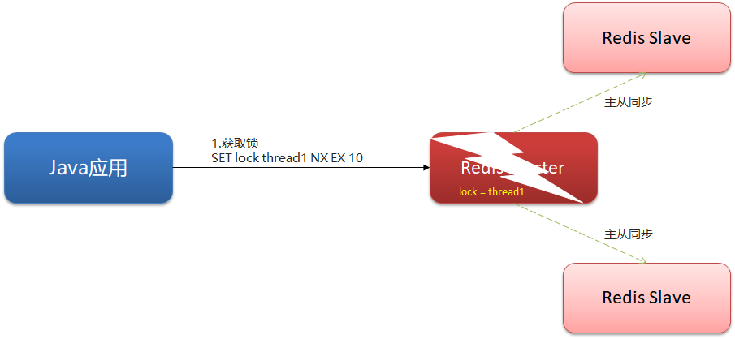

哨兵模式下，哨兵会推举一个从节点为新的主节点，此时有新的线程尝试获取同一把锁，会直接请求新的主节点，但之前的锁信息因为没有及时同步丢失了，因此新的线程可以成功加锁，这就导致了两个线程同时持有同一把锁的问题。

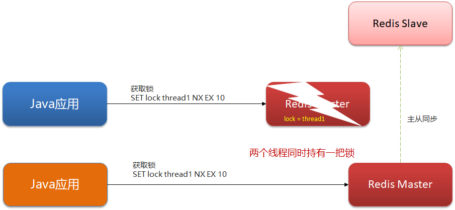

其实，在Redis提供了能解决这个问题的方案，红锁。

RedLock(红锁)：不能只在一个redis实例上创建锁，应该是在多个redis实例上创建锁(节点数量 / 2 + 1)，避免在一个redis实例上加锁。

但是红锁是有缺陷的，在项目中很少使用，主要原因是，红锁的实现非常复杂，运维也很繁琐，因为需要提供多个独立的节点（主节点），且在高并发的场景下，性能很差。

其实官方也是不建议使用红锁来解决**分布式锁的主从一致问题**的。

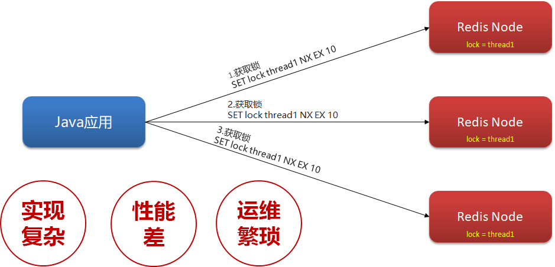

如果项目中非要用主从，如何解决这个问题？

其实这个问题发生的概率是很低的，哪有服务器天天挂，而且还得刚好在锁信息未及时同步的时候挂。

再者，Redis集群的整体思想是`AP`思想，优先保证高可用性，也就是最终一致，如果业务要求一定要保证数据的强一致性，建议采用`CP`思想的zookeeper。

> **面试官**：Redis分布式锁如何实现 ? 
>
> **候选人**：嗯，在redis中提供了一个命令setnx(SET if not exists)
>
> 由于redis的单线程的，用了命令之后，只能有一个客户端对某一个key设置值，在没有过期或删除key的时候是其他客户端是不能设置这个key的
>
> **面试官**：好的，那你如何控制Redis实现分布式锁有效时长呢？
>
> **候选人**：嗯，的确，redis的setnx指令不好控制这个问题，我们当时采用的redis的一个框架redisson实现的。
>
> 在redisson中需要手动加锁，并且可以控制锁的失效时间和等待时间，当锁住的一个业务还没有执行完成的时候，在redisson中引入了一个看门狗机制，就是说每隔一段时间就检查当前业务是否还持有锁，如果持有就增加加锁的持有时间，当业务执行完成之后需要使用释放锁就可以了
>
> 还有一个好处就是，在高并发下，一个业务有可能会执行很快，先客户1持有锁的时候，客户2来了以后并不会马上拒绝，它会自旋不断尝试获取锁，如果客户1释放之后，客户2就可以马上持有锁，性能也得到了提升。
>
> **面试官**：好的，redisson实现的分布式锁是可重入的吗？
>
> **候选人**：嗯，是可以重入的。这样做是为了避免死锁的产生。这个重入其实在内部就是判断是否是当前线程持有的锁，如果是当前线程持有的锁就会计数，如果释放锁就会在计算上减一。在存储数据的时候采用的hash结构，大key可以按照自己的业务进行定制，其中小key是当前线程的唯一标识，value是当前线程重入的次数
>
> **面试官**：redisson实现的分布式锁能解决主从一致性的问题吗
>
> **候选人**：这个是不能的，比如，当线程1加锁成功后，master节点数据会异步复制到slave节点，此时当前持有Redis锁的master节点宕机，slave节点被提升为新的master节点，假如现在来了一个线程2，再次加锁，会在新的master节点上加锁成功，这个时候就会出现两个节点同时持有一把锁的问题。
>
> 我们可以利用redisson提供的红锁来解决这个问题，它的主要作用是，不能只在一个redis实例上创建锁，应该是在多个redis实例上创建锁，并且要求在大多数redis节点上都成功创建锁，红锁中要求是redis的节点数量要过半。这样就能避免线程1加锁成功后master节点宕机导致线程2成功加锁到新的master节点上的问题了。
>
> 但是，如果使用了红锁，因为需要同时在多个节点上都添加锁，性能就变的很低了，并且运维维护成本也非常高，所以，我们一般在项目中也不会直接使用红锁，并且官方也暂时废弃了这个红锁
>
> **面试官**：好的，如果业务非要保证数据的强一致性，这个该怎么解决呢？
>
> **候选人：**嗯~，redis本身就是支持高可用的，做到强一致性，就非常影响性能，所以，如果有强一致性要求高的业务，建议使用zookeeper实现的分布式锁，它是可以保证强一致性的。

## 其他

### Redis集群有哪些方案？

在Redis中提供的集群方案总共有三种

- 主从复制
- 哨兵模式
- 分片集群

> **面试官**：Redis集群有哪些方案, 知道嘛 ? 
>
> **候选人**：嗯~~，在Redis中提供的集群方案总共有三种：主从复制、哨兵模式、分片集群

### 主从复制

单节点Redis的并发能力是有上限的，要进一步提高Redis的并发能力，就需要搭建主从集群，实现读写分离。主节点负责写数据，从节点负责读数据，主节点在写数据后异步将数据同步给从节点。通常Redis服务都是读多写少，让多个从节点来负责读操作，就可以增加redisn的并发能力。

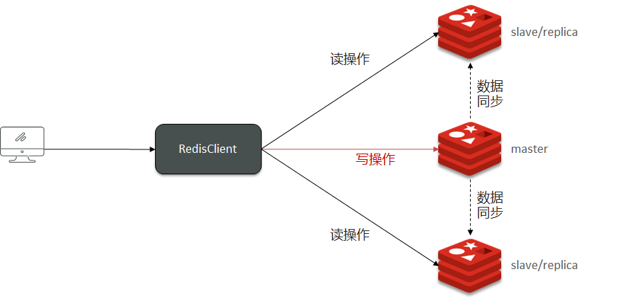

主从同步流程分为两个阶段：全量同步和增量同步。

**全量同步**

主从第一次连接时会执行全量同步，将master节点所有的数据拷贝给slave节点。

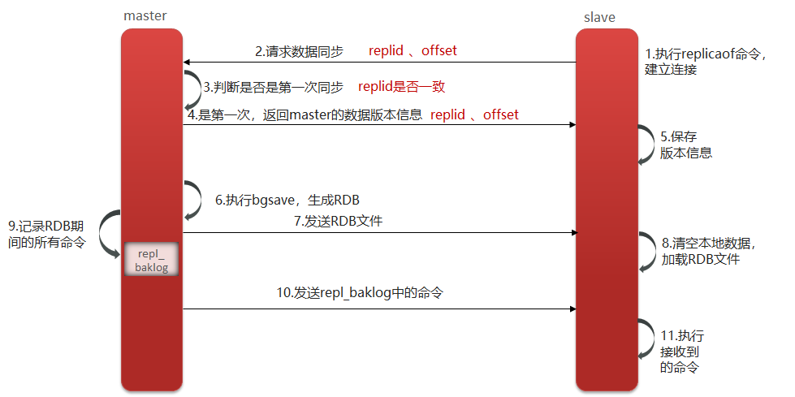

Replication Id：简称replid，是数据集的标记，id一致则说明是同一数据集。每一个master都有唯一的replid，slave则会继承master节点的replid。

offset：偏移量，随着记录在repl_baklog中的数据增多而逐渐增大。slave完成同步时也会记录当前同步的offset。如果slave的offset小于master的offset，说明slave数据落后于master，需要更新。

全量同步过程

- 从节点发送`replid`和`offset`给主节点请求数据同步
- 主节点检查出`replid`不一致，也就是第一次同步
- 主节点返回自己的`replid`和`offset`给从节点
- 从节点保存该版本信息，开始全量同步
- 主节点执行bgsave生成RDB文件
- 主节点将RDB文件发送给从节点
- 从节点清空本地的数据，加载主节点发送过来的RDB文件
- 主节点记录生成RDB文件期间，客户端所有新请求的命令到`repl_baklog`日志文件中
- 主节点将`repl_baklog`日志文件发送给从节点
- 从节点执行`repl_baklog`日志文件中的命令

**增量同步**

从节点重启或后期数据变化会执行增量同步，主从根据`offset`的差值同步数据。

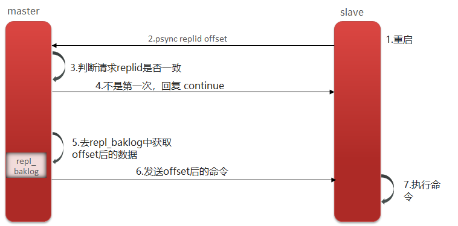

增量同步过程

- 从节点发送`replid`和`offset`给主节点请求数据同步
- 主节点检查出`replid`一致，也就不是第一次同步
- 主节点回复continue给从节点
- 主节点从`repl_baklog`日志文件中获取从节点的`offset`后的数据
- 主节点将从`repl_baklog`日志文件中获取到的命令发送给从节点
- 从节点执行主节点发送过来的命令

**repl_baklog日志文件**

master与slave的数据差异部分在repl_baklog文件，repl_baklog中会记录Redis处理过的命令日志及offset，包括master当前的offset，和slave已经拷贝到的offset。

slave和master的offset之间的差异就是slave需要拷贝的数据了。

需要注意的是，repl_baklog这个文件是一个固定大小的环形数组，也就是说角标到达数组末尾后，会再次从0开始读写，这样数组头部的数据就会被覆盖。

数组一旦写满，再有新数据写入时，就会覆盖数组的旧数据。如果slave来增量同步，发现自己offset已经被覆盖了，只能全量同步。这种情况一般发生在从节点宕机太久的时候。

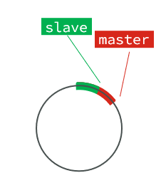

> **面试官**：那你来介绍一下主从同步
>
> **候选人**：嗯，是这样的，单节点Redis的并发能力是有上限的，要进一步提高Redis的并发能力，可以搭建主从集群，实现读写分离。一般都是一主多从，主节点负责写数据，从节点负责读数据，主节点写入数据之后，需要把数据同步到从节点中
>
> **面试官**：能说一下，主从同步数据的流程
>
> **候选人**：嗯~~，好！主从同步分为了两个阶段，一个是全量同步，一个是增量同步
>
> 全量同步是指从节点第一次与主节点建立连接的时候使用全量同步，流程是这样的：
>
> 第一：从节点请求主节点同步数据，其中从节点会携带自己的replication id和offset偏移量。
>
> 第二：主节点判断是否是第一次请求，主要判断的依据就是，主节点与从节点是否是同一个replication id，如果不是，就说明是第一次同步，那主节点就会把自己的replication id和offset发送给从节点，让从节点与主节点的信息保持一致。
>
> 第三：在同时主节点会执行bgsave，生成rdb文件后，发送给从节点去执行，从节点先把自己的数据清空，然后执行主节点发送过来的rdb文件，这样就保持了一致
>
> 当然，如果在rdb生成执行期间，依然有请求到了主节点，而主节点会以命令的方式记录到缓冲区，缓冲区是一个日志文件，最后把这个日志文件发送给从节点，这样就能保证主节点与从节点完全一致了，后期再同步数据的时候，都是依赖于这个日志文件，这个就是全量同步
>
> 增量同步指的是，当从节点服务重启之后，数据就不一致了，所以这个时候，从节点会请求主节点同步数据，主节点还是判断不是第一次请求，不是第一次就获取从节点的offset值，然后主节点从命令日志中获取offset值之后的数据，发送给从节点进行数据同步

### 哨兵模式

主从复制模式有一个缺点，保证不了redis的高可用，如果主节点宕机，就无法写数据了，为了保证redis集群的高可用，Redis提供了哨兵（Sentinel）机制来实现主从集群的自动故障恢复。

哨兵通常都是集群部署的，需要至少**3 个哨兵实例**组成一个哨兵集群（一般是奇数个，如 3、5、7）。哨兵的结构和作用如下：

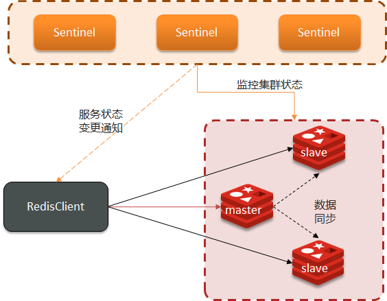

**监控**：Sentinel 会不断检查您的master和slave是否按预期工作。

**自动故障恢复**：如果master故障，Sentinel会将一个slave提升为master（选主）。当故障实例恢复后也以新的master为主。当slave故障，它也会被哨兵自动剔除。

**通知**：Sentinel充当Redis客户端的服务发现来源，当集群发生故障转移时，会将最新信息推送给Redis的客户端。

Sentinel基于心跳机制监测服务状态，每个哨兵每隔1秒向集群的每个redis实例发送ping命令：

- 主观下线：如果某sentinel节点发现某实例未在规定时间响应，则认为该实例**主观下线**。此时只是当前 Sentinel **个人认为**主节点下线了，还没有达成共识。
- 客观下线：若超过指定数量（quorum，配置文件中配置）的sentinel都认为该实例主观下线，则sentinel节点认为该实例**客观下线**。quorum值最好超过Sentinel实例数量的一半，一般设置为**哨兵节点数量 / 2 + 1**。

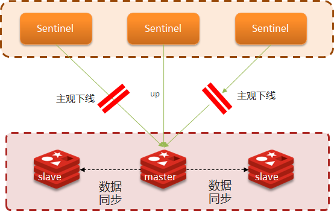

某主节点被认为客观下线后，哨兵内部需要投票选出一个 **Leader 哨兵** 来执行后续的故障恢复流程。每个哨兵只能投一票，得票最多者当选 Leader。

Leader 哨兵开始真正执行自动故障转移：

- 挑选新的主节点
- 将选中的从节点提升为新主节点
- 通知其他从节点重新认主，建立主从关系并同步数据

**哨兵选主规则**

- 首先判断主与从节点断开时间长短，如超过指定值（配置文件中配置）就排该从节点，不能成为选主候选人
- 然后判断从节点的slave-priority值（配置文件中配置），越小优先级越高
- 如果slave-prority一样，则判断slave节点的offset值，越大优先级越高
- 最后是判断slave节点的运行id大小，越小优先级越高

**脑裂问题**

这是一个正常的**哨兵+主从架构**。

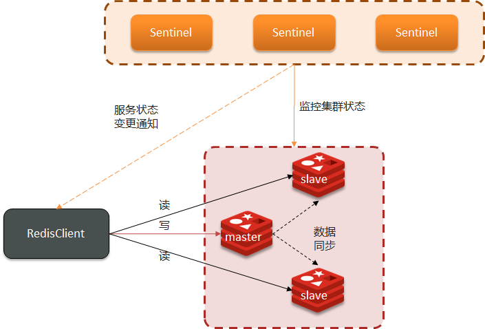

在分布式系统中，由于网络分区（network partition）或节点故障，使得集群被分割成两个（或多个）子集群，各自独立进行选主操作，结果出现多个主节点，客户端可能同时向不同主节点写入数据，导致数据分叉、不一致。

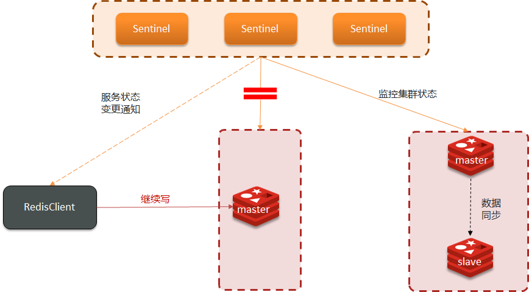

比如在Redis的**哨兵+主从架构**中，由于网络分区，一部分哨兵认为旧主仍然可用，一部分哨兵认为旧主客观下线，需要重新选主，于是就出现了两个主节点，且两个主节点都可被客户端正常连接，这就是脑裂问题。脑裂期间，两个主节点都可能被客户端请求写入数据，假如一段时间后，网络恢复了，脑裂结束，哨兵会把其中一个主节点强制降为从节点，于是，这个从节点就会去主节点中同步数据，它会把自己的数据清空，那之前脑裂时客户端写入的数据就丢失了。

可以通过修改redis的两个配置缓和这个问题。

redis中有两个配置参数：

min-replicas-to-write 1  表示最少的可用的salve节点为1个，否则拒绝写操作

min-replicas-max-lag 5 表示salve节点数据复制和同步的延迟不能超过5秒，否则视为不可用的从节点

通过这两个配置，脑裂时，达不到要求的主节点会拒绝写请求，就可以避免大量的数据丢失了。

> **面试官**：怎么保证Redis的高并发高可用
>
> **候选人**：首先可以搭建主从集群，再加上使用redis中的哨兵模式，哨兵模式可以实现主从集群的自动故障恢复，里面就包含了对主从服务的监控、自动故障恢复、通知；如果master故障，Sentinel会将一个slave提升为master。当故障实例恢复后也以新的master为主；同时Sentinel也充当Redis客户端的服务发现来源，当集群发生故障转移时，会将最新信息推送给Redis的客户端，所以一般项目都会采用哨兵的模式来保证redis的高并发高可用
>
> **面试官**：你们使用redis是单点还是集群，哪种集群
>
> **候选人**：嗯！，我们当时使用的是主从（1主1从）加哨兵。一般单节点不超过10G内存，如果Redis内存不足则可以给不同服务分配独立的Redis主从节点。尽量不做分片集群。因为集群维护起来比较麻烦，并且集群之间的心跳检测和数据通信会消耗大量的网络带宽，也没有办法使用lua脚本和事务
>
> **面试官**：redis集群脑裂，该怎么解决呢？
>
> **候选人**：嗯！ 这个在项目很少见，不过脑裂的问题是这样的，我们现在用的是redis的哨兵模式集群的
>
> 有的时候由于网络等原因可能会出现脑裂的情况，就是说，由于redis master节点和redis salve节点和sentinel处于不同的网络分区，使得sentinel没有能够心跳感知到master，所以通过选举的方式提升了一个salve为master，这样就存在了两个master，就像大脑分裂了一样，这样会导致客户端还在old master那里写入数据，新节点无法同步数据，当网络恢复后，sentinel会将old master降为salve，这时再从新master同步数据，这会导致old master中的大量数据丢失。
>
> 关于解决的话，我记得在redis的配置中可以设置：第一可以设置最少的salve节点个数，比如设置至少要有一个从节点才能同步数据，第二个可以设置主从数据复制和同步的延迟时间，达不到要求就拒绝请求，就可以避免大量的数据丢失

### 分片集群

主从和哨兵可以解决高可用、高并发读的问题。但是依然有两个问题没有解决：

- 海量数据存储问题
- 高并发写的问题

使用分片集群可以解决上述问题，分片集群特征：

- 集群中有多个master，每个master保存不同数据
- 每个master都可以有多个slave节点
- master之间通过互ping监测彼此健康状态
- 客户端请求可以访问集群任意节点，最终都会被转发到正确节点

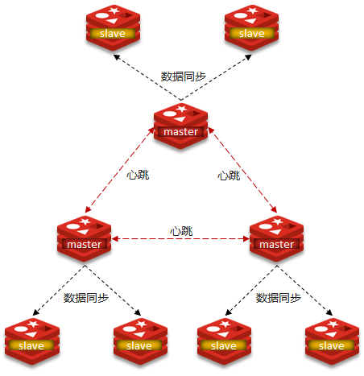

**数据读写**

Redis 分片集群引入了哈希槽的概念，Redis 集群有 16384 个哈希槽，每个 key 通过 CRC16 校验的到 hash 值，hash 值对 16384 取模来决定放置哪个槽，集群的每个节点负责一部分 hash 槽。还可以设置key的有效部分，具体规则是给key的有效部分套上**`{}`**，对key计算hash值时，只会对**`{}`**里的有效部分进行计算。如果想把相同的业务数据存储到同一个redis节点里，就可以利用这个规则。

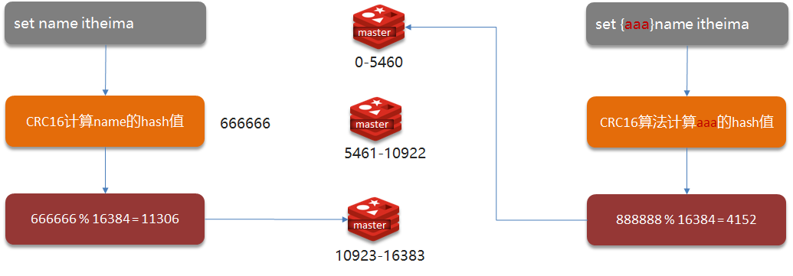

> **面试官**：redis的分片集群有什么作用
>
> **候选人**：分片集群主要解决的是，海量数据存储的问题，集群中有多个master，每个master保存不同数据，并且还可以给每个master设置多个slave节点，就可以继续增大集群的高并发能力。同时每个master之间通过ping监测彼此健康状态，就类似于哨兵模式了。当客户端请求可以访问集群任意节点，最终都会被转发到正确节点
>
> **面试官**：Redis分片集群中数据是怎么存储和读取的？
>
> **候选人**：
>
> 嗯~，在redis集群中是这样的
>
> Redis 集群引入了哈希槽的概念，有 16384 个哈希槽，集群中每个主节点绑定了一定范围的哈希槽范围， key通过 CRC16 校验后对 16384 取模来决定放置哪个槽，通过槽找到对应的节点进行存储。
>
> 取值的逻辑是一样的

### 单线程的Redis为什么这么快？

- Redis是纯内存操作，且基于C语言编写，执行速度非常快
- 采用单线程，避免不必要的上下文切换，多线程还要考虑线程安全问题，可能会使用到锁
- 使用I/O多路复用模型，非阻塞IO

> **面试官**：Redis是单线程的，但是为什么还那么快？
>
> **候选人**：
>
> 嗯，这个有几个原因吧~~~
>
> 1、完全基于内存的，C语言编写
>
> 2、采用单线程，避免不必要的上下文切换可竞争条件
>
> 3、使用多路I/O复用模型，非阻塞IO
>
> 例如：bgsave 和 bgrewriteaof  都是在**后台**执行操作，不影响主线程的正常使用，不会产生阻塞

### I/O多路复用模型

Redis是纯内存操作，执行速度非常快，它的性能瓶颈是网络延迟而不是执行速度， I/O多路复用模型主要就是实现了高效的网络请求。

**用户空间和内核空间**

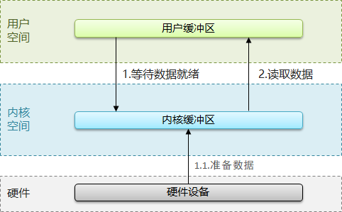

Linux系统中一个进程使用的内存情况划分两部分：**内核空间、用户空间**

**用户空间**只能执行受限的命令（Ring3），而且不能直接调用系统资源，必须通过内核提供的接口来访问

**内核空间**可以执行特权命令（Ring0），调用一切系统资源

Linux系统为了提高IO效率，会在用户空间和内核空间都加入缓冲区：

写数据时，要把用户缓冲数据拷贝到内核缓冲区，然后写入设备

读数据时，要从设备读取数据到内核缓冲区，然后拷贝到用户缓冲区

这整个过程中，会涉及到各种状态的切换，其实影响IO效率的主要有两个原因：

第一个是在用户空间需要数据时，需要从内核空间获取，它需要等待内核空间的数据就绪

第二个是数据的拷贝，读数据时需要从内核拷贝到用户，写数据时需要从用户拷贝到内核

所以说，想要提高IO的效率，需要想办法减少无效的等待和优化用户与内核空间之间数据拷贝。

而IO模型其实就是针对这块内容进行描述。

**常见的IO模型**

- 阻塞IO

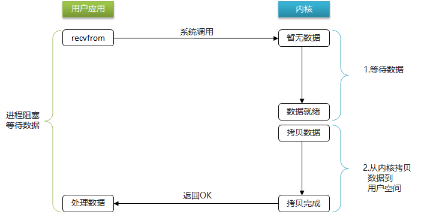

阻塞IO就是用户进程在等待数据和拷贝数据两个阶段都必须阻塞等待。

阶段一：

①用户进程尝试读取数据（比如网卡数据）

②此时数据尚未到达，内核需要等待数据

③此时用户进程也处于阻塞状态

阶段二：

①数据到达并拷贝到内核缓冲区，代表已就绪

②将内核数据拷贝到用户缓冲区

③拷贝过程中，用户进程依然阻塞等待

④拷贝完成，用户进程解除阻塞，处理数据

可以看到，阻塞IO模型中，用户进程在两个阶段都是阻塞状态。

- 非阻塞IO

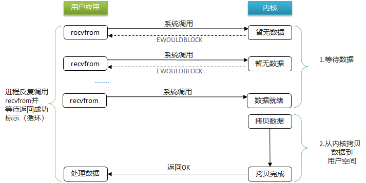

非阻塞IO的recvfrom操作会立即返回结果而不是阻塞用户进程。

阶段一：

①用户进程尝试读取数据（比如网卡数据）

②此时数据尚未到达，内核需要等待数据

③返回异常给用户进程

④用户进程拿到error后，再次尝试读取

⑤循环往复，直到数据就绪

阶段二：

①将内核数据拷贝到用户缓冲区

②拷贝过程中，用户进程阻塞等待

③拷贝完成，用户进程解除阻塞，处理数据

可以看到，非阻塞IO模型中，用户进程在第一个阶段是非阻塞，第二个阶段是阻塞状态。虽然是非阻塞，但性能并没有得到提高。而且忙等机制会导致CPU空转，CPU使用率暴增。

- IO多路复用

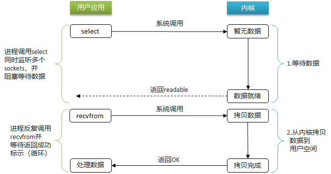

IO多路复用是利用单个线程来同时监听多个Socket ，并在某个Socket可读、可写时得到通知，从而避免无效的等待，充分利用CPU资源。

阶段一：

①用户进程调用select，向内核指定要监听的socket集合

②内核监听对应的多个socket

③任意一个或多个socket数据就绪则返回readable

④此过程中用户进程阻塞

阶段二：

①用户进程找到就绪的socket

②依次调用recvfrom读取数据

③内核将数据拷贝到用户空间

④用户进程处理数据

IO多路复用的核心在于通过单线程管理多个socket，只要有任意一个socket准备就绪，用户进程都会及时得到通知，然后再循环调用recvfrom函数找到数据就绪的socket处理数据即可。

Linux中，IO多路复用实现的方式有三种：

- select
- poll
- epoll

差异：

- select和poll只会通知用户进程有Socket就绪，但不确定具体是哪个Socket ，需要用户进程逐个遍历Socket来确认
- epoll则会在通知用户进程Socket就绪的同时，把已就绪的Socket写入用户空间

**Redis的网络模型**

Redis通过IO多路复用来提高网络性能，并且支持各种不同的多路复用实现，并且将这些实现进行封装， 提供了统一的高性能事件库。

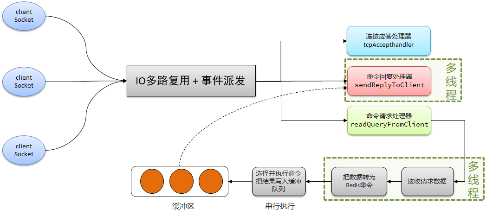

Redis的网络模型基于IO多路复用与事件派发机制，通过高效管理多个客户端连接。当客户端通过Socket发起连接时，连接应答处理器负责接受新连接，并将其注册到事件循环中。客户端请求数据到达后，命令请求处理器读取数据并解析为Redis命令，随后由单线程核心逻辑选择并执行命令，将结果写入缓冲队列。最终，命令回复处理器从队列中取出结果并通过Socket返回给客户端。整个流程通过事件派发器协调，结合IO多路复用，实现了高并发与低延迟。

Redis 6.0以后引入了多线程优化网络IO，主要在以下两个地方：

第一个是接收和解析请求数据，但命令执行仍保持单线程以确保原子性。假如现在有很多客户端来读写数据，那每个客户端请求都会携带自己的请求数据，首先，接收请求数据这里涉及到了网络IO问题，再者，每个客户端携带的请求数据都需要转为Redis命令，那在单线程下可能就会忙不过来，于是，就在接受请求数据和把数据转为Redis命令这个地方，就可以开启多个线程去处理。但在真正去执行命令时，还是保持单线程的，也就是由主线程去处理的，确保数据一致性和原子性，因为命令执行那里都是基于内存操作，并不会影响性能。

第二个是响应结果的输出，在向客户端响应结果这里，也涉及到了网络IO问题，所以这里也开启了多线程。

在这两个地方加入了多线程之后，大幅度提高了redis对客户端的处理速度，其实主要是减少了网络IO导致的性能变差的影响。所以，其实真正影响Redis性能的还是网络IO，针对Redis的性能优化，其实主要是针对网络IO这部分的优化。

> **面试官**：能解释一下I/O多路复用模型？
>
> **候选人**：嗯~~，I/O多路复用是指利用单个线程来同时监听多个Socket ，并在某个Socket可读、可写时得到通知，从而避免无效的等待，充分利用CPU资源。目前的I/O多路复用都是采用的epoll模式实现，它会在通知用户进程Socket就绪的同时，把已就绪的Socket写入用户空间，不需要挨个遍历Socket来判断是否就绪，提升了性能。
>
> 其中Redis的网络模型就是使用I/O多路复用结合事件的处理器来应对多个Socket请求，比如，提供了连接应答处理器、命令回复处理器，命令请求处理器；
>
> 在Redis6.0之后，为了提升更好的性能，在命令回复处理器使用了多线程来处理回复事件，在命令请求处理器中，将命令的转换使用了多线程，增加命令转换速度，在命令执行的时候，依然是单线程

