# 设计场景

## 设计模式

在平时的开发中，涉及到设计模式的有两块内容，第一个是我们平时使用的框架（比如spring、mybatis等），第二个是我们自己开发业务使用的设计模式。

需求：设计一个咖啡店点餐系统。  

设计一个咖啡类（Coffee），并定义其两个子类（美式咖啡【AmericanCoffee】和拿铁咖啡【LatteCoffee】）；再设计一个咖啡店类（CoffeeStore），咖啡店具有点咖啡的功能。

具体类的设计如下：


>类图中的符号
>
>* +：表示public
>* -：表示private
>* #：表示protected
>
>泛化关系(继承)用带空心三角箭头的实线来表示
>
>依赖关系使用带箭头的虚线来表示

```java
package com.itheima.factory.simple;

public class CoffeeStore {

    public static void main(String[] args) {
        Coffee coffee = orderCoffee("latte");
        System.out.println(coffee.getName());
    }


    public static Coffee orderCoffee(String type){
        Coffee coffee = null;
        if("american".equals(type)){
            coffee = new AmericanCoffee();
        }else if ("latte".equals(type)){
            coffee = new LatteCoffee();
        }

        //添加配料
        coffee.addMilk();
        coffee.addSuqar();
        return coffee;
    }
}

```


在java中，万物皆对象，这些对象都需要创建，如果创建的时候直接new该对象，就会对该对象耦合严重，假如我们要更换对象，所有new对象的地方都需要修改一遍，这显然违背了软件设计的**开闭原则**。如果我们使用工厂来生产对象，我们就只和工厂打交道就可以了，彻底和对象解耦，如果要更换对象，直接在工厂里更换该对象即可，达到了与对象解耦的目的；所以说，工厂模式最大的优点就是：**解耦**。

>开闭原则：**对扩展开放，对修改关闭**。在程序需要进行拓展的时候，不能去修改原有的代码，实现一个热插拔的效果。简言之，是为了使程序的扩展性好，易于维护和升级。

三种工厂

* 简单工厂模式
* 工厂方法模式
* 抽象工厂模式

### 简单工厂模式

简单工厂不是一种设计模式，反而比较像是一种编程习惯。

**结构**

简单工厂包含如下角色：

* 抽象产品 ：定义了产品的规范，描述了产品的主要特性和功能。
* 具体产品 ：实现或者继承抽象产品的子类
* 具体工厂 ：提供了创建产品的方法，调用者通过该方法来获取产品。

**实现**

现在使用简单工厂对上面案例进行改进，类图如下：


工厂类代码如下：

```java
public class SimpleCoffeeFactory {

    public Coffee createCoffee(String type) {
        Coffee coffee = null;
        if("americano".equals(type)) {
            coffee = new AmericanoCoffee();
        } else if("latte".equals(type)) {
            coffee = new LatteCoffee();
        }
        return coffee;
    }
}
```

咖啡店

```java
package com.itheima.factory.simple;

public class CoffeeStore {

    public Coffee orderCoffee(String type){
        //通过工厂获得对象，不需要知道对象实现的细节
        SimpleCoffeeFactory factory = new SimpleCoffeeFactory();
        Coffee coffee = factory.createCoffee(type);
        //添加配料
        coffee.addMilk();
        coffee.addSuqar();
        return coffee;
    }
}
```

工厂（factory）处理创建对象的细节，一旦有了SimpleCoffeeFactory，CoffeeStore类中的orderCoffee()就变成此对象的客户，后期如果需要Coffee对象直接从工厂中获取即可。这样也就解除了和Coffee实现类的耦合，同时又产生了新的耦合，CoffeeStore对象和SimpleCoffeeFactory工厂对象的耦合，工厂对象和商品对象的耦合。

后期如果再加新品种的咖啡，我们势必要需求修改SimpleCoffeeFactory的代码，违反了开闭原则。工厂类的客户端可能有很多，比如创建美团外卖等，这样只需要修改工厂类的代码，省去其他的修改操作。

**优点**

封装了创建对象的过程，可以通过参数直接获取对象。把对象的创建和业务逻辑层分开，这样以后就避免了修改客户代码，如果要实现新产品直接修改工厂类，而不需要在原代码中修改，这样就降低了客户代码修改的可能性，更加容易扩展。

**缺点**

增加新产品时还是需要修改工厂类的代码，违背了“开闭原则”。

**扩展**

在开发中也有一部分人将工厂类中的创建对象的功能定义为静态的，这个就是**静态工厂**模式，它也不是23种设计模式中的。代码如下：

```java
public class SimpleCoffeeFactory {

    public static Coffee createCoffee(String type) {
        Coffee coffee = null;
        if("americano".equals(type)) {
            coffee = new AmericanoCoffee();
        } else if("latte".equals(type)) {
            coffee = new LatteCoffee();
        }
        return coffe;
    }
}
```

### 工厂方法模式

针对简单工厂模式的缺点，使用工厂方法模式就可以完美的解决，完全遵循开闭原则。

**概念**

定义一个用于创建对象的接口，让子类决定实例化哪个产品类对象。工厂方法使一个产品类的实例化延迟到其工厂的子类。

**结构**

工厂方法模式的主要角色：

* 抽象工厂（Abstract Factory）：提供了创建产品的接口，调用者通过它访问具体工厂的工厂方法来创建产品。
* 具体工厂（ConcreteFactory）：主要是实现抽象工厂中的抽象方法，完成具体产品的创建。
* 抽象产品（Product）：定义了产品的规范，描述了产品的主要特性和功能。
* 具体产品（ConcreteProduct）：实现了抽象产品角色所定义的接口，由具体工厂来创建，它同具体工厂之间一一对应。

**实现**

使用工厂方法模式对上例进行改进，类图如下：

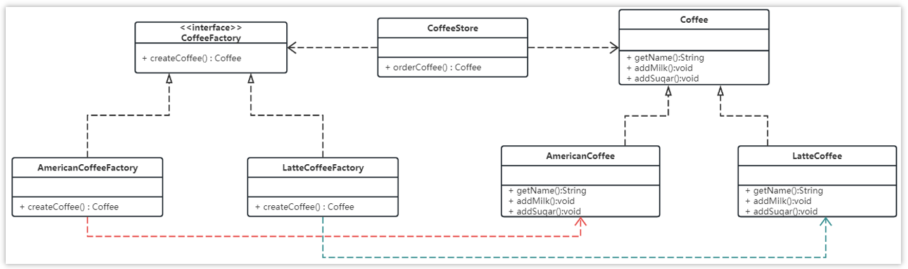

流程：

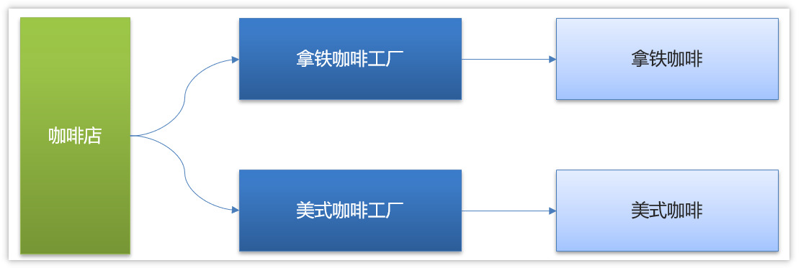

代码如下：

抽象工厂：

```java
public interface CoffeeFactory {

    Coffee createCoffee();
}
```

具体工厂：

```java
public class LatteCoffeeFactory implements CoffeeFactory {

    public Coffee createCoffee() {
        return new LatteCoffee();
    }
}

public class AmericanCoffeeFactory implements CoffeeFactory {

    public Coffee createCoffee() {
        return new AmericanCoffee();
    }
}
```

咖啡店类：

```java
public class CoffeeStore {

    private CoffeeFactory factory;

    public CoffeeStore(CoffeeFactory factory) {
        this.factory = factory;
    }

    public Coffee orderCoffee(String type) {
        Coffee coffee = factory.createCoffee();
        coffee.addMilk();
        coffee.addsugar();
        return coffee;
    }
}
```

从以上的编写的代码可以看到，要增加产品类时也要相应地增加工厂类，不需要修改工厂类的代码了，这样就解决了简单工厂模式的缺点。

工厂方法模式是简单工厂模式的进一步抽象。由于使用了多态性，工厂方法模式保持了简单工厂模式的优点，而且克服了它的缺点。

**优点**

- 用户只需要知道具体工厂的名称就可得到所要的产品，无须知道产品的具体创建过程；
- 在系统增加新的产品时只需要添加具体产品类和对应的具体工厂类，无须对原工厂进行任何修改，满足开闭原则；

**缺点**

* 每增加一个产品就要增加一个具体产品类和一个对应的具体工厂类，这增加了系统的复杂度。

### 抽象工厂模式

前面介绍的工厂方法模式中考虑的是一类产品的生产，如畜牧场只养动物、电视机厂只生产电视机、传智播客只培养计算机软件专业的学生等。

这些工厂只生产同种类产品，同种类产品称为同等级产品，也就是说：工厂方法模式只考虑生产同等级的产品，但是在现实生活中许多工厂是综合型的工厂，能生产多等级（种类） 的产品，如电器厂既生产电视机又生产洗衣机或空调，大学既有软件专业又有生物专业等。

本节要介绍的抽象工厂模式将考虑多等级产品的生产，将同一个具体工厂所生产的位于不同等级的一组产品称为一个产品族，下图所示

- 产品族：一个品牌下面的所有产品；例如华为下面的电脑、手机称为华为的产品族；
- 产品等级：多个品牌下面的同种产品；例如华为和小米都有手机电脑为一个产品等级；

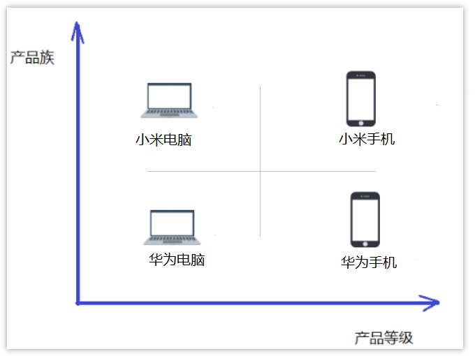

**概念**

是一种为访问类提供一个创建一组相关或相互依赖对象的接口，且访问类无须指定所要产品的具体类就能得到同族的不同等级的产品的模式结构。

抽象工厂模式是工厂方法模式的升级版本，工厂方法模式只生产一个等级的产品，而抽象工厂模式可生产多个等级的产品。

**一个超级工厂创建其他工厂。该超级工厂又称为其他工厂的工厂**

**结构**

抽象工厂模式的主要角色如下：

* 抽象工厂（Abstract Factory）：提供了创建产品的接口，它包含多个创建产品的方法，可以创建多个不同等级的产品。
* 具体工厂（Concrete Factory）：主要是实现抽象工厂中的多个抽象方法，完成具体产品的创建。
* 抽象产品（Product）：定义了产品的规范，描述了产品的主要特性和功能，抽象工厂模式有多个抽象产品。
* 具体产品（ConcreteProduct）：实现了抽象产品角色所定义的接口，由具体工厂来创建，它 同具体工厂之间是多对一的关系。

**实现**

现咖啡店业务发生改变，不仅要生产**咖啡**还要生产**甜点**

- 同一个产品等级（产品分类）
  - 咖啡：拿铁咖啡、美式咖啡 
  - 甜点：提拉米苏、抹茶慕斯
- 同一个风味，就是同一个产品族（相当于同一个品牌）
  - 美式风味：美式咖啡、抹茶慕斯
  - 意大利风味：拿铁咖啡、提拉米苏

要是按照工厂方法模式，需要定义提拉米苏类、抹茶慕斯类、提拉米苏工厂、抹茶慕斯工厂、甜点工厂类，很容易发生类爆炸情况。

所以这个案例可以使用抽象工厂模式实现。类图如下：

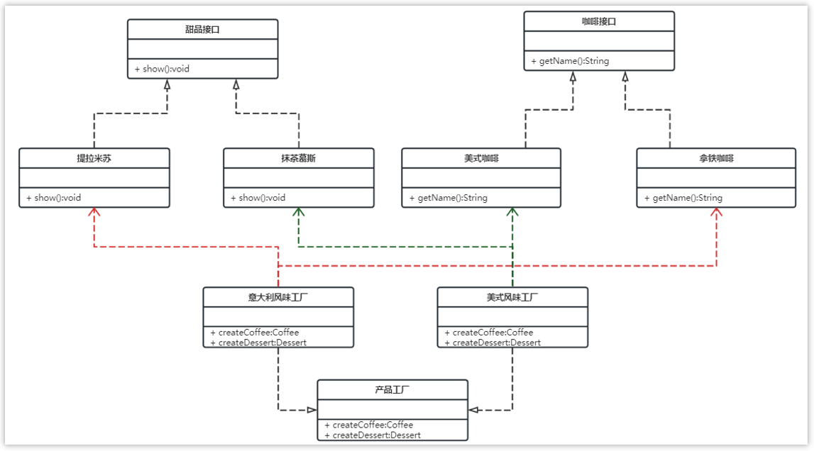

>实现关系使用带空心三角箭头的虚线来表示

整体调用思路：

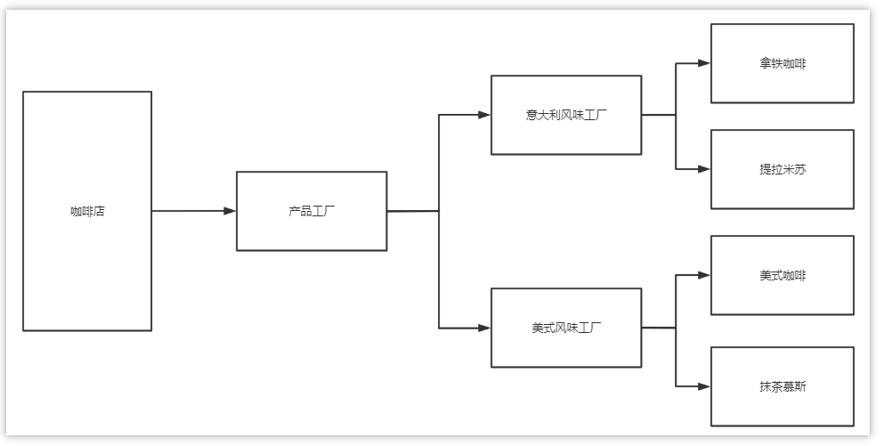

**优点**

当一个产品族中的多个对象被设计成一起工作时，它能保证客户端始终只使用同一个产品族中的对象。

**缺点**

当产品族中需要增加一个新的产品时，所有的工厂类都需要进行修改。

**使用场景**

* 当需要创建的对象是一系列相互关联或相互依赖的产品族时，如电器工厂中的电视机、洗衣机、空调等。

* 系统中有多个产品族，但每次只使用其中的某一族产品。如有人只喜欢穿某一个品牌的衣服和鞋。

* 系统中提供了产品的类库，且所有产品的接口相同，客户端不依赖产品实例的创建细节和内部结构。

如：输入法换皮肤，一整套一起换。生成不同操作系统的程序。


### 策略模式

**概述**

先看下面的图片，我们去旅游选择出行模式有很多种，可以骑自行车、可以坐汽车、可以坐火车、可以坐飞机。

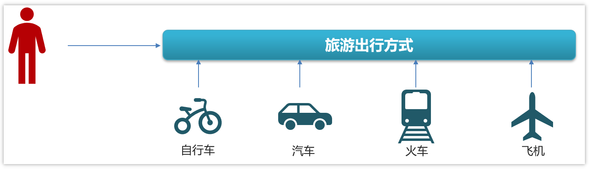

作为一个程序猿，开发需要选择一款开发工具，当然可以进行代码开发的工具有很多，可以选择Idea进行开发，也可以使用eclipse进行开发，也可以使用其他的一些开发工具。

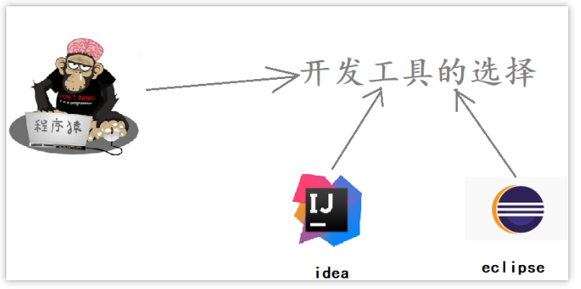

**定义：**

​	该模式定义了一系列算法，并将每个算法封装起来，使它们可以相互替换，且算法的变化不会影响使用算法的客户。策略模式属于对象行为模式，它通过对算法进行封装，把使用算法的责任和算法的实现分割开来，并委派给不同的对象对这些算法进行管理。


**结构**

策略模式的主要角色如下：

* 抽象策略（Strategy）类：这是一个抽象角色，通常由一个接口或抽象类实现。此角色给出所有的具体策略类所需的接口。
* 具体策略（Concrete Strategy）类：实现了抽象策略定义的接口，提供具体的算法实现或行为。
* 环境（Context）类：持有一个策略类的引用，最终给客户端调用。

**案例实现**

【例】促销活动

一家百货公司在定年度的促销活动。针对不同的节日（春节、中秋节、圣诞节）推出不同的促销活动，由促销员将促销活动展示给客户。类图如下：

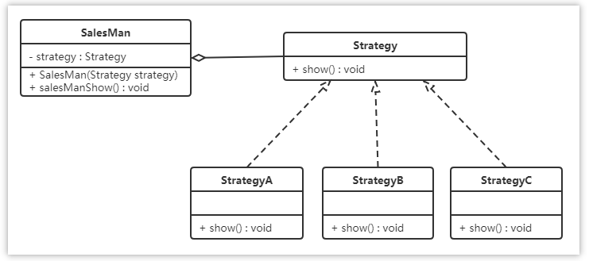

>聚合关系可以用带空心菱形的实线来表示

代码如下：

定义百货公司所有促销活动的共同接口

```java
public interface Strategy {
    void show();
}
```

定义具体策略角色（Concrete Strategy）：每个节日具体的促销活动

```java
//为春节准备的促销活动A
public class StrategyA implements Strategy {

    public void show() {
        System.out.println("买一送一");
    }
}

//为中秋准备的促销活动B
public class StrategyB implements Strategy {

    public void show() {
        System.out.println("满200元减50元");
    }
}

//为圣诞准备的促销活动C
public class StrategyC implements Strategy {

    public void show() {
        System.out.println("满1000元加一元换购任意200元以下商品");
    }
}
```

定义环境角色（Context）：用于连接上下文，即把促销活动推销给客户，这里可以理解为销售员

```java
public class SalesMan {                        
    //持有抽象策略角色的引用                              
    private Strategy strategy;                 
                                               
    public SalesMan(Strategy strategy) {       
        this.strategy = strategy;              
    }                                          
                                               
    //向客户展示促销活动                                
    public void salesManShow(){                
        strategy.show();                       
    }                                          
}                                              
```

### 综合案例（工厂+策略）

**概述**

下图是gitee的登录的入口，其中有多种方式可以进行登录

- 用户名密码登录

- 短信验证码登录

- 微信登录

- QQ登录

- ....

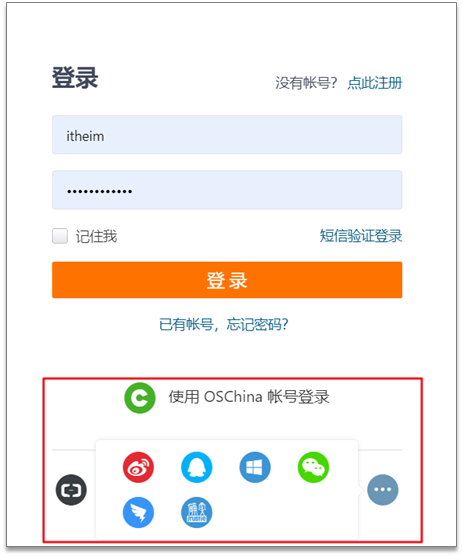

**目前已实现的代码**

登录接口

|          | 说明            |
| -------- | --------------- |
| 请求方式 | POST            |
| 路径     | /api/user/login |
| 参数     | LoginReq        |
| 返回值   | LoginResp       |

请求参数：LoginReq

```java
@Data
public class LoginReq {

    private String name;
    private String password;

    private String phone;
    private String validateCode;//手机验证码

    private String wxCode;//用于微信登录
    /**
     * account : 用户名密码登录
     * sms : 手机验证码登录
     * we_chat : 微信登录
     */
    private String type;
}
```

响应参数：LoginResp

```java
@Data
public class LoginResp{
    private Integer userId;
    private String userName;
    private String roleCode;
    private String token; //jwt令牌
    private boolean success;

}
```

控制层LoginController

```java
@RestController
@RequestMapping("/api/user")
public class LoginController {

    @Autowired
    private UserService userService;


    @PostMapping("/login")
    public LoginResp login(@RequestBody LoginReq loginReq){
        return userService.login(loginReq);
    }
}
```

业务层UserService

```java
@Service
public class UserService {

    public LoginResp login(LoginReq loginReq){

        if(loginReq.getType().equals("account")){
            System.out.println("用户名密码登录");

            //执行用户密码登录逻辑

            return new LoginResp();

        }else if(loginReq.getType().equals("sms")){
            System.out.println("手机号验证码登录");

            //执行手机号验证码登录逻辑

            return new LoginResp();
        }else if (loginReq.getType().equals("we_chat")){
            System.out.println("微信登录");

            //执行用户微信登录逻辑

            return new LoginResp();
        }
        LoginResp loginResp = new LoginResp();
        loginResp.setSuccess(false);
        System.out.println("登录失败");
        return loginResp;
    }
}
```

>注意：我们重点讲的是设计模式，并不是登录的逻辑，所以以上代码并没有真正的实现登录功能

问题分析

- 业务层代码大量使用到了if...else，在后期阅读代码的时候会非常不友好，大量使用if...else性能也不高
- 如果业务发生变更，比如现在新增了QQ登录方式，这个时候需要修改业务层代码，违反了开闭原则

解决：

使用**工厂方法设计模式+策略模式**解决

**代码改造（工厂+策略）**

整体思路

改造之后，不在service中写业务逻辑，让service调用工厂，然后通过service传递不同的参数来获取不同的登录策略（登录方式）

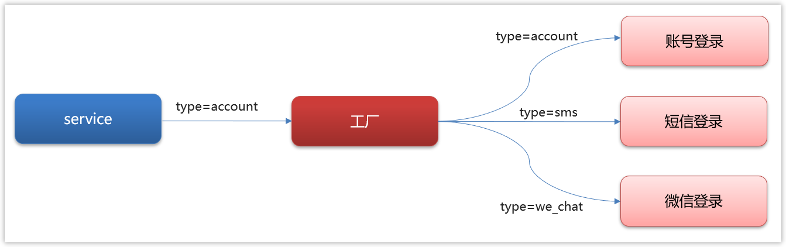

具体实现

抽象策略类：UserGranter

```java
/**
 * 抽象策略类
 */
public interface UserGranter{

   /**
    * 获取数据
    * @param loginReq 传入的参数
    * @return map值
    */
   LoginResp login(LoginReq loginReq);
}
```

具体的策略：AccountGranter、SmsGranter、WeChatGranter

```java
/**
 * 	策略：账号登录
 **/
@Component
public class AccountGranter implements UserGranter{

	@Override
	public LoginResp login(LoginReq loginReq) {

		System.out.println("登录方式为账号登录" + loginReq);
		// TODO
		// 执行业务操作 
		
		return new LoginResp();
	}
}
/**
 * 策略:短信登录
 */
@Component
public class SmsGranter implements UserGranter{

	@Override
	public LoginResp login(LoginReq loginReq)  {

		System.out.println("登录方式为短信登录" + loginReq);
		// TODO
		// 执行业务操作

		return new LoginResp();
	}
}
/**
 * 策略:微信登录
 */
@Component
public class WeChatGranter implements UserGranter{

	@Override
	public LoginResp login(LoginReq loginReq)  {

		System.out.println("登录方式为微信登录" + loginReq);
		// TODO
		// 执行业务操作
		
		return new LoginResp();
	}
}
```

工程类：UserLoginFactory

```java
/**
 * 操作策略的上下文环境类 工具类
 * 将策略整合起来 方便管理
 */
@Component
public class UserLoginFactory implements ApplicationContextAware {

    private static Map<String, UserGranter> granterPool = new ConcurrentHashMap<>();

    @Autowired
    private LoginTypeConfig loginTypeConfig;

    /**
     * 从配置文件中读取策略信息存储到map中
     * {
     * account:accountGranter,
     * sms:smsGranter,
     * we_chat:weChatGranter
     * }
     *
     * @param applicationContext
     * @throws BeansException
     */
    @Override
    public void setApplicationContext(ApplicationContext applicationContext) throws BeansException {
        loginTypeConfig.getTypes().forEach((k, y) -> {
            granterPool.put(k, (UserGranter) applicationContext.getBean(y));
        });
    }

    /**
     * 对外提供获取具体策略
     *
     * @param grantType 用户的登录方式，需要跟配置文件中匹配
     * @return 具体策略
     */
    public UserGranter getGranter(String grantType) {
        UserGranter tokenGranter = granterPool.get(grantType);
        return tokenGranter;
    }

}
```

在application.yml文件中新增自定义配置

```yaml
login:
  types:
    account: accountGranter
    sms: smsGranter
    we_chat: weChatGranter
```

新增读取数据配置类

```java
Getter
@Setter
@Configuration
@ConfigurationProperties(prefix = "login")
public class LoginTypeConfig {

    private Map<String,String> types;

}

```

改造service代码

```java
@Service
public class UserService {

    @Autowired
    private UserLoginFactory factory;

    public LoginResp login(LoginReq loginReq){

        UserGranter granter = factory.getGranter(loginReq.getType());
        if(granter == null){
            LoginResp loginResp = new LoginResp();
            loginResp.setSuccess(false);
            return loginResp;
        }
        LoginResp loginResp = granter.login(loginReq);
        return loginResp;
    }
}
```

大家可以看到我们使用了设计模式之后，业务层的代码就清爽多了，如果后期有新的需求改动，比如加入了QQ登录，我们只需要添加对应的策略就可以，无需再改动业务层代码。

**举一反三**

其实像这样的需求，在日常开发中非常常见，场景有很多，以下的情景都可以使用工厂模式+策略模式解决比如：

- 订单的支付策略
  - 支付宝支付
  - 微信支付
  - 银行卡支付
  - 现金支付
- 解析不同类型excel
  - xls格式
  - xlsx格式
- 打折促销
  - 满300元9折
  - 满500元8折
  - 满1000元7折
- 物流运费阶梯计算
  - 5kg以下
  - 5kg-10kg
  - 10kg-20kg
  - 20kg以上

一句话总结：**只要代码中有冗长的 if-else 或 switch 分支判断都可以采用策略模式优化**

### 责任链设计模式

**概述**

在现实生活中，常常会出现这样的事例：一个请求有多个对象可以处理，但每个对象的处理条件或权限不同。例如，公司员工请假，可批假的领导有部门负责人、副总经理、总经理等，但每个领导能批准的天数不同，员工必须根据自己要请假的天数去找不同的领导签名，也就是说员工必须记住每个领导的姓名、电话和地址等信息，这增加了难度。这样的例子还有很多，如找领导出差报销、生活中的“击鼓传花”游戏等。

**定义：**

又名职责链模式，为了避免请求发送者与多个请求处理者耦合在一起，将所有请求的处理者通过前一对象记住其下一个对象的引用而连成一条链；当有请求发生时，可将请求沿着这条链传递，直到有对象处理它为止。

比较常见的springmvc中的拦截器，web开发中的filter过滤器

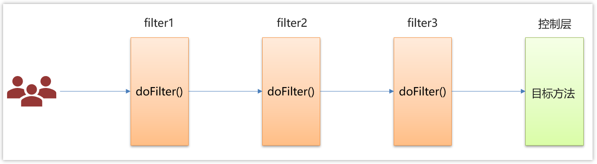

**结构**

职责链模式主要包含以下角色:

* 抽象处理者（Handler）角色：定义一个处理请求的接口，包含抽象处理方法和一个后继连接。
* 具体处理者（Concrete Handler）角色：实现抽象处理者的处理方法，判断能否处理本次请求，如果可以处理请求则处理，否则将该请求转给它的后继者。
* 客户类（Client）角色：创建处理链，并向链头的具体处理者对象提交请求，它不关心处理细节和请求的传递过程。


**案例实现**

处理订单的操作

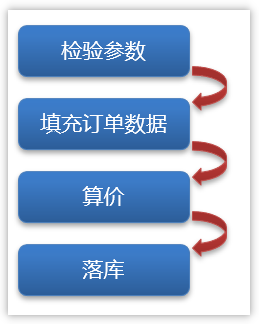

类图：

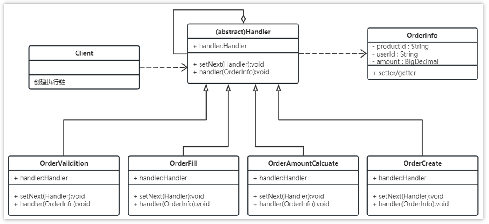

代码：

抽象处理者

```java
package com.itheima.designpattern.chain;

/**
 * 抽象处理者
 */
public abstract class Handler {

    protected Handler handler;

    public void setNext(Handler handler) {
        this.handler = handler;
    }

    /**
     * 处理过程
     * 需要子类进行实现
     */
    public abstract void process(OrderInfo order);
}
```

订单信息类：

```java
package com.itheima.designpattern.chain;


import java.math.BigDecimal;

public class OrderInfo {

    private String productId;
    private String userId;

    private BigDecimal amount;

    public String getProductId() {
        return productId;
    }

    public void setProductId(String productId) {
        this.productId = productId;
    }

    public String getUserId() {
        return userId;
    }

    public void setUserId(String userId) {
        this.userId = userId;
    }

    public BigDecimal getAmount() {
        return amount;
    }

    public void setAmount(BigDecimal amount) {
        this.amount = amount;
    }
}
```


具体处理者：

```java
/**
 * 订单校验
 */
public class OrderValidition extends Handler {

    @Override
    public void process(OrderInfo order) {
        System.out.println("校验订单基本信息");
        //校验
        handler.process(order);
    }

}

/**
 * 补充订单信息
 */
public class OrderFill extends Handler {
    @Override
    public void process(OrderInfo order) {
        System.out.println("补充订单信息");
        handler.process(order);
    }

}

/**
 * 计算金额
 */
public class OrderAmountCalcuate extends Handler {
    @Override
    public void process(OrderInfo order) {
        System.out.println("计算金额-优惠券、VIP、活动打折");
        handler.process(order);
    }

}

/**
 * 订单入库
 */
public class OrderCreate extends Handler {
    @Override
    public void process(OrderInfo order) {
        System.out.println("订单入库");
    }
}

```

客户类：

```java
public class Application {

    public static void main(String[] args) {
        //检验订单
        Handler orderValidition = new OrderValidition();
        //补充订单信息
        Handler orderFill = new OrderFill();
        //订单算价
        Handler orderAmountCalcuate = new OrderAmountCalcuate();
        //订单落库
        Handler orderCreate = new OrderCreate();

        //设置责任链路
        orderValidition.setNext(orderFill);
        orderFill.setNext(orderAmountCalcuate);
        orderAmountCalcuate.setNext(orderCreate);

        //开始执行
        orderValidition.process(new OrderInfo());
    }

}
```


**优点**

* 降低了对象之间的耦合度

  该模式降低了请求发送者和接收者的耦合度。

* 增强了系统的可扩展性

  可以根据需要增加新的请求处理类，满足开闭原则。

* 增强了给对象指派职责的灵活性

  当工作流程发生变化，可以动态地改变链内的成员或者修改它们的次序，也可动态地新增或者删除责任。

* 责任链简化了对象之间的连接

  一个对象只需保持一个指向其后继者的引用，不需保持其他所有处理者的引用，这避免了使用众多的 if 或者 if···else 语句。

* 责任分担

  每个类只需要处理自己该处理的工作，不能处理的传递给下一个对象完成，明确各类的责任范围，符合类的单一职责原则。

**缺点**

* 不能保证每个请求一定被处理。由于一个请求没有明确的接收者，所以不能保证它一定会被处理，该请求可能一直传到链的末端都得不到处理。
* 对比较长的职责链，请求的处理可能涉及多个处理对象，系统性能将受到一定影响。
* 职责链建立的合理性要靠客户端来保证，增加了客户端的复杂性，可能会由于职责链的错误设置而导致系统出错，如可能会造成循环调用。

**举一反三**

- 内容审核（视频、文章、课程….）

  

- 订单创建

  

- 简易流程审批

  

## 技术场景

### 单点登录这块怎么实现的

**概述**

单点登录的英文名叫做：Single Sign On（简称**SSO**）,只需要登录一次，就可以访问所有信任的应用系统

在**以前**的时候，一般我们就**单系统**，所有的功能都在同一个系统上。

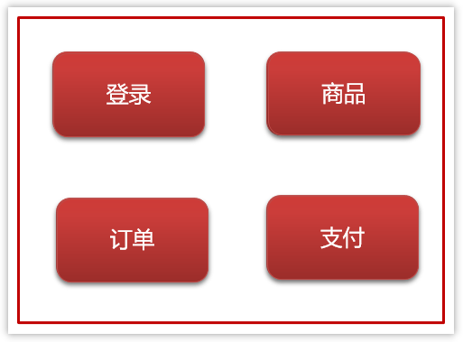

单体系统的session共享

- **登录**：将用户信息保存在Session对象中

- - 如果在Session对象中能查到，说明已经登录
  - 如果在Session对象中查不到，说明没登录（或者已经退出了登录）

- **注销（退出登录）**：从Session中删除用户的信息

后来，我们为了**合理利用资源和降低耦合性**，于是把单系统**拆分**成多个子系统。

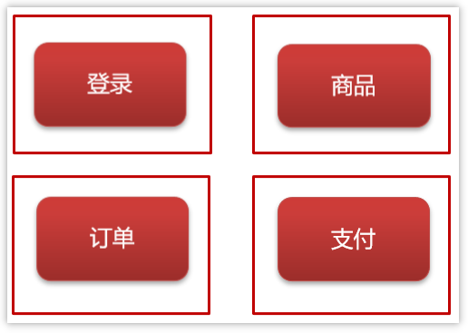

多系统即可能有多个Tomcat，而Session是依赖当前系统的Tomcat，所以系统A的Session和系统B的Session是**不共享**的。

解决系统之间Session不共享问题有一下几种方案：

- Tomcat集群Session全局复制（最多支持5台tomcat，不推荐使用）
- JWT(常见)
- Oauth2
- CAS
- 自己实现（redis+token）

**JWT解决单点登录**

现在有一个微服务的简单架构，如图：

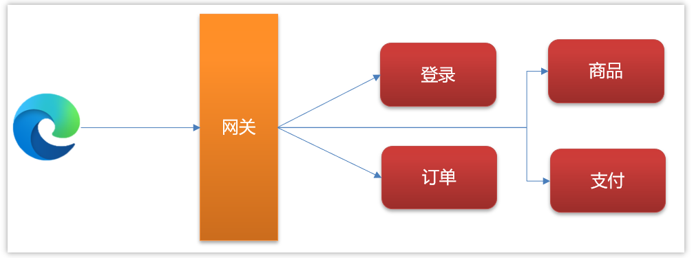

使用jwt解决单点登录的流程如下：

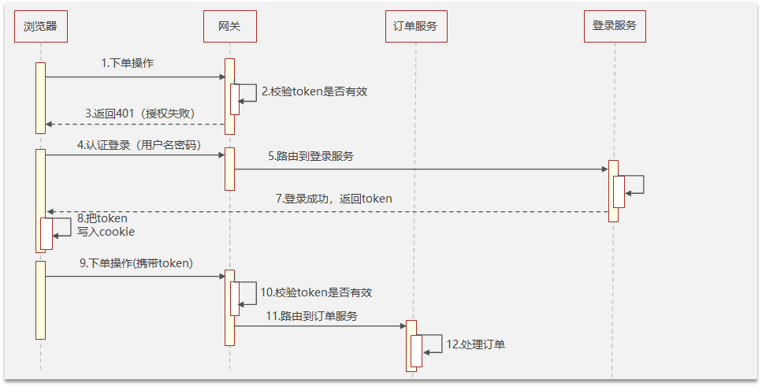

**回答要点**

1，先解释什么是单点登录

单点登录的英文名叫做：Single Sign On（简称**SSO**）

2，介绍自己项目中涉及到的单点登录（即使没涉及过，也可以说实现的思路）

3，介绍单点登录的解决方案，以JWT为例

​	   I.  用户访问其他系统，会在网关判断token是否有效

​     II.  如果token无效则会返回401（认证失败）前端跳转到登录页面

​    III.  用户发送登录请求，返回浏览器一个token，浏览器把token保存到cookie

​    IV.  再去访问其他服务的时候，都需要携带token，由网关统一验证后路由到目标服务

### 权限认证是如何实现的

**概述**

后台的管理系统，更注重权限控制，最常见的就是RBAC模型来指导实现权限

RBAC(Role-Based Access Control)基于角色的访问控制

- 3个基础部分组成：用户、角色、权限

- 具体实现
  - 5张表（用户表、角色表、权限表、用户角色中间表、角色权限中间表）
  - 7张表（用户表、角色表、权限表、菜单表、用户角色中间表、角色权限中间表、权限菜单中间表）

**RBAC权限模型**

最常见的5张表的关系

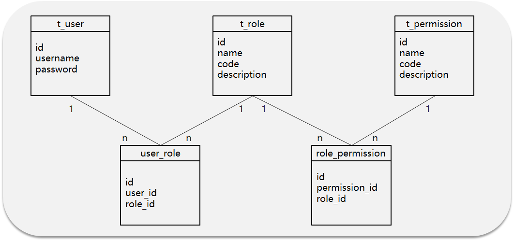

**数据流转**

张三具有什么权限呢？

流程：张三登录系统---> 查询张三拥有的角色列表--->再根据角色查询拥有的权限

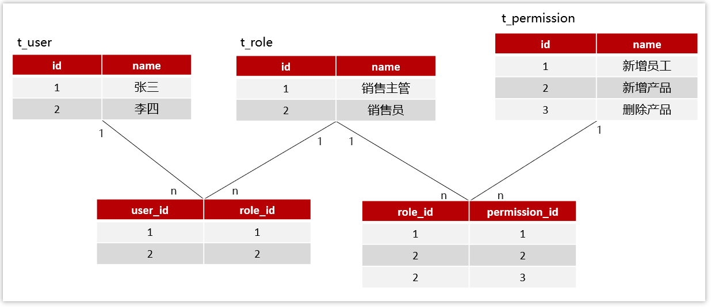

在实际的开发中，也会使用权限框架完成权限功能的实现，并且设置多种粒度，常见的框架有：

- Apache shiro  
- Spring security（推荐）

**回答要点**

- 后台管理系统的开发经验

- 介绍RBAC权限模型5张表的关系（用户、角色、权限）

- 权限框架：Spring security

### 上传数据的安全性你们怎么控制？

**概述**

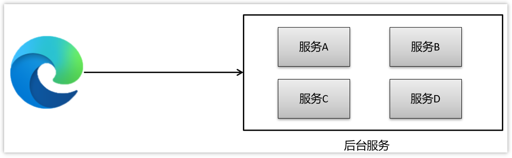

>这里的安全性，主要说的是，浏览器访问后台，需要经过网络传输，有可能会出现安全的问题

解决方案：使用非对称加密（或对称加密），给前端一个公钥让他把数据加密后传到后台，后台负责解密后处理数据

**对称加密**

文件加密和解密使用相同的密钥，即加密密钥也可以用作解密密钥

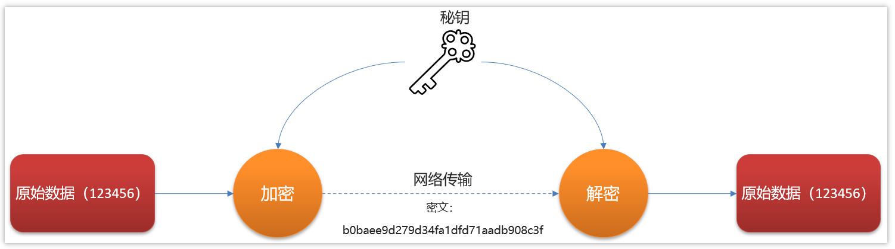

- 数据发信方将明文和加密密钥一起经过特殊的加密算法处理后，使其变成复杂的加密密文发送出去，

- 收信方收到密文后，若想解读出原文，则需要使用加密时用的密钥以及相同加密算法的逆算法对密文进行解密，才能使其回复成可读明文。
- 在对称加密算法中，使用的密钥只有一个，收发双方都使用这个密钥，这就需要解密方事先知道加密密钥。

**优点:**  对称加密算法的优点是算法公开、计算量小、加密速度快、加密效率高。

**缺点:**  没有非对称加密安全.

**用途：** 一般用于保存用户手机号、身份证等敏感但能解密的信息。

**常见的对称加密算法有**: `AES、DES、3DES、Blowfish、IDEA、RC4、RC5、RC6、HS256 `

**非对称加密**

两个密钥：公开密钥（publickey）和私有密钥，公有密钥加密，私有密钥解密

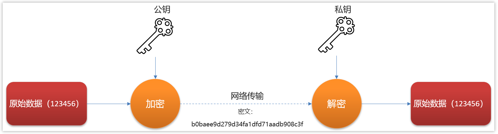

解释:  同时生成两把密钥：私钥和公钥，私钥隐秘保存，公钥可以下发给信任客户端.

加密与解密:

- 私钥加密，持有公钥才可以解密
- 公钥加密，持有私钥才可解密

签名:

- 私钥签名,  持有公钥进行验证是否被篡改过.

**优点: ** 非对称加密与对称加密相比，其安全性更好；

**缺点:**  非对称加密的缺点是加密和解密花费时间长、速度慢，只适合对少量数据进行加密。
**用途：** 一般用于签名和认证。私钥服务器保存, 用来加密,  公钥客户拿着用于对于令牌或者签名的解密或者校验使用.

**常见的非对称加密算法有：** RSA、DSA（数字签名用）、ECC（移动设备用）、RS256 (采用SHA-256 的 RSA 签名) 

**回答要点**

- 使用非对称加密（或对称加密），给前端一个公钥让他把数据加密后传到后台，后台解密后处理数据
  - 传输的数据很大建议使用对称加密，不过不能保存敏感信息
  - 传输的数据较小，要求安全性高，建议采用非对称加密

### 你负责项目的时候遇到了哪些比较棘手的问题

这个面试题主要考察的是，

- 你是否有过开发经验
- 是否是核心开发人员

有4个方面可以回答，只要挑出一个回答就行了

**设计模式**

- 工厂模式+策略
- 责任链模式

>回答思路
>
>1，什么背景（技术问题）
>
>2，过程（解决问题的过程）
>
>3，最终落地方案

举例：

①：介绍登录业务（一开始没有用设计模式，所有的登录方式都柔和在一个业务类中，不过，发现需求经常改）

②：登录方式经常会增加或更换，每次都要修改业务层代码，所以，经过我的设计，使用了工厂设计模式和策略模式，解决了，经常修改业务层代码的问题

③：详细介绍一下工厂模式和策略模式（参考前面设计模式的课程）

**线上BUG**

- CPU飙高
- 内存泄漏
- 线程死锁
- ....

回答方式参考上面的回答思路，具体问题可以参考前面的课程（JVM和多线程相关的面试题）

**调优**

- 慢接口
- 慢SQL
- 缓存方案

**组件封装**

- 分布式锁
- 接口幂等
- 分布式事务
- 支付通用


### 你们项目中日志怎么采集的

**问题**

1，为什么要采集日志？

日志是定位系统问题的重要手段，可以根据日志信息快速定位系统中的问题

2，采集日志的方式有哪些?

- ELK：即Elasticsearch、Logstash和Kibana三个软件的首字母

- 常规采集：按天保存到一个日志文件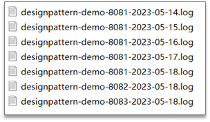

**ELK基本架构**

ELK即Elasticsearch、Logstash和Kibana三个开源软件的缩写

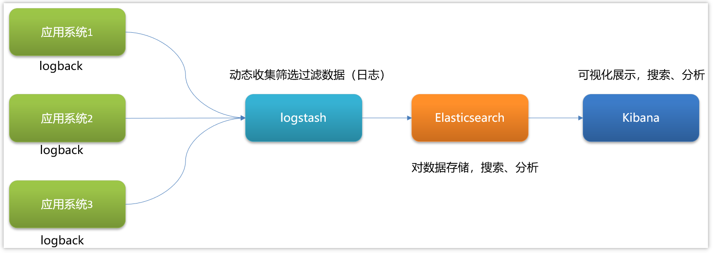

- Elasticsearch
  Elasticsearch  全文搜索和分析引擎，对大容量的数据进行接近实时的存储、搜索和分析操作。

- Logstash
  Logstash是一个数据收集引擎，它可以动态的从各种数据源搜集数据，并对数据进行过滤、分析和统一格式等操作，并将输出结果存储到指定位置上

- Kibana
  Kibana是一个数据分析和可视化平台，通常与Elasticsearch配合使用，用于对其中的数据进行搜索、分析，并且以统计图标的形式展示。

**参考回答**

- 我们搭建了ELK日志采集系统

- 介绍ELK的三个组件：
  - Elasticsearch是全文搜索分析引擎，可以对数据存储、搜索、分析
  - Logstash是一个数据收集引擎，可以动态收集数据，可以对数据进行过滤、分析，将数据存储到指定的位置
  - Kibana是一个数据分析和可视化平台，配合Elasticsearch对数据进行搜索，分析，图表化展示

### 查看日志的命令

目前采集日志的方式：按天保存到一个日志文件

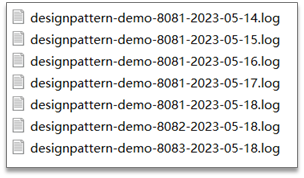

也可以在logback配置文件中设置日志的目录和名字

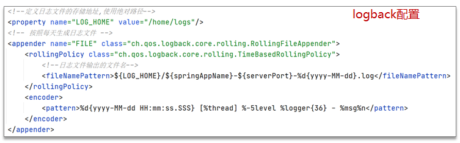


需要掌握的Linux中的日志：

- 实时监控日志的变化

  实时监控某一个日志文件的变化：tail -f xx.log；实时监控日志最后100行日志： tail –n 100 -f xx.log

- 按照行号查询

  - 查询日志尾部最后100行日志：tail – n 100 xx.log

  - 查询日志头部开始100行日志：head –n 100 xx.log

  - 查询某一个日志行号区间：cat -n xx.log | tail -n +100 | head -n 100 (查询100行至200行的日志)

- 按照关键字找日志的信息

  查询日志文件中包含debug的日志行号：cat -n xx.log | grep "debug"

- 按照日期查询

  sed -n '/2023-05-18 14:22:31.070/,/ 2023-05-18 14:27:14.158/p’xx.log 

- 日志太多，处理方式

  - 分页查询日志信息：cat -n xx.log |grep "debug" | more

  - 筛选过滤以后，输出到一个文件：cat -n xx.log | grep "debug" >debug.txt  

### 生产问题怎么排查

已经上线的bug排查的思路：

1，先分析日志，通常在业务中都会有日志的记录，或者查看系统日志，或者查看日志文件，然后定位问题

2，远程debug(通常公司的正式环境（生产环境）是不允许远程debug的。一般远程debug都是公司的测试环境，方便调试代码)

**远程debug配置**

前提条件：**远程的代码和本地的代码要保持一致**

1.远程代码需要配置启动参数，把项目打包放到服务器后启动项目的参数：

```shell
java -jar -agentlib:jdwp=transport=dt_socket,server=y,suspend=n,address=5005 project-1.0-SNAPSHOT.jar
```

>**-agentlib:jdwp**  是通知JVM使用(java debug wire protocol)来运行调试环境
>
>**transport=dt_socket**  调试数据的传送方式
>
>**server=y**  参数是指是否支持在server模式
>
>**suspend=n** 是否在调试客户端建立起来后，再执行JVM。
>
>**address=5005**  调试端口设置为5005，其它端口也可以

2.idea中设置远程debug，找到idea中的 Edit Configurations...

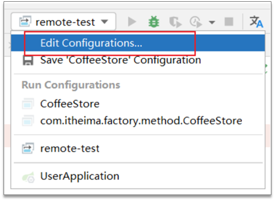

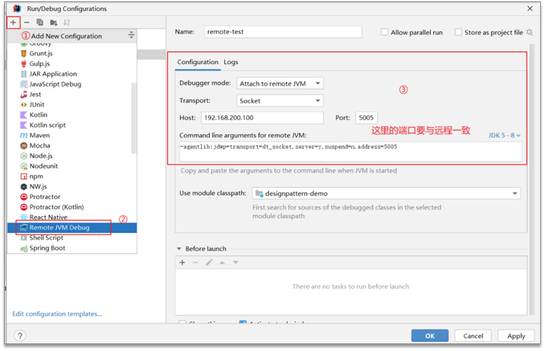

3. idea中启动远程debug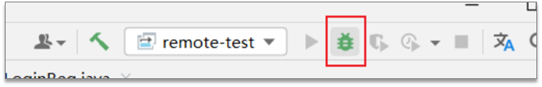
4. 访问远程服务器，在本地代码中打断点即可调试远程

### 怎么快速定位系统的瓶颈

- 压测（性能测试），项目上线之前测评系统的压力

  - 压测目的：给出系统当前的性能状况；定位系统性能瓶颈或潜在性能瓶颈
  - 指标：响应时间、 QPS、并发数、吞吐量、 CPU利用率、内存使用率、磁盘IO、错误率
  - 压测工具：LoadRunner、Apache Jmeter …
  - 后端工程师：根据压测的结果进行解决或调优（接口慢、代码报错、并发达不到要求…）

- 监控工具、链路追踪工具，项目上线之后监控

  - 监控工具：Prometheus+Grafana
  - 链路追踪工具：skywalking、Zipkin

- 线上诊断工具Arthas(阿尔萨斯)，项目上线之后监控、排查

  - 官网：https://arthas.aliyun.com/

  - 核心功能：

    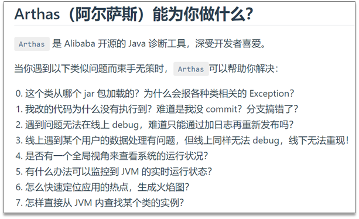

    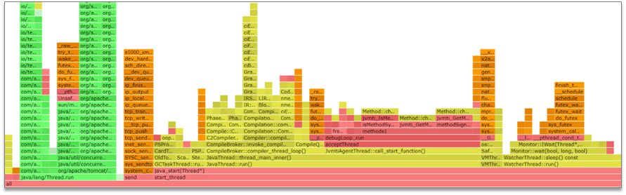