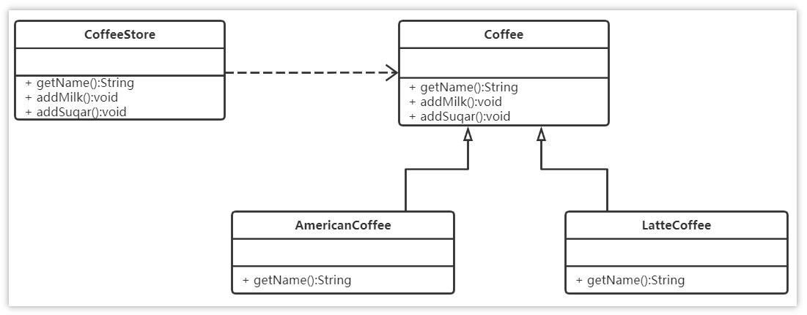
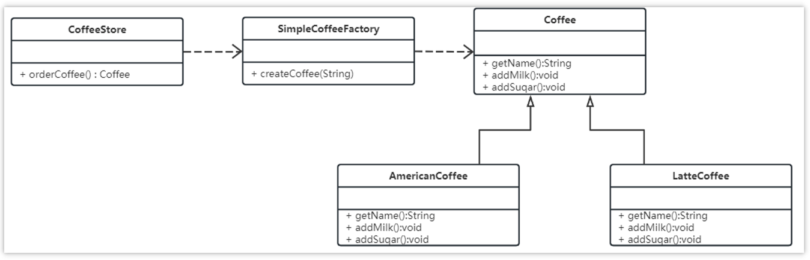

# 设计场景

## 设计模式

在平时的开发中，涉及到设计模式的有两块内容，第一个是我们平时使用的框架（比如spring、mybatis等），第二个是我们自己开发业务使用的设计模式。

需求：设计一个咖啡店点餐系统。  

设计一个咖啡类（Coffee），并定义其两个子类（美式咖啡【AmericanCoffee】和拿铁咖啡【LatteCoffee】）；再设计一个咖啡店类（CoffeeStore），咖啡店具有点咖啡的功能。

具体类的设计如下：



>类图中的符号
>
>* +：表示public
>* -：表示private
>* #：表示protected
>
>泛化关系(继承)用带空心三角箭头的实线来表示
>
>依赖关系使用带箭头的虚线来表示

```java
package com.itheima.factory.simple;

public class CoffeeStore {

    public static void main(String[] args) {
        Coffee coffee = orderCoffee("latte");
        System.out.println(coffee.getName());
    }


    public static Coffee orderCoffee(String type){
        Coffee coffee = null;
        if("american".equals(type)){
            coffee = new AmericanCoffee();
        }else if ("latte".equals(type)){
            coffee = new LatteCoffee();
        }

        //添加配料
        coffee.addMilk();
        coffee.addSuqar();
        return coffee;
    }
}

```


在java中，万物皆对象，这些对象都需要创建，如果创建的时候直接new该对象，就会对该对象耦合严重，假如我们要更换对象，所有new对象的地方都需要修改一遍，这显然违背了软件设计的**开闭原则**。如果我们使用工厂来生产对象，我们就只和工厂打交道就可以了，彻底和对象解耦，如果要更换对象，直接在工厂里更换该对象即可，达到了与对象解耦的目的；所以说，工厂模式最大的优点就是：**解耦**。

>开闭原则：**对扩展开放，对修改关闭**。在程序需要进行拓展的时候，不能去修改原有的代码，实现一个热插拔的效果。简言之，是为了使程序的扩展性好，易于维护和升级。

三种工厂

* 简单工厂模式
* 工厂方法模式
* 抽象工厂模式

### 简单工厂模式

简单工厂不是一种设计模式，反而比较像是一种编程习惯。

**结构**

简单工厂包含如下角色：

* 抽象产品 ：定义了产品的规范，描述了产品的主要特性和功能。
* 具体产品 ：实现或者继承抽象产品的子类
* 具体工厂 ：提供了创建产品的方法，调用者通过该方法来获取产品。

**实现**

现在使用简单工厂对上面案例进行改进，类图如下：



工厂类代码如下：

```java
public class SimpleCoffeeFactory {

    public Coffee createCoffee(String type) {
        Coffee coffee = null;
        if("americano".equals(type)) {
            coffee = new AmericanoCoffee();
        } else if("latte".equals(type)) {
            coffee = new LatteCoffee();
        }
        return coffee;
    }
}
```

咖啡店

```java
package com.itheima.factory.simple;

public class CoffeeStore {

    public Coffee orderCoffee(String type){
        //通过工厂获得对象，不需要知道对象实现的细节
        SimpleCoffeeFactory factory = new SimpleCoffeeFactory();
        Coffee coffee = factory.createCoffee(type);
        //添加配料
        coffee.addMilk();
        coffee.addSuqar();
        return coffee;
    }
}
```

工厂（factory）处理创建对象的细节，一旦有了SimpleCoffeeFactory，CoffeeStore类中的orderCoffee()就变成此对象的客户，后期如果需要Coffee对象直接从工厂中获取即可。这样也就解除了和Coffee实现类的耦合，同时又产生了新的耦合，CoffeeStore对象和SimpleCoffeeFactory工厂对象的耦合，工厂对象和商品对象的耦合。

后期如果再加新品种的咖啡，我们势必要需求修改SimpleCoffeeFactory的代码，违反了开闭原则。工厂类的客户端可能有很多，比如创建美团外卖等，这样只需要修改工厂类的代码，省去其他的修改操作。

**优点**

封装了创建对象的过程，可以通过参数直接获取对象。把对象的创建和业务逻辑层分开，这样以后就避免了修改客户代码，如果要实现新产品直接修改工厂类，而不需要在原代码中修改，这样就降低了客户代码修改的可能性，更加容易扩展。

**缺点**

增加新产品时还是需要修改工厂类的代码，违背了“开闭原则”。

**扩展**

在开发中也有一部分人将工厂类中的创建对象的功能定义为静态的，这个就是**静态工厂**模式，它也不是23种设计模式中的。代码如下：

```java
public class SimpleCoffeeFactory {

    public static Coffee createCoffee(String type) {
        Coffee coffee = null;
        if("americano".equals(type)) {
            coffee = new AmericanoCoffee();
        } else if("latte".equals(type)) {
            coffee = new LatteCoffee();
        }
        return coffe;
    }
}
```


## 技术场景