# 框架

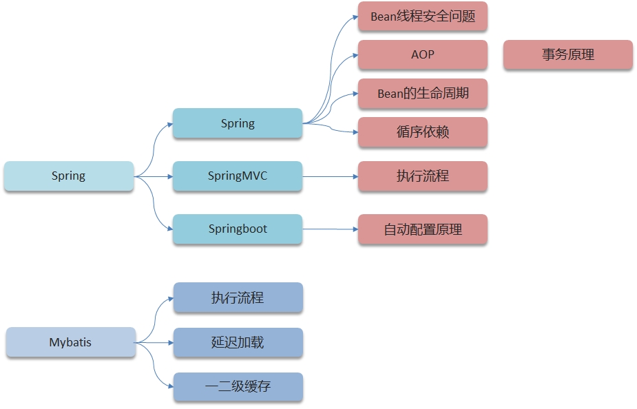

## 基础

### 常见注解

#### Spring 的常见注解有哪些？

| **注解**                                       | **说明**                                                     |
| ---------------------------------------------- | ------------------------------------------------------------ |
| @Component、@Controller、@Service、@Repository | 使用在类上用于实例化Bean                                     |
| @Autowired                                     | 使用在字段上用于根据类型依赖注入                             |
| @Qualifier                                     | 结合@Autowired一起使用用于根据名称进行依赖注入               |
| @Scope                                         | 标注Bean的作用范围                                           |
| @Configuration                                 | 指定当前类是一个 Spring  配置类，当创建容器时会从该类上加载注解 |
| @ComponentScan                                 | 用于指定 Spring  在初始化容器时要扫描的包                    |
| @Bean                                          | 使用在方法上，标注将该方法的返回值存储到Spring容器中         |
| @Import                                        | 使用@Import导入的类会被Spring加载到IOC容器中                 |
| @Aspect、@Before、@After、@Around、@Pointcut   | 用于切面编程（AOP）                                          |

#### SpringMVC常见的注解有哪些？

| **注解**        | **说明**                                                     |
| --------------- | ------------------------------------------------------------ |
| @RequestMapping | 用于映射请求路径，可以定义在类上和方法上。用于类上，则表示类中的所有的方法都是以该地址作为父路径 |
| @RequestBody    | 注解实现接收http请求的json数据，将json转换为java对象         |
| @RequestParam   | 指定请求参数的名称                                           |
| @PathViriable   | 从请求路径下中获取请求参数(/user/{id})，传递给方法的形式参数 |
| @ResponseBody   | 注解实现将controller方法返回对象转化为json对象响应给客户端   |
| @RequestHeader  | 获取指定的请求头数据                                         |
| @RestController | @Controller  + @ResponseBody                                 |

#### Springboot常见注解有哪些？

| **注解**                 | **说明**                                                     |
| ------------------------ | ------------------------------------------------------------ |
| @SpringBootConfiguration | 组合了-  @Configuration注解，实现配置文件的功能              |
| @EnableAutoConfiguration | 打开自动配置的功能，也可以关闭某个自动配置的选               |
| @ComponentScan           | Spring Boot 通过 `@SpringBootApplication` 默认包含了它，但他是Sping的注解 ，用于组件扫描 |

> **面试官**：Spring 的常见注解有哪些？
>
> **候选人**：
>
> 嗯，这个就很多了
>
> 第一类是：声明bean，有@Component、@Service、@Repository、@Controller
>
> 第二类是：依赖注入相关的，有@Autowired、@Qualifier、@Resourse
>
> 第三类是：设置作用域 @Scope
>
> 第四类是：spring配置相关的，比如@Configuration，@ComponentScan 和 @Bean 
>
> 第五类是：跟aop相关做增强的注解  @Aspect，@Before，@After，@Around，@Pointcut
>
> **面试官**：SpringMVC常见的注解有哪些？
>
> **候选人**：
>
> 嗯，这个也很多的
>
> 有@RequestMapping：用于映射请求路径；
>
> @RequestBody：注解实现接收http请求的json数据，将json转换为java对象；
>
> @RequestParam：指定请求参数的名称；
>
> @PathViriable：从请求路径下中获取请求参数(/user/{id})，传递给方法的形式参数；@ResponseBody：注解实现将controller方法返回对象转化为json对象响应给客户端。@RequestHeader：获取指定的请求头数据，还有像@PostMapping、@GetMapping这些。
>
> **面试官**：Springboot常见注解有哪些？
>
> **候选人**：
>
> 嗯~~
>
> Spring Boot的核心注解是@SpringBootApplication , 他由几个注解组成 : 
>
> - @SpringBootConfiguration： 组合了- @Configuration注解，实现配置文件的功能；
> - @EnableAutoConfiguration：打开自动配置的功能，也可以关闭某个自动配置的选项
> - @ComponentScan：Spring Boot 通过 `@SpringBootApplication` 默认包含了它，但他是Sping的注解 ，用于组件扫描

## Spring

### Spring框架中的单例bean是线程安全的吗？

**Spring框架中的bean是单例的吗？**

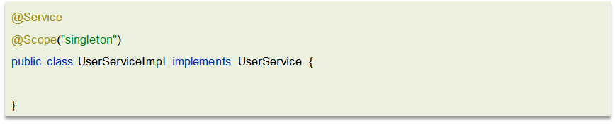

singleton : bean在每个Spring IOC容器中只有一个实例。

prototype：一个bean的定义可以有多个实例。 

默认就是singleton，也就是单例的。这意味着 Spring 容器中只会存在一个 Bean 实例，并且该实例会被多个线程共享。

如果单例 Bean 是无状态的，也就是没有成员变量或者成员变量不可变，那么这个单例 Bean 是线程安全的。比如 Spring MVC 中的 Controller、Service、Dao 等，基本上都是无状态的。

但如果 Bean 的内部状态（成员变量）是可变的，且没有进行适当的同步处理，就可能出现线程安全问题。

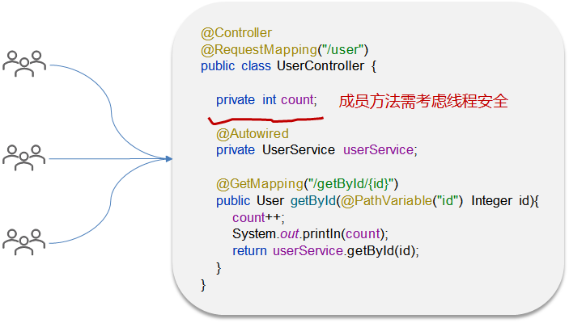

> ##### 面试官：Spring框架中的单例bean是线程安全的吗？
>
> **候选人**：
>
> 嗯！
>
> 不是线程安全的，是这样的
>
> 当多用户同时请求一个服务时，容器会给每一个请求分配一个线程，这是多个线程会并发执行该请求对应的业务逻辑（成员方法），如果该处理逻辑中有对该单列状态的修改（体现为该单例的成员属性），则必须考虑线程同步问题。
>
> Spring框架并没有对单例bean进行任何多线程的封装处理。关于单例bean的线程安全和并发问题需要开发者自行去搞定。
>
> 比如：我们通常在项目中使用的Spring bean都是不可变的状态(比如Service类和DAO类)，所以在某种程度上说Spring的单例bean是线程安全的。
>
> 如果你的bean有多种状态的话（比如 View Model对象），就需要自行保证线程安全。最浅显的解决办法就是将多态bean的作用由“**singleton**”变更为“**prototype**”。

### 说一说什么是IOC和DI

所谓的**IoC**，就是由容器来控制对象的生命周期和对象之间的关系。控制对象生命周期的不再是引用它的对象，而是容器，这就叫**控制反转**（Inversion of Control）。

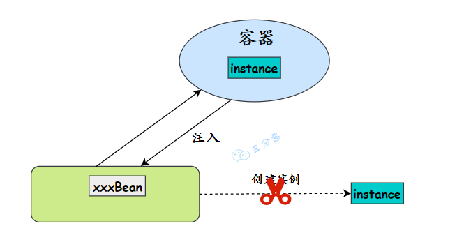

以前是我们想要什么就自己创建什么，现在是我们需要什么容器就帮我们送来什么。


没有 IoC 之前：

> 我需要一个女朋友，刚好大街上突然看到了一个小姐姐，人很好看，于是我就自己主动上去搭讪，要她的微信号，找机会聊天关心她，然后约她出来吃饭，打听她的爱好，三观。。。

有了 IoC 之后：

> 我需要一个女朋友，于是我就去找婚介所，告诉婚介所，我需要一个长的像赵露思的，会打 Dota2 的，于是婚介所在它的人才库里开始找，找不到它就直接说没有，找到它就直接介绍给我。

婚介所就相当于一个 IoC 容器，我就是一个对象，我需要的女朋友就是另一个对象，我不用关心女朋友是怎么来的，我只需要告诉婚介所我需要什么样的女朋友，婚介所就帮我去找。

Spring 倡导的开发方式就是这样，所有类的创建和销毁都通过 Spring 容器来，不再是开发者去 new，去 `= null`，这样就实现了对象的解耦。

于是，对于某个对象来说，以前是它控制它依赖的对象，现在是所有对象都被 Spring 控制。

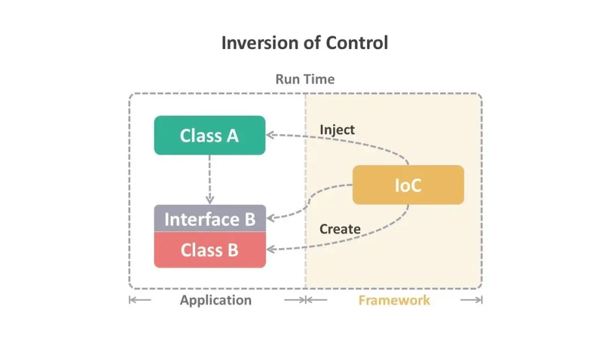

**IOC** 是一种思想，而 **DI** 是实现 **IOC** 的具体方式，比如说利用注入机制（如构造器注入、Setter 注入）将依赖传递给目标对象。

**为什么要使用 IoC 呢？**

在平时的 Java 开发中，如果我们要实现某一个功能，可能至少需要两个以上的对象来协助完成，在没有 Spring 之前，每个对象在需要它的合作对象时，需要自己 new 一个，比如说 A 要使用 B，A 就对 B 产生了依赖，也就是 A 和 B 之间存在了一种耦合关系。

有了 Spring 之后，就不一样了，创建 B 的工作交给了 Spring 来完成，Spring 创建好了 B 对象后就放到容器中，A 告诉 Spring 我需要 B，Spring 就从容器中取出 B 交给 A 来使用。

至于 B 是怎么来的，A 就不再关心了，Spring 容器想通过 newnew 创建 B 还是 new 创建 B，无所谓。

这就是 IoC 的好处，它降低了对象之间的耦合度，使得程序更加灵活，更加易于维护。

### 谈谈你对AOP的理解

AOP称为面向切面编程，用于将那些与业务无关，但却对多个对象产生影响的公共行为和逻辑，抽取并封装为一个可重用的模块，这个模块被命名为“切面”（Aspect），减少系统中的重复代码，降低了模块间的耦合度，同时提高了系统的可维护性。

举个例子，假如我们现在需要在业务代码开始前进行参数校验，在结束后打印日志，该怎么办呢？

我们可以把`日志记录`和`数据校验`这两个功能抽取出来，形成一个切面，然后在业务代码中引入这个切面，这样就可以实现业务逻辑和通用逻辑的分离。

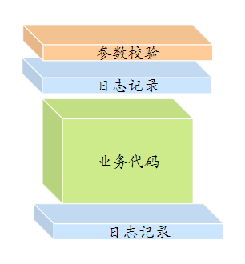

业务代码不再关心这些通用逻辑，只需要关心自己的业务实现，这样就实现了业务逻辑和通用逻辑的分离。

#### AOP中的核心概念

- 切面（Aspect）：可以理解为一个“功能模块”，专门封装某类横切关注点。比如把所有的日志操作都放在一个日志切面里，把权限检查放在一个安全切面里。
- 目标对象 （Target）：是被代理增强的业务对象，它包含了可以被拦截的连接点（如方法执行）。
- 织入（Weaving）：将通知应用到目标对象，进而生成代理对象的过程动作。
- 连接点（Join Point）：程序运行中“可以被拦截的点”（如方法调用、异常抛出等）。在Spring AOP中，仅支持方法执行这一连接点。
- 切入点（Pointcut）：是用于筛选连接点的规则，只有匹配切入点的连接点才会被实际拦截并织入切面逻辑。
- 通知（Advice）：指拦截到连接点之后要执行的代码，也可以称作增强。

#### AOP中的通知方式

- @Around：环绕通知，此注解标注的通知方法在目标方法前、后都被执行
- @Before：前置通知，此注解标注的通知方法在目标方法前被执行
- @After ：后置通知，此注解标注的通知方法在目标方法后被执行，无论是否有异常都会执行
- @AfterThrowing ： 异常后通知，此注解标注的通知方法发生异常后执行
- @AfterReturning ： 在目标方法成功执行后（没有抛出异常）执行的通知

#### AOP中的织入方式

- 编译期织入：切面在目标类编译时被织入。
- 类加载期织入：切面在目标类加载到 JVM 时被织入。需要特殊的类加载器，它可以在目标类被引入应用之前增强该目标类的字节码。
- 运行期织入：切面在应用运行的某个时刻被织入。一般情况下，在织入切面时，AOP 容器会为目标对象动态地创建一个代理对象。

Spring AOP 采用运行期织入，而 AspectJ 可以在编译期织入和类加载时织入。

#### **Spring AOP和 AspectJ**（实现原理）

**Spring AOP** 是基于动态代理实现的，动态代理是在运行时动态生成代理对象，而不是在编译时。它允许开发者在运行时指定要代理的接口和行为，从而实现在不修改源码的情况下增强方法的功能。

如果要代理的对象，实现了某个接口，那么 Spring AOP 会使用 **JDK Proxy**，去创建代理对象，该代理对象实现了目标对象所实现的接口，并在方法调用前后插入横切逻辑。而对于没有实现接口的对象，就无法使用 JDK Proxy 去进行代理了，这时候 Spring AOP 会使用 **CGLIB** 生成一个被代理对象的子类来作为代理，并在方法调用前后插入横切逻辑。如下图所示：

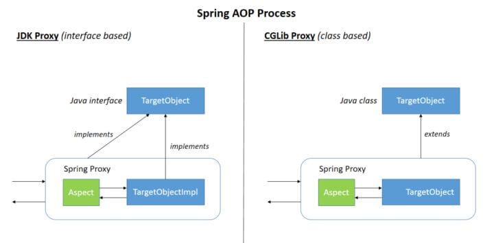

当然你也可以使用 **AspectJ** ！Spring AOP 已经集成了 AspectJ ，AspectJ 应该算的上是 Java 生态系统中最完整的 AOP 框架了。

**Spring AOP 和 AspectJ 有什么区别？**

| 特性           | Spring AOP                                               | AspectJ                                    |
| -------------- | -------------------------------------------------------- | ------------------------------------------ |
| **增强方式**   | 运行时增强（基于动态代理）                               | 编译时增强、类加载时增强（直接操作字节码） |
| **切入点支持** | 方法级（Spring Bean 范围内，不支持 final 和 staic 方法） | 方法级、字段、构造器、静态方法等           |
| **性能**       | 运行时依赖代理，有一定开销，切面多时性能较低             | 运行时无代理开销，性能更高                 |
| **复杂性**     | 简单，易用，适合大多数场景                               | 功能强大，但相对复杂                       |
| **使用场景**   | Spring 应用下比较简单的 AOP 需求                         | 高性能、高复杂度的 AOP 需求                |

#### 常见的AOP使用场景

- 记录操作日志
- 缓存处理
- Spring中内置的事务处理
- 数据脱敏

#### **记录操作日志**

获取请求的用户名、请求方式、访问地址、模块名称、登录ip、操作时间，记录到数据库的日志表中。

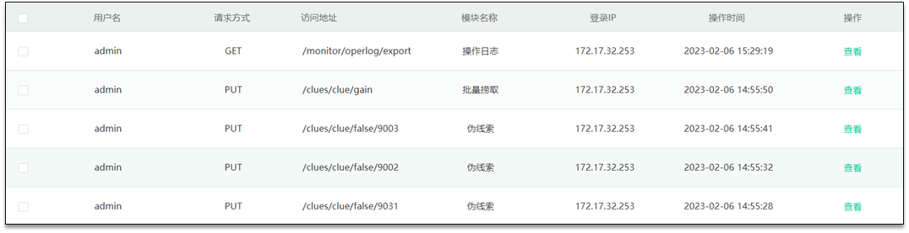

自定义注解+环绕通知

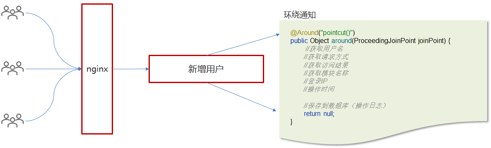

#### Spring中内置的事务处理

Spring支持编程式事务管理和声明式事务管理两种方式。

- 编程式事务控制：需使用TransactionTemplate来进行实现，对业务代码有侵入性，项目中很少使用。
- 声明式事务管理：声明式事务管理建立在AOP之上的。其本质是通过AOP功能，对方法前后进行拦截，将事务处理的功能编织到拦截的方法中，也就是在目标方法开始之前开启一个事务，在执行完目标方法之后根据执行情况提交或者回滚事务。

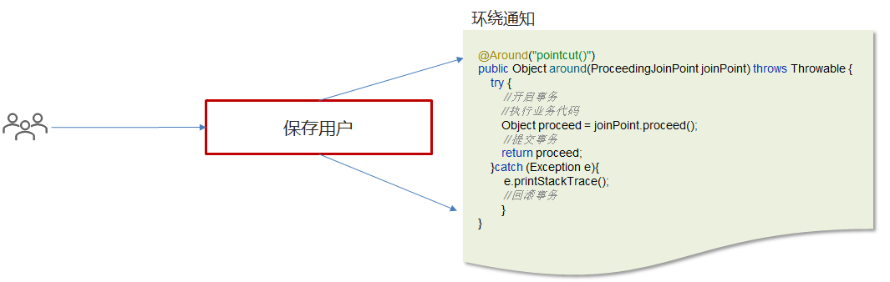

> **面试官**：什么是AOP？
>
> **候选人**：
>
> aop是面向切面编程，在spring中用于将那些与业务无关，但却对多个对象产生影响的公共行为和逻辑，抽取公共模块复用，降低耦合，一般比如可以做为公共日志保存，事务处理等。
>
> ### 谈谈你对AOP的理解？
>
> **面试官**：你们项目中有没有使用到AOP？
>
> **候选人**：
>
> 我们当时在后台管理系统中，就是使用aop来记录了系统的操作日志
>
> 主要思路是这样的，使用aop中的环绕通知+切点表达式，这个表达式就是要找到要记录日志的方法，然后通过环绕通知的参数获取请求方法的参数，比如类信息、方法信息、注解、请求方式等，获取到这些参数以后，保存到数据库
>
> ### 数据脱敏？
>
> **面试官**：Spring中的事务是如何实现的
>
> **候选人**：
>
> spring实现的事务本质就是aop完成，对方法前后进行拦截，在执行方法之前开启事务，在执行完目标方法之后根据执行情况提交或者回滚事务。

### Spring中事务失效的场景

其实主要是因为事务的实现原理是AOP、动态代理，总的原因大概有两个，对象没被动态代理，AOP感知不到异常。

**事务方法非public修饰**

由于Spring的事务是基于AOP的方式结合动态代理来实现的。因此事务方法一定要是public的，这样才能便于被Spring做事务的代理和增强。

解决办法是用public修饰方法即可。

**同一个类中，非事务方法调用事务方法**

有这样一段代码：

```Java
@Service
public class OrderService {
    
    public void createOrder(){
        // ... 准备订单数据
        
        // 生成订单并扣减库存
        insertOrderAndReduceStock();
    }
    
    @Transactional
    public void insertOrderAndReduceStock(){
        // 生成订单
        insertOrder();
        // 扣减库存
        reduceStock();
    }
}
```

可以看到，`insertOrderAndReduceStock`方法是一个事务方法，肯定会被Spring事务管理。Spring会给`OrderService`类生成一个动态代理对象，对`insertOrderAndReduceStock`方法做增加，实现事务效果。

但是现在`createOrder`方法是一个非事务方法，在其中调用了`insertOrderAndReduceStock`方法，这个调用其实隐含了一个`this.`的前缀。也就是说，这里相当于是直接调用原始的OrderService中的普通方法，而非被Spring代理对象的代理方法。那事务肯定就失效了！

这个的话可以引入AspectJ

```XML
<!--aspecj-->
<dependency>
    <groupId>org.aspectj</groupId>
    <artifactId>aspectjweaver</artifactId>
</dependency>
```

然后在启动类上添加注解，暴露代理对象

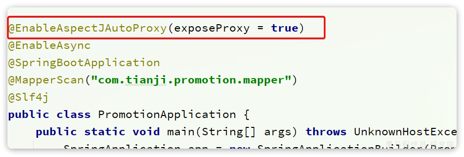

最后，获取代理对象来调用事务方法：

```java
@Service
public class OrderService {
    
    public void createOrder(){
        // ... 准备订单数据
        
        // 生成订单并扣减库存
        OrderService orderService = (OrderService) AopContext.currentProxy();
        orderService.insertOrderAndReduceStock();
    }
    
    @Transactional
    public void insertOrderAndReduceStock(){
        // 生成订单
        insertOrder();
        // 扣减库存
        reduceStock();
    }
}
```

**事务方法的异常被捕获了但没有重新抛出异常**

示例：

```Java
 @Service
 public class OrderService {

    @Transactional
    public void createOrder(){
        // ... 准备订单数据
        // 生成订单
        insertOrder();
        // 扣减库存
        reduceStock();
    }

    private void reduceStock() {
        try {
            // ...扣库存
        } catch (Exception e) {
            // 处理异常
        }
    }

 }
```

在这段代码中，reduceStock方法内部直接捕获了Exception类型的异常，也就是说方法执行过程中即便出现了异常也不会向外抛出。

而Spring的事务管理就是要感知业务方法的异常，当捕获到异常后才会回滚事务。

现在事务被捕获，就会导致Spring无法感知事务异常，自然不会回滚，事务就失效了。

所以方法捕获异常时，记得要重新抛出。

**事务回滚异常类型不对**

示例代码：

```Java
@Service
 public class OrderService {

    @Transactional(rollbackFor = RuntimeException.class)
    public void createOrder() throws IOException {
        // ... 准备订单数据
        
        // 生成订单
        insertOrder();
        // 扣减库存
        reduceStock();

        throw new IOException();
    }
 }
```

Spring的事务管理默认感知的异常类型是`RuntimeException`，当事务方法内部抛出了一个`IOException`时，不会被Spring捕获，因此就不会触发事务回滚，事务就失效了。

因此，当我们的业务中会抛出RuntimeException以外的异常时，应该通过`@Transactional`注解中的`rollbackFor`属性来指定异常类型：

```Java
@Transactional(rollbackFor = Exception.class)
```

这个表示的是只要有异常，都会回滚。

**没有被Spring管理**

示例代码：

```Java
//  @Service
 public class OrderService {
    @Transactional
    public void createOrder(){
        // 生成订单
        insertOrder();
        // 扣减库存
        reduceStock();
        throw new RuntimeException("业务异常");
    }
    @Transactional
    public void insertOrder() {
    }
    @Transactional
    public void reduceStock() {
    }
 }
```

这个示例属于比较低级的错误，`OrderService`类没有添加`@Service`注解，因此就没有被Spring管理。你在方法上添加的`@Transactional`注解根本不会有人帮你动态代理，事务自然失效。

当然，有同学会说，我不会犯这么低级的错误。这可不一定，有的时候你没有忘了加`@Service`注解，但是你在获取某个对象的时候，可能并不是获取的Spring管理的对象，有可能是其它方式创建的。这同样会导致事务失效。

> **面试官**：Spring中事务失效的场景有哪些
>
> **候选人**：
>
> 嗯！这个在项目中之前遇到过，我想想啊
>
> 第一个，如果方法上异常捕获处理，自己处理了异常，没有抛出，就会导致事务失效，所以一般处理了异常以后，别忘了跑出去就行了
>
> 第二个，如果方法抛出检查异常，如果报错也会导致事务失效，最后在spring事务的注解上，就是@Transactional上配置rollbackFor属性为Exception，这样别管是什么异常，都会回滚事务
>
> 第三，我之前还遇到过一个，如果方法上不是public修饰的，也会导致事务失效
>
> 嗯，就能想起来那么多

### Bean的生命周期

Spring容器在实例化时，会将Bean的信息封装到BeanDefinition类里，Spring根据BeanDefinition类里的信息来创建Bean对象，里面有很多属性来描述Bean。

xml文件配置bean

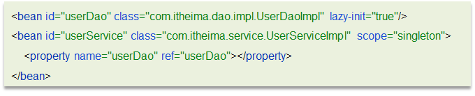

配置的bean的信息会被封装到BeanDefinition类的属性里

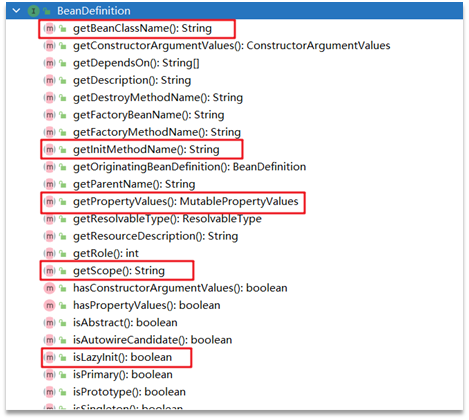

BeanDefinition定义好了之后，后续Bean就可以通过它开启自己的一生了：

1. 通过BeanDefinition获取Bean的定义信息
2. 调用构造函数实例化Bean
3. 属性和依赖注入
4. 处理Aware接口，如果Bean实现了某个*Aware接口的话，就调用相应的方法（BeanNameAware、BeanFactoryAware、ApplicationContextAware等）
5. 执行Bean的后置处理器BeanPostProcessor（before方法），如果Bean实现了后置处理器BeanPostProcessor
6. 执行Bean的初始化方法(实现了InitializingBean或者Bean中定义了init-method（加了@PostConstruct的方法）)
7. 执行Bean的执行后置处理器BeanPostProcessor（after方法），如果Bean实现了后置处理器BeanPostProcessor
8. 销毁bean

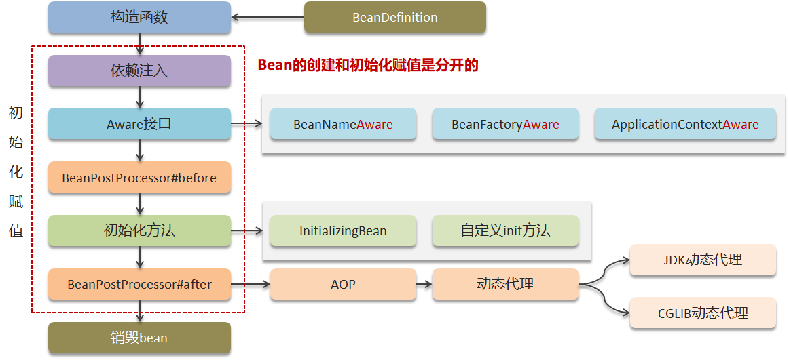

> **面试官**：Spring的bean的生命周期
>
> **候选人**：
>
> 嗯！，这个步骤还是挺多的，我之前看过一些源码，它大概流程是这样的
>
> 首先会通过一个非常重要的类，叫做BeanDefinition获取bean的定义信息，这里面就封装了bean的所有信息，比如，类的全路径，是否是延迟加载，是否是单例等等这些信息
>
> 在创建bean的时候，第一步是调用构造函数实例化bean
>
> 第二步是bean的依赖注入，比如一些set方法注入，像平时开发用的@Autowire都是这一步完成
>
> 第三步是处理Aware接口，如果某一个bean实现了Aware接口就会重写方法执行
>
> 第四步是bean的后置处理器BeanPostProcessor，这个是前置处理器
>
> 第五步是初始化方法，比如实现了接口InitializingBean或者自定义了方法init-method标签或@PostContruct
>
> 第六步是执行了bean的后置处理器BeanPostProcessor，主要是对bean进行增强，有可能在这里产生代理对象
>
> 最后一步是销毁bean

### Spring 中的循环依赖

如图，就是循环依赖可能出现的三种情况：

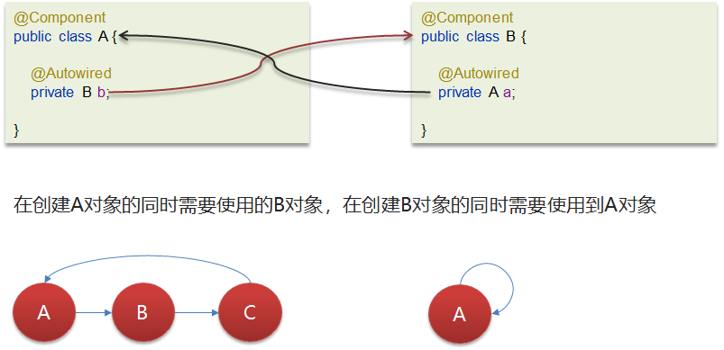

为什么会有这种问题，因为在Bean的生命周期中，一个Bean要想真正创建完成，需要先执行依赖注入，如果某个BeanA依赖了BeanB，BeanB又依赖了BeanA，就会出现这么一种情况：Bean在执行依赖注入时需要BeanB，但BeanB还未创建，BeanB开始创建，又发现BeanB需要注入依赖BeanA，但BeanA也还未真正创建完成，因此陷入死循环。

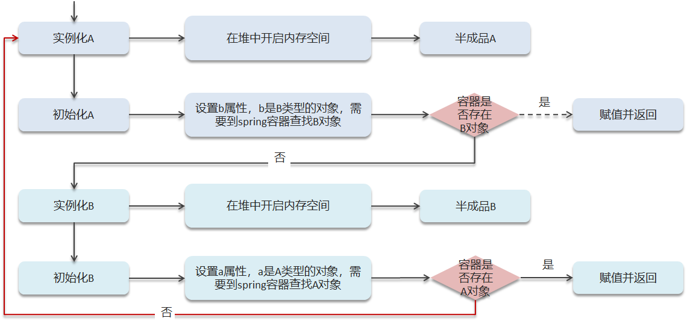

**如何解决？**

其实Sping中已经解决了大部分循环问题了，主要是通过三级缓存解决的。

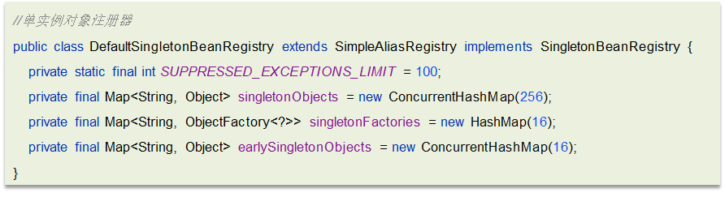

| **缓存名称** | **源码名称**          | **作用**                                                     |
| ------------ | --------------------- | ------------------------------------------------------------ |
| 一级缓存     | singletonObjects      | 单例池，缓存已经经历了完整的生命周期，已经初始化完成的bean对象 |
| 二级缓存     | earlySingletonObjects | 缓存早期的bean对象（生命周期还没走完）                       |
| 三级缓存     | singletonFactories    | 缓存的是ObjectFactory，表示对象工厂，用来创建某个对象的      |

**一级缓存**

一级缓存主要主要作用是限制Bean工厂只会创建一个Bean，后续需要该Bean都从一级缓存中获取，从而实现单例作用域的Bean。很显然，一级缓存解决不了循环依赖。

**二级缓存**

如果要想打破循环依赖, 就需要一个中间人的参与, 这个中间人就是二级缓存。加入二级缓存后，整个过程如下：

首先，实例化A对象，**获得的原始对象A（也就是早期的Bean）会被存入二级缓存**。

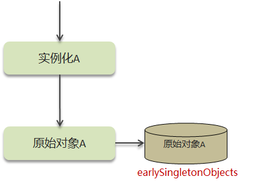

然后A对象需要注入B，B不存在，因此开始实例化B对象，**获得的原始对象B会被存入二级缓存**，然后B对象需要注入A，但这里不会再像之前那样陷入死循环，而是**从二级缓存中获取到原始对象A并注入**。

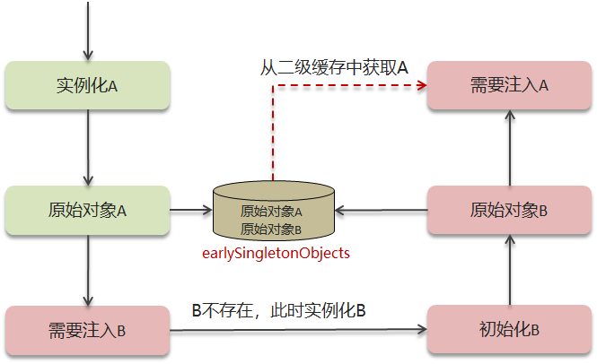

这时完整的B对象就能创建成功了，**有了完整的B对象之后，它就会被存入到一级缓存中，然后从二级缓存中被删除**。

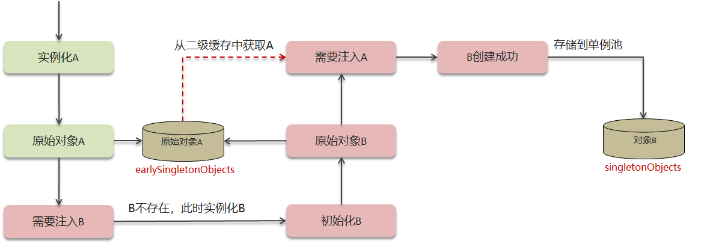

那**A对象就可以从一级缓存从获取到完整的B对象并注入**，完成自己的创建了，然后**A对象也一样会被注入一级缓存中，然后从二级缓存中被删除**。

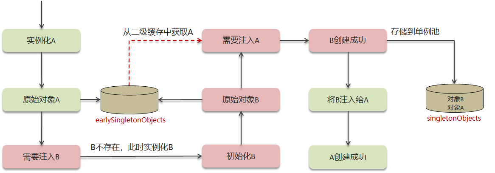

至此，循环依赖的问题成功解决。那三级缓存好像没有存在的必要了，不是的，二级缓存只能解决普通对象的循环依赖问题，而无法解决代理对象的循环依赖问题，假如A是代理对象，二级缓存就没办法了，这时候就需要三级缓存了。

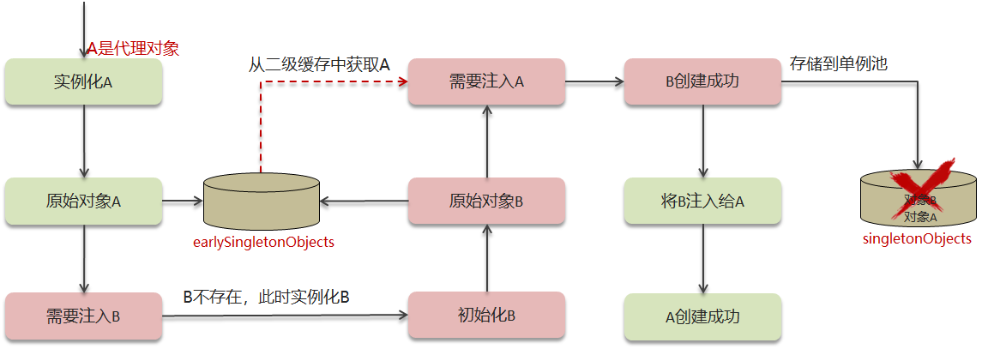

**三级缓存**

**这里假设对象A是被AOP增强过的**，因此，在对象B依赖对象A是，需要注入A的代理对象。加入三级缓存后，整个过程如下：

首先，实例化A对象，然后**原始对象A生成一个ObjectFactory对象存入三级缓存中**。这个ObjectFactory是专门来生产对象A的。

注意！这里可能有一个误区，实例对象A的动作其实并不是由ObjectFactory对象完成的，而是由构造函数完成，因此在实例化A对象之后才会生成对象A的ObjectFactory对象，ObjectFactory对象的主要作用是**提前暴露 Bean 的早期引用** 或者 **延迟生成代理对象**。

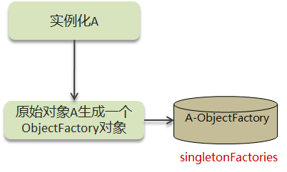

这时A对象需要注入B，但是B对象不存在，因此实例化B对象，**B对象同样生成一个ObjectFactory对象存入三级缓存中**。

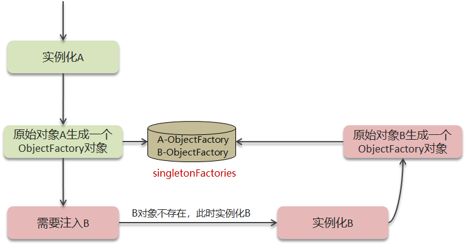

然后B对象需要注入A，而且B需要注入的是A的代理对象，目前是没有的，但是**它在三级缓存中有一个A-ObjectFactory，这个A-ObjectFactory就可以用来生成A的代理对象（如果B需要的是A的普通对象，A-ObjectFactory也可以向B提供A的普通对象），这个代理对象会被存入二级缓存中，当然它目前还是个半成品，然后A-ObjectFactory从三级缓存中被删除**，最后B就可以注入A的代理对象了。

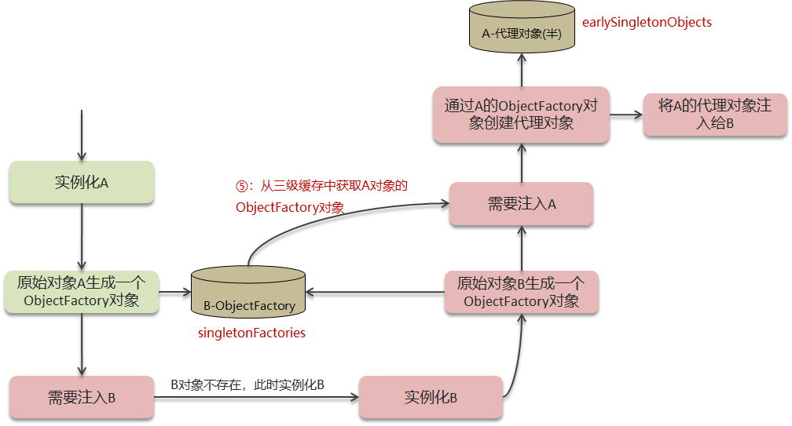

经过以上步骤，对象B创建成功，**它会被存入一级缓存中，然后B-ObjectFactory从三级缓存中被删除**。

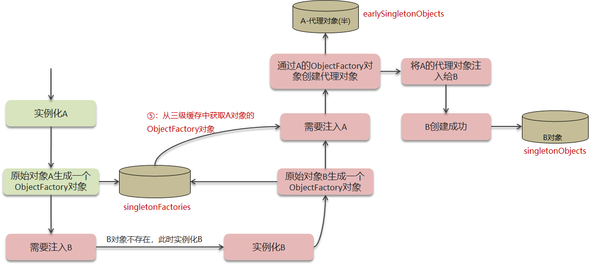

B对象创建成功了，它就可以注入给A对象了，A对象也可以创建成功了，然后它同样会被存入一级缓存中，从二级缓存中被删除。需要注意的是，目前A是一个代理对象，这样，三级缓存就成功解决了代理对象的循环依赖问题。

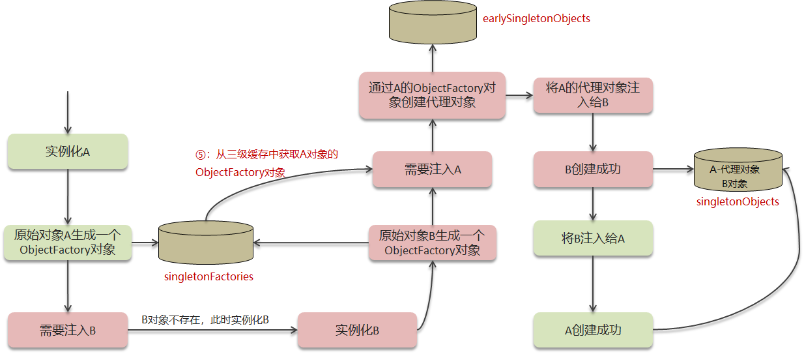

**二级缓存在三级缓存模式下的作用**

提供早期半成品对象：当 A 创建过程中请求注入 B，再回头 B 创建时又请求 A，二级缓存能让 B 拿到一个未完全初始化但足够“引用填充”的 A 对象引用，打破互相等待的死锁。

防止重复创建：有了早期引用，不会使用A-ObjectFactory再重新去创建一个 A，而是从二级缓存中直接获取到原始对象A，从而保证单例的唯一性。

**构造方法注入出现了循环依赖**

Spring使用三级缓存解决了大部分循环依赖问题，但有些循环依赖Spring解决不了，需要开发者手动解决，其中最典型的就是构造方法注入产生的循环依赖。

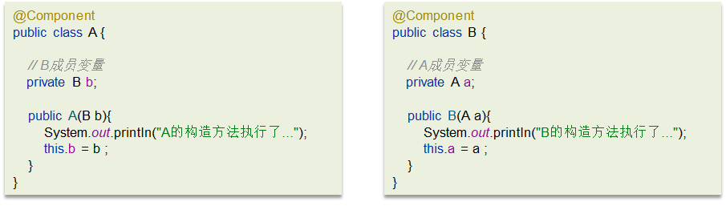

原因需要结合Bean的生命周期和三级缓存原理来分析。

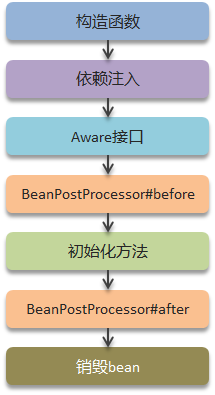

在Bean的生命周期中，第一步就是调用构造函数去实例化Bean，而在三级缓存中，是在实例化Bean之后才将ObjectFactory对象存入三级缓存中，它解决的是Bean在初始化过程的产生的循环依赖，但不能解决实例化时产生的循环依赖。

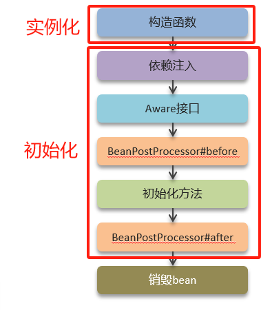

解决方法是使用`@Lazy`注解，加上这个注解的作用是，懒加载，也就是什么时候需要对象，再进行Bean对象的创建和注入。这个就能解决构造方法注入产生的循环依赖问题了。

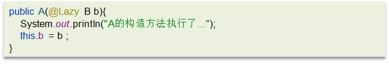

> **面试官**：Spring中的循环引用
>
> **候选人**：
>
> 嗯，好的，我来解释一下
>
> 循环依赖：循环依赖其实就是循环引用,也就是两个或两个以上的bean互相持有对方,最终形成闭环。比如A依赖于B,B依赖于A
>
> 循环依赖在spring中是允许存在，spring框架依据三级缓存已经解决了大部分的循环依赖
>
> ①一级缓存：单例池，缓存已经经历了完整的生命周期，已经初始化完成的bean对象
>
> ②二级缓存：缓存早期的bean对象（生命周期还没走完）
>
> ③三级缓存：缓存的是ObjectFactory，表示对象工厂，用来创建某个对象的
>
> **面试官**：那具体解决流程清楚吗？
>
> **候选人**：
>
> 第一，先实例A对象，同时会创建ObjectFactory对象存入三级缓存singletonFactories  
>
> 第二，A在初始化的时候需要B对象，这个走B的创建的逻辑
>
> 第三，B实例化完成，也会创建ObjectFactory对象存入三级缓存singletonFactories  
>
> 第四，B需要注入A，通过三级缓存中获取ObjectFactory来生成一个A的对象同时存入二级缓存，这个是有两种情况，一个是可能是A的普通对象，另外一个是A的代理对象，都可以让ObjectFactory来生产对应的对象，这也是三级缓存的关键
>
> 第五，B通过从通过二级缓存earlySingletonObjects  获得到A的对象后可以正常注入，B创建成功，存入一级缓存singletonObjects  
>
> 第六，回到A对象初始化，因为B对象已经创建完成，则可以直接注入B，A创建成功存入一次缓存singletonObjects 
>
> 第七，二级缓存中的临时对象A清除 
>
> **面试官**：构造方法出现了循环依赖怎么解决？
>
> **候选人**：
>
> 由于bean的生命周期中构造函数是第一个执行的，spring框架并不能解决构造函数的的依赖注入，可以使用@Lazy懒加载，什么时候需要对象再进行bean对象的创建

## SpringMVC

### SpringMVC的核心组件

- **DispatcherServlet**：前置控制器，它相当于一个调度中心，任何请求进入后台之后，都得先经过这个DispatcherServlet，它会调用其他组件来完成处理用户请求的整个过程，降低组件之间的耦合性，可以把它理解为总指挥。
- **Handler**：处理器，完成具体的业务逻辑，可以把它理解为某个Controller（控制器）的某个方法。
- **HandlerMapping**：处理器映射器，里面维护者一个map，map中记录的是请求url与对应Handler的映射关系
- **HandlerAdapter**：处理器适配器，它做了两件大事：处理参数，把 HTTP 请求中的信息（URL、表单、JSON 等）转换成方法参数。处理返回值，把方法返回的对象转成 JSON、ModelAndView等格式。Spring MVC 支持多种处理器类型，而处理器适配器让它们都能正常工作。
- **ViewResolver**：视图解析器，DispatcheServlet 通过它将逻辑视图解析为物理视图，最终将渲染结果响应给客户端。

### SpringMVC的执行流程

现在的开发模式发生了变化，SpringMVC的执行流程也不太一样了，因此它有两个版本，一个是以前的“以视图为核心”模式，像JSP等框架，一个是现在的“前后端分离”模式，也就是后端专注于提供接口，而不渲染页面。

**以视图为核心**

- 用户发起请求，前端控制器接收用户请求
- 前端控制器调用处理器映射器查询处理器
- 处理器映射器根据请求url找到对应处理器，生成一个处理器执行链（HandlerExecutionChain，包括处理器拦截器和处理器）返回给前端控制器
- 前端控制器调用处理器适配器去执行处理器，处理器将执行结果响应给处理器适配器，由处理器适配器统一封装成ModelAndView返回给前端控制器
- 前端控制器调用视图解析器，将逻辑视图转换成物理视图，视图解析器将物理视图对象返回给前端控制器
- 前端控制器渲染视图，生成最终的页面并响应返回给客户端。

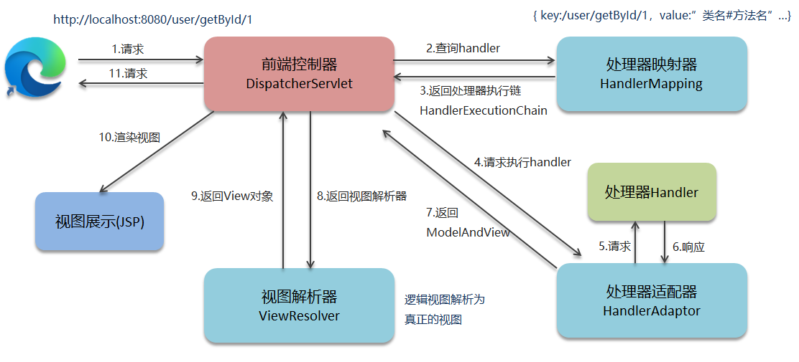

**前后端分离**

在前后端分离架构下，后端只负责输出纯数据（通常为 JSON），由前端统一接收并渲染展示。与传统 MVC 模式相比，后端不再返回视图，也无需视图解析器和前端控制器参与视图渲染；其返回结果不再是 ModelAndView，而是标准化的数据格式。同时，处理器适配器的职责被拆分给更专职的组件，处理器适配器的角色转变成了一个执行处理器的中枢，降低了个组件之间的耦合度，进一步提升了系统的模块化和可维护性。

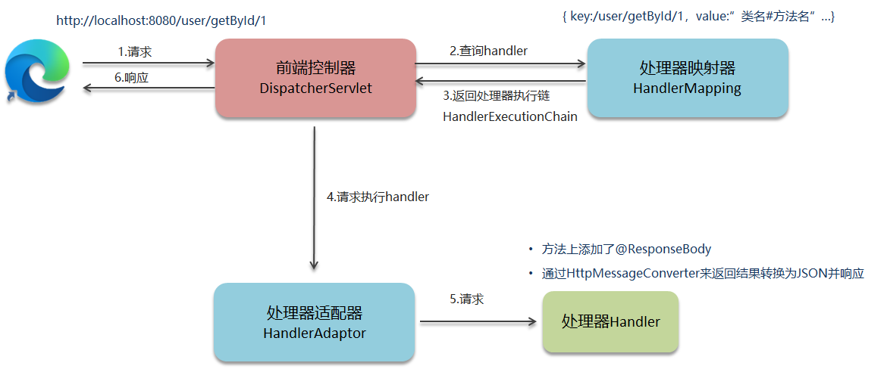

> **面试官**：SpringMVC的执行流程知道嘛
>
> **候选人**：
>
> 嗯，这个知道的，它分了好多步骤
>
> 1、用户发送出请求到前端控制器DispatcherServlet，这是一个调度中心
>
> 2、DispatcherServlet收到请求调用HandlerMapping（处理器映射器）。
>
> 3、HandlerMapping找到具体的处理器(可查找xml配置或注解配置)，生成处理器对象及处理器拦截器(如果有)，再一起返回给DispatcherServlet。
>
> 4、DispatcherServlet调用HandlerAdapter（处理器适配器）。
>
> 5、HandlerAdapter经过适配调用具体的处理器（Handler/Controller）。
>
> 6、Controller执行完成返回ModelAndView对象。
>
> 7、HandlerAdapter将Controller执行结果ModelAndView返回给DispatcherServlet。
>
> 8、DispatcherServlet将ModelAndView传给ViewReslover（视图解析器）。
>
> 9、ViewReslover解析后返回具体View（视图）。
>
> 10、DispatcherServlet根据View进行渲染视图（即将模型数据填充至视图中）。
>
> 11、DispatcherServlet响应用户。
>
> 当然现在的开发，基本都是前后端分离的开发的，并没有视图这些，一般都是handler中使用Response直接结果返回

## Springboot

### Springboot自动配置原理

Springboot自动配置的关键在于`@EnableAutoConfiguration`这个注解，为了简化配置，它被封装到`@SpringBootApplication`，也就是启动类注解。

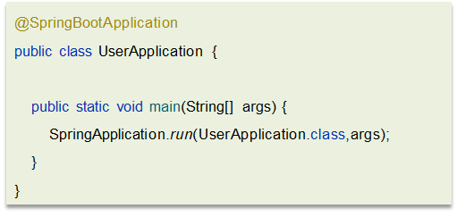

`@SpringBootApplication`中封装了三个关键注解：

- @SpringBootConfiguration：作用与`@Configuration`相同，声明当前类是一个配置类
- @ComponentScan：组件扫描，默认扫描当前引导类所在包及其子包。
- @EnableAutoConfiguration：SpringBoot实现自动化配置的核心注解。

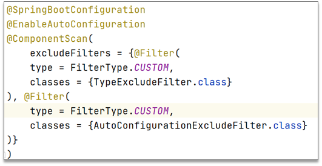

点开`@EnableAutoConfiguration`查看源码，里面包含了一个`@import`注解，它的作用是导入某一些类，把它放到 Sping 容器中，这里导入的是`AutoConfigurationImportSelector.class`这个类。

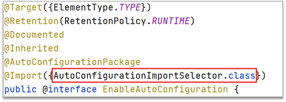

这个类里面，会去扫描所有 JAR 包的一个文件，`META-INF/spring.factories`。

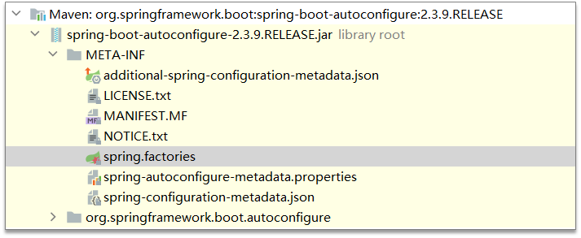

每个 JAR 包只要在 `src/main/resources/META-INF/` 下放置一个名为 `spring.factories` 的文本文件，Spring Boot 启动时，里面声明的需要自动配置的类就会被 SpringFactoriesLoader 识别。

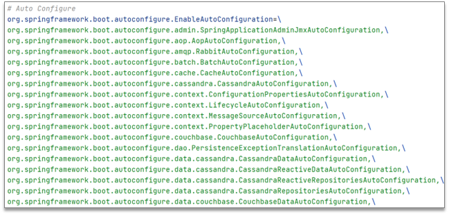

符合条件的话，它们会被加载到Spring容器中。点开`spring.factories`中声明的某一个自动配置类，比如说`RedisAutoConfiguration`

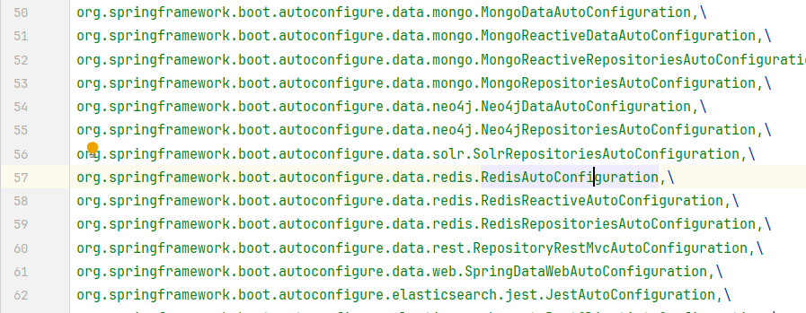

这里有四个关键注解：

**@Configuration**

这个不用多说，声明当前类是一个配置类

**@ConditionalOnClass**

这个的作用是判断是否有对应的字节码文件，有的话才加载当前类，也就是`RedisAutoConfiguration`到`Sping`容器中。在项目引入`Redis`的相关依赖后，就会有`RedisOperations`这个字节码文件

**@Bean**

将当前方法的返回值加载到`Spring`容器中

**@ConditionalOnMissingBean**

判断`Spirng`容器中是否已经存在某个`Bean`（括号中标明的），存在的话就不加载对应的`Bean`（前面通过`@Bean`加载的）了

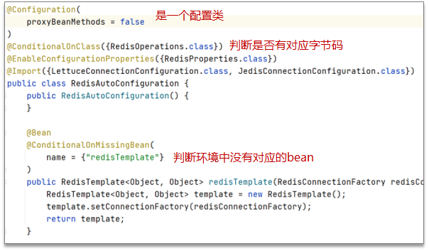

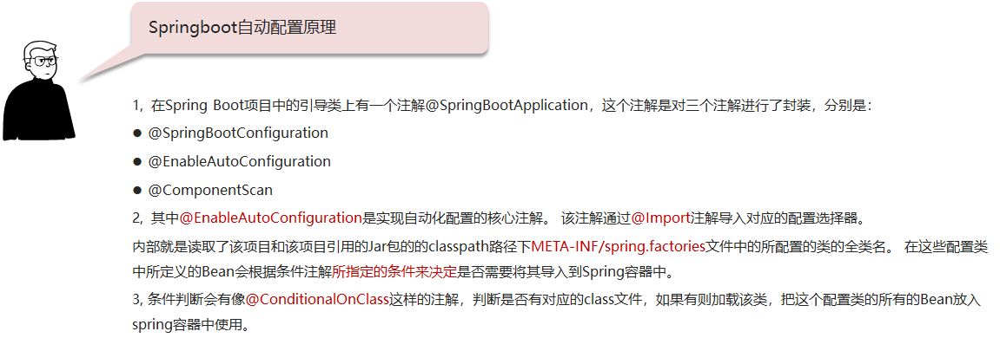

> **面试官**：Springboot自动配置原理
>
> **候选人**：
>
> 嗯，好的，它是这样的。
>
> 在Spring Boot项目中的引导类上有一个注解@SpringBootApplication，这个注解是对三个注解进行了封装，分别是：
>
> - @SpringBootConfiguration
>
> - @EnableAutoConfiguration
>
> - @ComponentScan
>
> 其中`@EnableAutoConfiguration`是实现自动化配置的核心注解。 
>
> 该注解通过`@Import`注解导入对应的配置选择器。关键的是内部就是读取了该项目和该项目引用的Jar包的的classpath路径下**META-INF/spring.factories**文件中的所配置的类的全类名。 
>
> 在这些配置类中所定义的Bean会根据条件注解所**指定的条件来决定**是否需要将其导入到Spring容器中。
>
> 一般条件判断会有像`@ConditionalOnClass`这样的注解，判断是否有对应的class文件，如果有则加载该类，把这个配置类的所有的Bean放入spring容器中使用。

## Mybatis

### MyBatis执行流程

MyBatis执行流程大概可以分成以下几步：

- 读取配置文件（`mybatis-config.xml`，`spring`项目中是`application.properties` 或 `application.yml`）

配置文件里定义了数据库连接信息以及映射文件信息

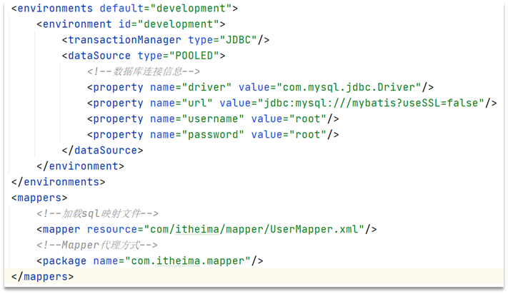

- 构建`SqlSessionFactory`，全局只有一个，用于生产`SqlSession`。
- 通过`SqlSessionFactory`创建`SqlSession`，`SqlSession`里包含了所有执行`sql`语句的原生方法，每次操作都有一个`SqlSession`，它的主要作用包括连接数据库，调用`executor（执行器）`，管理事务。
- `SqlSession`通过调用`executor`的具体方法操作数据库，并把对应的`MappedStatement`对象作为参数传递，`executor`里面就封装`JDBC`的一些操作方法，同时也负责维护查询缓存（一级缓存、二级缓存）
- `executor`读取`MappedStatement`获取映射信息，每条SQL对应一个`MappedStatement`对象

包括具体是哪个Mapper，哪个方法

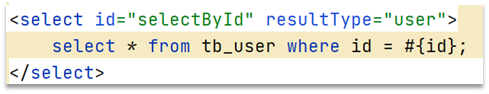

还有sql语句，参数，返回结果封装。

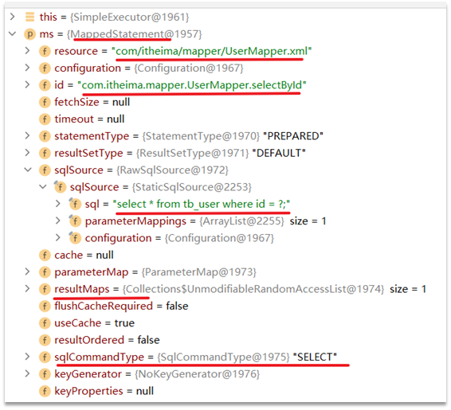

- 在操作数据库前，还要先处理参数序列化，将Java类型转换成数据库支持的类型
- 同样，操作数据库后，处理结果序列化，将数据库类型转换成Java类型
- 最后，输出结果

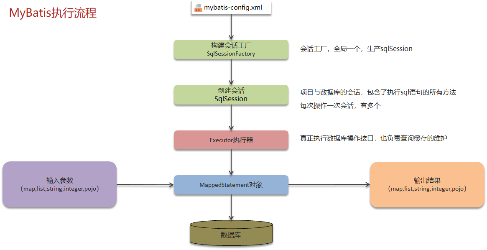

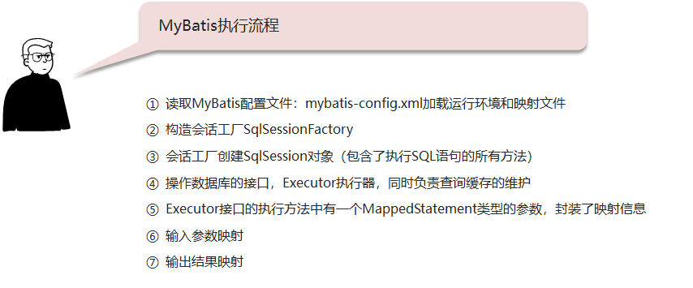

> **面试官**：MyBatis执行流程
>
> **候选人**：
>
> 好，这个知道的，不过步骤也很多
>
> ①读取MyBatis配置文件：mybatis-config.xml加载运行环境和映射文件
>
> ②构造会话工厂SqlSessionFactory，一个项目只需要一个，单例的，一般由spring进行管理
>
> ③会话工厂创建SqlSession对象，这里面就含了执行SQL语句的所有方法
>
> ④操作数据库的接口，Executor执行器，同时负责查询缓存的维护
>
> ⑤Executor接口的执行方法中有一个MappedStatement类型的参数，封装了映射信息
>
> ⑥输入参数映射
>
> ⑦输出结果映射

### Mybatis是否支持延迟加载？

mybatis是支持一对一关联对象和一对多关联集合对象的延迟加载的，但默认没有开启。

可以通过在Mapper文件中配置fetchType = "lazy"开启，这个是局部配置，针对当前方法

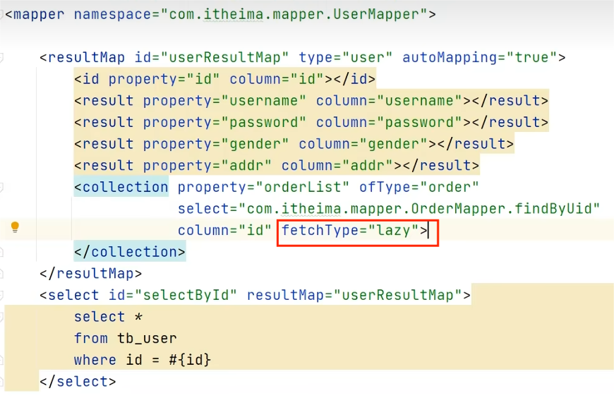

也可以在在Mybatis配置文件中，配置是否启用延迟加载`lazyLoadingEnabled = true | false`

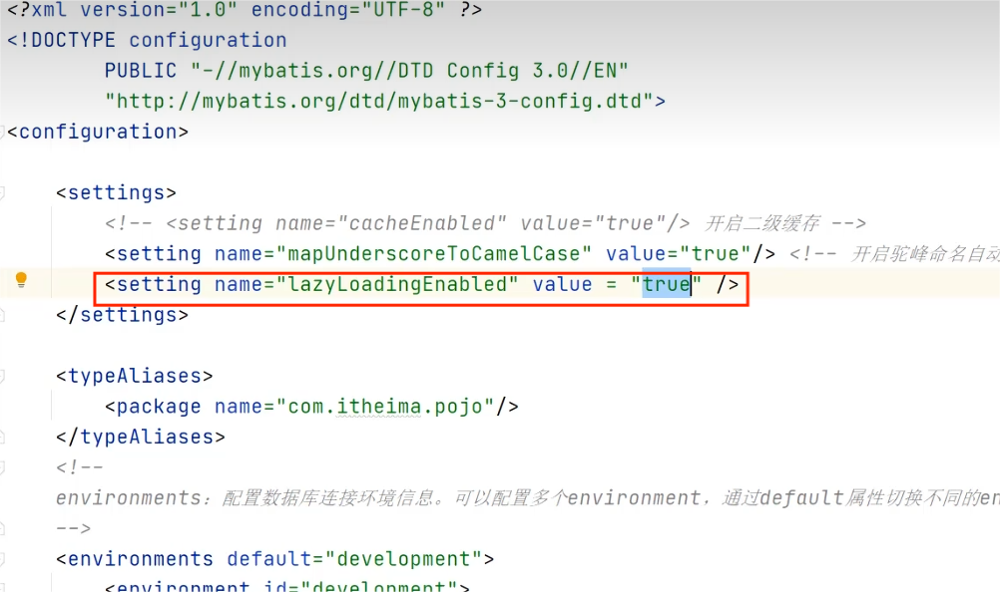

**什么叫做延迟加载？**

比如说有一张用户表和一张订单表，它们是一对多的关系，一个用户会有多个订单，通过字段`userId`关联。

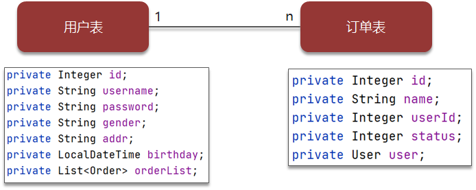

在查询用户时，把用户所有订单也查询出来，这个叫立即加载

在查询用户时，暂时不查询订单，而是在需要查询订单（执行了`getOrderList`方法）时才查询，这个叫延迟加载

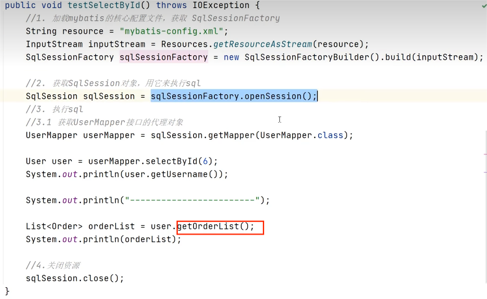

**原理**

延迟加载的原理是动态代理，默认是JDK动态代理，目前对象没有实现接口则是CGLIB动态代理，简单来说就是给目标对象（延迟加载的那个属性）创建代理对象，然后在执行目标方法，一般是`getter`方法（比如`getOrderList`）时实际上会被代理对象拦截，进入代理对象中的拦截方法，在这个方法中，会去判断`orderList`是否为空，如果为空，会执行对应sql查询订单，将结果封装到`orderList`中，然后`getOrderList`就可以正常获取结果了。

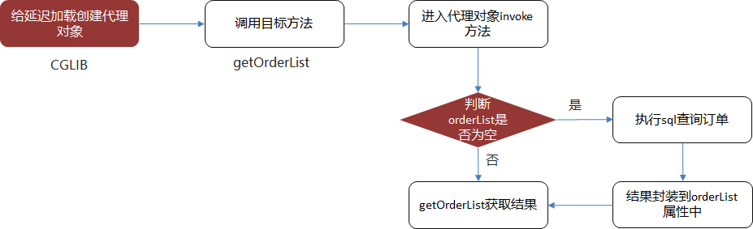

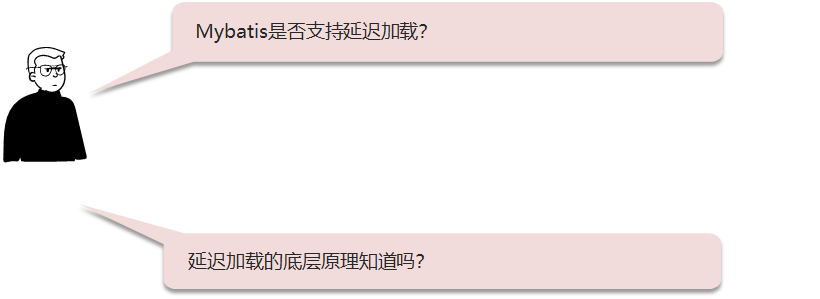

> **面试官**：Mybatis是否支持延迟加载？
>
> **候选人**：
>
> 是支持的~
>
> 延迟加载的意思是：就是在需要用到数据时才进行加载，不需要用到数据时就不加载数据。
>
> Mybatis支持一对一关联对象和一对多关联集合对象的延迟加载
>
> 在Mybatis配置文件中，可以配置是否启用延迟加载lazyLoadingEnabled=true|false，默认是关闭的
>
> **面试官**：延迟加载的底层原理知道吗？
>
> **候选人**：
>
> 嗯，我想想啊
>
> 延迟加载在底层主要使用的CGLIB动态代理完成的
>
> 第一是，使用CGLIB创建目标对象的代理对象，这里的目标对象就是开启了延迟加载的mapper
>
> 第二个是当调用目标方法时，进入拦截器invoke方法，发现目标方法是null值，再执行sql查询
>
> 第三个是获取数据以后，调用set方法设置属性值，再继续查询目标方法，就有值了

### Mybatis的一级、二级缓存

缓存一般有什么作用？

假如查询一个数据，会先去缓存中查看有没有，缓存命中的话，直接返回结果即可，没有再到数据库查询，同时再把数据回设缓存，然后返回结果。

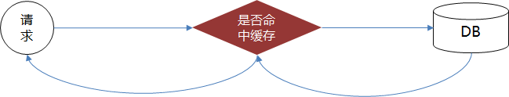

在Mybatis中，就支持一级、二级缓存，它们的缓存都是保存在本地，是基于PerpetualCache实现的，本质上是一个HashMap。

**一级缓存**

默认开启，作用域是seesion，在SqlSession进行flush()或者close()后，该SqlSession中的所有缓存就会被清空。

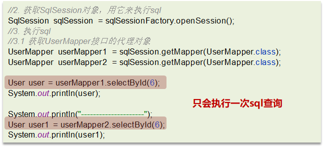

**二级缓存**

二级缓存是基于namespace和mapper的作用域起作用的，不依赖于SqlSession。如下图，如果默认使用一级缓存则会执行两次sql查询，开启二级缓存则只有一次sql查询。

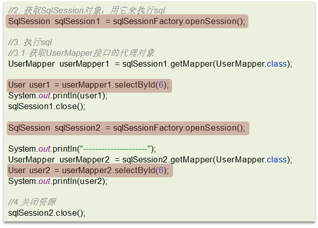

二级缓存默认是关闭的，需要在配置文件中开启，开启方式分为两步：

- 在全局配置文件（mybatis-config.xml）中开启 cacheEnabled = true;

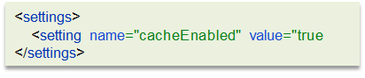

- 在对应映射文件中（***Mapper.xml）文件中添加标签\</cache>

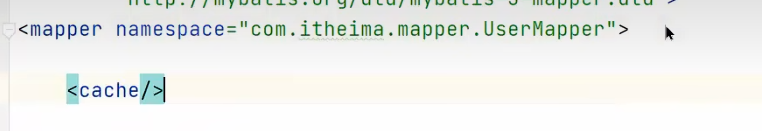

**注意事项**

- 对于缓存数据更新机制，当某一个作用域(一级缓存 Session/二级缓存Namespaces)的进行了新增、修改、删除操作后，默认该作用域下所有 select 中的缓存将被 clear
- 二级缓存需要缓存的数据实现Serializable接口
- 只有会话提交或者关闭以后，一级缓存中的数据才会转移到二级缓存中

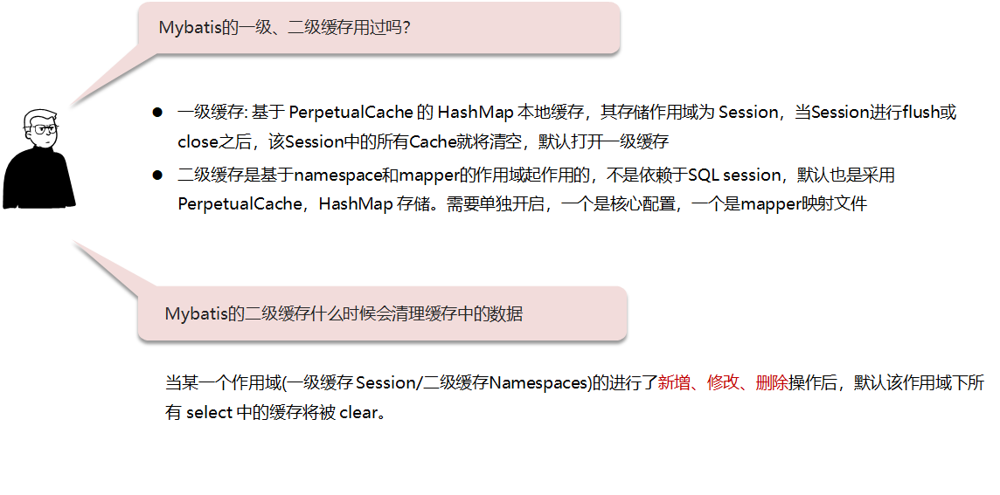

> **面试官**：Mybatis的一级、二级缓存用过吗？
>
> **候选人**：
>
> 嗯~~，用过的~
>
> mybatis的一级缓存: 基于 PerpetualCache 的 HashMap 本地缓存，其存储作用域为 Session，当Session进行flush或close之后，该Session中的所有Cache就将清空，默认打开一级缓存
>
> 关于二级缓存需要单独开启
>
> 二级缓存是基于namespace和mapper的作用域起作用的，不是依赖于SQL session，默认也是采用 PerpetualCache，HashMap 存储。
>
> 如果想要开启二级缓存需要在全局配置文件和映射文件中开启配置才行。
>
> **面试官**：Mybatis的二级缓存什么时候会清理缓存中的数据
>
> **候选人**：
>
> 嗯！！
>
> 当某一个作用域(一级缓存 Session/二级缓存Namespaces)的进行了新增、修改、删除操作后，默认该作用域下所有 select 中的缓存将被 clear。