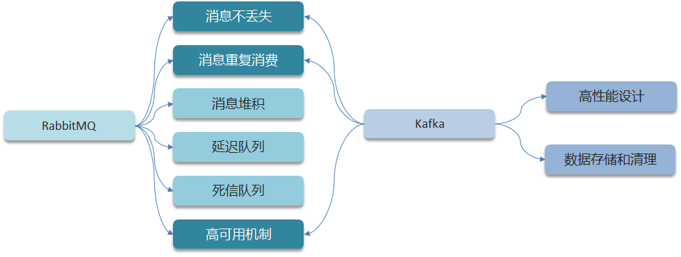
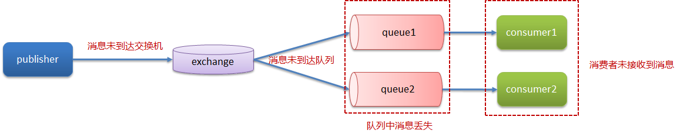
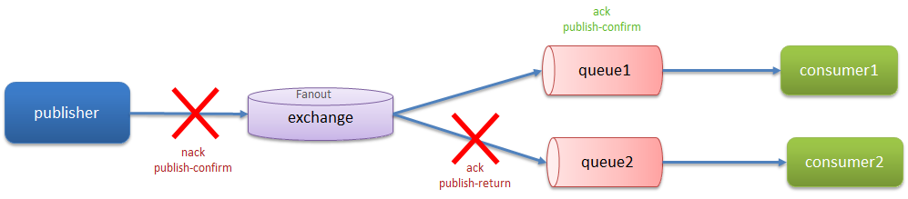
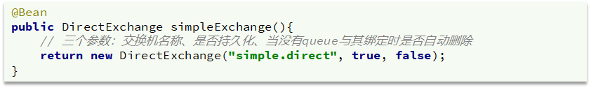
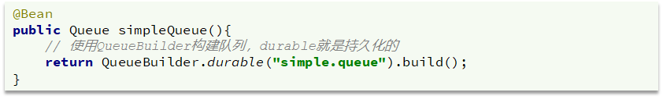
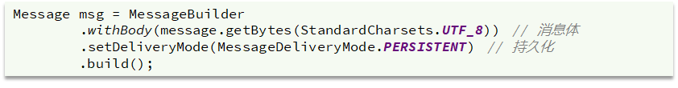
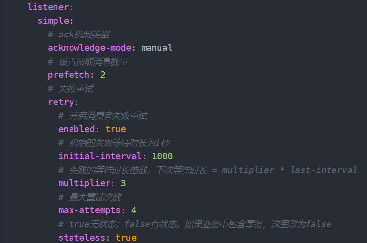
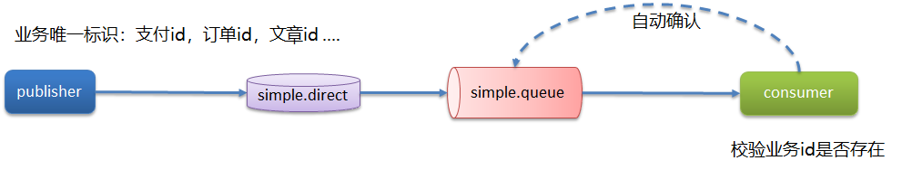

# 消息中间件

## RabbitMQ

### RabbitMQ如何保证消息不丢失?

**MQ的使用场景**

- 异步发送（验证码、短信、邮件…）
- MYSQL和Redis , ES之间的数据同步
- 分布式事务
- 削峰填谷
- …

像这些场景，都需要MQ具备高可用性，最基础的也就是保证消息不丢失，那如何做到呢？

下面是一个消息从发送到被消费的正常过程，消息在传递的过程中，在哪一个环节有可能丢失消息呢？注意！在哪一个环节都有可能丢失。

**生产者确认机制**

RabbitMQ中提供了publish confirm 机制来确认消息成功到达MQ的队列中，如果消息成功到达队列中，返回的是`ack publish-confirm`标识给消费者，当然，在这个过程中有两个地方可能会发送消息失败，一个是从生产者发送到交换机失败，一个是从交换机路由到队列失败，它们会返回不同的提示信息，如图。

消息失败之后如何处理呢？

- 回调方法即时重发
- 记录日志
- 如果还是失败，保存到数据库然后定时重发，成功发送后即刻删除表中的数据
- 如果还是失败，就只能交给人工解决了

**消息持久化**

MQ默认是内存存储消息，开启持久化功能可以确保缓存在MQ中的消息不丢失。

- 交换机持久化：

- 队列持久化：

- 消息持久化，SpringAMQP中的的消息默认是持久的，可以通过MessageProperties中的DeliveryMode来指定

**消费者确认机制**

RabbitMQ支持消费者确认机制，即：消费者处理消息后可以向MQ发送ack回执，MQ收到ack回执后才会删除该消息。而SpringAMQP则允许配置三种确认模式：

- manual：手动ack，需要在业务代码结束后，调用api发送ack。
- auto：自动ack，由spring监测listener代码是否出现异常，没有异常则返回ack；抛出异常则返回nack
- none：关闭ack，MQ假定消费者获取消息后会成功处理，因此消息投递后立即被删除

相应的，可以在配置文件中开启配置失败重试策略

> **面试官：RabbitM**Q-如何保证消息不丢失
>
> **候选人**：
>
> 嗯！我们当时MYSQL和Redis的数据双写一致性就是采用RabbitMQ实现同步的，这里面就要求了消息的高可用性，我们要保证消息的不丢失。主要从三个层面考虑
>
> 第一个是开启生产者确认机制，确保生产者的消息能到达队列，如果报错可以先记录到日志中，再去修复数据
>
> 第二个是开启持久化功能，确保消息未消费前在队列中不会丢失，其中的交换机、队列、和消息都要做持久化
>
> 第三个是开启消费者确认机制为auto，由spring确认消息处理成功后完成ack，当然也需要设置一定的重试次数，我们当时设置了3次，如果重试3次还没有收到消息，就将失败后的消息投递到异常交换机，交由人工处理

### RabbitMQ消息的重复消费问题

发生重复消费问题的场景：

- 网络抖动
- 消费者处理完业务逻辑后还未向MQ发送ack就宕机了，造成MQ中消息未正常删除

这也是个典型的幂等性问题，可以参考幂等性问题的解决方案。

比如说唯一标识（适用于新增操作）：

其他方案：

每条消息设置一个唯一的标识id

- 消费者监听到消息后获取id，先去查询这个id是否存中
- 如果不存在，则正常消费消息，并把消息的id存入 数据库或者redis中，这个操作注意要和其他业务逻辑具有原子性，失败一起失败，成功一起成功
- 如果存在则丢弃此消息

幂等方案：【 分布式锁、数据库锁（悲观锁、乐观锁） 。。。】

> **面试官**：RabbitMQ消息的重复消费问题如何解决的
>
> **候选人**：
>
> 嗯，这个我们还真遇到过，是这样的，我们当时消费者是设置了自动确认机制，当服务还没来得及给MQ确认的时候，服务宕机了，导致服务重启之后，又消费了一次消息。这样就重复消费了
>
> 因为我们当时处理的支付（订单|业务唯一标识），它有一个业务的唯一标识，我们再处理消息时，先到数据库查询一下，这个数据是否存在，如果不存在，说明没有处理过，这个时候就可以正常处理这个消息了。如果已经存在这个数据了，就说明消息重复消费了，我们就不需要再消费了
>
> **面试官**：那你还知道其他的解决方案吗？
>
> **候选人**：
>
> 嗯，我想想~
>
> 其实这个就是典型的幂等的问题，比如，redis分布式锁、数据库的锁都是可以的