# 微服务

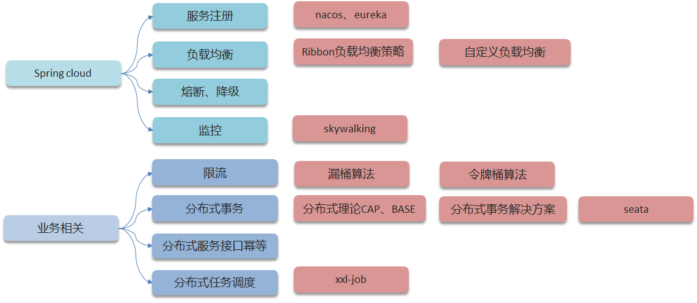

## Spring cloud

### Spring Cloud 有哪些组件？

注册中心：Eureka、Nacos

网关：Zuul、Gateway 

服务保护：Hystrix、Sentinel

远程调用：Feign

负载均衡：Ribbon

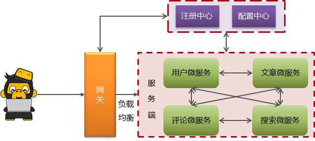

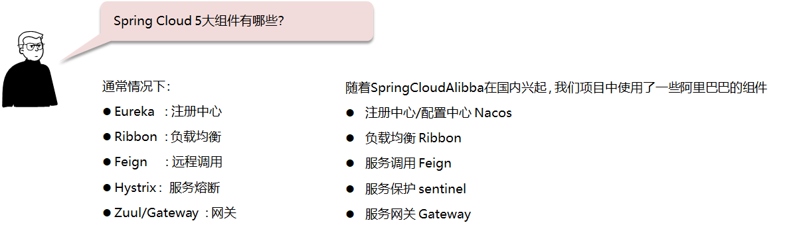

> **面试官：**Spring Cloud 5大组件有哪些？
>
> **候选人：**
>
> 早期我们一般认为的Spring Cloud五大组件是 
>
> - Eureka   : 注册中心
> - Ribbon  : 负载均衡
> - Feign     : 远程调用
> - Hystrix :  服务熔断
> - Zuul/Gateway  : 网关
>
> 随着SpringCloudAlibba在国内兴起 , 我们项目中使用了一些阿里巴巴的组件 
>
> - 注册中心/配置中心 Nacos
>
> - 负载均衡 Ribbon
>
> - 服务调用 Feign
>
> - 服务保护 Sentinel
>
> - 服务网关 Gateway

### 注册中心的作用

注册中心是微服务中必不可少的组件，主要作用有三个：服务注册、服务发现、服务监控，常见的注册中心有Eureka、Nacos、Zookeeper。

**作用**

以**Eureka**为例，这里有两个服务，订单服务和用户服务，现在有个下单操作，在下单时需要获取用户数据，那订单服务就要去远程调用用户服务，首先它得知道用户服务的IP和端口，这个时候，注册中心就起作用了。

当服务提供者启动时，这里体现为用户服务，就会把自己的信息注册到注册中心中，比如说服务名称、服务IP、服务端口、如果用户服务有三个实例，那注册中心就会保存用户服务三个实例的地址，如图，用户服务做了集群，有三个实例，但他们的地址不同，分别8081、8082和8083。同样，订单服务也会把自己的信息注册到注册中心中，供其他服务调用。

注册中心有了各个服务的信息后，比如说，订单服务想要拉取用户服务的信息，就可以从注册中心中获取了，订单中心会把用户服务的所有信息拉取到本地，但用户服务是有三个实例的，这时，订单服务就会在内部做负载均衡，去选择其中一个调用用户服务。这就是注册中心的整个工作流程了。

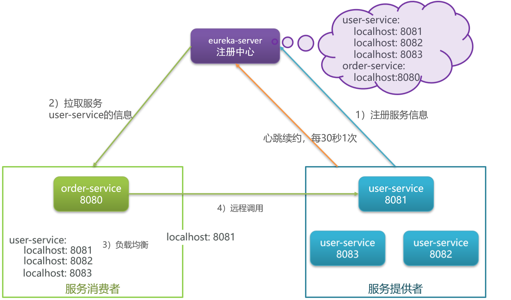

其中，服务注册主要体现在服务需要把自己的信息注册到注册中心中

服务发现体现在服务消费者服务需要调用服务提供者，于是就会到注册中心中拉取服务提供者的信息

而服务监控指的是，当某一个服务提供者的某一个实例宕机了，注册中心会监控到并把这个实例从服务提供者的实例列表中干掉，其他服务到注册中心拉取服务提供者的信息时就发现不了这个实例了。比如说，用户服务的8083宕机了，于是，它就从注册中心中被干掉，而订单服务再从注册中心中拉取订单服务的信息时也没有8083了。

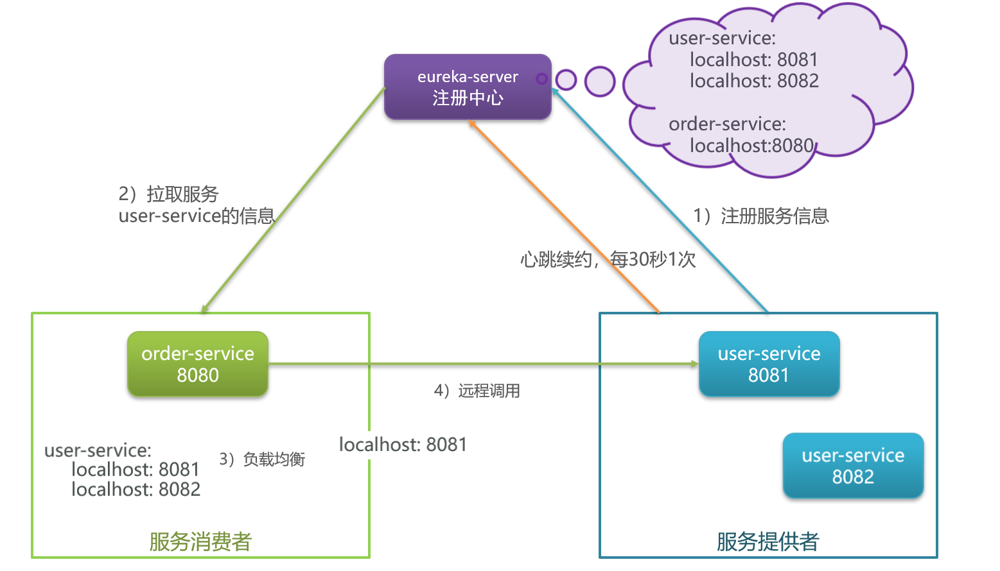

当然，它的完整机制是这样的，服务提供者的每一个实例都需要定期向注册中心发送自己的心跳，默认是30秒，证明当前自己是一个健康的实例，假如某一个实例一直没发送心跳，如果超过一定阈值，默认是90秒，注册中心还没收到实例发来的心跳，就会认为这个实例挂了，于是这个实例就从注册中心中消失，直到它再次重新连接注册中心。

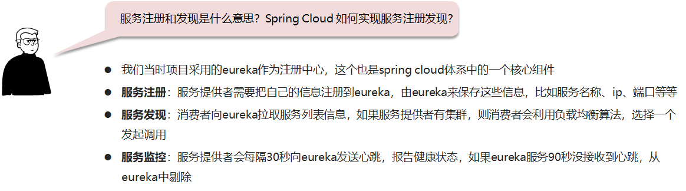

> **面试官：**服务注册和发现是什么意思？Spring Cloud 如何实现服务注册发现？
>
> **候选人：**
>
> 我理解的是主要三块大功能，分别是服务注册 、服务发现、服务状态监控
>
> 我们当时项目采用的eureka作为注册中心，这个也是spring cloud体系中的一个核心组件
>
> **服务注册**：服务提供者需要把自己的信息注册到eureka，由eureka来保存这些信息，比如服务名称、ip、端口等等
>
> **服务发现**：消费者向eureka拉取服务列表信息，如果服务提供者有集群，则消费者会利用负载均衡算法，选择一个发起调用
>
> **服务监控**：服务提供者会每隔30秒向eureka发送心跳，报告健康状态，如果eureka服务90秒没接收到心跳，从eureka中剔除

### Nacos与Eureka的共同点和不同点

注册中心除Eureka外，还有Nacos，Nacos的整个工作流程如图：


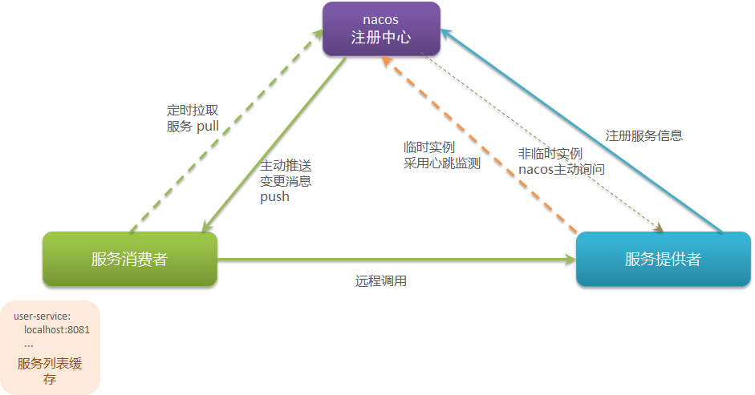

可以看到，Naocs和Eureka同样支持服务监控、服务注册和服务发现，而且在服务注册上没什么区别，但在服务监控和服务发现是有区别的。还有一个是，它们都支持服务提供者心跳方式做健康检测。

**服务监控**

Nacos中引入了临时实例的概念，在服务监控时，如果是临时实例，则还是采用心跳机制，由实例每隔一段时间，向注册中心主动发送心跳，证明自己还存活，超时则会被注册中心剔除，如果是非临时实例，则是由注册中心主动询问，但是非临时实例是不会被剔除的。

**服务发现**

除服务消费者主动拉取服务提供者的信息外，如果服务提供者的信息发生改变，注册中心还会向服务消费者推送服务提供者的最新状态。

**其他**

此外，在集群上，Nacos集群默认采用AP方式，当集群中存在非临时实例时，采用CP模式；Eureka采用AP方式。还有一个是Nacos还可以作为配置中心，Eureka则不可以。

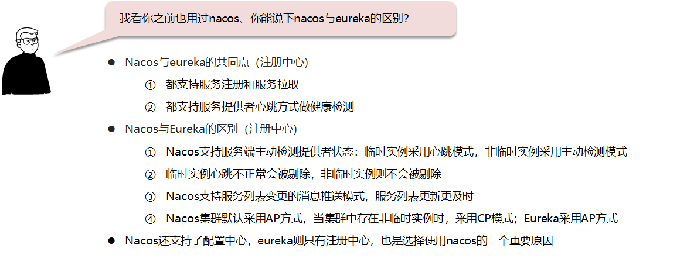

> **面试官：**我看你之前也用过nacos、你能说下nacos与eureka的区别？
>
> **候选人：**
>
> 我们当时xx项目就是采用的nacos作为注册中心，选择nacos还要一个重要原因就是它支持配置中心，不过nacos作为注册中心，也比eureka要方便好用一些，主要相同不同点在于几点：
>
> - 共同点
>
> Nacos与eureka都支持服务注册和服务拉取，都支持服务提供者心跳方式做健康检测
>
> - Nacos与Eureka的区别
>
> ①Nacos支持服务端主动检测提供者状态：临时实例采用心跳模式，非临时实例采用主动检测模式
>
> ②临时实例心跳不正常会被剔除，非临时实例则不会被剔除
>
> ③Nacos支持服务列表变更的消息推送模式，服务列表更新更及时
>
> ④Nacos集群默认采用AP方式，当集群中存在非临时实例时，采用CP模式；Eureka采用AP方式

### Ribbon负载均衡

#### Ribbon负载均衡流程

首先，服务消费者向服务提供者发起请求，该请求会被Ribbon拦截，Ribbon会解析该请求获得对应服务提供者的服务名称，如图为user-service，然后到注册中心中拉取服务提供者的信息，如果服务提供者做了集群，Ribbon就会根据负载均衡策略选择一个地址进行调用，比如说轮询，轮询到端口8081的服务提供者，ribbon就会调用该服务获取结果，如成功则将结果返回给服务消费者，失败（如超时、网络异常）则根据配置的重试策略（如RetryRule）尝试其他实例。

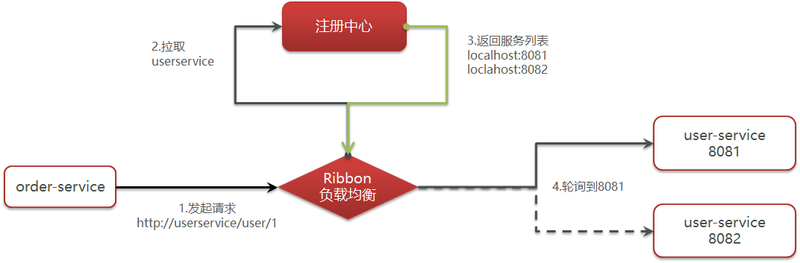

#### Ribbon负载均衡策略

RoundRobinRule：简单轮询服务列表

WeightedResponseTimeRule：按照权重来选择服务器，响应时间越长，权重越小

RandomRule：随机选择

BestAvailableRule：忽略那些短路的服务器，并选择并发数较低的服务器

RetryRule：重试机制的选择逻辑

AvailabilityFilteringRule：可用性敏感策略，先过滤非健康的，再选择连接数较小的实例

ZoneAvoidanceRule：使用Zone（区域）对服务器进行分类，就近原则选择Zone，这个Zone可以理解为一个机房、一个机架等。以区域可用的服务列表作为基础候选实例，对候选实例进行轮询选择。

#### 自定义负载均衡策略

Ribbon提供了两种方式自定义负载均衡策略：

- 在配置类中使用方法实现IRule接口，并将返回结果交给Spring容器管理（全局）
- 在配置文件中针对某一个服务的调用配置负载均衡策略（局部）

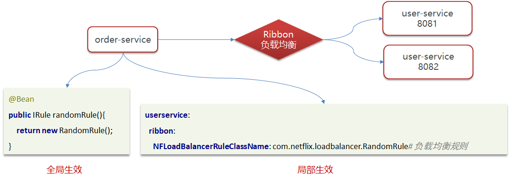

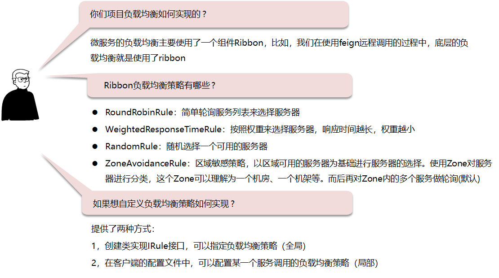

> **面试官：**你们项目负载均衡如何实现的 ? 
>
> **候选人：**
>
> 是这样~~
>
> 在服务调用过程中的负载均衡一般使用SpringCloud的Ribbon 组件实现  , Feign的底层已经自动集成了Ribbon  , 使用起来非常简单
>
> 当发起远程调用时，ribbon先从注册中心拉取服务地址列表，然后按照一定的路由策略选择一个发起远程调用，默认的调用策略是轮询，一般也是这个。
>
> **面试官：**Ribbon负载均衡策略有哪些 ? 
>
> **候选人：**
>
> 我想想啊，有很多种，我记得几个：
>
> - RoundRobinRule：简单轮询服务列表来选择服务器
> - WeightedResponseTimeRule：按照权重来选择服务器，响应时间越长，权重越小
> - RandomRule：随机选择一个可用的服务器
> - ZoneAvoidanceRule：区域敏感策略，以区域可用的服务器为基础进行服务器的选择。使用Zone对服务器进行分类，这个Zone可以理解为一个机房、一个机架等。而后再对Zone内的多个服务做轮询(默认)
>
> **面试官：**如果想自定义负载均衡策略如何实现 ? 
>
> **候选人：**
>
> 提供了两种方式：
>
> 1，创建类实现IRule接口，可以指定负载均衡策略，这个是全局的，对所有的远程调用都起作用
>
> 2，在客户端的配置文件中，可以配置某一个服务调用的负载均衡策略，只是对配置的这个服务生效远程调用

### 什么是服务雪崩，怎么解决?

服务雪崩指的是一个服务宕机造成整条链路的服务都宕机的情况。

如图，假如服务D宕机了，那服务A去调用服务D时，肯定也是失败的，假如在一段时间内，服务A不断的调用服务D，但是一个服务的连接数是有限的，而这些调用失败的连接如果不做任何处理并不会被释放，服务A的连接数如果被占满了，它也不能对外提供服务了，也就是宕机。这是一个连锁反应，如果有其他服务去调用服务A，那么其他服务也会因为服务A而宕机，最终导致服务大面积崩溃的情况，这就是服务雪崩。

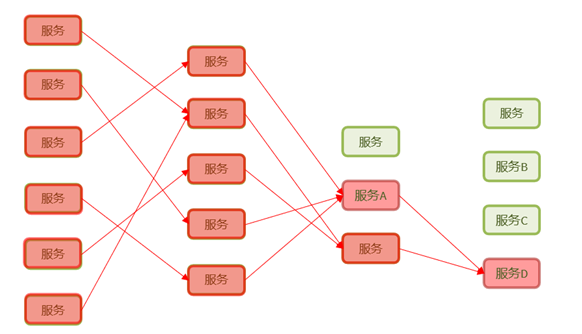

解决方案是对服务进行降级熔断，当然，还有一个是限流，但是限流只能起到预防的作用，限流的意思是一个服务如果连接数过多，就限制对这个服务的请求数量。

**服务降级**

服务降级指的是某个服务或其依赖的下游服务变得不可用时，主动关闭或弱化非核心功能业务，保障核心功能业务的正常执行，或者甚至返回预设的降级结果。这是一种**弃车保帅**的思想。服务降级是服务自我保护的一种方式，或者保护下游服务的一种方式，用于确保服务不会受请求突增影响变得不可用，确保服务不会崩溃。

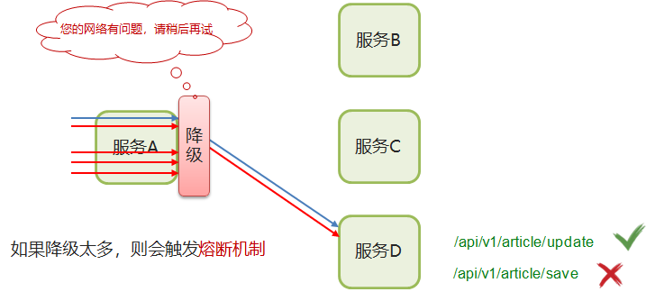

如果项目中使用了Feign，则可以配置降级逻辑，具体配置方式如图。如果服务调用正常，则走正常业务逻辑，如果调用失败，则走降级逻辑，一般可以返回错误提示信息。

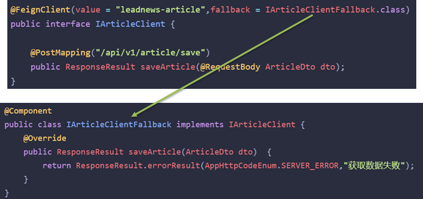

**服务熔断**

服务熔断是微服务架构中的容错机制，用于保护系统免受服务故障或异常的影响。当某个服务出现故障或异常时，服务熔断可以快速隔离该服务，确保系统稳定可用。

它通过监控服务的调用情况，当错误率或响应时间超过阈值时，触发熔断机制，后续请求将返回默认值或错误信息，避免资源浪费和系统崩溃。

服务熔断还支持自动恢复，重新尝试对故障服务的请求，确保服务恢复正常后继续使用。

Hystrix 熔断机制，用于监控微服务调用情况， 默认是关闭的，如果需要开启需要在引导类上添加注解：@EnableCircuitBreaker

如果检测到 10 秒内请求的失败率超过 50%，就触发熔断机制。之后每隔 5 秒重新尝试请求微服务，如果微服务不能响应，继续走熔断机制。如果微服务可达，则关闭熔断机制，恢复正常请求。

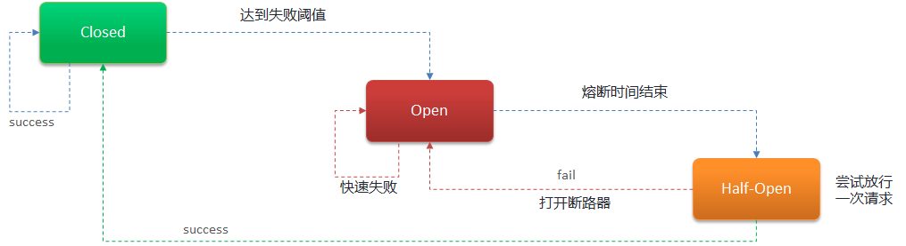

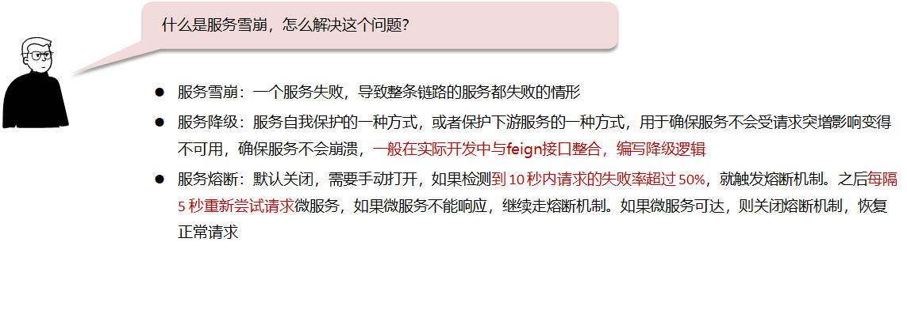

> **面试官：**什么是服务雪崩，怎么解决这个问题？
>
> **候选人：**
>
> 服务雪崩是指一个服务失败，导致整条链路的服务都失败的情形，一般我们在项目解决的话就是两种方案，第一个是服务降级，第二个是服务熔断，如果流量太大的话，可以考虑限流
>
> 服务降级：服务自我保护的一种方式，或者保护下游服务的一种方式，用于确保服务不会受请求突增影响变得不可用，确保服务不会崩溃，一般在实际开发中与feign接口整合，编写降级逻辑
>
> 服务熔断：默认关闭，需要手动打开，如果检测到 10 秒内请求的失败率超过 50%，就触发熔断机制。之后每隔 5 秒重新尝试请求微服务，如果微服务不能响应，继续走熔断机制。如果微服务可达，则关闭熔断机制，恢复正常请求

### 你们的微服务是怎么监控的？

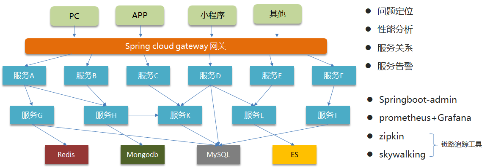

**skywalking**

一个分布式系统的应用程序性能监控工具（ Application Performance Managment ），提供了完善的链路追踪能力， apache的顶级项目（前华为产品经理吴晟主导开源）

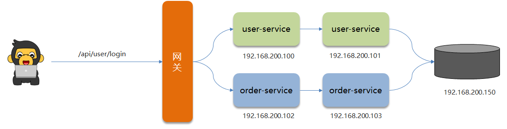

服务（service）：业务资源应用系统（微服务）

端点（endpoint）：应用系统对外暴露的功能接口（接口）

实例（instance）：服务器

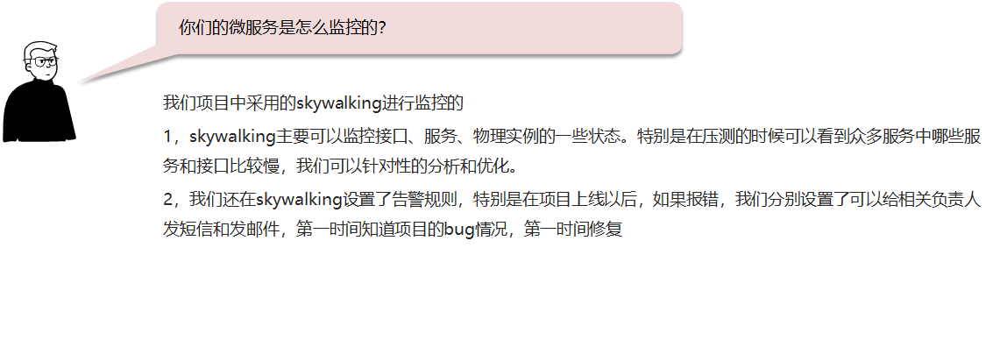

> **面试官：**你们的微服务是怎么监控的？
>
> **候选人：**
>
> 我们项目中采用的skywalking进行监控的
>
> 1，skywalking主要可以监控接口、服务、物理实例的一些状态。特别是在压测的时候可以看到众多服务中哪些服务和接口比较慢，我们可以针对性的分析和优化。
>
> 2，我们还在skywalking设置了告警规则，特别是在项目上线以后，如果报错，我们分别设置了可以给相关负责人发短信和发邮件，第一时间知道项目的bug情况，第一时间修复

## 业务

### 你们项目中有没有做过限流 ? 怎么做的 ?

**为什么要做限流：**

- 防止并发过大
- 防止恶意刷接口

**限流的实现方式：**

- tomcat（可以配置中设置最大连接数）

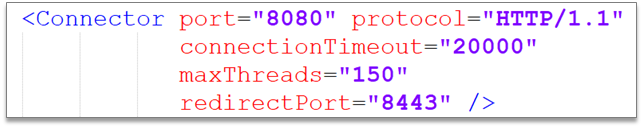

- nginx（漏桶算法）
- 网关（令牌桶算法）
- 自定义拦截器

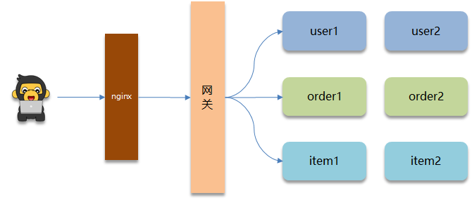

**nginx限流**

- 控制速率（突发流量）

主要原理是漏桶算法，可以理解为将接收到的请求放到一个漏桶里，并以一定的速率漏出请求，比如说每秒10个请求，路由给具体服务，当然，桶也是由大小的，如果桶满了，剩下的请求会根据策略进行处理，比如说直接抛弃或者等待。

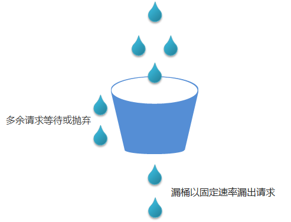

具体配置如下：

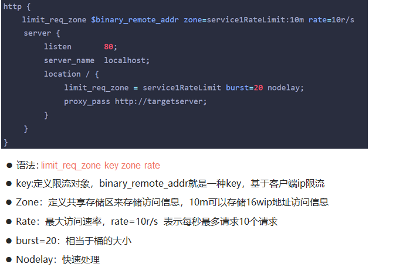

- 控制并发连接数

nginx可以针对某个服务限制它的并发请求总数，可以对单个ip的最大并发请求进行限制和对所有并发请求进行限制

具体配置如下：

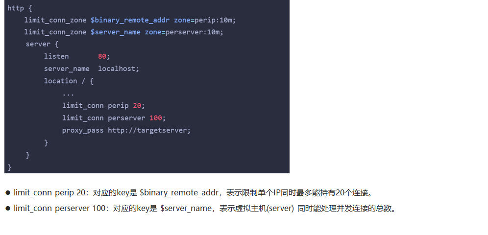

**网关限流**

网关限流的基本思想是基于令牌桶算法。它没以固定的速率生成令牌存入令牌桶中，请求过来时需要到桶中申请令牌，申请到了令牌，才能被服务处理，否则会被阻塞。令牌桶是有大小的，因此令牌是由数量上线的，请求的处理数是有上限的。

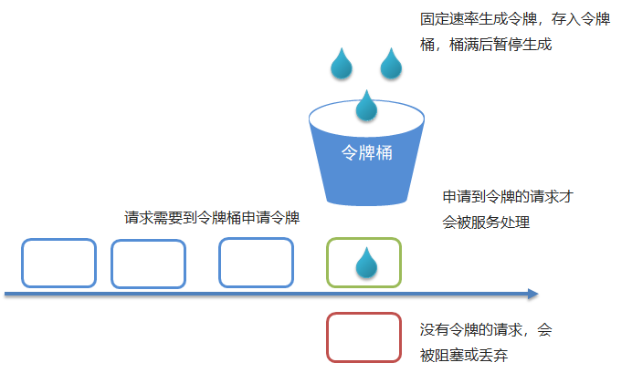

在网关中，限流的具体配置如下：
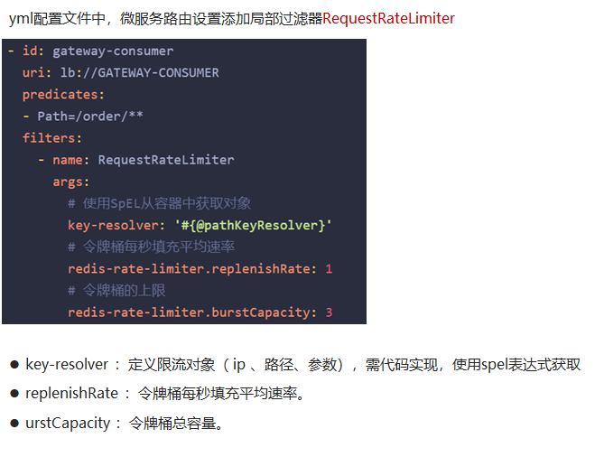

**漏桶算法与令牌桶算法的区别**

主要在于处理请求的速率，一个是固定的，一个不是固定的。

漏桶算法中，请求会以固定的速率漏出去，因此，处理请求的速率一定是固定的。

而在令牌桶算法中，则是请求领取到令牌才能被处理，虽然令牌会以固定的速率生成，但是不一定每次生成令牌都会被请求申请，处理请求的速率取决于令牌桶中令牌的数量。

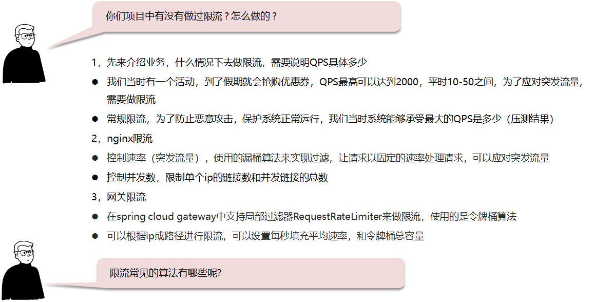

> **面试官：**你们项目中有没有做过限流 ? 怎么做的 ?
>
> **候选人：**
>
> 我当时做的xx项目，采用就是微服务的架构，因为xx因为，应该会有突发流量，最大QPS可以达到2000，但是服务支撑不住，我们项目都通过压测最多可以支撑1200QPS。因为我们平时的QPS也就不到100，为了解决这些突发流量，所以采用了限流。
>
> 【版本1】
>
> 我们当时采用的nginx限流操作，nginx使用的漏桶算法来实现过滤，让请求以固定的速率处理请求，可以应对突发流量，我们控制的速率是按照ip进行限流，限制的流量是每秒20
>
> 【版本2】
>
> 我们当时采用的是spring cloud gateway中支持局部过滤器RequestRateLimiter来做限流，使用的是令牌桶算法，可以根据ip或路径进行限流，可以设置每秒填充平均速率，和令牌桶总容量
>
> **面试官：**限流常见的算法有哪些呢？
>
> **候选人：**
>
> 比较常见的限流算法有漏桶算法和令牌桶算法
>
> 漏桶算法是把请求存入到桶中，以固定速率从桶中流出，可以让我们的服务做到绝对的平均，起到很好的限流效果
>
> 令牌桶算法在桶中存储的是令牌，按照一定的速率生成令牌，每个请求都要先申请令牌，申请到令牌以后才能正常请求，也可以起到很好的限流作用
>
> 它们的区别是，漏桶和令牌桶都可以处理突发流量，其中漏桶可以做到绝对的平滑，令牌桶有可能会产生突发大量请求的情况，一般nginx限流采用的漏桶，spring cloud gateway中可以支持令牌桶算法

### CAP定理和BASE理论

#### CAP定理

1998年，加州大学的计算机科学家 Eric Brewer 提出，分布式系统有三个指标：

- Consistency（一致性）
- Availability（可用性）
- Partition tolerance （分区容错性）

Eric Brewer 说，分布式系统无法同时满足这三个指标。

这个结论就叫做 CAP 定理。

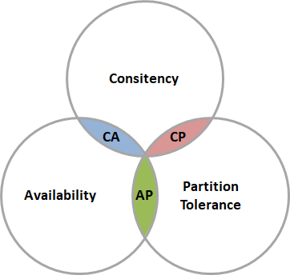

**Consistency（一致性）**

指的是用户访问分布式系统的任意节点，得到的数据必须一致。

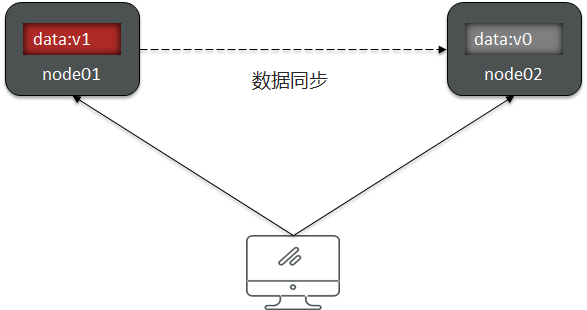

**Availability （可用性）**

指的是用户访问集群中的任意健康节点，必须能得到响应，而不是阻塞或拒绝。


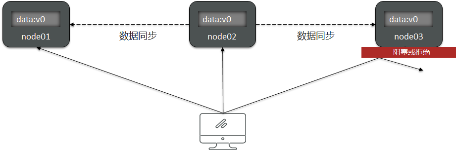

**Partition tolerance（分区容错）**

Partition（分区）：因为网络故障或其他原因，导致部分节点和其他节点失去联系，形成独立分区

Tolerance（容错）：在集群出现分区时，整个系统也要持续对外提供服务

因为在分布式系统中，各节点之间肯定需要网络连接，那么分区随时会发生，因此一定要保证分区容错

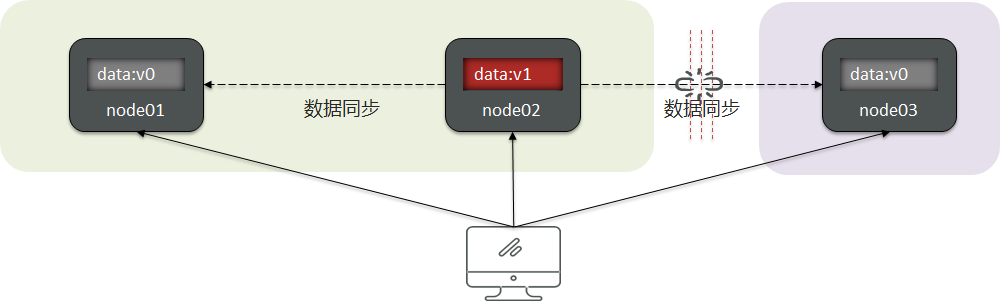

**结论**

如图，节点3发生了网络分区，与节点1节点2隔离了，而节点2中的数据在此期间发生了变化，节点2会把这个变化同步给节点1，但不会同步给节点3，此时节点3持续保持对外服务，这就是**高可用**，那么用户用户访问节点3和其他节点获得的数据肯定是不一致的，也就是**无法保证一致性**，如果想让用户访问到的数据保持一致，这就是**强一致**，可以让到达节点3的请求先阻塞一段时间，直到网络分区消失，节点3成功同步数据，才正常返回数据，这期间内访问节点3是无响应的，也就是**无法保证可用性**。


- 分布式系统节点之间肯定是需要网络连接的，分区（P）是必然存在的
- 如果保证访问的高可用性（A）,可以持续对外提供服务，但不能保证数据的强一致性--> AP
- 如果保证访问的数据强一致性（C）,就要放弃高可用性  --> CP

#### Base理论

**BASE 是 CAP 理论中 AP 方案的延伸**，包含三个思想：

- **B**asically **A**vailable （基本可用）：分布式系统在出现故障时，允许损失部分可用性，保证核心可用。
- **S**oft State（软状态）：在一定时间内，允许出现短暂不一致状态。
- **E**ventually Consistent（最终一致性）：虽然无法保证强一致，但在软状态结束后，最终达到数据一致。

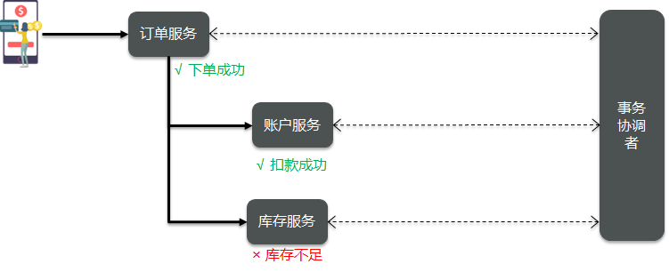

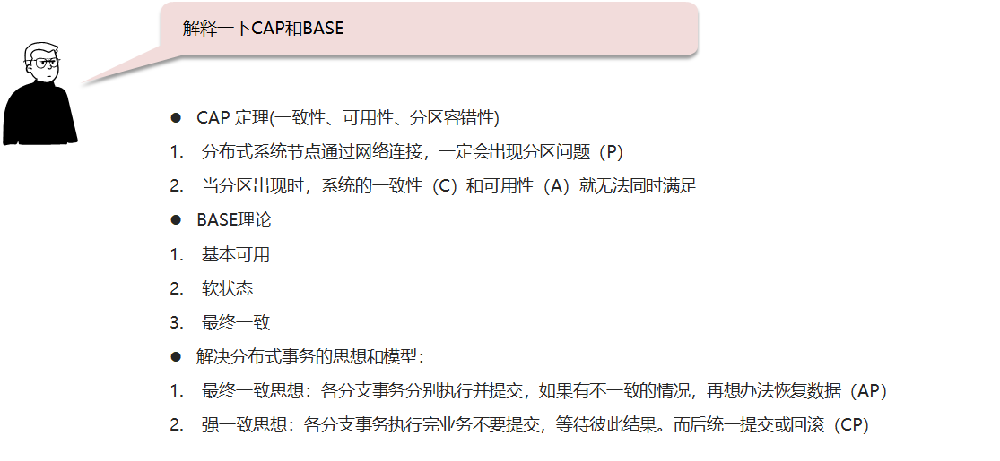

#### paxos协议


#### Raft协议


> **面试官**：什么是CAP理论？
>
> **候选人**：
>
> CAP主要是在分布式项目下的一个理论。包含了三项，一致性、可用性、分区容错性
>
> - 一致性(Consistency)是指更新操作成功并返回客户端完成后，所有节点在同一时间的数据完全一致(强一致性)，不能存在中间状态。
>
> - 可用性(Availability) 是指系统提供的服务必须一直处于可用的状态，对于用户的每一个操作请求总是能够在有限的时间内返回结果。
>
> - 分区容错性(Partition tolerance) 是指分布式系统在遇到任何网络分区故障时，仍然需要能够保证对外提供满足一致性和可用性的服务，除非是整个网络环境都发生了故障。
>
> **面试官**：为什么分布式系统中无法同时保证一致性和可用性？
>
> **候选人**：
>
> 嗯，是这样的~~
>
> 首先一个前提，对于分布式系统而言，分区容错性是一个最基本的要求，因此基本上我们在设计分布式系统的时候只能从一致性（C）和可用性（A）之间进行取舍。
>
> 如果保证了一致性（C）：对于节点N1和N2，当往N1里写数据时，N2上的操作必须被暂停，只有当N1同步数据到N2时才能对N2进行读写请求，在N2被暂停操作期间客户端提交的请求会收到失败或超时。显然，这与可用性是相悖的。
>
> 如果保证了可用性（A）：那就不能暂停N2的读写操作，但同时N1在写数据的话，这就违背了一致性的要求。
>
> **面试官**：什么是BASE理论？
>
> **候选人**：
>
> 嗯，这个也是CAP分布式系统设计理论
>
> BASE是CAP理论中AP方案的延伸，核心思想是即使无法做到强一致性（StrongConsistency，CAP的一致性就是强一致性），但应用可以采用适合的方式达到最终一致性（Eventual Consitency）。它的思想包含三方面：
>
> 1、Basically Available（基本可用）：基本可用是指分布式系统在出现不可预知的故障的时候，允许损失部分可用性，但不等于系统不可用。
>
> 2、Soft state（软状态）：即是指允许系统中的数据存在中间状态，并认为该中间状态的存在不会影响系统的整体可用性，即允许系统在不同节点的数据副本之间进行数据同步的过程存在延时。
>
> 3、Eventually consistent（最终一致性）：强调系统中所有的数据副本，在经过一段时间的同步后，最终能够达到一个一致的状态。其本质是需要系统保证最终数据能够达到一致，而不需要实时保证系统数据的强一致性。

### 分布式事务解决方案

在分布式环境下，会涉及到多个数据库，比如说支付库、商品库、订单库。因此要保证跨服务的事务一致性就变得非常复杂。

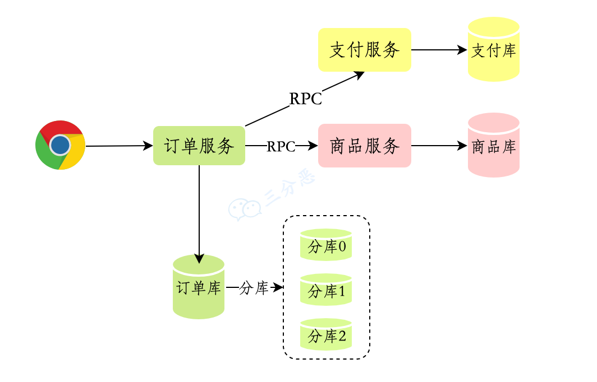

分布式事务其实就是将单一库的事务概念扩大到了多库，目的是为了保证跨服的数据一致性。

主要解决方案有两个：

- Seata框架(XA、AT、TCC)
- MQ

#### Seata

Seata事务管理中有三个重要的角色：

**TC (Transaction Coordinator) - 事务协调者：**维护全局和分支事务的状态，协调全局事务的提交和回滚。可以看做项目Leader。

**TM (Transaction Manager) - 事务管理器：**定义全局事务的范围、开启全局事务、提交或回滚全局事务。可以看做项目经理。

**RM (Resource Manager) - 资源管理器：**管理分支事务处理的资源，与TC交谈以注册分支事务和报告分支事务的状态，并负责分支事务的提交和回滚，可以看作开发人员。

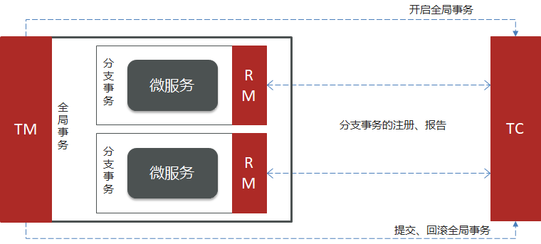

**XA模式（CP)**

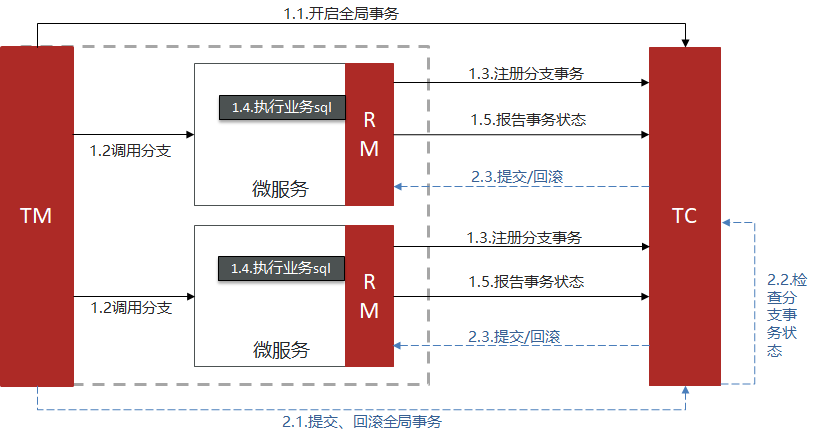

**AT模式(AP)**

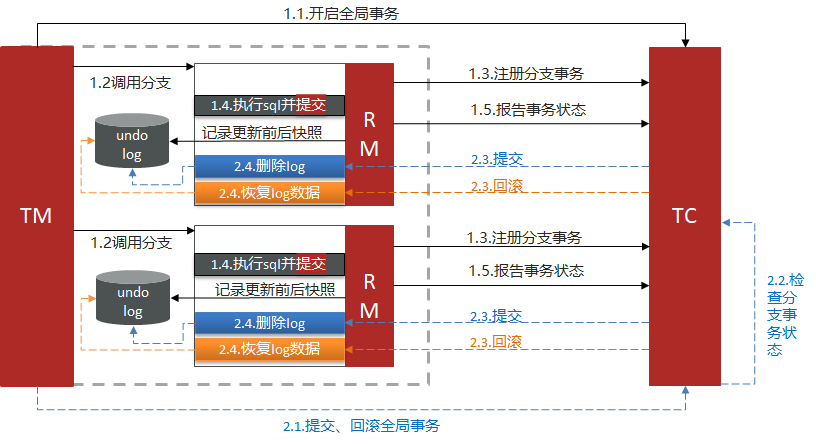

**TCC模式（补偿式事务，代码入侵大）**

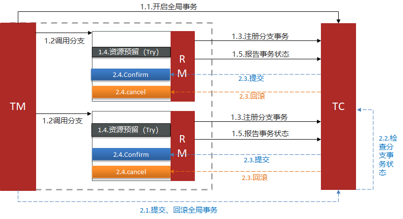

#### MQ

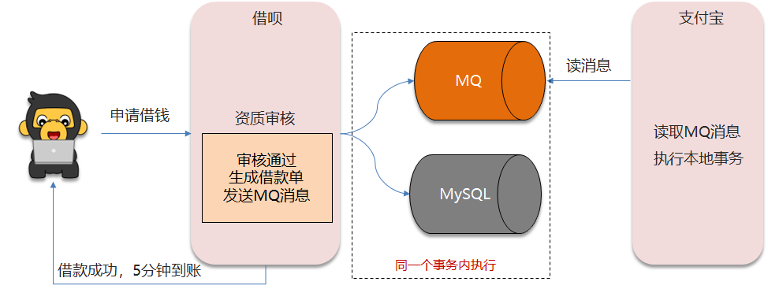

如图，MQ方案中，一定要保证借呗资质审核通过生成借款单后才向支付宝发送MQ消息，还要注意支付宝转账这个操作的失败重试问题。保证借呗审核、生成借款单与支付宝转账这些操作在同一事务内。

当然，MQ方案是异步的，它的性能是很高的，但是，它的实时性也是最差的。

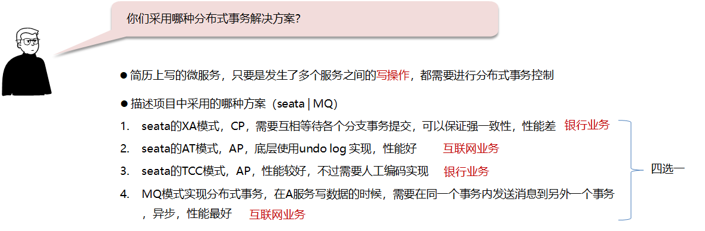

> **面试官：**你们采用哪种分布式事务解决方案？
>
> **候选人：**
>
> 我们当时是xx项目，主要使用到的seata的at模式解决的分布式事务
>
> seata的AT模型分为两个阶段：
>
> 1、阶段一RM的工作：① 注册分支事务  ② 记录undo-log（数据快照）③ 执行业务sql并提交 ④报告事务状态
>
> 2、阶段二提交时RM的工作：删除undo-log即可
>
> 3、阶段二回滚时RM的工作：根据undo-log恢复数据到更新前
>
> at模式牺牲了一致性，保证了可用性，不过，它保证的是最终一致性

### 分布式服务的接口幂等性如何设计？

幂等: 多次调用方法或者接口不会改变业务状态，可以保证重复调用的结果和单次调用的结果一致。

需要幂等场景：

- 用户重复点击(网络波动)
- MQ消息重复
- 应用使用失败或超时重试机制

比如说下单时因为网路波动原因导致用户多次点击下单，这多次下单操作要保证只有一个生效才可以。


基于RESTful API的角度对部分常见类型请求的幂等性特点进行分析

| **请求方式** | **说明**                                                     |
| ------------ | ------------------------------------------------------------ |
| GET          | 查询操作，天然幂等                                           |
| POST         | 新增操作，请求一次与请求多次造成的结果不同，不是幂等的       |
| PUT          | 更新操作，如果是以绝对值更新，则是幂等的。如果是通过增量的方式更新，则不是幂等的 |
| DELETE       | 删除操作，根据唯一值删除，是幂等的                           |

```sql
绝对值更新：update t_item set money = 500 where id = 1;
增量更新: update t_item set money = money + 500 where id = 1;
```

其实大部分场景下的更新操作都是绝对值更新。

解决方案有三种：

- 唯一索引
- token + redis
- 分布式锁
- 状态机

**唯一索引**

唯一索引只能针对新增操作生效，在新增数据时判断唯一索引是否存在某个值。更新操作每次操作都是针对同一行数据，而新增操作会新增一行数据，自然会因为唯一索引而无法新增数据。

**token + redis**

在需要保证幂等性接口的前一次接口调用时，生成token存入redis并返回前端，存入到redis可以以用户作为key，token作为value，前端在调用幂等性接口时将token传参过来，后端到redis中寻找对应用户是否存在这个token，如果存在，正常处理业务，并删除token，如不存在则直接返回错误提示。

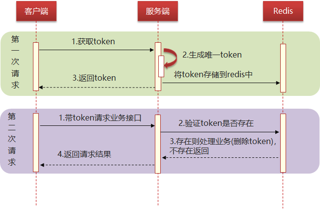


如下单操作

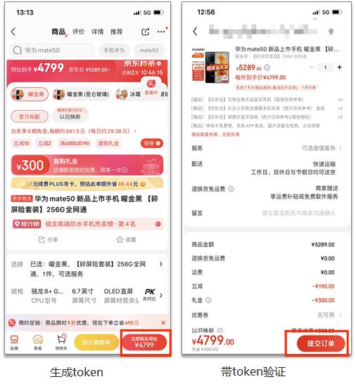

**分布式锁**

执行业务时获取锁，获取成功正常执行业务，获取失败则快速返回错误提示信息。当然，加锁都是比较消耗性能的，为了让锁的力度小一点，可以针对用户和本行数据加锁。

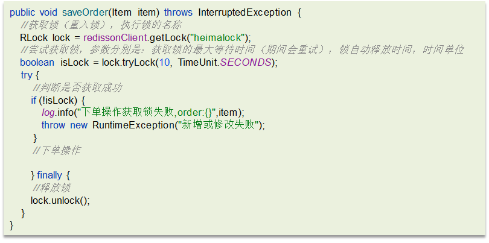

**状态机**

有些业务表是有状态的，比如说订单表中有：1-下单、2-已支付、3-完成、4-撤销等状态，可以通过限制状态的流动来完成幂等。

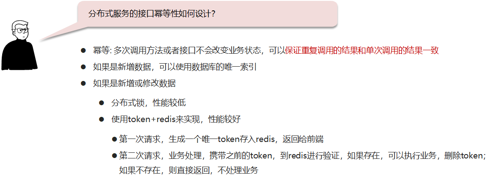

> **面试官：**分布式服务的接口幂等性如何设计？
>
> **候选人：**
>
> 嗯，我们当时有一个xx项目的下单操作，采用的token+redis实现的，流程是这样的
>
> 第一次请求，也就是用户打开了商品详情页面，我们会发起一个请求，在后台生成一个唯一token存入redis，key就是用户的id，value就是这个token，同时把这个token返回前端
>
> 第二次请求，当用户点击了下单操作会后，会携带之前的token，后台先到redis进行验证，如果存在token，可以执行业务，同时删除token；如果不存在，则直接返回，不处理业务，就保证了同一个token只处理一次业务，就保证了幂等性

### 分布式任务调度

目前，最流行的分布式任务调度中间件时xxl-job

**xxl-job解决的问题**

解决集群任务的重复执行问题

cron表达式定义灵活（统一管理任务执行频率）

定时任务失败了，重试和统计（管理界面和重试机制）

任务量大，分片执行（任务分派，路由策略）

#### xxl-job路由策略有哪些？

- FIRST（第一个）：固定选择第一个机器；
- LAST（最后一个）：固定选择最后一个机器；
- ROUND（轮询）
- RANDOM（随机）：随机选择在线的机器；
- CONSISTENT_HASH（一致性HASH）：每个任务按照Hash算法固定选择某一台机器，且所有任务均匀散列在不同机器上。
- LEAST_FREQUENTLY_USED（最不经常使用）：使用频率最低的机器优先被选举；
- LEAST_RECENTLY_USED（最近最久未使用）：最久未使用的机器优先被选举；
- FAILOVER（故障转移）：按照顺序依次进行心跳检测，第一个心跳检测成功的机器选定为目标执行器并发起调度；
- BUSYOVER（忙碌转移）：按照顺序依次进行空闲检测，第一个空闲检测成功的机器选定为目标执行器并发起调度；
- SHARDING_BROADCAST(分片广播)：广播触发对应集群中所有机器执行一次任务，同时系统自动传递分片参数；可根据分片参数开发分片任务

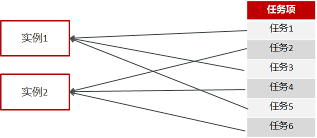

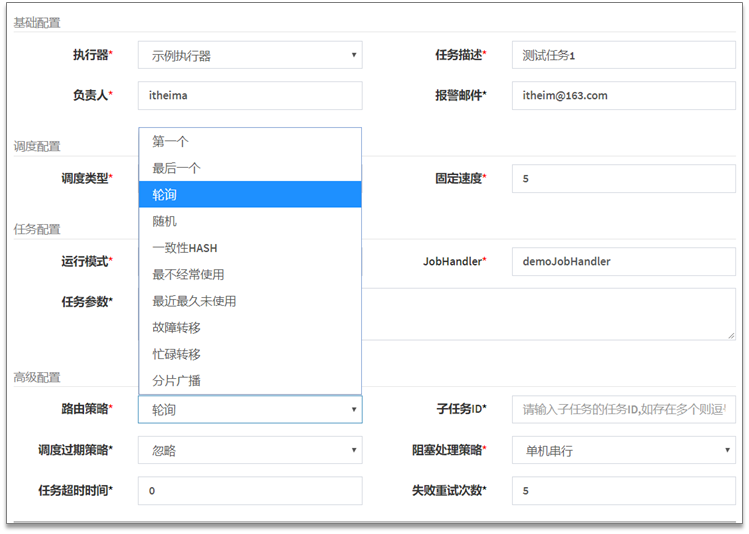

#### xxl-job任务执行失败怎么解决？

#### 如果有大数据量的任务同时都需要执行，怎么解决？


故障转移+失败重试，查看日志分析----> 邮件告警

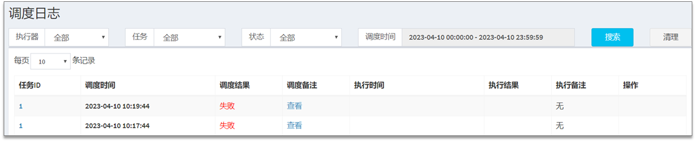

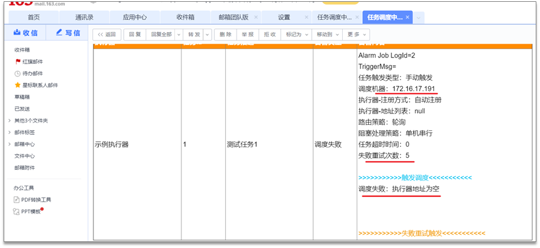

执行器集群部署时，任务路由策略选择分片广播情况下，一次任务调度将会广播触发对应集群中所有执行器执行一次任务。

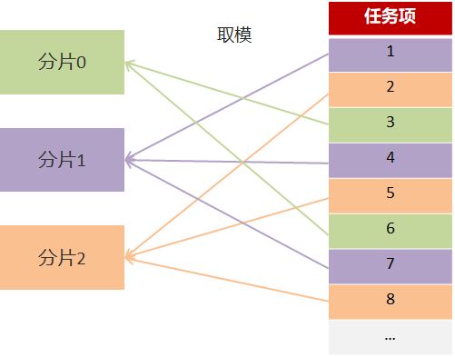

分片参数

- index：当前分片序号(从0开始)，执行器集群列表中当前执行器的序号；
- total：总分片数，执行器集群的总机器数量；

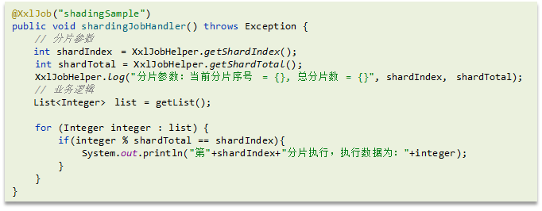

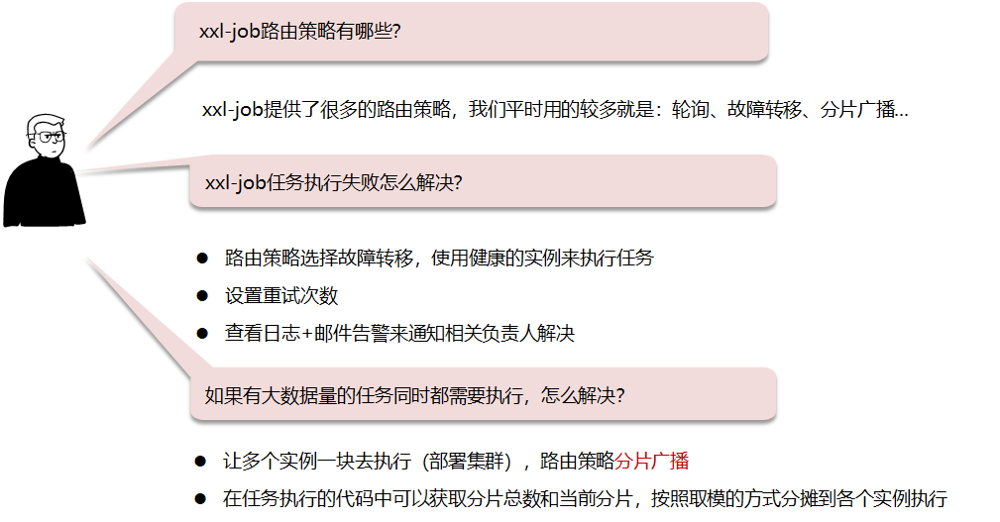

> **面试官：**xxl-job路由策略有哪些？
>
> **候选人：**
>
> xxl-job提供了很多的路由策略，我们平时用的较多就是：轮询、故障转移、分片广播…
>
> **面试官：**xxl-job任务执行失败怎么解决？
>
> **候选人：**
>
> 有这么几个操作
>
> 第一：路由策略选择故障转移，优先使用健康的实例来执行任务
>
> 第二，如果还有失败的，我们在创建任务时，可以设置重试次数
>
> 第三，如果还有失败的，就可以查看日志或者配置邮件告警来通知相关负责人解决
>
> **面试官：**如果有大数据量的任务同时都需要执行，怎么解决？
>
> **候选人：**
>
> 我们会让部署多个实例，共同去执行这些批量的任务，其中任务的路由策略是分片广播
>
> 在任务执行的代码中可以获取分片总数和当前分片，按照取模的方式分摊到各个实例执行就可以了

