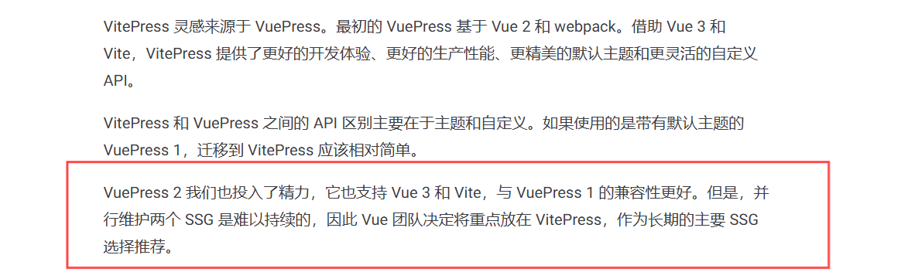
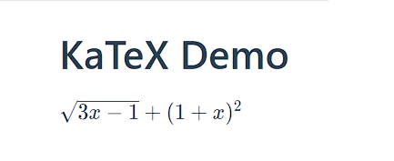
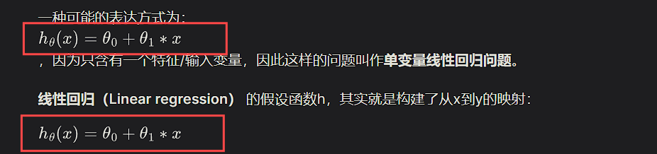
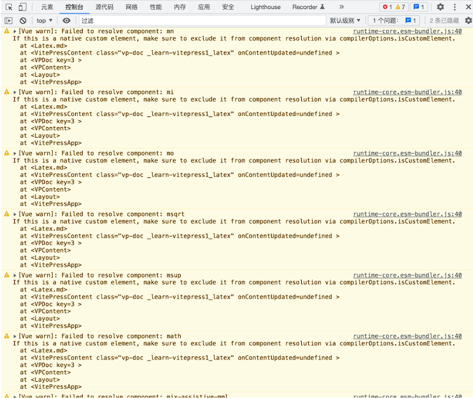

# VitePress + Github Pages搭建博客

------

## 前言

最近借助VitePress搭建了个人博客网站，于是就顺便写了这篇博客记录一下过程。这里吐槽一下，其实一开始我是打算用VuePress搭建的，找教程试了一下，用的是最新版本，但我发现它的热更新有bug（热更新失效），虽然后搜了一下有解决bug的办法，但是我对后期网站的维护更新还是有点担忧，如果冷不丁再来一个bug那怎么办，而且官方是比较推荐使用VitePress的，下面是官方的说法



## 准备工作

vitepress官网地址：https://vitepress.dev/

## 插件

### LaTeX数学公式

VitePress默认的markdown-it解析器是无法渲染LaTeX数学公式的，有两种解决方案：

**一、Katex**

安装markdown-it-katex包

```bash
npm install markdown-it-katex
```

在 `.vitepress/config.mjs`文件中：

```javascript
import { defineConfig } from 'vitepress'
import markdownItKatex from 'markdown-it-katex'

const customElements = [
  'math',
  'maction',
  'maligngroup',
  'malignmark',
  'menclose',
  'merror',
  'mfenced',
  'mfrac',
  'mi',
  'mlongdiv',
  'mmultiscripts',
  'mn',
  'mo',
  'mover',
  'mpadded',
  'mphantom',
  'mroot',
  'mrow',
  'ms',
  'mscarries',
  'mscarry',
  'mscarries',
  'msgroup',
  'mstack',
  'mlongdiv',
  'msline',
  'mstack',
  'mspace',
  'msqrt',
  'msrow',
  'mstack',
  'mstack',
  'mstyle',
  'msub',
  'msup',
  'msubsup',
  'mtable',
  'mtd',
  'mtext',
  'mtr',
  'munder',
  'munderover',
  'semantics',
  'math',
  'mi',
  'mn',
  'mo',
  'ms',
  'mspace',
  'mtext',
  'menclose',
  'merror',
  'mfenced',
  'mfrac',
  'mpadded',
  'mphantom',
  'mroot',
  'mrow',
  'msqrt',
  'mstyle',
  'mmultiscripts',
  'mover',
  'mprescripts',
  'msub',
  'msubsup',
  'msup',
  'munder',
  'munderover',
  'none',
  'maligngroup',
  'malignmark',
  'mtable',
  'mtd',
  'mtr',
  'mlongdiv',
  'mscarries',
  'mscarry',
  'msgroup',
  'msline',
  'msrow',
  'mstack',
  'maction',
  'semantics',
  'annotation',
  'annotation-xml'
]

export default defineConfig({
  markdown: {
    config: (md) => {
      md.use(markdownItKatex)
    }
  },
  vue: {
    template: {
      compilerOptions: {
        isCustomElement: (tag) => customElements.includes(tag)
      }
    }
  }
})
```

在 **.md文件中引入Katex的样式文件

```markdown
---
head:
  - - link
    - rel: stylesheet
      href: https://cdnjs.cloudflare.com/ajax/libs/KaTeX/0.5.1/katex.min.css
---
# KaTeX Demo
$\sqrt{3x-1}+(1+x)^2$
```

效果



**二、MathJax**

安装markdown-it-mathjax3包

```
npm install markdown-it-mathjax3
```

在 `.vitepress/config.mjs`文件中：

```javascript
import mathjax3 from 'markdown-it-mathjax3';

const customElements = [
	'mjx-container',
    'mjx-assistive-mml',
	'math',
	'maction',
	'maligngroup',
	'malignmark',
	'menclose',
	'merror',
	'mfenced',
	'mfrac',
	'mi',
	'mlongdiv',
	'mmultiscripts',
	'mn',
	'mo',
	'mover',
	'mpadded',
	'mphantom',
	'mroot',
	'mrow',
	'ms',
	'mscarries',
	'mscarry',
	'mscarries',
	'msgroup',
	'mstack',
	'mlongdiv',
	'msline',
	'mstack',
	'mspace',
	'msqrt',
	'msrow',
	'mstack',
	'mstack',
	'mstyle',
	'msub',
	'msup',
	'msubsup',
	'mtable',
	'mtd',
	'mtext',
	'mtr',
	'munder',
	'munderover',
	'semantics',
	'math',
	'mi',
	'mn',
	'mo',
	'ms',
	'mspace',
	'mtext',
	'menclose',
	'merror',
	'mfenced',
	'mfrac',
	'mpadded',
	'mphantom',
	'mroot',
	'mrow',
	'msqrt',
	'mstyle',
	'mmultiscripts',
	'mover',
	'mprescripts',
	'msub',
	'msubsup',
	'msup',
	'munder',
	'munderover',
	'none',
	'maligngroup',
	'malignmark',
	'mtable',
	'mtd',
	'mtr',
	'mlongdiv',
	'mscarries',
	'mscarry',
	'msgroup',
	'msline',
	'msrow',
	'mstack',
	'maction',
	'semantics',
	'annotation',
	'annotation-xml',
];

export default {
  markdown: {
    config: (md) => {
      md.use(mathjax3);
    },
  },
  vue: {
    template: {
      compilerOptions: {
        isCustomElement: (tag) => customElements.includes(tag),
      },
    },
  },
};
```

但是这样会出现一个问题：



样式显示不正确，我们需要对MathJax插件渲染的样式进行一个修改，我们可以在 .vitepress/theme/ 里添加一个 `mathjax3.css`文件：

```css
mjx-container {
  display: inline-block;
  margin: auto 2px -2px;
}

mjx-container > svg {
  margin: auto;
  display: inline-block;
}
```

还有一个更细节的点，在之前的配置 `.vitepress/config.mjs`文件中，我们定义了一个数组 `customElements`，看起来是一串很长的配置项，这是为了防止Vue给出下面这些警告信息，并且让组件能够正确被解析。



这样将当更新包后会有一些组件无法解析时，只需将组件的名称（报告错误）添加到 `customElements` 数组中即可。

### Mermaid

如果你想要配置mermaid支持(这是一个可以使用md语法绘制流程图，饼状图的md扩展),需要按照下面的步骤操作。 

安装：

```bash
npm i vitepress-plugin-mermaid mermaid -D
```

如果使用pnpm，还需要下面的配置改变pnpm的默认行为兼容插件

```bash
pnpm install --shamefully-hoist
# 或者在根目录新建.npmrc文件，配置
shamefully-hoist=true
```

更改`.vitepress/config.mjs`配置项

```javascript
import { withMermaid } from "vitepress-plugin-mermaid";

// defineConfig—>withMermaid
export default withMermaid({
  mermaid: {
    // refer https://mermaid.js.org/config/setup/modules/mermaidAPI.html#mermaidapi-configuration-defaults for options
  },

  mermaidPlugin: {
    class: "mermaid my-class", // set additional css classes for parent container
  },
```

