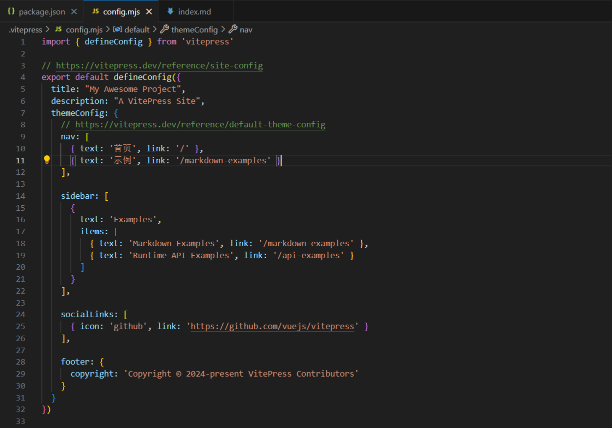

# VitePress + Github Pages搭建博客

------

## 前言

最近借助VitePress搭建了个人博客网站，于是就顺便写了这篇博客记录一下过程。这里吐槽一下，其实一开始我是打算用VuePress搭建的，找教程试了一下，用的是最新版本，但我发现它的热更新有bug（热更新失效），虽然后搜了一下有解决bug的办法，但是我对后期网站的维护更新还是有点担忧，如果冷不丁再来一个bug那怎么办，而且官方是比较推荐使用VitePress的，下面是官方的说法


VitePress官网地址：https://vitepress.dev/

博客地址：https://javaerxiaozhi.github.io/Interview-Notes/

## 准备工作

首先需要本地安装Node.js，18版本及以上的。推荐去下载nvm，方便安装、卸载和切换多个版本的 Node.js。

包管理工具推荐使用pnpm，命令行安装

```sh
npm install -g pnpm
```

建议同个项目不要使用多个包管理工具，不然可能会出现奇奇怪怪的问题。

这是我node和pnpm的版本


版本不一样一般也没什么问题，如果出现问题就换成跟我一样的版本即可。

## 初始化项目

新建项目文件夹，然后在文件夹下打开命令行窗口

**安装 VitePress**

```sh
pnpm add -D vitepress
```

**初始化 VitePress**

```sh
pnpm vitepress init
```

执行完命令可以看到这个界面


简单介绍下我的个人配置

- 第一个是在当前根目录下创建vitepress项目
- 站点标题和描述。后续可以在配置中改
- 选择主题，我的那个博客网站选择的是第二个，可以参考一下
- 是否使用ts，我们个人学习就没必要ts了
- 是否添加脚本到package.json，这个还是需要的，启动命令，打包命令这些都得用

初始化成功后，使用vscode或webstorm打开项目，会看到这样一个目录结构。


简单介绍一下每个文件的含义

- .vitepress，最核心的目录
- theme目录，自定义主题配置，css样式等
- config.mjs，最核心的文件，各种配置导航栏、侧边栏、标题什么的都是在这里
- node_modules，安装的依赖
- api-examples.md和markdown-examples.md，官方给的两个示例
- index.md，主页相关
- package.json和pnpm-lock.yml，包管理工具需要用的

**启动项目**

```sh
pnpm run docs:dev
```


打开看到这个，说明初始化成功


## 自定义配置

### 页面布局

VitePress 提供了三种布局，`doc`， `home`， `page`。

可以通过设置页面 [frontmatter](https://vitepress.dev/zh/reference/frontmatter-config) 选项来选择页面布局。默认为 `doc` 页面。

```markdown
---
layout: doc
---
```

- home：`home` 将生成模板化的“主页”。在此布局中，可以设置额外的选项，例如 `hero` 和 `features` 以进一步自定义内容。
- doc：`doc` 是默认布局，它将整个 Markdown 内容设置为“documentation”外观，其实就是 md 文档生成的网页那种布局。
- page：`page` 被视为“空白页”。Markdown 仍然会被解析，所有的 Markdown 扩展都和 `doc` 布局一样运行，但它没有任何默认样式。

详情查看官网说明：[布局 | VitePress](https://vitepress.dev/zh/reference/default-theme-layout)

### 美化主页

对于主页，我们有以下9个地方可以自定义


2-6是在index.md文件中自定义的，简单介绍一下对应关系

`name<==>2` `text<==>3` `tagline<==>4` `actions<==>5` `features<==>6`

需要说明的是，对于5这两个按钮，是可以跳转的，**link指定路径**，比如/api-example就是指向项目根目录下api-example.md这个文件


1、7、8、9这四个配置是在config.mjs中配置的其中

`title<==>1` `nav<==>7` `socialLinks<==>8` `footer<==>9`

description是SEO要用的，我们不用关注。



显示效果


我们可能还想要对页面进行进一步美化，添加主页 logo 、导航栏 logo 、地址栏 logo。可以去这个网站找图片https://www.iconfont.cn/

将图片放在根目录下的public目录下。


主页 logo


导航栏 logo，位于站点标题前。


地址栏 logo

在`config.mjs defineConfig`下面直接配置即可

```js
head: [["link", { rel: "icon", href: "/开发中.png" }]],
```

显示效果


**拓展**

- vitepress原生支持国外的sociallink，如果是国内需要自行复制svg代码。如图：


- 添加搜索栏，config.mjs中的themeConfig（更多查看官网[搜索 | VitePress](https://vitepress.dev/zh/reference/default-theme-search)）

  

### 美化文章页

默认进来官方给的示例是三边栏的，左边是sidebar的配置，右边是显示的文章目录（默认显示一二级标题）。


下面叙述这个是怎么配置的。

#### 侧边栏

sidebar可以是数组，也可以是对象。还是修改config.mjs

**数组**


每个数组元素中应该包含作为小标题的 `text` 和作为实际导航链接的 `items`。

每个 `link` 都应指定以 `/` 开头的实际文件的路径。如果在链接末尾添加斜杠，它将显示相应目录的 `index.md`。

显示效果


可以进一步将侧边栏项目嵌入到 6 级深度，从根级别上计数。请注意，深度超过 6 级将被忽略，并且不会在侧边栏上显示。

```javascript
export default {
  themeConfig: {
    sidebar: [
      {
        text: 'Level 1',
        items: [
          {
            text: 'Level 2',
            items: [
              {
                text: 'Level 3',
                items: [
                  ...
                ]
              }
            ]
          }
        ]
      }
    ]
  }
}
```

**对象**

一般我们希望根据不同的页面显示不同的侧边栏，这个时候就要对象这种方式配置侧边栏。


显示效果

guide页面


config页面


#### 目录


目录是VitePress根据md文档里的标题自动生成的，不需要配置什么


目录默认显示的是md文件的一二级标题，并且会默认显示目录说明`On this page`

如果需要定义显示的标题级别和目录说明，通过配置`outlineTitle`和`outline`这两个选项即可，这里outline设置的是1~6级标题

如果需要改变目录显示位置，则需要配置`aside`，有`false`，`true`，`left`三个选项，默认是`true`，并且显示在右边

显示效果


#### 自动生成侧边栏

我们使用这种配置时常常是一个目录有很多md文件，这些md文件所在的目录对应导航栏的一个选项。侧边栏的配置需要自己手写一个个路由映射到相应的文件上，那么有没有一个自动生成侧边栏的工具呢？根据一个目录下面的所有md文件自动生成路由，可以使用下面这个脚本

```js
import path from "node:path";
import fs from "node:fs";

// 文件根目录
const DIR_PATH = path.resolve();
// 白名单,过滤不是文章的文件和文件夹
const WHITE_LIST = [
  "index.md",
  ".vitepress",
  "node_modules",
  ".idea",
  "assets",
];

// 判断是否是文件夹
const isDirectory = (path) => fs.lstatSync(path).isDirectory();

// 取差值
const intersections = (arr1, arr2) =>
  Array.from(new Set(arr1.filter((item) => !new Set(arr2).has(item))));

// 把方法导出直接使用
function getList(params, path1, pathname) {
  // 存放结果
  const res = [];
  // 开始遍历params
  for (let file in params) {
    // 拼接目录
    const dir = path.join(path1, params[file]);
    // 判断是否是文件夹
    const isDir = isDirectory(dir);
    if (isDir) {
      // 如果是文件夹,读取之后作为下一次递归参数
      const files = fs.readdirSync(dir);
      res.push({
        text: params[file],
        collapsible: true,
        items: getList(files, dir, `${pathname}/${params[file]}`),
      });
    } else {
      // 获取名字
      const name = path.basename(params[file]);
      // 排除非 md 文件
      const suffix = path.extname(params[file]);
      if (suffix !== ".md") {
        continue;
      }
      res.push({
        text: name,
        link: `${pathname}/${name}`,
      });
    }
  }
  // 对name做一下处理，把后缀删除
  res.map((item) => {
    item.text = item.text.replace(/\.md$/, "");
  });
  return res;
}

export const set_sidebar = (pathname) => {
  // 获取pathname的路径
  const dirPath = path.join(DIR_PATH, pathname);
  // 读取pathname下的所有文件或者文件夹
  const files = fs.readdirSync(dirPath);
  // 过滤掉
  const items = intersections(files, WHITE_LIST);
  // getList 函数后面会讲到
  return getList(items, dirPath, pathname);
};
```

使用时，需要导入函数名

```js
import { set_sidebar } from "../utils/auto-gen-sidebar.mjs";	// 改成自己的路径
```

直接使用。第一个/front-end/react常常是**nav的link**，这个set_sidebar传递的参数是相对于根路径的文件夹路径，返回的是每个文件夹中文件的名称和链接

```js
sidebar: { "/front-end/react": set_sidebar("front-end/react") },
```

## 使用Github Pages部署

### 部署步骤

Github Pages专门用来托管静态内容，由于不需要服务器且基于git，支持CI/CD，成为很多静态网站比如博客、文档网站的很好的选择。下面介绍流程

在github上创建仓库，如果没有Github账号，需要先注册一个。


需要在config.mjs里面配置base，名称为github仓库名称

```js
export default defineConfig ({
  base: '/Demo/'
})
```

初始化git仓库

```sh
git init
```

添加.gitignore文件

```
node_modules
.DS_Store
dist
dist-ssr
cache
.cache
.temp
*.local
```

添加本地所有文件到git仓库

```sh
git add .
```

创建第一次提交

```sh
git commit -m "first commit"
```

添加远程仓库地址到本地

```sh
git remote add origin https://github.com/javaerxiaozhi/Demo.git
```

推送项目到github

```sh
git push -u origin master
```

选择github actions


设置工作流


重命名 deploy.yml 并设置deploy脚本


脚本文件：参考的vitepress官方文档：https://vitepress.dev/guide/deploy#github-pages

❗node版本和pnpm版本需要一致

❗对于npm的部署可以参考这个博客[GitHub Action一键部署个人博客 | Ahao (helloahao096.github.io)](https://helloahao096.github.io/helloahao/posts/GitHub Action一键部署个人博客.html)

❗需要注意项目的根目录（.vitepress所在的目录）和分支名称

```yml
name: Deploy VitePress site to Pages

on:
  push:
    branches: [master] # 分支名称

# 设置tokenn访问权限
permissions:
  contents: read
  pages: write
  id-token: write

# 只允许同时进行一次部署，跳过正在运行和最新队列之间的运行队列
# 但是，不要取消正在进行的运行，因为我们希望允许这些生产部署完成
concurrency:
  group: pages
  cancel-in-progress: false

jobs:
  # 构建工作
  build:
    runs-on: ubuntu-latest
    steps:
      - name: Checkout
        uses: actions/checkout@v3
        with:
          fetch-depth: 0 # 如果未启用 lastUpdated，则不需要
      - name: Setup pnpm
        uses: pnpm/action-setup@v2 # 安装pnpm并添加到环境变量
        with:
          version: 8.6.12 # 指定需要的 pnpm 版本
      - name: Setup Node
        uses: actions/setup-node@v3
        with:
          node-version: 18
          cache: pnpm # 设置缓存
      - name: Setup Pages
        uses: actions/configure-pages@v3  # 在工作流程自动配置GithubPages
      - name: Install dependencies
        run: pnpm install # 安装依赖
      - name: Build with VitePress
        run: |
          pnpm run docs:build # 启动项目
          touch .nojekyll  # 通知githubpages不要使用Jekyll处理这个站点，不知道为啥不生效，就手动搞了
      - name: Upload artifact
        uses: actions/upload-pages-artifact@v2  # 上传构建产物
        with:
          path: .vitepress/dist # 指定上传的路径，当前是根目录，如果是docs需要加docs/的前缀

  # 部署工作
  deploy:
    environment:
      name: github-pages
      url: ${{ steps.deployment.outputs.page_url }} # 从后续的输出中获取部署后的页面URL
    needs: build    # 在build后面完成
    runs-on: ubuntu-latest  # 运行在最新版本的ubuntu系统上
    name: Deploy
    steps:
      - name: Deploy to GitHub Pages
        id: deployment  # 指定id
        uses: actions/deploy-pages@v2 # 将之前的构建产物部署到github pages中
```

点击确定，耐心等待三分钟左右，就可以了，接下来查看我们的域名：


踩坑点：网站可能会没有CSS样式，原因是因为根目录没有.nojekyll这个文件（空白文件），导致一些css会被忽略。添加一下再push就好了。

最后，就部署完毕了


### 配置自定义域名

直接配置子域名，别配置4条A记录，没必要让所有都指向这个，一个域名能配置好几个网站。另外域名服务商只允许添加5条记录，多了就得加钱了。

在自己的域名服务商那里添加一条CNAME记录，直接指向自己的github分配的域名就好了，另外需要把这个base给注释掉（不然css文件和页面都找不到），等待分配完成。


## 插件

### LaTeX数学公式

VitePress默认的markdown-it解析器是无法渲染LaTeX数学公式的，有两种解决方案：

**一、Katex**

安装markdown-it-katex包

```sh
npm install markdown-it-katex
```

在 `.vitepress/config.mjs`文件中：

```javascript
import { defineConfig } from 'vitepress'
import markdownItKatex from 'markdown-it-katex'

const customElements = [
  'math',
  'maction',
  'maligngroup',
  'malignmark',
  'menclose',
  'merror',
  'mfenced',
  'mfrac',
  'mi',
  'mlongdiv',
  'mmultiscripts',
  'mn',
  'mo',
  'mover',
  'mpadded',
  'mphantom',
  'mroot',
  'mrow',
  'ms',
  'mscarries',
  'mscarry',
  'mscarries',
  'msgroup',
  'mstack',
  'mlongdiv',
  'msline',
  'mstack',
  'mspace',
  'msqrt',
  'msrow',
  'mstack',
  'mstack',
  'mstyle',
  'msub',
  'msup',
  'msubsup',
  'mtable',
  'mtd',
  'mtext',
  'mtr',
  'munder',
  'munderover',
  'semantics',
  'math',
  'mi',
  'mn',
  'mo',
  'ms',
  'mspace',
  'mtext',
  'menclose',
  'merror',
  'mfenced',
  'mfrac',
  'mpadded',
  'mphantom',
  'mroot',
  'mrow',
  'msqrt',
  'mstyle',
  'mmultiscripts',
  'mover',
  'mprescripts',
  'msub',
  'msubsup',
  'msup',
  'munder',
  'munderover',
  'none',
  'maligngroup',
  'malignmark',
  'mtable',
  'mtd',
  'mtr',
  'mlongdiv',
  'mscarries',
  'mscarry',
  'msgroup',
  'msline',
  'msrow',
  'mstack',
  'maction',
  'semantics',
  'annotation',
  'annotation-xml'
]

export default defineConfig({
  markdown: {
    config: (md) => {
      md.use(markdownItKatex)
    }
  },
  vue: {
    template: {
      compilerOptions: {
        isCustomElement: (tag) => customElements.includes(tag)
      }
    }
  }
})
```

在 **.md文件中引入Katex的样式文件

```markdown
---
head:
  - - link
    - rel: stylesheet
      href: https://cdnjs.cloudflare.com/ajax/libs/KaTeX/0.5.1/katex.min.css
---
# KaTeX Demo
$\sqrt{3x-1}+(1+x)^2$
```

效果


**二、MathJax**

安装markdown-it-mathjax3包

```sh
npm install markdown-it-mathjax3
```

在 `.vitepress/config.mjs`文件中：

```javascript
import mathjax3 from 'markdown-it-mathjax3';

const customElements = [
	'mjx-container',
    'mjx-assistive-mml',
	'math',
	'maction',
	'maligngroup',
	'malignmark',
	'menclose',
	'merror',
	'mfenced',
	'mfrac',
	'mi',
	'mlongdiv',
	'mmultiscripts',
	'mn',
	'mo',
	'mover',
	'mpadded',
	'mphantom',
	'mroot',
	'mrow',
	'ms',
	'mscarries',
	'mscarry',
	'mscarries',
	'msgroup',
	'mstack',
	'mlongdiv',
	'msline',
	'mstack',
	'mspace',
	'msqrt',
	'msrow',
	'mstack',
	'mstack',
	'mstyle',
	'msub',
	'msup',
	'msubsup',
	'mtable',
	'mtd',
	'mtext',
	'mtr',
	'munder',
	'munderover',
	'semantics',
	'math',
	'mi',
	'mn',
	'mo',
	'ms',
	'mspace',
	'mtext',
	'menclose',
	'merror',
	'mfenced',
	'mfrac',
	'mpadded',
	'mphantom',
	'mroot',
	'mrow',
	'msqrt',
	'mstyle',
	'mmultiscripts',
	'mover',
	'mprescripts',
	'msub',
	'msubsup',
	'msup',
	'munder',
	'munderover',
	'none',
	'maligngroup',
	'malignmark',
	'mtable',
	'mtd',
	'mtr',
	'mlongdiv',
	'mscarries',
	'mscarry',
	'msgroup',
	'msline',
	'msrow',
	'mstack',
	'maction',
	'semantics',
	'annotation',
	'annotation-xml',
];

export default {
  markdown: {
    config: (md) => {
      md.use(mathjax3);
    },
  },
  vue: {
    template: {
      compilerOptions: {
        isCustomElement: (tag) => customElements.includes(tag),
      },
    },
  },
};
```

但是这样会出现一个问题：


样式显示不正确，我们需要对MathJax插件渲染的样式进行一个修改，我们可以在 .vitepress/theme/ 里添加一个 `mathjax3.css`文件：

```css
mjx-container {
  display: inline-block;
  margin: auto 2px -2px;
}

mjx-container > svg {
  margin: auto;
  display: inline-block;
}
```

还有一个更细节的点，在之前的配置 `.vitepress/config.mjs`文件中，我们定义了一个数组 `customElements`，看起来是一串很长的配置项，这是为了防止Vue给出下面这些警告信息，并且让组件能够正确被解析。


这样将当更新包后会有一些组件无法解析时，只需将组件的名称（报告错误）添加到 `customElements` 数组中即可。

### Mermaid绘图

如果你想要配置mermaid支持(这是一个可以使用md语法绘制流程图，饼状图的md扩展),需要按照下面的步骤操作。 

安装：

```bash
npm i vitepress-plugin-mermaid mermaid -D
```

如果使用pnpm，还需要下面的配置改变pnpm的默认行为兼容插件

```bash
pnpm install --shamefully-hoist
# 或者在根目录新建.npmrc文件，配置
shamefully-hoist=true
```

更改`.vitepress/config.mjs`配置项

```javascript
import { withMermaid } from "vitepress-plugin-mermaid";

// defineConfig—>withMermaid
export default withMermaid({
  mermaid: {
    // refer https://mermaid.js.org/config/setup/modules/mermaidAPI.html#mermaidapi-configuration-defaults for options
  },

  mermaidPlugin: {
    class: "mermaid my-class", // set additional css classes for parent container
  },
```

