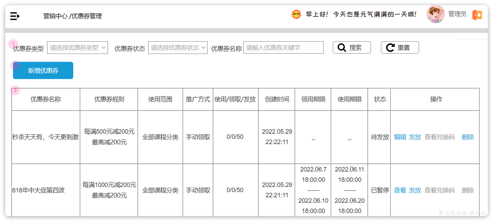
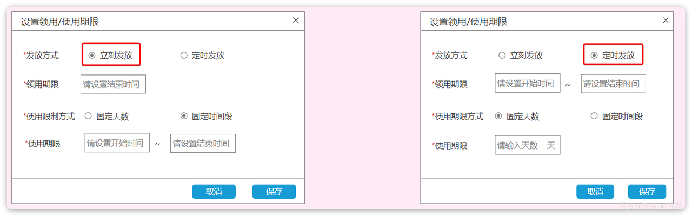
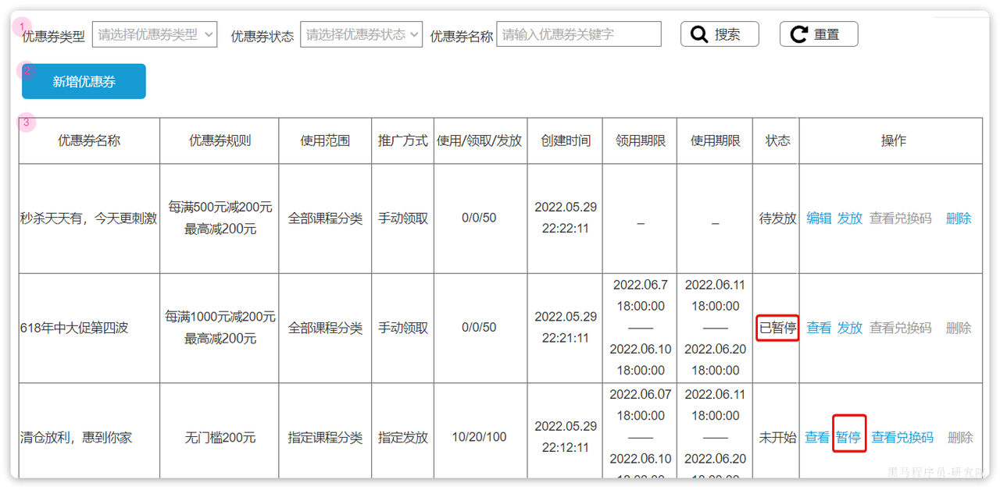

# 优惠券系统

优惠券是电商常见的营销手段，具有灵活的特点，既可以作为促销活动的载体，也是重要的引流入口。

我们先了解一下优惠券系统的一些热点、难点问题：

- 优惠券的优惠策略设计
- 优惠券的兑换码算法
- 优惠券领取的并发安全问题及解决方案
- 优惠券叠加方案的智能推荐
- 多商品、多券叠加时的优惠金额计算
- 多商品订单退款的拆单和退券问题

一般情况下，一个完整的优惠券系统包括以下两大功能：

- 优惠券管理和发放（管理端）
- 优惠券领取和使用（用户端）

------

## 优惠券管理和发放

### 需求分析

需求分析的流程一般基于产品原型，分三步走：

- 分析业务流程
- 统计业务接口
- 设计数据库表

#### 分析业务流程

下面是一个优惠券管理页面的原型：

很明显的可以看出，我们需要在这里实现优惠券基础的**增删改查**功能。

需要注意的是，新增的优惠券不应该立刻出现在用户端页面，管理员还需要对优惠券信息做**审核，**审核通过后则可以通过发放按钮来发布优惠券。这才是合理的优惠券管理流程设计，有助于确保优惠券信息的准确性和有效性，防止错误或不符合要求的优惠券被发布到用户端。

而优惠券的发放方式通常分为两种：

立刻发放和定时发放。顾名思义，立刻发放就是优惠券立刻生效，会直接出现在用户端页面供用户领取。定时发放则需要指定一个发放开始时间，时间到期后才会进入出现在用户端页面。

而且无论是哪种发放方式，都应该指定一个领用期限的结束时间，当过期时优惠券就会进入已结束状态，用户端页面无法领取。

当然，除了过期导致的结束发放以外，管理员也可以手动点击暂停发放：

也可以在需要的时候重新发放优惠券。

#### 统计业务接口

#### 设计数据库表

## 优惠券领取

## 优惠券使用

