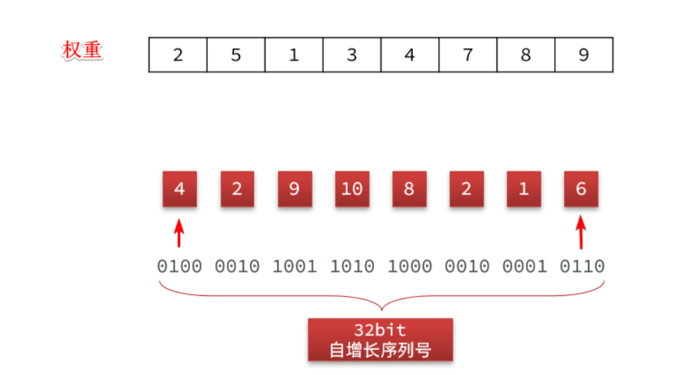
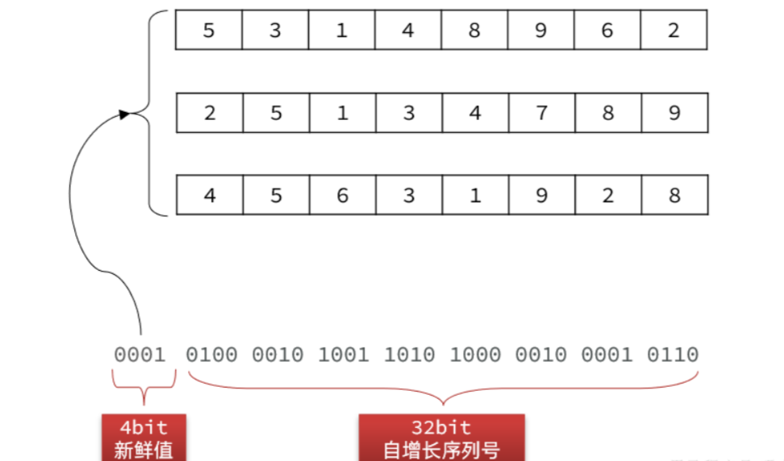
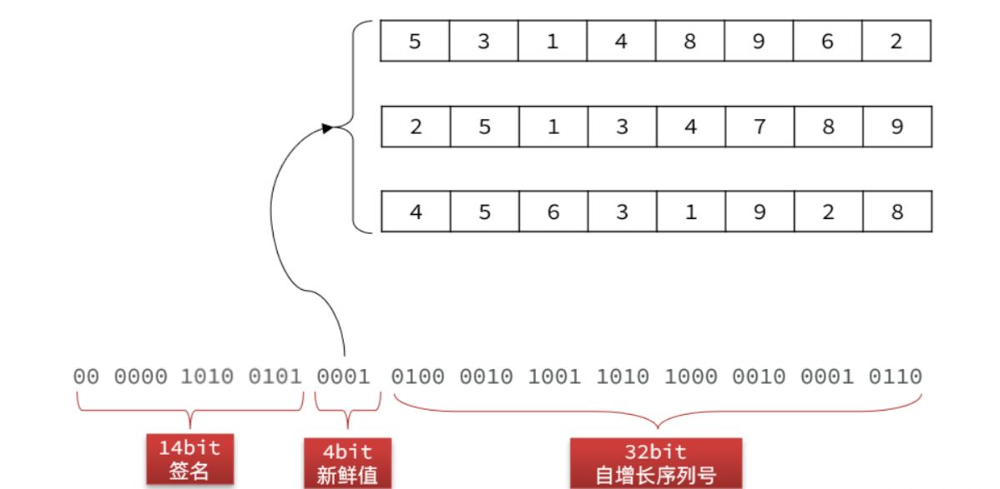
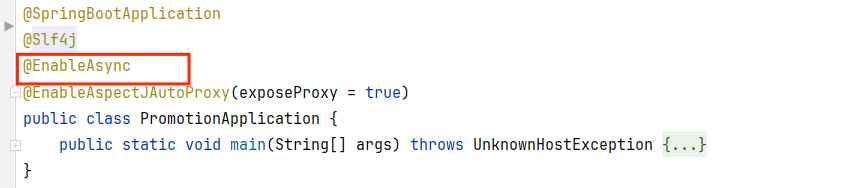
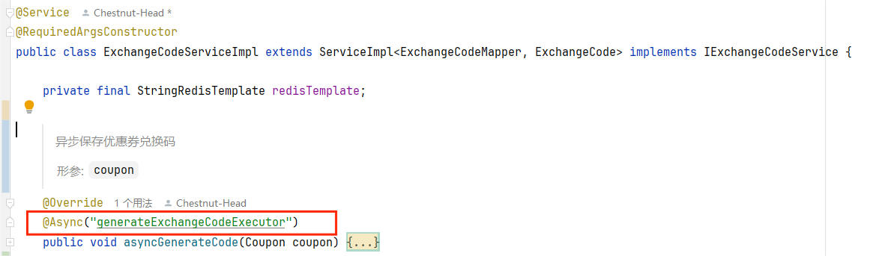

# 基于Base32的兑换码生成算法

兑换码常见于电商促销（优惠券、积分）、游戏福利（道具、测试资格）、数字服务（软件激活、会员订阅）、实体商品（礼品卡、门票核销）及用户运营（邀请奖励、防伪查询）等场景，通过灵活策略与安全验证，便捷分发资源并激励用户行为。

兑换码并不是简单的一个字符串，它其实有很多的需求：


以下是基于图中简略需求拓展的详细需求：

- **可读性好**：兑换码是要给用户使用的，用户需要输入兑换码，因此可读性必须好。要求：
  - 长度为10个字符，当然，这只是个参考，我们也可以设计8个字符的兑换码，设计12个字符的兑换码，设计任意个字符的兑换码，但那就要根据实际情况调整兑换码的算法了，当然，我认为10是一个比较合适的数字，不长不短，可读性好，也不会被轻易破解
  - 只能是24个大写字母和8个数字的组合：ABCDEFGHJKLMNPQRSTUVWXYZ23456789，由于0和O，1和I长的很像，可读性较差，所以使用的字符不包括它们
- **数据量大**：一般优惠活动比较频繁，必须有充足的兑换码，最好有10亿以上的量
- **唯一性**：所有兑换码都必须唯一，不能重复，否则会出现兑换混乱的情况
- **不可重兑**：兑换码必须便于校验兑换状态，避免重复兑换
- **防止爆刷**：兑换码的规律性不能很明显，不能轻易被人猜测到其它兑换码
- **高效**：兑换码生成、验证的算法必须保证效率，避免对数据库带来较大的压力

下面将基于这个详细需求来分析兑换码的生成算法。

## 算法分析

要满足唯一性，我们可以想到以下技术：

- UUID
- Snowflake
- 自增id

我们的兑换码要求是24个大写字母和8个数字。而以上算法最终生成的结果都是数值类型，并不符合我们的需求！

有没有什么办法，可以把数字转为我们要求的格式呢？

### Base32转码

当然有了，假如我们将24个字母和8个数字放到数组中，如下：

| **角标** | 0    | 1    | 2    | 3    | 4    | 5    | 6    | 7    | 8    | 9    | 10   | 11   | 12   | 13   | 14   | 15   |
| -------- | ---- | ---- | ---- | ---- | ---- | ---- | ---- | ---- | ---- | ---- | ---- | ---- | ---- | ---- | ---- | ---- |
| **字符** | A    | B    | C    | D    | E    | F    | G    | H    | J    | K    | L    | M    | N    | P    | Q    | R    |
| **角标** | 16   | 17   | 18   | 19   | 20   | 21   | 22   | 23   | 24   | 25   | 26   | 27   | 28   | 29   | 30   | 31   |
| **字符** | S    | T    | U    | V    | W    | X    | Y    | Z    | 2    | 3    | 4    | 5    | 6    | 7    | 8    | 9    |

这样，0~31的角标刚好对应了我们的32个字符！而2的5次幂刚好就是32，因此5位二进制数的范围就是0~31。

因此我们只要让数字转为二进制的形式，然后让每5位二进制数为一组，每一组再转成10进制数，结果就刚好对应表中某一个角标，就

能在表中找到一个对应的字符。

举例：假如我们经过自增id计算出一个复杂数字，转为二进制，并每5位一组，结果如下：

```shell
01001 00010 01100 10010 01101 11000 01101 00010 11110 11010
```

此时，我们看看每一组的结果：

- 01001转10进制是9，查数组得字符为：**K**
- 00010转10进制是2，查数组得字符为：**C**
- 01100转10进制是12，查数组得字符为：**N**
- 10010转10进制是18，查数组得字符为：**B**
- 01101转10进制是13，查数组得字符为：**P**
- 11000转10进制是24，查数组得字符为：**2**
- ...

依此类推，最终那一串二进制数得到的结果就是KCNBP2PC84，刚好符合我们的需求。

但是，我们要求最终兑换码字符是10位，而每个字符对应5个bit位，因此二进制数不能超过50个bit位。

UUID和Snowflake算法得到的结果，一个是128位，一个是64位，都远远超出了要求。

那自增id算法符合我们的需求吗？

自增id从1增加到Integer的最大值，可以达到40亿以上个数字，而占用的字节仅仅4个字节，也就是32个bit位，距离50个bit位的限制还有很大的剩余，符合要求！

综上，我们可以利用自增id作为兑换码，但是要利用Base32加密，转为我们要求的格式。此时就符合了我们的几个要求了：

- **可读性好**：可以转为要求的字母和数字的格式，长度还不超过10个字符
- **数据量大**：可以应对40亿以上的数据规模
- **唯一性**：自增id，绝对唯一

### 重兑校验算法

那重兑问题该如何判断呢？此处有两种方案：

- 基于数据库：我们在设计数据库时有一个字段就是标示兑换码状态，每次兑换时可以到数据库查询状态，避免重兑。
  - 优点：简单
  - 缺点：对数据库压力大
- 基于BitMap：兑换或没兑换就是两个状态，对应0和1，而兑换码使用的是自增id.我们如果每一个自增id对应一个bit位，用每一个bit位的状态表示兑换状态，是不是完美解决问题。而这种算法恰好就是BitMap的底层实现，而且Redis中的BitMap刚好能支持2^32个bit位。
  - 优点：简答、高效、性能好
  - 缺点：依赖于Redis

OK，**重兑、高效**的两个特性都满足了！

现在，就剩下防止爆刷了。我们的兑换码规律性不能太明显，否则很容易被人猜测到其它兑换码。但是，如果我们使用了自增id，那规律简直太明显了，岂不是很容易被人猜到其它兑换码？！！！

所以，我们采用自增id的同时，还需要利用某种校验算法对id做加密验证，避免他人找出规律，猜测到其它兑换码，甚至伪造、篡改兑换码。

那该采用哪种校验算法呢？

### 防刷校验算法

非常可惜，没有一种现成的算法能满足我们的需求，我们必须自己**设计一种算法**来实现这个功能。

不过我们可以模拟其它验签的常用算法。比如众所周知的JWT技术。我们知道JWT分为三部分组成：

- Header：描述签名的算法和类型
- Payload：存储信息的声明（例如用户信息）
- Verify Signature：验签，用于验证整个token

JWT中的的Header和Payload采用的是Base64算法，与我们Base32类似，几乎算是明文传输，难道不怕其他人伪造、篡改token吗？

为了解决这个问题，JWT中才有了第三部分，**验签**。这个签名是由一个秘钥，结合Header、Payload，利用MD5或者RSA算法生成的。因此：

- 只要秘钥不泄露，其他人就无法伪造签名，也就无法伪造token。
- 有人篡改了token，验签时会根据header和payload再次计算签名。数据被篡改，计算的到的签名肯定不一致，就是无效token

因此，我们也可以模拟这种思路：

- 首先准备一个秘钥
- 然后利用秘钥对自增id做加密，生成签名
- 将签名、自增id利用Base32转码后生成兑换码

只要秘钥不泄露，就没有人能伪造兑换码。只要兑换码被篡改，就会导致验签不通过。

当然，这里我们不能采用MD5和RSA算法来生成签名，因为这些算法得到的签名都太长了，一般都是128位以上，超出了长度限制。

因此，这里我们必须采用一种特殊的签名算法。由于我们的兑换码核心是自增id，也就是数字，因此这里我们可以采用按位加权的签名算法：

- 将自增id（32位）每4位分为一组，共8组，都转为10进制
- 给每一组分配不同权重
- 把每一组的10进制数加权然后对所有组的10进制数求和，得到的结果就是签名

举例：



最终的加权和就是：4*2 + 2*5 + 9*1 + 10*3 + 8*4 + 2*7 + 1*8 + 6*9 = 165 

这里的权重数组就可以理解为加密的**秘钥**。

当然，为了避免秘钥被人猜测出规律，我们可以准备16组秘钥。在兑换码自增id前拼接一个4位的**新鲜值**，可以是 0~16 随机的。这个值是多少，就取第几组秘钥。




这样就进一步增加了兑换码的复杂度。

最后，把加权和，也就是签名也转二进制，拼接到最前面，最终的结果就是这样：



刚好50位，最后我们将这串二进制数每 5 位为一组，根据前面讲过的 Base32 转码成对应字符，我们就可以得到最终的兑换码：ALLFBKXASY。

## 算法实现

实现这个算法，我们需要创建两个工具类


其中：

- Base32.java：是Base32工具类
- CodeUtil.java：是签名工具

**CodeUtil**

我们重点关注CodeUtil的实现，代码如下：

```java
/**
 * <h1 style='font-weight:500'>1.兑换码算法说明：</h1>
 * <p>兑换码分为明文和密文，明文是50位二进制数，密文是长度为10的Base32编码的字符串 </p>
 * <h1 style='font-weight:500'>2.兑换码的明文结构：</h1>
 * <p style='padding: 0 15px'>14(校验码) + 4 (新鲜值) + 32(序列号) </p>
 *   <ul style='padding: 0 15px'>
 *       <li>序列号：一个单调递增的数字，可以通过Redis来生成</li>
 *       <li>新鲜值：可以是优惠券id的最后4位，同一张优惠券的兑换码就会有一个相同标记</li>
 *       <li>载荷：将新鲜值（4位）拼接序列号（32位）得到载荷</li>
 *       <li>校验码：将载荷4位一组，每组乘以加权数，最后累加求和，然后对2^14求余得到</li>
 *   </ul>
 *  <h1 style='font-weight:500'>3.兑换码的加密过程：</h1>
 *     <ol type='a' style='padding: 0 15px'>
 *         <li>首先利用优惠券id计算新鲜值 f</li>
 *         <li>将f和序列号s拼接，得到载荷payload</li>
 *         <li>然后以f为角标，从提前准备好的16组加权码表中选一组</li>
 *         <li>对payload做加权计算，得到校验码 c  </li>
 *         <li>利用c的后4位做角标，从提前准备好的异或密钥表中选择一个密钥：key</li>
 *         <li>将payload与key做异或，作为新payload2</li>
 *         <li>然后拼接兑换码明文：f (4位) + payload2（36位）</li>
 *         <li>利用Base32对密文转码，生成兑换码</li>
 *     </ol>
 * <h1 style='font-weight:500'>4.兑换码的解密过程：</h1>
 * <ol type='a' style='padding: 0 15px'>
 *      <li>首先利用Base32解码兑换码，得到明文数值num</li>
 *      <li>取num的高14位得到c1，取num低36位得payload </li>
 *      <li>利用c1的后4位做角标，从提前准备好的异或密钥表中选择一个密钥：key</li>
 *      <li>将payload与key做异或，作为新payload2</li>
 *      <li>利用加密时的算法，用payload2和s1计算出新校验码c2，把c1和c2比较，一致则通过 </li>
 * </ol>
 */
public class CodeUtil {
    /**
     * 异或密钥表，用于最后的数据混淆
     */
    private final static long[] XOR_TABLE = {
            45139281907L, 61261925523L, 58169127203L, 27031786219L,
            64169927199L, 46169126943L, 32731286209L, 52082227349L,
            59169127063L, 36169126987L, 52082200939L, 61261925739L,
            32731286563L, 27031786427L, 56169127077L, 34111865001L,
            52082216763L, 61261925663L, 56169127113L, 45139282119L,
            32731286479L, 64169927233L, 41390251661L, 59169127121L,
            64169927321L, 55139282179L, 34111864881L, 46169127031L,
            58169127221L, 61261925523L, 36169126943L, 64169927363L,
    };
    /**
     * fresh值的偏移位数
     */
    private final static int FRESH_BIT_OFFSET = 32;
    /**
     * 校验码的偏移位数
     */
    private final static int CHECK_CODE_BIT_OFFSET = 36;
    /**
     * fresh值的掩码，4位
     */
    private final static int FRESH_MASK = 0xF;
    /**
     * 验证码的掩码，14位
     */
    private final static int CHECK_CODE_MASK = 0b11111111111111;
    /**
     * 载荷的掩码，36位
     */
    private final static long PAYLOAD_MASK = 0xFFFFFFFFFL;
    /**
     * 序列号掩码，32位
     */
    private final static long SERIAL_NUM_MASK = 0xFFFFFFFFL;
    /**
     * 序列号加权运算的秘钥表
     */
    private final static int[][] PRIME_TABLE = {
            {23, 59, 241, 61, 607, 67, 977, 1217, 1289, 1601},
            {79, 83, 107, 439, 313, 619, 911, 1049, 1237},
            {173, 211, 499, 673, 823, 941, 1039, 1213, 1429, 1259},
            {31, 293, 311, 349, 431, 577, 757, 883, 1009, 1657},
            {353, 23, 367, 499, 599, 661, 719, 929, 1301, 1511},
            {103, 179, 353, 467, 577, 691, 811, 947, 1153, 1453},
            {213, 439, 257, 313, 571, 619, 743, 829, 983, 1103},
            {31, 151, 241, 349, 607, 677, 769, 823, 967, 1049},
            {61, 83, 109, 137, 151, 521, 701, 827, 1123},
            {23, 61, 199, 223, 479, 647, 739, 811, 947, 1019},
            {31, 109, 311, 467, 613, 743, 821, 881, 1031, 1171},
            {41, 173, 367, 401, 569, 683, 761, 883, 1009, 1181},
            {127, 283, 467, 577, 661, 773, 881, 967, 1097, 1289},
            {59, 137, 257, 347, 439, 547, 641, 839, 977, 1009},
            {61, 199, 313, 421, 613, 739, 827, 941, 1087, 1307},
            {19, 127, 241, 353, 499, 607, 811, 919, 1031, 1301}
    };

    /**
     * 生成兑换码
     *
     * @param serialNum 递增序列号
     * @return 兑换码
     */
    public static String generateCode(long serialNum, long fresh) {
        // 1.计算新鲜值
        fresh = fresh & FRESH_MASK;
        // 2.拼接payload，fresh（4位） + serialNum（32位）
        long payload = fresh << FRESH_BIT_OFFSET | serialNum;
        // 3.计算验证码
        long checkCode = calcCheckCode(payload, (int) fresh);
        // 4.payload做大质数异或运算，混淆数据
        payload ^= XOR_TABLE[(int) (checkCode & 0b11111)];
        // 5.拼接兑换码明文: 校验码（14位） + payload（36位）
        long code = checkCode << CHECK_CODE_BIT_OFFSET | payload;
        // 6.转码
        return Base32.encode(code);
    }

    private static long calcCheckCode(long payload, int fresh) {
        // 1.获取码表
        int[] table = PRIME_TABLE[fresh];
        // 2.生成校验码，payload每4位乘加权数，求和，取最后13位结果
        long sum = 0;
        int index = 0;
        while (payload > 0) {
            sum += (payload & 0xf) * table[index++];
            payload >>>= 4;
        }
        return sum & CHECK_CODE_MASK;
    }

    public static long parseCode(String code) {
        if (code == null || !code.matches(RegexConstants.COUPON_CODE_PATTERN)) {
            // 兑换码格式错误
            throw new BadRequestException("无效兑换码");
        }
        // 1.Base32解码
        long num = Base32.decode(code);
        // 2.获取低36位，payload
        long payload = num & PAYLOAD_MASK;
        // 3.获取高14位，校验码
        int checkCode = (int) (num >>> CHECK_CODE_BIT_OFFSET);
        // 4.载荷异或大质数，解析出原来的payload
        payload ^= XOR_TABLE[(checkCode & 0b11111)];
        // 5.获取高4位，fresh
        int fresh = (int) (payload >>> FRESH_BIT_OFFSET & FRESH_MASK);
        // 6.验证格式：
        if (calcCheckCode(payload, fresh) != checkCode) {
            throw new BadRequestException("无效兑换码");
        }
        return payload & SERIAL_NUM_MASK;
    }
}
```

核心的两个方法：

- `generateCode(long serialNum, long fresh)`：根据自增id生成兑换码。两个参数
  - serialNum：兑换码序列号，也就是自增id
  - fresh：新鲜值，这里建议使用兑换码对应的优惠券id对 16 取余做新鲜值
- `parseCode(String code)`：验证并解析兑换码，返回的是兑换码的序列号，也就是自增id

**Base32**

```java
/**
 * 将整数转为base32字符的工具，因为是32进制，所以每5个bit位转一次
 */
public class Base32 {
    private final static String baseChars = "6CSB7H8DAKXZF3N95RTMVUQG2YE4JWPL";

    public static String encode(long raw) {
        StrBuilder sb = new StrBuilder();
        while (raw != 0) {
            int i = (int) (raw & 0b11111);
            sb.append(baseChars.charAt(i));
            raw = raw >>> 5;
        }
        return sb.toString();
    }

    public static long decode(String code) {
        long r = 0;
        char[] chars = code.toCharArray();
        for (int i = chars.length - 1; i >= 0; i--) {
            long n = baseChars.indexOf(chars[i]);
            r = r | (n << (5 * i));
        }
        return r;
    }

    public static String encode(byte[] raw) {
        StrBuilder sb = new StrBuilder();
        int size = 0;
        int temp = 0;
        for (byte b : raw) {
            if (size == 0) {
                // 取5个bit
                int index = (b >>> 3) & 0b11111;
                sb.append(baseChars.charAt(index));
                // 还剩下3位
                size = 3;
                temp = b & 0b111;
            } else {
                int index = temp << (5 - size) | (b >>> (3 + size) & ((1 << 5 - size) - 1));
                sb.append(baseChars.charAt(index));
                int left = 3 + size;
                size = 0;
                if (left >= 5) {
                    index = b >>> (left - 5) & ((1 << 5) - 1);
                    sb.append(baseChars.charAt(index));
                    left = left - 5;
                }
                if (left == 0) {
                    continue;
                }
                temp = b & ((1 << left) - 1);
                size = left;
            }
        }
        if (size > 0) {
            sb.append(baseChars.charAt(temp));
        }
        return sb.toString();
    }

    public static byte[] decode2Byte(String code) {
        char[] chars = code.toCharArray();
        byte[] bytes = new byte[(code.length() * 5) / 8];
        byte tmp = 0;
        byte byteSize = 0;
        int index = 0;
        int i = 0;
        for (char c : chars) {
            byte n = (byte) baseChars.indexOf(c);
            i++;
            if (byteSize == 0) {
                tmp = n;
                byteSize = 5;
            } else {
                int left = Math.min(8 - byteSize, 5);
                if (i == chars.length) {
                    bytes[index] = (byte) (tmp << left | (n & ((1 << left) - 1)));
                    break;
                }
                tmp = (byte) (tmp << left | (n >>> (5 - left)));
                byteSize += left;
                if (byteSize >= 8) {
                    bytes[index++] = tmp;
                    byteSize = (byte) (5 - left);
                    if (byteSize == 0) {
                        tmp = 0;
                    } else {
                        tmp = (byte) (n & ((1 << byteSize) - 1));
                    }
                }
            }
        }
        return bytes;
    }
}
```

## 异步生成兑换码

如果我们每次要生成兑换码都是成批生成的，同一时刻要生成兑换码的数量较多，比较耗时，可以考虑基于线程池异步生成。

如果是在`Spring`的环境中，想要实现基于线程池异步生成兑换码还是很方便的。

首先，通过`@Bean`方法创建一个线程池，这个线程池将用于执行异步方法。例如，可以创建一个配置类`PromotionConfig`，在其中定义线程池的核心线程池大小、最大线程池大小、队列大小、线程名称、拒绝策略等参数，并通过`@Bean`方法返回一个`ThreadPoolTaskExecutor`实例。当然，默认情况下`Bean`实例的名称就是使用了 `@Bean` 方法的方法名，这个`Bean`实例的名称后面会用到。


具体代码如下：

```java
@Slf4j
@Configuration
public class PromotionConfig {

    @Bean
    public Executor generateExchangeCodeExecutor(){
        ThreadPoolTaskExecutor executor = new ThreadPoolTaskExecutor();
        // 1.核心线程池大小
        executor.setCorePoolSize(2);
        // 2.最大线程池大小
        executor.setMaxPoolSize(5);
        // 3.队列大小
        executor.setQueueCapacity(200);
        // 4.线程名称
        executor.setThreadNamePrefix("exchange-code-handler-");
        // 5.拒绝策略
        executor.setRejectedExecutionHandler(new ThreadPoolExecutor.CallerRunsPolicy());
        executor.initialize();
        return executor;
    }
}
```

同时，需要在启动类加上`@EnableAsync`注解来启动异步方法调用的支持。



最后，在需要异步执行的方法上，也就是生成兑换码的方法（建议是在`Service`层中的方法）上，使用`@Async`注解来标记方法。当

调用这个方法时，它将在配置好的线程池中异步执行。这里`@Async`注解需要配置属性`Bean`实例的名称，也就是前面讲到那个。



